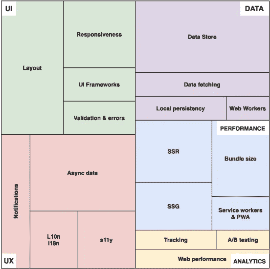
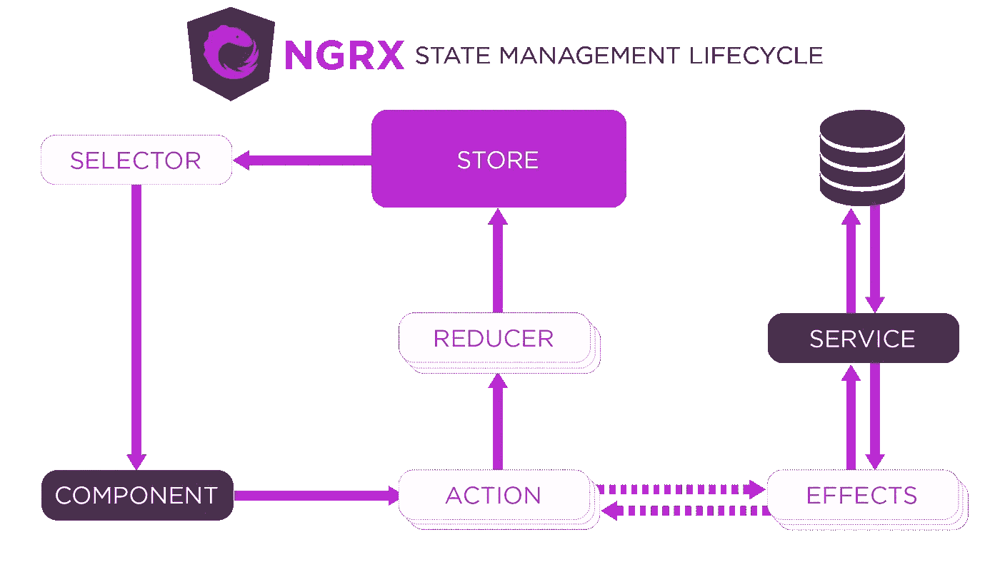
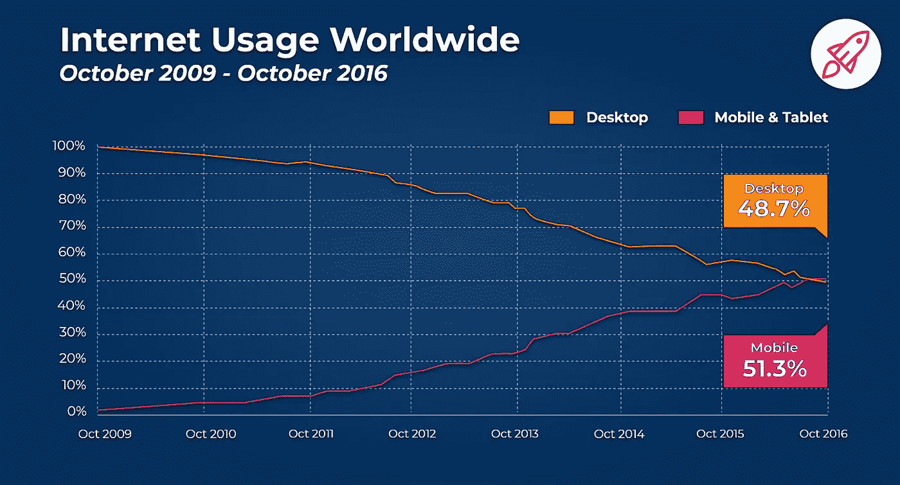
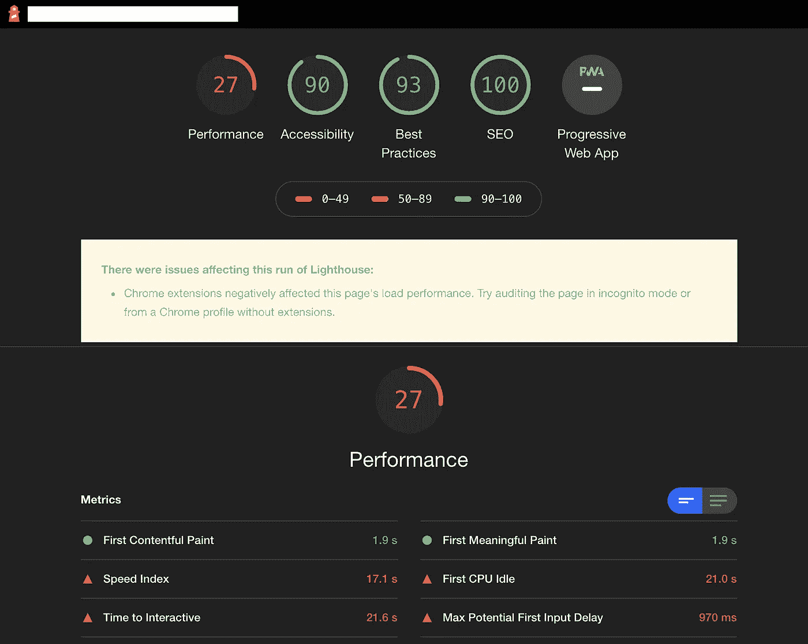

# 您可能错过的前端功能

> 原文：<https://betterprogramming.pub/the-front-end-features-you-might-have-missed-38f3ad1360a9>

## 开发者体验

## 用 Angular/React/Vue.js 提示列出的 Web 开发方面

图片来源:作者

做前端开发者是一个多才多艺的工作。它涉及十几个任务和能力。此外，我们必须保持对我们正在开发的首要目标的关注:一个帮助人们减轻他们的共同任务的网站。

在这篇文章中，我将列出每个 web 开发人员应该考虑的各个方面/特性。如果它们存在，我会提供一些关于这些特性的线索和例子，以及如何在这些特性上取得成功。

# 用户界面

## 布局

创建一个 web 应用程序首先要建立一个有吸引力的、精确的布局来吸引用户，让他们在你的网站上花很多时间。

存在许多 CSS 框架，也许你会找到适合你需要的那个。最著名的是 Bootstrap，由于 CSS 预处理程序的新功能，您可以轻松地对其进行定制。他们建议使用各种组件和控件来给你的网站一个同质的外观。

 [## 引导程序

### 使用 Bootstrap 快速设计和定制响应迅速的移动优先网站，Bootstrap 是世界上最受欢迎的前端开放…

getbootstrap.com](https://getbootstrap.com/) 

迄今为止，Bootstrap 已经发布了第五版的 [alpha。](https://blog.getbootstrap.com/2020/06/16/bootstrap-5-alpha/)

如果你喜欢创建你自己的 CSS 框架(例如，组件方面，间隔，容器等等。)，flexbox 是管理灵活的内容块的好选择。

 [## flexbox 的基本概念

### 柔性盒模块，通常被称为 flexbox，被设计为一维布局模型，并作为一个…

developer.mozilla.org](https://developer.mozilla.org/en-US/docs/Web/CSS/CSS_Flexible_Box_Layout/Basic_Concepts_of_Flexbox) 

[CSS Grid](https://developer.mozilla.org/en-US/docs/Web/CSS/CSS_Grid_Layout) 使用另一种方法，将内容块划分成一个网格。

## 响应性

响应性是网站根据读者的设备来调整其内容处理的能力。例如，如果你在智能手机和台式机上阅读这篇文章，你会有不同的感受。

web 应用程序的响应能力有助于精确显示内容，提高可读性和用户体验。

正如 [MDN web docs](https://developer.mozilla.org/en-US/docs/Web/CSS/Media_Queries/Using_media_queries) 所说，“当你想根据设备的一般类型(如打印与屏幕)或特定特征和参数(如屏幕分辨率或浏览器[视窗](https://developer.mozilla.org/en-US/docs/Glossary/viewport)宽度)来修改你的网站或应用程序时，媒体查询非常有用。”

CSS 媒体查询是一种处理响应的强大方法。

正如我们之前看到的，您可以将它们与 Flexbox 或 CSS Grid 搭配使用。如果您更喜欢使用 CSS 框架，响应性通常已经得到管理。你只需要添加特定的 CSS 类。

对图像使用`srcset`是一个很好的选择，可以让你的图像反应灵敏。它允许您根据设备尺寸以不同的初始大小呈现相同的图像，保持纵横比并减少其在包中的重量。

 [## 响应图像

### 在这篇文章中，我们将了解响应图像的概念——在具有广泛应用的设备上运行良好的图像…

developer.mozilla.org](https://developer.mozilla.org/en-US/docs/Learn/HTML/Multimedia_and_embedding/Responsive_images) 

## 同类组件和控制

拥有同质的组件和控件会让用户觉得不舒服。它就像一个指南，一个用户的面包屑，一个你公司的标识。

如果你想使用现有的框架，这里有著名的 JS 框架库:

Angular——Angular 的替代品是[角状材料](https://material.angular.io/)，部件强大，还有一个完整的 [CDK](https://material.angular.io/cdk/categories) 。

react—web 组件的材质设计实现:[材质 UI](https://material-ui.com/) 。

Vue.js —最后，Vue.js 社区创建了自己的材料指南实现: [Vuetify](https://vuetifyjs.com/en/) 。

## 验证和错误

在处理用户输入时，验证是必不可少的。无论错误来自网络问题、服务器错误还是错误的用户输入，管理应用程序中的验证和错误都很重要。

Angular——作为一个完整的框架，Angular 提供了一个关于表单验证的 API[。](https://angular.io/guide/form-validation)

React——React 应用中处理表单验证最常用的插件可能是 [React 钩子表单](https://react-hook-form.com/)。

Vue.js——这个 vue . js 版本的一个有趣的文字游戏: [vuelidate](https://vuelidate.js.org/)

# 用户体验

## 考虑异步性

检索数据或保存信息可能需要几毫秒、几秒甚至几分钟。这就是为什么添加加载程序或未决消息表明发生了一些事情。

Javascript 的`Promise`或[浏览器获取 API](https://developer.mozilla.org/en-US/docs/Web/API/Fetch_API) 帮助处理异步调用。

## 浏览器支持(多填充)

前端世界发展很快，浏览器也是如此。然而，在所有的浏览器及其各种版本中，由于追溯兼容性，单个代码片段不会给出相同的输出。旧版本的 IE (Internet Explorer)不会像最新版本的 Google Chrome 那样支持那么多 JS 特性或 CSS 规则。

为了防止旧版本运行时出现错误，创建了[poly fill](https://en.wikipedia.org/wiki/Polyfill_(programming))。Remy Sharp 在他的[文章](https://remysharp.com/2010/10/08/what-is-a-polyfill)中非常清楚地描述了它们:“polyfill，或 polyfiller，是一段代码(或插件)，它提供了你，开发者，期望浏览器本身提供的技术。”

要了解特定版本的浏览器是否支持 CSS 规则或 JS 函数，请检查“[我可以使用…](https://caniuse.com/) ”

Angular——Angular 文档中有一节专门讨论[浏览器支持](https://angular.io/guide/browser-support)。

React —创建 React 应用程序[支持带有 polyfills 的](https://create-react-app.dev/docs/supported-browsers-features/) Internet Explorer 9+，就像 [ReactDOM](https://reactjs.org/docs/react-dom.html) 一样。

Vue.js — [CLI 文档](https://cli.vuejs.org/guide/browser-compatibility.html#browserslist)描述了其浏览器支持。

## L10n(本地化)和 i18n(国际化)

你的网站可能有来自世界各地的用户。将您的 web 应用程序国际化将提高其对所有读者的可理解性。

l10n(*L*和 *n* 之间的 10 个字母)或*本地化*是检测用户所在的当地国家(或地方)并根据他们的位置来适配你的网站的过程。

i18n(*I*和 *n* 之间的 18 个字母)或*国际化*是在一个 web app 中管理几种语言和区域参数的过程。当然，它不仅包括措辞，还包括日期格式、数字格式，有时还包括书写方向( *ltr* 或 *rtl* )。

这两个概念相互嵌套，可以通过多种方式实现:

*   使用包含所有可用语言的下拉列表
*   访问用户位置(使用[地理位置浏览器 API](https://developer.mozilla.org/en-US/docs/Web/API/Geolocation_API) )并调整网站
*   添加语言 URL 参数，创建不同形式的 URL，如
    `example.com?lang=en`或`example.com/en`甚至`en.example.com`

Angular——同样，作为一个完整的框架，Angular 为[提供了一个交钥匙解决方案](https://angular.io/guide/i18n)。

React——React-i18 next 插件在 React 界相当有名。

vue . js——[vue-i18n](https://kazupon.github.io/vue-i18n/)插件非常强大。

## a11y(可访问性)

a11y(*a*和 *y* 之间的 11 个字母)或*可访问性*是网站适应有视觉、运动或其他障碍的用户的能力。

经常被遗忘的是，它涉及到关于用户体验的新观点，有时需要在项目中进行重大修改。然而，将这部分人包括进来是很重要的，尤其是当你的代码中很小的变化可能会对他们的用户体验产生很大影响的时候。

存在许多解决方案，包括:

*   对图像使用`alt`属性
*   添加`[ARIA](https://developer.mozilla.org/en-US/docs/Web/Accessibility/ARIA)` [属性](https://developer.mozilla.org/en-US/docs/Web/Accessibility/ARIA)来描述内容
*   允许文本大小自定义
*   提供高对比度模式
*   使用 TAB 或⬆️ ➡️ ⬇️ ⬅️ ️keys 管理键盘导航

a11y 项目试图将这个概念标准化，这是来自社区的一项值得尊敬的努力！主要的 JavaScript 框架也取得了进步:

角度——角度文档有一个专用部分[和](https://angular.io/guide/accessibility)[角度 CDK](https://material.angular.io/cdk/a11y/overview) 开始处理可访问性。

React — React 在其文档中也谈到了 a11y，并开发了一个库 [react-a11y](https://github.com/reactjs/react-a11y) 。(小心，很快它将不再被支撑，并被[反作用轴](https://github.com/dequelabs/react-axe)取代)。

Vue.js —插件 [vue-a11y](https://vue-a11y.com/) 管理可访问性， [vuetify](https://vuetifyjs.com/en/customization/accessibility/) 也关注它。

## 通知

为了与读者保持联系，推送通知浏览器 API 会在有新内容时通知用户。

 [## 通知

### 通知 API 的通知接口用于配置并向用户显示桌面通知…

developer.mozilla.org](https://developer.mozilla.org/en-US/docs/Web/API/notification) 

# 数据和使用

## 真理的唯一来源(SSOT)

从 2015 年开始流行，app 状态管理工具已经不可避免。它们的使用可能有争议，但它们是在应用程序中集中数据的简单有效的解决方案。它们都实现了通量模式:

通量模式的 NgRx 实现(来自 [ngrx.io](https://ngrx.io/guide/store)

每一个都有自己的命名:来自 NgRx 或 Redux 的`selectors`类似于来自 Vuex 的`getters`。Angular 的`reducers`等于 Vue 的`mutations` …

角度— *“角度的反应状态”* : [NgRx](https://ngrx.io/) 。

当然是 React — [Redux](https://redux.js.org/) ！

vue . js—vue . js app 状态管理工具: [Vuex](https://vuex.vuejs.org/) 。

## 数据提取

从网上检索数据有多种方法。最常见的是使用 HTTP 请求来查询 web APIs。浏览器 API 提供了[获取 API](https://developer.mozilla.org/en-US/docs/Web/API/Fetch_API) ，但是已经为每个主要的 JS 框架开发了一个实现。

Angular——Angular 建议根据观察者模式使用 [rxjs](https://rxjs-dev.firebaseapp.com/) (使用可观察对象或主体对象)。

React —获取 API 仍然由[文档](https://reactjs.org/docs/faq-ajax.html)提供建议。

Vue.js — [Axios](https://vuejs.org/v2/cookbook/using-axios-to-consume-apis.html) 是 Vue.js 社区的首选。这是一个基于`Promise`的实现。

**值得一提:** [**GraphQL**](https://graphql.org/)

GraphQL 改变了前端开发领域获取数据的方式。它的假设是:“由于查询语言，客户定义了它需要什么。”这样做，我们得到了我们想要的。

Angular — [阿波罗—安古拉](https://www.apollographql.com/docs/angular/)r
React—[React—阿波罗](https://www.apollographql.com/docs/react/api/react-apollo/)
vue . js—[vue—阿波罗](https://apollo.vuejs.org/)

## 局部持久性

本地持久性允许数据存储在用户的计算机上。我们可以使用 cookies 或者`localStorage`或者`sessionStorage`来存储数据。

 [## 窗口.本地存储

### 只读 localStorage 属性允许您访问的源对象；存储的数据保存在…

developer.mozilla.org](https://developer.mozilla.org/en-US/docs/Web/API/Window/localStorage)  [## 使用 HTTP cookies

### HTTP cookie (web cookie，浏览器 cookie)是服务器发送给用户的 web 浏览器的一小段数据。的…

developer.mozilla.org](https://developer.mozilla.org/en-US/docs/Web/HTTP/Cookies) 

## 网络工作者

 [## 使用网络工作者

### Web Workers 是 Web 内容在后台线程中运行脚本的一种简单方式。工作线程可以执行…

developer.mozilla.org](https://developer.mozilla.org/en-US/docs/Web/API/Web_Workers_API/Using_web_workers) 

Web Workers 是一个新的浏览器 API。它是一个在后台运行的 JavaScript 脚本，不会影响页面的性能。

Angular — Angular 在其[文档](https://angular.io/guide/web-worker)中创建了一个专门的章节。

React —已经创建了一个 React 挂钩，您可以在这里找到它[。](https://github.com/dai-shi/react-hooks-worker)

Vue.js — [vue-worker](https://github.com/israelss/vue-worker) 是 web workers 的 Vue.js 实现。

# 网络和性能

## 捆绑大小

智能手机市场的增长给网络开发世界带来了一场重大革命。现在，我们需要首先考虑移动设备，以便设备可以下载最少量的内容。事实上，如图所示，移动互联网的使用已经超越了桌面浏览。

图片来自[broadbandsearch.net](https://www.broadbandsearch.net/blog/mobile-desktop-internet-usage-statistics)

这意味着包的大小很重要。下载文件的大小必须尽可能小，以减少数据消耗。幸运的是，主要的 JS 框架在发布新版本的库时都会用到它。束尺寸的减小也意味着性能的提高。

angular—[web pack-bundle-analyzer](https://github.com/webpack-contrib/webpack-bundle-analyzer)简化了对产品包的检测分析。此外，Angular CLI 提供了`stats-json`命令选项，用于在构建过程之后生成报告文件。

React — Create React App 写了一个[页面](https://create-react-app.dev/docs/analyzing-the-bundle-size/)关于捆绑包大小的分析。

Vue.js —与 Angular 类似，Vue CLI 提供了一个`report`命令选项来获取报告文件。你可以在这里找到更多信息。

## 服务人员和先进的网络应用

服务工作者是在 web 浏览器中运行的脚本，负责管理应用程序的缓存。这是将 web 应用程序转变为 PWA 或渐进式 web 应用程序的步骤之一。PWA 可以像普通网站一样从安全的 URL 进行浏览，但允许类似于从移动应用程序浏览的用户体验，而没有其限制(例如，应用程序商店提交或设备上的密集内存使用)。

angular——完整的框架还提供了管理[服务人员](https://angular.io/guide/service-worker-intro)的方法。

React——这里是 Create React App 的 PWA [教程](https://create-react-app.dev/docs/making-a-progressive-web-app/)。

Vue.js — Vue CLI 包括一个 [PWA 功能](https://cli.vuejs.org/core-plugins/pwa.html)。

## 服务器端呈现(SSR)

服务器端渲染或 SSR 是 Angular、React 和 Vue.js 应用程序的游戏规则改变者。它在服务器上将组件呈现为 HTML 字符串，并将它们直接发送到浏览器。最后，它在客户端将静态标记融合成一个完全交互式的应用程序。它有几个目标:

*   提高 SEO(搜索引擎优化)
*   内容显示速度更快。

以下是每个 JS 框架提供的解决方案:

角度— [角度通用](https://angular.io/guide/universal)特征

React — [Next.js](https://nextjs.org/) 常用于 React apps。

Vue.js — [Nuxt](https://nuxtjs.org/) 是用于 SSR 的 Vue.js 框架( [Vue 文档](https://vuejs.org/v2/guide/ssr.html))。

## 静态站点生成器(SSG)

随着 [Jamstack](https://jamstack.org/) 的增长，静态站点生成器，或 SSG，变得不可避免。Jamstack 是一种不依赖于网络服务器的网络应用。您将在前面的链接中找到更多详细信息，但以下是使用 SSG 的优势:

*   **速度**:静态站点生成器在构建时生成站点页面，而不是实时生成。
*   **安全性**:不再有内容管理系统(CMSs)，它经常成为黑客攻击的目标
*   **更容易扩展**:部署驻留在可以在任何地方提供的文件堆栈中，因此在内容交付网络(CDN)中存储网站非常容易。因此，这些文件可以在世界范围内以最快的速度复制。
*   **开发工作流程**:不再需要开发人员创建和管理后端服务器或运行数据库

最常见的 SSG 有:

棱角分明— [史高丽](https://scully.io/)

React — [盖茨比](https://www.gatsbyjs.org/) (React + GraphQL)， [Next.js](https://nextjs.org/)

Vue.js — [Gridsome](https://gridsome.org/) ， [Nuxt](https://nuxtjs.org/)

其他编程语言— [11ty](https://www.11ty.dev/) 、 [Hugo](https://gohugo.io/) 、 [Jekyll](https://jekyllrb.com/) 等。

# 分析学

## 跟踪和 A/B 测试

当开发一个网站时，跟踪不是必须的，但是它对改进网站有很大的帮助。事实上，跟踪包括一套工具，当用户浏览你的应用程序时，这些工具可以跟踪用户的点击和行为。它允许你更贴近用户的需求，并且由于 A/B 测试，在特性、行为和设计方面选择最合适的替代方案。

以下是实现跟踪和 A/B 测试的一些解决方案:

Google Analytics—Angular 的[教程](https://scotch.io/tutorials/integrating-google-analytics-with-angular-2)，React 的[教程](https://levelup.gitconnected.com/using-google-analytics-with-react-3d98d709399b)，Vue.js 的[教程](https://webdeasy.de/en/how-to-integrate-google-analytics-on-your-vue-js-page/)

人工智能驱动的个性化和 A/B 测试框架

## Web 性能

构建一个高性能的 web 应用程序很难一蹴而就。加快加载速度可以保证用户享受浏览应用的过程。有各种 app insight 网站来评估性能，例如 Google 的 PageSpeed Insights:

 [## PageSpeed 洞察

### 有关于使用 PageSpeed Insights 的具体、可回答的问题吗？问你关于栈溢出的问题。对于一般情况…

developers.google.com](https://developers.google.com/speed/pagespeed/insights/) 

谷歌 Chrome 控制台提供了一个高效的工具，[灯塔](https://developers.google.com/web/tools/lighthouse)。它根据五个标准(性能、渐进式 web 应用、最佳实践、可访问性和 SEO)评估您网站的性能，每个类别的分数为 100 分。分析之后，给出了改进评分的建议。

随机网站的灯塔分析

谷歌 Chrome 控制台提供的另一个工具是覆盖率。

 [## 使用 Chrome DevTools 中的 Coverage 选项卡查找未使用的 JavaScript 和 CSS 代码

### Chrome DevTools 中的 Coverage 选项卡可以帮助你找到未使用的 JavaScript 和 CSS 代码。删除未使用的代码可以加快…

developers.google.com](https://developers.google.com/web/tools/chrome-devtools/coverage) 

例如，它有助于跟踪未使用的 Javascript 和 CSS 代码，以减少包的大小，从而降低加载时间和智能手机上的数据消耗。

## 搜索引擎优化

SEO 是你必须做的事情，以提高你在搜索引擎中的排名，比如 Google，Bing，DuckDuckGo 等等。它增加了你在网上的知名度。现在甚至还有一个具体的职位，SEO 顾问。大量的书籍、文章和课程可以让你的网站名声大振。

Angular——一篇关于 SEO 应用于 Angular 和 Angular Universal 项目的[有趣文章](https://www.ganatan.com/tutorials/search-engine-optimization-with-angular)

React 2——关于 React 和 SEO 的文章，包括一篇关于 React 项目中常见 SEO 问题的文章和另一篇关于 React 应用中改进 SEO 的工具的文章。

Vue.js——一篇关于在 vue . js 应用中管理 SEO 的深度文章

# 最后的想法

我同意:这是一大堆需要考虑的前端技能和方面。事实上，遵守所有这些规则是非常困难的，并且需要花费大量的时间。每个项目都有自己的需求和优先级。这就是为什么你必须在项目一开始就定义主要的。因此，您将准备好适当地根据这些目标调整您的架构。