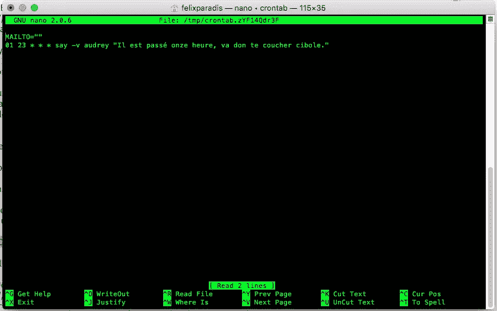

# 有趣的克隆教程

> 原文：<https://betterprogramming.pub/the-fun-cron-tutorial-b1c9d255a94c>

## 在几分钟内创建一个有效且有用的 cron 作业


默里·坎贝尔在 [Unsplash](https://unsplash.com?utm_source=medium&utm_medium=referral) 上的照片

cron 已经存在很久很久了。它的简单性和高效性使它与任何想要在特定时间自动执行重复任务的人相关，也就是说，任何从事 it 工作的人！

此外，如果你正在读这篇文章，很可能你经常被电脑屏幕深深吸引，以至于忘记已经过了睡觉时间。你应该尊重你的就寝时间。)

这里有一个有趣的教程，教你如何创建一个提醒你去睡觉的 cron 作业。这至少能让你笑上几个星期。

# 特定于操作系统的注意事项

**Windows** : cron 是一个用于类 Unix 操作系统的软件工具，所以如果你想完成本教程，你必须使用类似 Linux 的 Windows 子系统。

**Linux** :如果你想让你的电脑说话，你需要下载 [eSpeak](http://espeak.sourceforge.net/) 或者类似的软件:`sudo apt-get install espeak`。

麦克:你会没事的。

# 会说话的机器？！

让电脑随心所欲地说话很有趣。即使在 2020 年成年。相信我。让我们启动终端开始吧。

**Linux** :终端在`/usr/bin/xterm`下。

**Mac** :终端在`/Applications/Utilities`下面。


Mac 用户:这是酷小孩打开应用程序的方式

键入以下内容，并按 enter 键(在终端中):

**Mac:**

**Linux:**

你的电脑刚刚祝你愉快吗？应该是。因为这是一台很好的电脑。

如果你想要更多的声音(比如说，说你母语的声音)，看看苹果的这个小指南或者 eSpeak 的另一个指南。

下一步是让你的电脑在合适的时间自己说话。

# 介绍 cron 作业

简而言之，cron 作业是您的计算机将在特定时间执行的命令。

是后台运行的守护进程来执行这些任务。

`crontab`是定义这些作业的文件的名称。

让我们用大家最喜欢的文本编辑器创建我们的第一份工作:Nano。将下面一行粘贴到终端中:

`env EDITOR=nano crontab -e`

它会把你带到这里:



…或者保存到一个空白文件，因为您可能还没有设置任何 cron 作业。让我们建立一个！

下面的文本片段很好地解释了 cron jobs 的语法。

`*` =“每”，所以`* * * * *` =“一周的每一天，每月的每一天，每小时的每一分钟。”

`01 23 * * * say -v audrey "..."`可以用英语翻译成:“每天晚上 11 点 01 分，用奥黛丽的声音说‘无论那些引用中有什么’"

那`MAILTO=""`呢？问得好。默认情况下，终端希望通过电子邮件发送其 cron 作业的每日报告。谢谢，但是不用了，终端。`MAILTO=""`解决问题。

此时，设置您的日常 cron 作业就像根据您的喜好修改这个一行程序一样简单:

**Mac:**

**Linux:**

完成后，剩下要做的就是保存修改并退出 Nano: `ctrl + x`然后`y`。


为了确保一切都正确，您可以将 cron 作业设置为在下一分钟触发，并像 1999 年一样对着说话的计算机傻笑。

就是这样！下次你发现自己在 YouTube 上看深海动物，即使你需要在不到八小时内醒来，你友好的 cron 工作会提醒你该睡觉了。

# 更进一步

每五分钟触发一次命令:

```
*/5 * * * * command
```

每五分钟一次，但仅限于工作日:

```
*/5 * * * 1-5 command
```

上午 10 点—但仅限于每月的 1 号和 15 号:

```
00 10 1,15 * * command
```

cron 的设计粒度可以精确到分钟。如果你想每 30 秒触发一次，你需要发挥创造力。

有关更多详细信息，您可以随时参考 [good ol 手册页](http://man7.org/linux/man-pages/man5/crontab.5.html)。

我希望这是有益的和有趣的！