# 数据科学家不能错过的基本工具

> 原文：<https://betterprogramming.pub/the-fundamental-tool-that-data-scientists-cant-miss-315fa7513c76>

## 业务需求如何阻止您使用可用的机器学习工具，以及如何应对

当我们在互联网上搜索成功的数据科学家所需的技术能力时，我们会发现以下列表的变体:

*   分析技能
*   编程；编排
*   线性代数
*   多元微积分
*   统计数字
*   机器学习
*   数据可视化
*   软件工程

诸如此类。

但是这个列表中的一些项目有一个共同的主题没有得到同样的关注，尽管它是数据科学家使用的几个工具的主要引擎:*凸优化。*

当听到这个术语时，大多数人会立即开始谈论梯度下降是最棒的事情，我们如何给它增加动量，我们如何选择、适应甚至规避步长参数的选择，等等。

然而，在现实中，凸优化远远超出梯度下降及其变体。

如图 1 所示，这是一门结合了上述几种能力的学科，如线性代数、微积分、统计学和机器学习中的学习词。

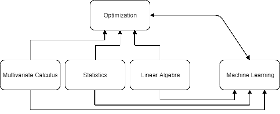

图 1:机器学习和优化之间的关系。

不仅如此，随着工业和学术界数据量的增加，对更快优化方法的渴望，以及并行计算的普及，这两个领域相互影响巨大。

机器学习正在提出新的优化问题，并恢复被遗忘的优化方法，而凸优化研究则允许统计学家和计算机科学家解决新的更大的问题。

# 耳目一新:什么是优化？

简而言之，最优化是数学的一个分支，它专注于寻找一个最小化目标函数的解决方案，可能对我们的问题变量的潜在值有一些约束。

最常见的优化问题具有以下形式:

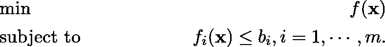

在这个设置中， *x* ∈ ℝⁿ是我们的变量，我们希望找到这个变量的值，这些值达到我们的目标函数 *f(* x *)* 的最小值(为了最大化这个函数，您可以最小化它的负版本)。

我们也可能被一些函数限制在由标量值限定的变量上，称为约束。有时，我们可以找到一个解析公式来解决一个优化问题，但通常情况下，没有封闭形式来解决这样的问题。

即使我们有一个分析解决方案，也可能有其他业务约束阻止我们在实践中使用它。

但这里有个窍门:取决于变量 *x* 的定义域的一些性质，函数 *f* ( *x* )，以及约束 *f* ᵢ(.)，我们可以使用一定会找到最佳解决方案的方法。

如果我们找不到有趣的性质，我们可能会遇到一个在合理的时间内无法解决的问题，或者我们无法找到最佳的解决方案。

通过我们所揭示的，你可以猜测我们能找到的最重要的性质:*凸性*。当我们的变量、目标函数和约束条件的定义域是凸的时，我们就有了一个凸问题和大量的文献！

鉴于网上关于这个主题的资源过多，这篇文章的目标不是成为凸优化和机器学习的全面指南。这即使对于一本 300 页的书来说也是不可能的(个人猜测或限制)。

相反，我们希望向您展示，如果您受限于现成的库，每个数据科学家都熟悉(或有一天会熟悉)的规范公式(正则化线性问题)会变得不切实际。

我们还将看到业务约束如何基于我们对问题的先验知识指导我们找到一个实用的解决方案。让我们开始吧。

# 规范公式:成本函数+正则化

我们将要关注的例子考虑了一个回归任务，但是我们将要讨论的概念要宽泛得多。以著名的最小二乘线性回归为例:

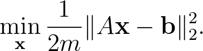

请注意，公式中没有任何正则项，但是通常的做法告诉我们要正则化。

这个问题与山脊、套索和弹性网正则化项一起构成了一组非常流行的回归方法。下面是这个问题的一个更一般的表示:

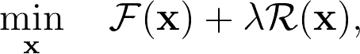

其中，𝔉(x 是经验损失函数，ℜ(x 是正则项，λ是正则参数。

在回归的情况下，这是𝔉(.的常见选择)是均方误差，但是我们可以做不同的选择。我们在这里关注 MSE 损失函数。

为了ℜ(.)，通常对套索问题使用 l₂范数、l₁范数，或者对弹性网正则化使用两者。设 *A* 为我们的设计矩阵，m× n 维，b ∈ ℝᵐ为我们的标签向量。

下表显示了这些功能最常见的配置。

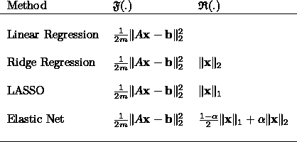

损失函数和正则项的常见选择。

当然，这些都是经过充分研究的问题，在几种编程语言中都有稳定的库，在实践中，您不应该关心它们在业务项目中的实现细节。

您不想花太多时间调试您的实现；或者处理边缘案件。但是，让我们浏览一下数据科学实践中的一些常规用例，看看如果没有适当的能力，这个简单的问题是如何变得不切实际的。

# 用例 1:拟合和预测

假设你正面临一个小的回归问题。您的所有数据都可以放在小于 2GB 的内存中，并且推断可以在同一台机器上本地完成。任何 [UCI](https://archive.ics.uci.edu/ml/datasets.php) 和大多数 [Kaggle](https://www.kaggle.com/) 数据集都将属于这个用例。

这是最常见的场景，我们可以很容易地使用现成的实现(例如， [Sklearn](https://scikit-learn.org/) )。

如果您没有使用任何正则化术语，并且也有点冒险，您可以使用您最喜欢的编程语言来计算最小二乘问题的解析解:

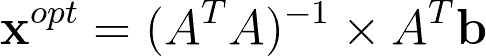

以下是 Python 函数的示例:求解等式。(1)直接地；并使用 NumPy 库获得稳定的解决方案，这是 Scikit-Learn 库中运行的底层方法。

# 用例 2:数据不适合内存

第二个用例更有趣。

假设现在训练集太大而不适合内存，因此，加载整个数据集不是这个问题的一个选项。

显然，我们不能使用解析解，因为我们需要顺序加载部分数据。为了找到这个问题的解决方案，我们将需要使用优化。

在这种情况下，几种技术可能是方便的，如梯度下降(如果用 l₂-norm 正则化)；快速迭代收缩阈值算法 FISTA(贝克，2009 年)，或交替方向乘数法(ADMM)(博伊德，2011 年)。

可以处理非光滑函数的方法。我们不是计算精确的解，而是运行一个迭代过程，在给定足够的迭代次数的情况下，找到一个接近最优的解。

知道了我们可以使用哪些算法，现在更大的问题是管理数据的加载部分和适当地释放内存。有些包甚至可以将此作为默认行为，如基于(Miller，1992)的 [*biglm*](https://cran.r-project.org/package=biglm) R 包。

这里有一个用 Python 写的玩具例子。我们使用 [pandas](https://pandas.pydata.org/) 延迟加载一个 CSV 文件，使用 Scikit-Learn 训练一个最小二乘模型，并使用前一次迭代的参数作为热启动。

每次我们调用 fit 方法时，它都使用以前的解决方案作为优化过程的起点，从而在大多数情况下加速收敛。

这里采用的优化策略可以称为“小批量随机梯度下降”，因为我们分批加载数据，并使用随机梯度下降方法优化损失函数。

# 用例 3:功能不完全可用

现在让我们严肃一点。

假设您正在处理一个带有敏感数据的问题的回归模型。您可以访问标注，但要素分别存储在不同的位置。

您可以在每个数据站点上拥有训练标签的副本，但是由于隐私限制，不允许将要素移动或复制到不同的位置:您需要在站点上处理它们。

请参见图 2，了解该问题的图示。

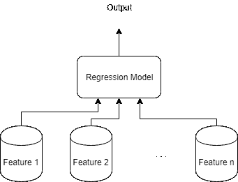

图 2:一个带有隐私约束的回归问题:每个特性都不能离开它的物理位置。

总而言之，此用例的要求是:

*   我们需要一个使用存储在不同位置的数据的单一模型。
*   我们不允许移动数据，除了标签。

由于我们无法同时访问所有数据，我们可以让计算更接近数据。

下面是解决这个问题的一个可能的总体策略:

*   将标签复制到所有数据站点。
*   对于每一步，我们在本地更新变量 *xᵢ* ，所有剩余变量保持不变:

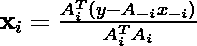

其中索引 *A_ᵢ* 表示除了从列 *i* 开始的 *A* 的所有列。
Obs。这个解的推导可以在参考文献中看到(Gordon，G 和 Tibshirani，r .讲义)。

*   在该步骤的最后，我们在所有站点之间同步 *x* ，并重复该过程，直到达到收敛。

这是一种相当常见的方法，称为*坐标下降*。我们不是计算整个变量 *x* 的导数，而是一次更新一个特征(或者当块坐标下降时更新一个特征块)，并在下一个更新步骤之前同步结果。

值得一提的是，坐标下降是一种高度自适应的优化方法。

您可以将它与其他方法结合起来，以并行方式分布步骤，在每次迭代中更新一组随机变量，等等。关于更广泛的观点，请参考开创性的论文(Wright，2015)。

下面的函数实现了这个解决方案。

# 实际例子

让我们深入一个鲍鱼回归数据集的实际例子。

鲍鱼是一种海洋蜗牛，在世界范围内有 30 到 130 种被认可的物种。我们使用这个数据集的目的是通过物理测量来预测鲍鱼的年龄。

通常，鲍鱼的年龄是通过精确切开外壳，然后用显微镜计数年轮来估计的。由于这既费时又容易出错，而且可能很无聊，我们对更有效的估计鲍鱼年龄的方法很感兴趣。

这个数据集向我们展示了其他几个容易获得的测量值，以及受试者的年龄。我们首先加载、准备数据，并将数据分成两组:训练和测试。

为了简化我们的工作，我们将定义一个预测函数，该函数返回预测的标注和残差:

让我们比较一下前面定义的三种方法找到的解决方案:

*   关闭窗体解决方案。
*   最小二乘法解。
*   坐标下降解。

现在，我们准备好训练模型，并使用估计的参数在测试集上进行预测。

让我们将这些方法做出的预测与原始标签进行视觉比较。

下图将真正的标签显示为蓝点，将封闭形式解决方案预测的标签显示为橙色点。

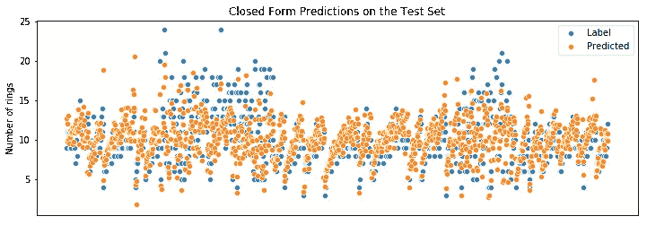

下图显示了 NumPy 最小二乘法的预测。

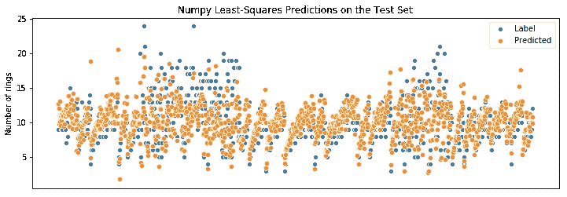

现在我们看到坐标下降解做出的预测。

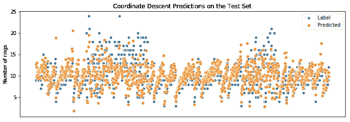

请注意预测是如何相互接近的:我们没有重新发明轮子，我们只是使用轮子的方式来滚动我们的场景。

下图显示了我们的解决方案对 10 个样本所做的预测，以及它们的真实标签，突出了解决方案的等效性。

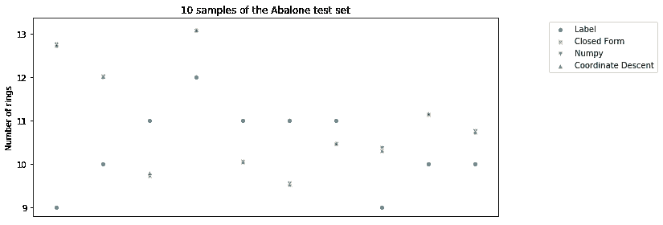

尽管事实上所有的用例都可以用线性回归方法解决，但是根据其他因素，公共图书馆可能甚至不能解决线性回归。

当连接到产品架构时，对于模型应该如何运行，还有几个其他的限制来源，这可以引导我们使用不同的优化方法。

了解一点凸优化允许从业者处理更多不同的情况。

Obs。:这些可能不是实际场景的最佳方法，但一旦您对凸优化有了更好的理解，这些选项就会出现。

# 结论

正如我们可以通过用例看到的，凸优化为数据科学家提供了一个强大的工具箱。

即使模型被很好地覆盖，出现在几个库和 API 中，也可能有业务约束阻止我们使用现成的实现。

凸优化将为您提供以更好、更实用的方式解决问题的选项，允许您实现为您的应用程序设计的解决方案。

当然，所展示的内容还不足以让您从头开始实现 ML 算法。但是，我的希望是通过这些实际的可能性来激发你学习这个主题的动力。

如果你有兴趣了解更多关于这个主题的知识，我们准备了一个列表，下面有一些很棒的学习资源。

# 推荐的学习资源

## 视频讲座

*   [博伊德的演讲集](https://www.youtube.com/playlist?list=PL3940DD956CDF0622)

## 书

*   Boyd，s .和 Vandenberghe，L. (2004 年)。 [*凸优化*](https://web.stanford.edu/~boyd/cvxbook/) 。剑桥大学出版社。
*   贝特塞卡斯博士(1999 年)。 [*非线性规划*](http://www.athenasc.com/nonlinbook.html) 。雅典娜科技公司。

## 开创性论文

*   Tibshirani，R. (1996 年)。通过套索的回归收缩和选择。皇家统计学会杂志。系列 B(方法学)，58(1)，267-288。
*   贝克和特布尔(2009 年)。线性反问题的快速迭代收缩阈值算法。SIAM 影像科学杂志，2(1):183–202。
*   Boyd，s .，Parikh，n .，Chu，e .，Peleato，b .，和 Eckstein，J. (2011 年)。通过交替方向乘子法的分布式优化和统计学习。机器学习的基础和趋势，3(1):1–122。
*   Wright，S. J. (2015)。坐标下降算法。数学规划，151(1):3–34。

## 工具

*   [scipy.optimize](https://docs.scipy.org/doc/scipy/reference/optimize.html)
*   [CVXOPT](https://cvxopt.org/)
*   [复杂](https://www.ibm.com/analytics/cplex-optimizer)
*   [古罗比](https://www.gurobi.com/)

## 其他参考文献

*   Gordon，g .和 Tibshirani，r .关于坐标下降的讲义。