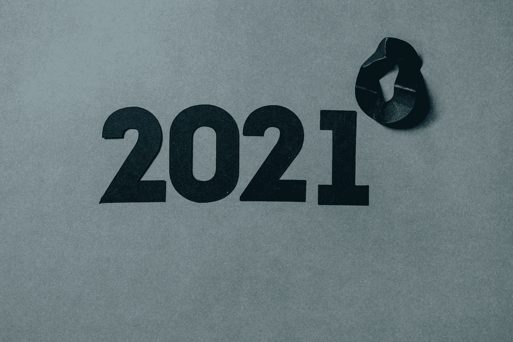

# 数据科学、数据工程和技术的未来

> 原文：<https://betterprogramming.pub/the-future-of-data-science-data-engineering-and-tech-7f0a503745fd>

## 6 位专家对 2021 年科技的看法

凯利·西克玛在 [Unsplash](https://unsplash.com/s/photos/2021?utm_source=unsplash&utm_medium=referral&utm_content=creditCopyText) 上的照片。

随着 2020 年即将结束，我们想花一点时间来反思技术的所有变化，并看看事情的发展方向。

无论你关注的是初创公司及其首次公开募股、技术进步，还是你关注的亚马逊 re:Invent，我们都看到，这一年有很多公司继续试图突破界限。

2020 年个人最喜欢的公告是 AWS 的 [SageMaker Data Wrangler](https://aws.amazon.com/sagemaker/data-wrangler/) ，旨在加快机器学习和人工智能应用的数据准备。这似乎是朝着拥有更多流体机器学习管道迈出的一大步，这将有望进一步使机器学习更容易被不专注于技术的公司获得。

但是 2020 年即将结束，所以我们邀请了来自科技世界各个角落的人们来提供他们对 2021 年的展望——无论是新的创业公司、技术还是最佳实践。

让我们看看他们说了些什么。

## 加入我们的时事通讯！

在继续滚动之前，为什么不加入我们团队的时事通讯，了解数据科学、数据工程和技术的最新动态！[在此了解更多信息](https://seattledataguy.substack.com/)。

# 1.山姆·坎农，脸书，数据科学家

图片来自 [LinkedIn](https://www.linkedin.com/in/sam-cannon-he-him-961169128/) 。

我觉得自然语言处理(NLP)目前正在以一种不可思议的速度前进，这既令人兴奋又令人沮丧。一旦我为文本分类或分布式单词表示聚类建立了一个像样的管道，一个新的模型就会出现，它优于我昨天使用的模型。

也就是说，我对 NLP 的发展方向感到非常兴奋——特别是对于复杂的 NLP 任务的开源解决方案。在这个领域，我最喜欢的公司之一，也是我个人的开源晴雨表，最先进的 NLP，是[拥抱脸](https://huggingface.co/)。拥抱脸遵循“解决 NLP”的信条，通过民主化复杂的 NLP 模型和任务，这些模型和任务通常由于缺乏计算能力或专业知识而不可能被许多个人利用。

他们已经提供了简单的情感分析解决方案，只需要最少的用户输入。在此基础上，我认为 2021 年将迎来一波预打包的 SOTA NLP 模型，可以用一行代码来使用。虽然不可能预测 2021 年这个领域将真正实现什么，但我相信，至少，开箱即用的 NLP 模型将允许更多的人比以往任何时候都更好地从自然语言数据中获得洞察力，这是我对 2021 年我们领域最期待的。

# 2.Catherine Tao，数据标准，数据科学家

图片来自 [LinkedIn](https://www.linkedin.com/in/catherine-tao/) 。

我很高兴看到云计算将如何在 2021 年的技术领域得到创新。截至目前，云是一个存储公司数据的空间。这方面存在一些挑战，比如可伸缩性、效率、数据流等等。

我想看看如何改进云计算，以平衡科技企业面临的一些主要问题。许多公司都在努力如何将人工智能引入他们的业务，这导致某些公司在科技行业落后。通过创新云计算，更多的公司应该能够在他们的公司实施人工智能，并在更高的生产力水平上部署项目/产品。

# 3.Riley Kinser，Terrain，产品主管

图片来自 [LinkedIn](https://www.linkedin.com/in/rileywkinser/) 。

展望 2021 年(希望这是商业地产更加光明的一年！)，我的主要目标是成为新的和现有的地理数据制图工具的专家。我的主要路线图目标之一是将我们对地形的理解转化为易于最终用户理解的地图。

当今行业中的许多示例都是使用 ArcGIS 完成的，ArcGIS 是一种较老但已得到广泛认可的数据制图工具。我相信可能会有更好的工具，这为我们的客户提供了一个对旧经典进行全新演绎的机会。我有兴趣探索的两个工具是优步开发的开源项目:H3 和 kepler.gl。我认为 H3 的主要优势之一是能够根据缩放比例将世界细分为不同大小的六边形。

这解决了我们早期发现的一个问题，即不同的用户喜欢从不同的角度看待一个大都市区域内的社区、子市场或城市的边界。这也更好地使我们能够在更难获得边界数据的地方开发国际地图。

另一方面，kepler.gl 很有趣，因为它相对容易开发并为最终用户或 MVP 在线托管。优步开发了 Kepler.gl，以允许用户在内部(技术和非技术)快速开发地图，这些地图可以共享，用于可视化地理空间数据的想法。kepler.gl 支持的另一个有趣的事情是能够轻松地可视化时间序列上的地理数据。我希望从 kepler.gl 开始我们的 MVP，然后在我们开始收集用户反馈时探索 H3。

# 4.克里斯·泽奥利，Base10 Partners，负责人

图片来自 [LinkedIn](https://www.linkedin.com/in/chriszeoli/) 。

虽然有很多趋势让我非常兴奋，但电子商务(尤其是 Shopify 及其相关工具的兴起)和远程医疗是我最兴奋的两个领域。我[写过关于](https://research.base10.vc/ecommerce-shopify-saas/)Shopify 生态系统的文章，该公司继续达到新的高度，为超过 200 万商家提供超过 1000 亿美元的 GMV。

我特别兴奋的是它与脸书/Instagram、抖音、支付宝、Affirm 和 Pinterest 等公司的新合作伙伴关系，因为 Shopify 成为消费者所在的主要网络的底层商业基础设施。它的软件和第三方生态系统的繁荣令人难以置信。有趣的是，传统的电子商务领域继续增长(服装和时尚、CPG 产品、健康和保健等)。)同时看到食品/杂货等新类别通过 Shopify 等平台自动上线。

远程医疗和新的数字医疗体验也让我非常兴奋。从 COVID 的角度来看，医疗保健显然是我们经济的核心。这一类别占 GDP 的 20%(还在增长)，几乎没有突破性的成果，也没有 FAANG 规模的公司。我可以想象，在五年内，至少会有一个主要的参与者(也期待看到苹果、谷歌和亚马逊继续推进医疗保健)。2020 年对于 telehealth 来说是重要的一年，Teladoc 收购了 Livongo，并以 300 多亿美元的企业总价值和超过 15 亿美元的 ARR 增长超过 100%创造了数字健康领域最强大的品牌。

我很高兴看到一个全新的数字健康体验浪潮，它解决了人类照顾自己的最基本需求。

# 5.脸书金俊，数据工程师

图片来自 [LinkedIn](https://www.linkedin.com/in/jkim65537/) 。

即将到来的 2021 技术最让我兴奋的是期待已久的 Apache Airflow 2.0 版本。自 2015 年首次发布以来，Apache Airflow 一直是数据工程领域最受欢迎的工作流管理系统之一——如果不是最受欢迎的*的话。*

它的巨大成功可以归功于这样一个事实，即它允许将工作流编写为代码、简单但有效的 GUI，以及它在构造数据管道方面的一般灵活性。随着新的 2.0 版本的发布，每个人都喜欢的工作流管理系统将变得更好。Airflow 2.0 将有许多令人印象深刻的新增功能，包括完全支持和全面的 REST API、TaskFlow API 和任务组。它还提供了许多改进，包括简化的 Kubernetes Executor、低延迟的调度程序，甚至更直观的 GUI。

我很高兴尝试新的和改进的气流。

# 6.Michael Mirandi，Saturn Cloud.io，战略主管

图片来自 [LinkedIn](https://www.linkedin.com/in/michaelmirandi/) 。

2021 年有几个技术趋势让我很兴奋，但没有比数据科学和机器学习中 GPU 计算越来越受欢迎的了。这种转变是由性能第一以及通过开源项目 RAPIDS 实现的易用性推动的。如果你不熟悉它，RAPIDS 允许用户在 NVIDIA 硬件上执行 Python 代码(免责声明:NVIDIA 赞助该项目)。

该团队在今年早些时候发布了行业标准大数据分析基准测试的结果，其表现高出近 20 倍！有趣的是，这些基准测试不仅展示了 GPU 计算对于数据科学工作负载的强大功能，还展示了它加速传统数据工程 ETL 作业的能力。这会导致 Python 被更广泛地采用吗？我愿意打赌，特别是最近一批新的数据科学初创公司发布了分布式 GPU 计算平台——这是一种在云中以前所未有的速度旋转 GPU 集群的能力。

# 2021 年及以后的科技

2021 年有很多值得期待的东西，无论是预打包的 SOTA [NLP 模型](https://www.theseattledataguy.com/how-to-process-pdfs-and-documents-with-aws-comprehend-and-gcp/)，可以用一行代码、自然语言查询，还是像 Airflow 这样的框架改进。

小型和大型科技公司似乎都在继续发展，即使面临变焦疲劳症。

我们希望 2021 年不仅会带来技术进步，还会是我们在提升每个人的船的领域取得进步的一年。

感谢阅读，祝新年好运！