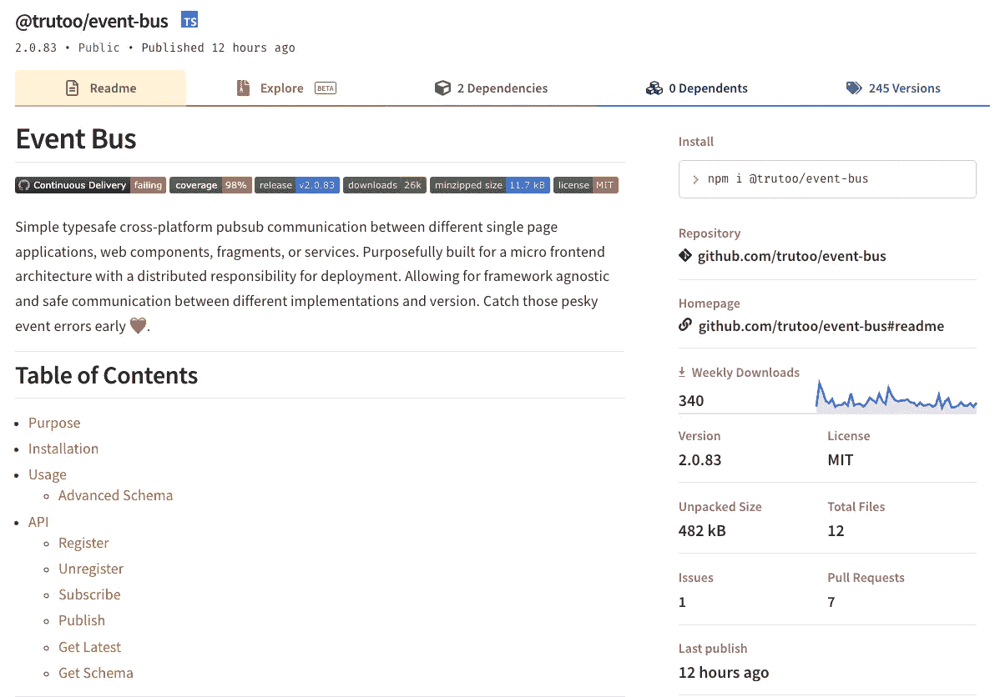
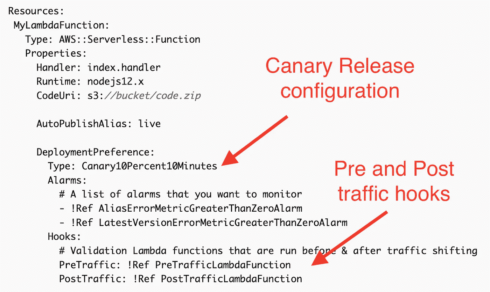

# 微前端的未来

> 原文：<https://betterprogramming.pub/the-future-of-micro-frontends-2f527f97d506>

## 我必须了解这个难题中缺少的部分是什么，并试图描绘出什么会使这个架构方法变得更好

兰迪·塔兰皮在 [Unsplash](https://unsplash.com/s/photos/motivational-quotes?utm_source=unsplash&utm_medium=referral&utm_content=creditCopyText) 上的照片

在 2021 年底和 2022 年初之间，我花了一些时间来看看微前端的旅程到目前为止已经到达了哪里。
我分析了团队正在努力应对的不同挑战，导致长期耦合的反模式，以及用于解决它们的循环模式。

我们发现，微前端使团队能够独立工作，并为大中型应用程序做出贡献，迭代地发展我们的应用程序，并减少潜在问题的爆炸半径。

然而，分析不能停留在我们已经取得的成绩上。

我必须向前看，向未来迈进一步。

我必须了解这个迷人的难题缺少了什么，并试图描绘出什么会使这个架构方法变得更好。

在这篇文章中，我想分享一些想法和趋势，它们可能会在微前端社区引发一些有趣的对话。
*涵盖的主题考虑了该架构的客户端、服务器端和边缘端实现。*

最后，我将分享我在 2022 年对微前端生态系统的关注。

# 更多前期设计

微前端架构的主要挑战之一是回答这个问题:微前端有多“微”?

这是许多组织都面临的一个问题，在现实中，没有唯一的答案，我们需要了解上下文、组织结构及其规模，以及团队之间的沟通流程。

在与多个致力于分布式架构的团队进行了几次接触后，我多次看到“分布式组件”多于微前端实现。

对于分布式组件，领域知识在容器和“微前端”之间共享，甚至在容器和多个“微前端”之间共享。

我们仍然在努力寻找正确的界限，有时在我们实现微前端时，对我们应该如何解释它们缺乏理解。

我认为这种理解是走向更成熟的必要步骤，掌握应用程序业务子领域不是一件容易的事情，需要对我们正在构建的应用程序有深入的了解。

*但是，我认为有一个潜在的解决方案可以缓解这一挑战。*

在白板上投入更多时间，与组织的多个部门一起修改如何在不影响用户体验的情况下分割我们的业务领域是一件*必须做的事情*。

当我们从这些会议中走出来时，我们应该有足够的基础来自信地启动项目，并定期审查我们的决策，以确保我们最初的假设对于实现我们的目标仍然有效。

请记住，我们无法预先捕捉所有信息，今天的企业和组织可能会在 6 个月或 12 个月内发生变化，因此我们应该定期重新审视我们的微前端边界。

此外，永远不要忘记组织结构和软件架构之间的联系，意识到这一点并在我们的设计决策中考虑到这一点非常重要。

# 微前端通信

当我们在同一个视图中有多个微前端时，在某些时候它们需要相互通信。

在我为设计微前端而创建的[心智模型](https://increment.com/frontend/micro-frontends-in-context/)中，鼓励使用[发布-订阅模式](https://en.wikipedia.org/wiki/Publish%E2%80%93subscribe_pattern)在微前端之间进行通信，以加强微前端之间的边界，避免或至少减少[设计时耦合](https://www.infoq.com/presentations/microservices-design-time-coupling/)，这将导致更多的自治团队。

为了在技术上实现这个模式，有几个选项，比如定制事件、事件发射器库，甚至是反应流。

在过去的几个月里，一个重要的需求*出现了，我在开始时并没有过多强调，可能是因为我认为这是理所当然的，但这绝对是需要注意的事情。*

与后端的事件驱动架构一样，拥有一个清晰的事件模式将有助于避免集成阶段的错误。此外，对于不直接在代码库上工作的技术人员来说，模式也提供了对特定应用程序内部发生的事情的清晰理解。

我在我跟踪的一个 Slack 频道中发现，这个事件总线库绝对有助于在松散耦合的元素(微前端，但不仅仅是微前端)之间实现更结构化的通信:[https://www.npmjs.com/package/@trutoo/event-bus](https://www.npmjs.com/package/@trutoo/event-bus)

@trutoo/event-bus 用于您的微前端通信

考虑到微前端是一个分布式架构，需要有一个更正式的 API 或事件管理。

API 或事件是团队交互的方式，不仅仅是在微前端。重要的是要明白，这些实践不仅帮助开发人员在发送事件时避免错误，还能促进团队之间的讨论并提供清晰的意图。

我希望在将来，当我们有大量使用松散耦合通信策略的大型应用程序时，在简化开发人员的体验方面会有更多的努力。

*每当我们开发微前端之间的新交互时，如果有一个事件注册表可供参考该有多好？*

最后，如果你没有机会看到 PayPal 在微前端通信上做了什么，我强烈建议你观看[这个伟大的视频](https://hasgeek.com/jsfoo/microfrontends-conf/schedule/micro-frontends-communication-patterns-NJ6MRtNaEc1aNh8oe6kERY)！

由 [hasgeek](https://hasgeek.com/jsfoo/microfrontends-conf/) 组织的微前端会议期间的 PayPal 演示

# 服务器端呈现(SSR)

服务器端渲染架构是过去几个月创新更多的架构，想想 Next.js 或 React 18 背后的团队对服务器组件的投资。

我们在微前端上也有一些有趣的解决方案，比如 Next.js 的[模块联邦](https://www.npmjs.com/package/@module-federation/nextjs-mf)、 [Piral](https://docs.piral.io/guidelines/tutorials/11-server-side-rendering) 、 [TailorX](https://github.com/StyleT/tailorx) 、 [ILC](http://ilc.namecheap.technology/) 等等。

对于 SSR 微前端应用，我们应该开始更深入地研究一些主题。

这些是我迄今为止个人化的差距:

*   **微前端发现**:类似微服务的[服务发现模式](https://microservices.io/patterns/server-side-discovery.html)，但应用于前端。使用这种模式，我们可以动态地组成微前端，而不需要对系统中的端点进行任何静态引用。想象一下，微前端基础设施向发现服务自我注册，并且 UI composer 从发现服务检索微前端，而不是与微前端本身点对点🤯
*   **云上的参考架构**:缺乏关于如何使用流行的云提供商构建 SSR 微前端架构的指导。这是一个摩擦点，可以相对快速地修复，我想尽我所能提供帮助。
*   **利用微前端的无服务器范例**:我相信无服务器可以提供很快的开发速度，将基础设施管理委托给云提供商。与此同时，我们必须转变思维模式，了解我们应该为微前端等特定工作负载利用哪些服务。
    例如，我认为使用像 AWS Step Functions 这样的服务来简化微前端的创建是有价值的，因为它提供了与整个 AWS 生态系统的高度集成。这允许我们采用低代码模型，从长远来看，这将简化维护。
    这是我们可以在云上使用的许多模式之一，但是用微前端探索这些模式可能会非常迷人(至少对我来说)。
*   **一种与框架无关的** [**React 服务器组件**](https://reactjs.org/blog/2020/12/21/data-fetching-with-react-server-components.html) **方法**:当数据在后端发生变化时，使用 SSR 自动重新加载视图的一部分，并与客户端微前端无缝集成。这将允许混合架构混合 CSR 和 SSR，对每个微前端使用正确的方法。也许我们今天可以创建这样的机制，但最终目标是实现一个像 React 18 中那样的光滑实现。

正如您所看到的，我们面前有许多机会，有些更具体，如参考体系结构，有些更长期，如不可知的 React 服务器组件方法。在此列表中，我的重点将是涵盖参考架构以及对微前端使用无服务器范例的研究。我已经开始制作参考架构的原型，并且在无服务器端也有一些有趣的原型。敬请关注进一步的更新。

# 部分水合

性能是每个前端应用的关键，包括微前端应用。听说*“我* [*slands 架构*](https://jasonformat.com/islands-architecture/)*这个概念已经有一段时间了，但是，我相信最终这个架构可能会因为它的原理和特点而归入微前端的保护伞之下。*

*islands architecture 引入的有趣技术是通过利用部分水合来增强我们的服务器端渲染应用程序的性能的可能性。*

> *简而言之，不是水合整个页面，而是只有对用户可见的“岛”将被立即水合，并且如果/当用户将可视化它们时，其他的将被水合。*

*部分水化并不是什么新技术，2019 年就有了(如果我没记错的话)，但是在微前端应用中我并没有看到任何关于这种技术的参考。*

*考虑到微前端的性质和部分水合的工作方式，我相信这种技术将会在进一步优化 SSR 微前端应用方面获得更多的支持。*

*在这篇文章中，Addy Osmani 为更好地理解这个概念提供了有用的资源:*

*部分水合资源*

*最后，如果你对这个话题感兴趣，我鼓励你阅读[这篇文章](https://dev.to/ajcwebdev/what-is-partial-hydration-and-why-is-everyone-talking-about-it-3k56#adding-partial-hydration-to-existing-frameworks)，其中有一个可能使用部分水合的 UI 框架列表。*

**我目前正在一个微前端概念验证中试验 Preact。希望我能很快分享更多的见解。**

# *微前端和边缘计算*

*当我们谈论边缘的微前端时，我们经常会想到[边缘端包含](https://www.w3.org/TR/esi-lang/) (ESI)标记语言。*

*这一次，我指的是许多 cdn 提供的计算功能，如 AWS Lambda at the edge 或 Cloudflare workers。*

*边缘技术发展迅速，因此部分应用可以移至边缘，从而改善我们解决方案的延迟和可扩展性。*

*然而，在许多 web 应用程序中，我们不能只考虑使用多个微前端生成一个 HTML 页面的计算工作量，我们还需要考虑整个应用程序的复杂性。*

*如今，计算通常是“最容易”解决的问题，但当涉及到数据重力(数据库、多区域数据复制、使用全局基础架构的写入与读取、数据复制延迟……)或通常在云基础架构的特定区域甚至是本地数据中心集中且安全的身份验证时，情况就不那么如此了。*

*诚然，SSR 微前端应用可以从边缘计算中受益，但它们需要访问大量其他资源(数据、认证、缓存等)，这些资源在边缘上还不完全可用。
*除非我们的工作负载封装得非常好，不需要任何外部依赖，否则我们无法真正发挥边缘的全部功能。**

*我相信，我们最终会更多地采用边缘技术，但同时我认为，我们必须更好地了解边缘技术可以在哪些地方使用，并对我们的工作负载产生真正的影响，而不仅仅是因为它“酷”(有人喜欢炒作驱动的开发吗？)使用边缘节点。*

*在我看来，在不久的将来，边缘计算将与微前端有很大的关联，特别是对于提高应用程序的性能，但这并不像现在看起来那么简单。*

# *部署*

*在微服务中，有一套整合的实践来消除部署新微服务版本的风险，如[功能标志](https://launchdarkly.com/blog/what-are-feature-flags/)、[蓝绿色部署](https://martinfowler.com/bliki/BlueGreenDeployment.html)和[金丝雀发布](https://martinfowler.com/bliki/CanaryRelease.html)。*

*在过去的 12 个月里，我没有看到任何用微前端实现类似实践的努力，除了对许多团队来说看起来是众所周知的模式的特性标志。*

*我认为建立开发团队信心的部署策略是必须具备的。*

*在分布式系统中，连续部署经常是现实的，我们必须为开发人员创建一个安全网，他们可以迭代地将他们的代码从他们的笔记本电脑快速移动到生产环境中，而不会冒一次引入所有用户都会遇到的错误的风险。*

*对于 SSR 微前端，我们可以轻松地重用现有的工具和实践来利用这些机制之一发布我们的基础架构，尽管这些策略通常不被客户端渲染微前端应用所接受。*

*我们有几种方法可以实现它们，客户端，服务器端，甚至是边缘。*

*我的建议是尽快实施这些策略中的一个，因为它们可以为你的团队创造一个更安全的环境，其结果可能会让你惊讶…从积极的方面来说。*

# *按指定路线发送*

*严格联系到部署策略，客户端渲染微前端应用缺乏一个稳固的路由策略。*

*所有实现都使用我们用来实现单片架构的相同路由库。*

*相反，我相信我们可以做得更好！*

*当我们将路由库与前面描述的部署策略相结合时，我们可以拥有一个非常智能的路由，它考虑到了更新的微前端版本、不同的环境，甚至不同的用户角色。*

*我们也可以使用工具来逐渐增加版本流量，并以同样的方式执行回滚。*

*例如，当我们在 AWS 中开发容器或无服务器工作负载时，我们可以通过几行配置轻松设置我们喜欢的部署策略:*

**

*使用 [AWS SAM](https://aws.amazon.com/serverless/sam/) 的 [AWS Lambda 函数](https://docs.aws.amazon.com/serverless-application-model/latest/developerguide/automating-updates-to-serverless-apps.html)的金丝雀发布*

*应用程序外壳中的路由可以通过外部 JSON 轻松地编排，该 JSON 提供了不同的可能性，而不需要将这些信息集成到应用程序逻辑中。*

*最后，当这个静态 JSON 与部署逻辑相结合时，我相信这种结合可以带来很多价值，降低新版本的风险，并允许基于您的业务想要实现的任何逻辑的动态配置。*

**路由和部署绝对是我感兴趣的领域。在接下来的几个月中，我将投入时间来消除无差别的繁重工作，并允许团队更好地控制他们的部署和路由。我希望我能尽快分享我正在做的事情，因为工作组对这两个主题非常感兴趣🚀**

# *微前端管理*

*我还没有探索这个领域，但是我有一个工具列表，可以尝试理解微前端的利与弊。*

*我的重点将主要放在 monorepo 上，因为我相信使用 poly-repo，我们不需要额外的工具来管理代码，就像在同一个存储库中有多个独立的项目时一样。
目前，这些工具引起了我的注意:*

*   *[Turborepo](https://turborepo.org/)*
*   *[PNPM](https://pnpm.io/)*
*   *[项目](https://projen.io/)*

*我相信他们都有一些特点，可能有助于构建一个单一回购策略，改善开发人员的体验。*

*这是今年的一个延伸目标，不确定我是否能投入足够的时间来回顾每一个工具，但我肯定会关注这个领域，因为我相信还有更多未开发的机会来进一步改善开发人员的体验。*

**任何关于工具的建议都非常受欢迎*，尤其是如果你能在分享你的经验时提供对它们的简要回顾。*

# *摘要*

*如您所见，微前端生态系统中仍有许多领域需要探索，但我们在过去几年中取得了长足的进步。*

*对我来说，这是一个超级令人兴奋的机会，为一个“年轻”的架构塑造许多改进的领域，这个架构正在提高全球企业组织的成功。*

*我确信还有更多的东西有待发现，我希望这种快速的采用能够带来新的见解，让人们了解什么在分布式 ui 架构中行得通，什么行不通。*

*在我的雷达上还有其他主题，如 WebAssembly、客户端更好的安全性、进一步简化开发人员的体验等等，但是这篇文章中列出的主题应该为所有社区提供思想食粮，以在未来几个月中改进这种扩展我们的应用程序和组织的新方法。*