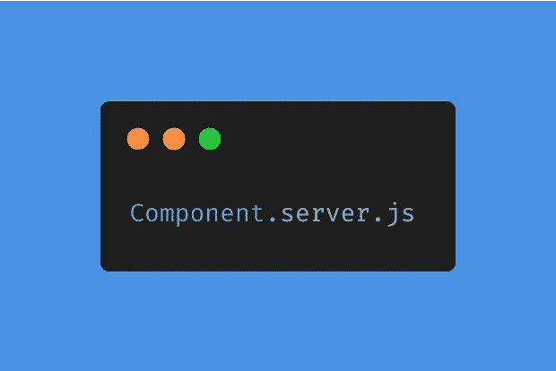
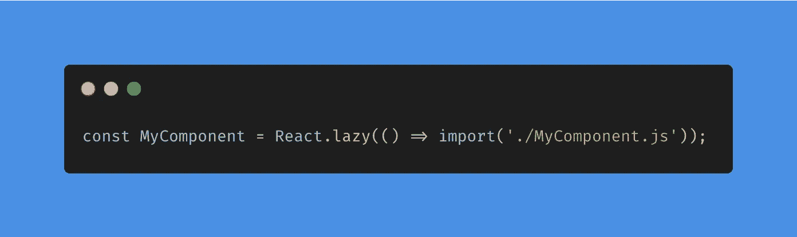
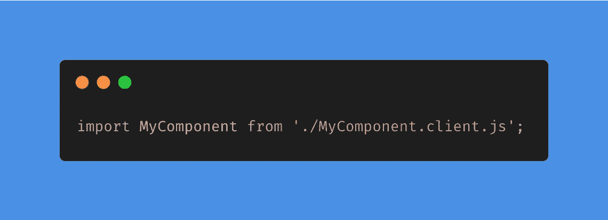
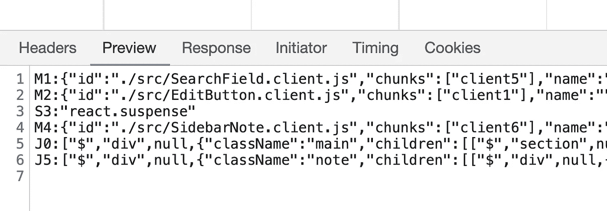
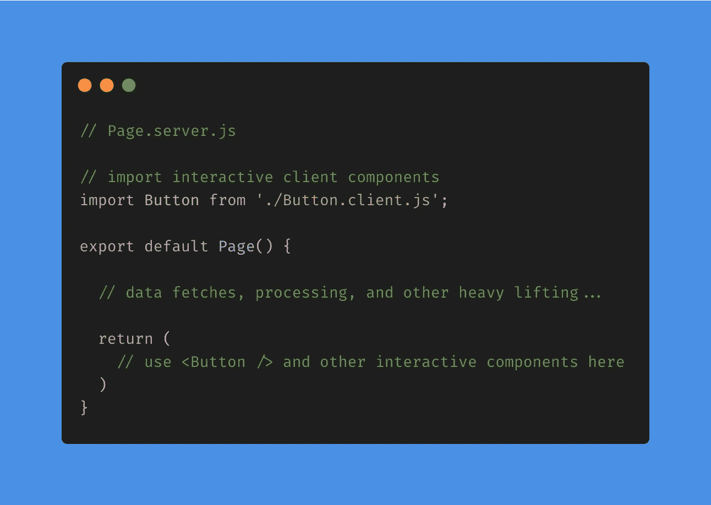

# React 的未来:服务器组件

> 原文：<https://betterprogramming.pub/the-future-of-react-server-components-90f6e3e97c8a>

## React 即将推出的功能介绍

用[碳](https://carbon.now.sh/)生成的图像。

# 什么是服务器组件？

今天，我们有了 React 组件，仅此而已。

然而，React 团队现在正在试验一种新的想法，将组件分成两种类型:客户端组件和服务器组件。建议是开始用文件扩展名(`.client.js`和`.server.js`)来区分它们。那么它们是什么呢？

客户端组件只是我们今天拥有的组件。

另一方面，服务器组件是一种新型的组件，它首先在服务器端呈现，然后再发送到客户端。

# 有什么优势？

乍一看，这听起来非常类似于服务器端渲染(SSR)。事实上，它提供了许多类似的优势:

*   由于可以直接访问服务器端资源(如数据库、文件系统、内部微服务等),因此开发更容易。).
*   更快的性能，因为我们避免了服务器和客户端之间的网络延迟。
*   更小的捆尺寸。只在服务器上使用的库(例如`lodash`、`rambda`、`moment`等实用程序库)不需要提供给客户端。

它还为 React 开发人员提供了一些生活质量的改善。最值得注意的是:

*   自动代码分割(即将代码分割成小的包，这样客户端就可以只加载必要的代码)。目前，React 开发人员必须有意识地通过编写如下代码来实现代码拆分:

将来，服务器组件会自动处理它。这意味着我们可以像平常一样编写导入代码:

然而，最大的优势只有当我们仔细研究服务器组件和 SSR 之间的区别时才能理解。

# 服务器组件与 SSR 有何不同？

在 SSR 中，您在服务器上呈现 HTML，然后将其发送到客户端。此过程在每次页面访问中只能发生一次(在初始加载时)。之后，您的应用程序与普通的 React 应用程序没有什么不同。要显示更新的数据，您需要从客户端进行网络调用或者刷新页面。这两个选项都将导致组件重新渲染并丢失它们的状态。

在服务器组件中，您在服务器上呈现 React 组件，然后通过自定义协议将它们发送到客户端(参见下面的截图)。React 获取这些数据，将新的 UI 合并到客户端树*中，而*不会影响任何客户端状态。这个过程可以发生无数次。跨 UI 更新保存客户端状态可以极大地改善用户体验。

获取服务器组件的网络调用示例。

要了解更多细节，请查看丹·阿布拉莫夫本人的[这个帖子](https://twitter.com/dan_abramov/status/1342264337478660096)，React 数据团队的劳伦·谭的[这个帖子](https://twitter.com/sugarpirate_/status/1341141198258524163)，或者 freeCodeCamp 的 Mehul Mohan 的[这个帖子](https://www.freecodecamp.org/news/react-server-components/)。

# 警告

因为服务器组件是静态的，并且在后端呈现，所以对它们的使用有一些限制。

首先，服务器组件不能有任何交互性(即没有`useState()`，没有`useEffect()`)。要解决这个问题，您需要在服务器组件中导入客户端组件(可以是交互式的)。例如，您可以像这样两全其美:

其次，从服务器组件传递到客户端组件的`props`必须在网络上是可序列化的(即可以传入字符串、JSON 和 JSX 等数据，但不能传入 JavaScript 函数)。这是因为呈现的服务器组件必须通过网络发送。

# 下一步是什么？

虽然这非常令人兴奋，但该功能仍处于试验阶段。它的 API 和实现可能会发生变化。这是*不是*生产就绪。

目前，React 团队正在与 Next.js 团队密切合作，将服务器组件集成到框架中。有一个 webpack 插件的 alpha 版本，一个 package 插件的谈判正在进行中。

最后，服务器组件将是一个选择加入的功能。现有的 React 代码仍然可以工作，不需要急着使用新特性。

有关该功能的更多详细信息，我鼓励您查看[演示视频](https://youtu.be/TQQPAU21ZUw)或[本 RFC](https://github.com/josephsavona/rfcs/blob/server-components/text/0000-server-components.md#update-refetch-sequence) ！

感谢阅读！