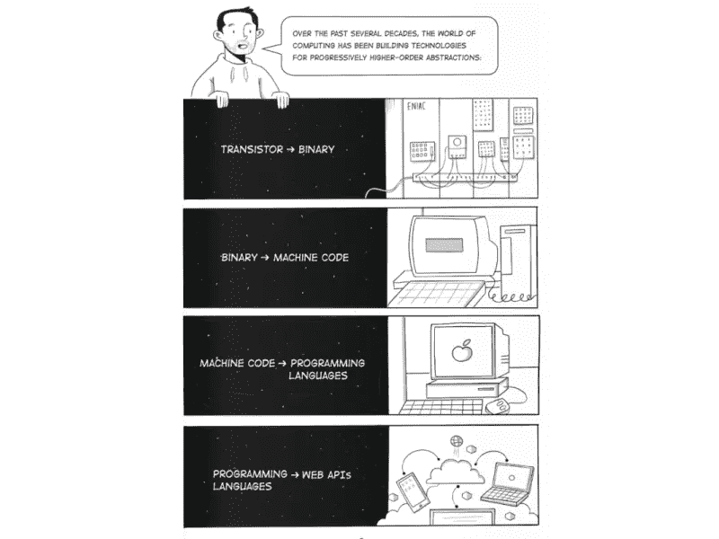

# 无服务器的未来会怎样？

> 原文：<https://betterprogramming.pub/the-future-of-serverless-1c945a75f4be>

## 无服务器越来越受欢迎。未来我们能从它身上期待什么？

由[rawpixel.com](https://www.freepik.com/photos/sea-shore)创作的海岸照片

我的日常工作是云架构师。我不像当开发人员时那样编码了。相反，我花时间思考未来。我制定了 1 年、3 年和 5 年的计划，以规划我们如何在继续使用最新实践和方法的同时高效地推进云计算。

理论很多。*但是很刺激*。

多年来，无服务器一直是我关注的焦点。这是我的工作。我修补它，构建[概念证明](/4-reasons-you-should-never-use-proof-of-concepts-in-production-ca54432e52b9)，并为我的时事通讯阅读来自社区的内容[。](https://www.getrevue.co/profile/allenheltondev)

综上所述，有一件事非常清楚:*我们对当今无服务器的可能性有了很好的理解*。

作为负责任的架构师，我们需要考虑无服务器在未来会怎样。它从这里去哪里？是否已经见顶？

我认为没有。我认为未来会有一个完全不同于我们今天所知的无服务器世界。

让我们谈谈未来可能出现的一些颠覆者。

# 深度基础设施分析

在生产级无服务器应用中，[监控您的应用](/the-challenges-of-stateless-architecture-and-how-to-monitor-your-serverless-application-94c0e8b8dd1)对您的成功至关重要。您需要知道是否丢弃了任何事件，瓶颈在哪里，以及死信队列中是否堆积了项目。更不用说您需要端到端跟踪交易的能力。

这是一个终于开始腾飞的领域。随着越来越多的无服务器生产工作负载上线，这一领域的缺口变得越来越明显。

像 [DataDog](https://www.datadoghq.com/) 、 [Lumigo](https://lumigo.io/) 和[桑德拉](https://www.thundra.io/)这样的厂商都试图解决这个问题——并取得了相当大的成功。*但需要更好的*。

未来，我们需要上面列出的供应商提供的工具，但需要内置优化和洞察力，如 [AWS 可信顾问](https://aws.amazon.com/premiumsupport/technology/trusted-advisor/)。我们需要应用程序监控来发展。当我们听到*应用程序监控*时，我们需要考虑的不仅仅是服务图和队列数量。

> *应用程序监控将不仅仅是花哨的仪表盘和冗余消息。从它看到的工作负载来看，它最终会告诉我们我们调配了错误的基础架构。*

监控有无限的潜力。但是，我们需要努力实现基于工作负载的基础架构决策正常化。与许多开发人员的想法相反，*他们的用例并不特别*。我们都在解决不同领域的相同的 8 个问题。

为了实现这一目标，我们需要将监控服务发展到能够理解基础设施的程度*。*不仅如此，他们还必须能够识别流量模式，以便 it 部门就如何优化成本、性能或可持续性(或三者)提出建议。

# 来自代码的基础结构

我们已经知道，无服务器应用程序是由业务逻辑和基础设施代码(IaC)组合而成的。业务逻辑是知识产权，它使您的应用程序在解决业务问题的方式上与众不同。基础设施作为代码定义了运行业务逻辑的云供应商资源。

工具越来越好，使得基础设施作为代码变得更加容易。像 AWS SAM 和 CDK 这样的工具抽象出了云形成的一些复杂性，使它更容易与你的资源“连接起来”。像 [Terraform](https://docs.microsoft.com/en-us/azure/cloud-adoption-framework/manage/hybrid/server/best-practices/aws-terraform-ubuntu) 和[无服务器框架](https://www.serverless.com/framework/docs/providers)这样的工具将供应商完全抽象化，让您使用相同的 IaC 部署工作负载，而不管您使用哪个云提供商。

随着我们对技术理解的不断加深，抽象性也越来越高。这反过来使得开发变得越来越容易。

*来源:*[*API 第一世界*](https://api-first-world.com/) *由* [*邮递员*](https://www.postman.com)

我们已经处在一个范式转变的过程中。将我们带到前所未有的抽象层次。

在[无服务器云](https://www.serverless.com/cloud)的人们正在将基础设施抽象为代码。他们的任务是从你编写的业务逻辑中推断出你需要的基础设施*。代码基础设施是由[道格·莫斯克普](https://twitter.com/dougmoscrop)创造并由[杰里米·戴利](https://twitter.com/jeremy_daly)推广的一个短语，描述了这个过程。*

您编写代码来解决您的业务问题，剩下的就交给他们了。

> *代码基础设施是无服务器的下一个重大突破。*

一旦无服务器云为一系列使用案例树立了先例，其他人也会效仿。创新者将进入这个领域，进行更高层次的抽象。基于您的业务逻辑，定义良好的最佳实践和模式将被抽象成简单的转换。

通过抽象出基础设施决策，无服务器从蛮荒的西部走向了一种标准开发实践，这种实践通过自动为我们实现的事实上的[模式和标准](https://serverlessland.com/)得到加强。

通过从代码上全身心投入到基础设施中，我们去掉了被认为是无服务器的“硬部分”。零件开发人员花费大量时间试图弄清楚他们缺少什么权限，或者为什么没有触发触发器。

无服务器变得更加容易，以极快的速度从想法到生产。

# 两全其美

在我们通过查看代码获得了基于为我们生成的工作负载和基础架构的智能监控之后，下一步是什么？

这是我们的*下巴撞到地板的*时刻。

想象一个场景，您的开发团队编写了一个无服务器的应用程序。它最初被部署到云中，基础设施是从代码中推断出来的。

该应用程序投入生产并运行了大约一个月。在这一个月中，基础架构分析已经确定了您的流量模式，并成功映射了您的微服务中的所有分布式事务。

最初推断的资源不适合我们应用程序的规模。监控发现了低效率，并根据流量和使用情形自动重新调配正确的资源。

换句话说，基础设施不仅仅是为了满足流量而扩展。它会根据实际流量和工作负载数据进行重新安排和重组，以优化成本、性能和可持续性。

您的应用程序将不断微调其基础设施。它可能从从 API 网关到 Lambda 函数再到 DynamoDB 的集成开始。但随着它获得使用分析，它可能会省略 Lambda 函数，直接从 API Gateway 自动集成到 DynamoDB。

从代码中革新应用程序监控和基础设施是实现这一目标的基础。

# 什么不会改变

在自我供应基础设施的未来世界中，无服务器开发的某些方面不会改变。*数据建模*和 *API 建模*仍然需要手工完成。

但是等等。为什么要问？

当我们谈论抽象出复杂性时，它们往往是“无领域的”,这意味着您正在提取可重复的切割和干燥部分。一旦您开始包含特定领域的数据，nuance 就会出现，并使其难以一般化。

您的数据模型由您的访问模式驱动。访问模式完全是领域驱动的。它们是基于*你如何以自己的方式*解决业务问题而构建的。没有通用的抽象可以用来自动构建数据模型来满足您访问数据的方式。

情况正在好转，但我们可能永远也不会达到 100%生产就绪的程度。

API 建模也有类似的分支。如果您正在设计一个 REST API，那么您可以构建端点来钻取数据实体。如果我们必须手工建模数据实体，那么它也可以移植到 API 建模中。

为开发者体验设计 API 需要人情味。有时[有助于更好发展的东西](/the-importance-of-proper-serverless-api-design-878dfc3d3fcf)违背了基本原则。创建一个打破 REST 指导原则但为开发人员节省 5 个步骤的端点是许多人愿意采取的折衷方案。

# 结论

未来是一个激动人心的无服务器世界。抽象将会变得越来越高，使我们的工作变得越来越容易。

应用程序可以变得“有自我意识”,因为它们知道在给定用例及其看到的流量的情况下，什么是最好的基础设施。我们已经从代码中看到了基础设施的进步，而且随着时间的推移，它会继续变得更好。

我们还有很长的路要走，当然，这都是理论上的。但并非不可能。

今天开发的工具是真正革命性的，可以无缝集成到您的云供应商环境中。不难想象这些工具中的一些可以执行使用率分析和修改基础设施。

在未来的几年里，我们对无服务器有很多期待。不断学习，不断试验，不断创新。

编码快乐！