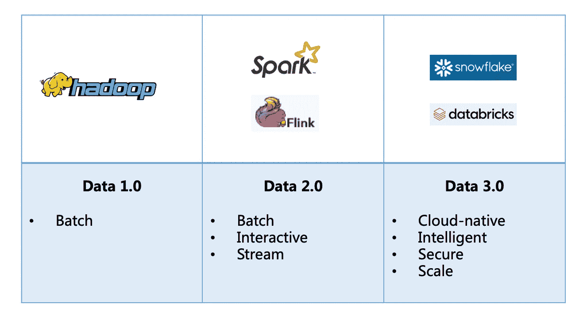
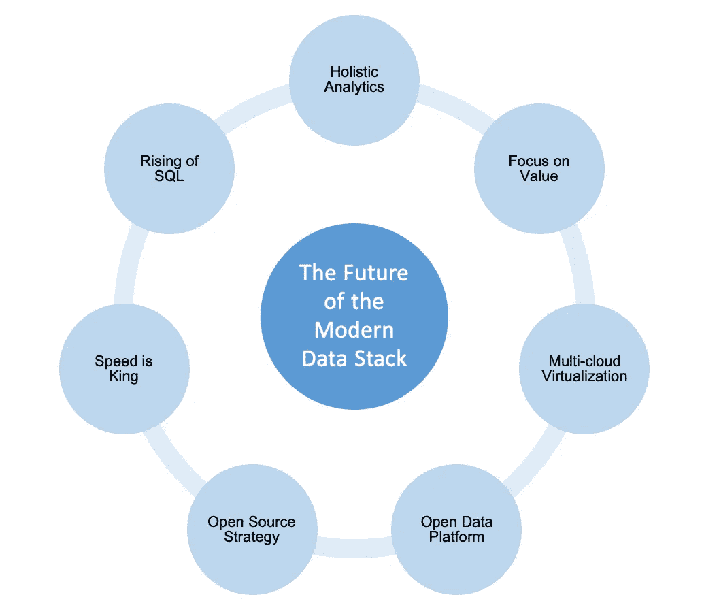

# 现代数据堆栈的未来

> 原文：<https://betterprogramming.pub/the-future-of-the-modern-data-stack-7e49e3067e42>

## 数据平台如何发展？现代数据堆栈的未来是什么？


Jarrett Kow 在 [Unsplash](https://unsplash.com/s/photos/stack?utm_source=unsplash&utm_medium=referral&utm_content=creditCopyText) 上拍摄的照片

十多年来，大数据一直是一个炙手可热的领域，从释放商业洞察力到提供深度学习。然而，这个词随着两个转折点变得暗淡:2019 年 Cloudera 和 Hortonworks 的合并以及 DL 大型模型的挑战。我们对大数据寄予厚望，预测下一个最大的公司应该是大数据公司。我们对 Cloudera 和 Hortonworks 作为大数据先驱感到兴奋，但它们的市值都没有达到 100 亿美元。他们最终合并了，新的 Cloudera 现在是一家私人公司。另一方面，我们正转向[以数据为中心的人工智能](https://towardsdatascience.com/what-is-data-centric-ai-engineering-d29b3468062e)，以应对大型模型日益增加的挑战。

2020 年 9 月，总部位于圣马特奥的公司雪花上市，成为历史上最大的软件 IPO。其市值一度超过 1200 亿美元。这是惊人的。这是甲骨文以外的数据公司首次达到这一里程碑。对大数据的追求在我们心中重燃。

雪花自称是一家数据云公司。随着高性能和高度可扩展的数据云的出现，一个新的时代已经到来，一个新生的数据平台生态系统，即现代数据堆栈。那么什么是现代数据堆栈呢？是否有传统的数据堆栈？现代数据堆栈的未来是什么？

# 数据平台演变

在现代数据堆栈出现之前,“数据堆栈”这个术语从来都不是正式的，听起来也不体面。大数据时代的数据平台已经演变为三个阶段。现在应该是关于现代数据堆栈的数据 3.0。



数据平台的演变(作者)

**Data 1.0** 是 Apache Hadoop 的时代。那是一个繁荣的时代。因此，如果你熟悉 Hadoop 生态系统中的海量数据组件，你就不会对现代数据堆栈中丰富的工具和服务感到惊讶。它主要专注于大数据批处理，尽管有一些初始的云解决方案，如 Amazon EMR、Azure HD Insight 和 Azure Databricks。

**数据 2.0** 是实时大数据时代，典型代表是 Spark 和 Flink。它可以在不同的系统中支持流式和批量数据处理。Spark 和 Flink 现在可以支持流和批处理，尽管 Spark 是从批处理开始的，而 Flink 是从流处理开始的。对于相关的流数据收集和摄取，Apache Kafka 和 Amazon Kinesis 分别在开源社区和云中处于领先地位。

现代的数据堆栈是**数据 3.0** 。现在是数据云时代。毫无疑问，它应该是云原生的、智能的、安全的、可扩展的和易于使用的。这个新的生态系统主要由雪花、数据块和领先的云提供商(如 AWS、Azure 和 GCP)驱动。该堆栈广泛支持云存储、数据查询、处理、ELT/ETL/反向 ETL、BI/分析、可观察性、可发现性、编排、治理、ML Ops 等。

# 什么是现代数据堆栈？

现代数据堆栈是云原生的开放数据平台和服务。云和模块化堆栈是它们的明显特征。那么现代数据堆栈的独特特征是什么呢？现代数据堆栈有四个主流。

> 现代数据栈的四个特征:云原生、批处理和流处理的统一、数据湖库(数据湖和数据仓库集成)和全面的数据工程。

1.  **云现代化**:首先，它应该是云本地的，而不是基于云的、云管理的或云托管的。例如，亚马逊 EMR、Azure HD Insight 和 Azure Databricks 是基于云或云管理的，但不是云原生的，因此难以影响现代数据堆栈。雪花采用计算和存储解耦的云原生架构，使 it 能够独立地横向扩展计算和存储，并增强服务性能和可靠性。亚马逊红移(Amazon Redshift)更早推出，但使用了 EMR 这样的集群托管架构，不幸的是，无论是性能还是收入，都远远落后于雪花。
2.  **批量和流式处理的统一**:批量和流式处理是多年来数据平台演进的主要历程。在当前的 Spark 和 Flink 到来之前，我们对 Hadoop 首次处理海量数据、 [Spark](https://spark.apache.org) 加速 map-reduce 和 [Storm](https://storm.apache.org) 启动流数据处理感到兴奋。现在是时候使用 Spark 或 Flink 统一处理批处理和流数据，而无需两个独立的系统或 [lambda 架构](https://en.wikipedia.org/wiki/Lambda_architecture)。鉴于复杂数据任务的速度，数据转换器(又名 ELT 工具)已经成为生态系统中的便利工具。
3.  **数据湖和数据仓库的整合**:数据湖首次亮相，支持非结构化、半结构化和结构化数据。它通常采用对象存储和就地查询，但是它们很慢。云数据仓库在结构化数据的查询性能方面表现出色。整合数据湖和数据仓库是一个绝妙的策略。[数据湖库](https://towardsdatascience.com/newsql-lakehouse-htap-and-the-future-of-data-69d427c533e0)是一种集成的数据云架构，具有数据湖灵活性和数据仓库性能。此外，从数据湖到数据仓库的 ETL 过程可以减轻，此外还消除了多个存储或数据仓库。
4.  **灵活而全面的数据工程**:现代数据堆栈是灵活的开放式数据平台和服务，支持从数据集成到存储、处理、BI/分析、可观察性、治理等全面的数据工程。例如，用于 ETL 的 Fivetran、Hevo 和 Airbyte，用于 ELT 的 dbt，用于反向 ETL 的 Census，用于存储和查询的 Snowflake 和 Databricks Delta Lake，用于处理的 Spark 和 Flink 等等。所有这些都被编排在一起，以完成整个数据工程任务。

# 现代数据堆栈的挑战

随着 Data 3.0 的出现，现代数据堆栈已经向前迈出了一大步，但它仍处于萌芽状态。挑战和机遇很多。三大挑战如下。

1.  **复杂**:现代数据栈全面、灵活、开放。但是，由于不同的语言、协议、法规甚至基础设施，它仍然太复杂，难以选择或集成。这让我们想起了 Hadoop 生态系统，其中有几十种工具用于不同或类似的目的。我们被持续的包升级和接口集成淹没了。
2.  **远远落后于数据科学**:现代数据堆栈目前专注于数据工程，数据科学的工具远远落后。数据是 AI/ML 的核心，但特征工程和特征/参数/模型管理仍然是另一个领域空间。例如，我们能否将 BI 数据集市与特定于 AI 的特征存储合并？我们能为数据、特征、参数、模型、信号和超参数建立一个单一/统一的目录、谱系和可观测性吗？数据工程和数据科学之间的脱节越来越严重。幸运的是，[以数据为中心的人工智能工程](https://towardsdatascience.com/what-is-data-centric-ai-engineering-d29b3468062e)正在兴起，将解决数据生命周期并扩展到人工智能/ML。
3.  **巨大的云孤岛**:现代数据堆栈驻留在云中，由于不同的云提供商，很难避免云孤岛。我们可能会从组织数据孤岛的问题转移到巨型云孤岛的问题，这可能与数据之外的流程、SLA 和法规遵从性有关。但是这可以为多云元数据和编排带来机会。

# 现代数据堆栈的未来

考虑到上述特性和挑战，让我们展望一下现代数据堆栈的未来。什么是数据 3.5 或数据 4.0？

有**七个**对未来有意义又令人兴奋的领域: ***整体分析、关注价值、多云虚拟化、开放数据平台、开源战略、速度为王、SQL 的崛起*** 。



现代数据堆栈的未来(作者)

## **整体数据分析(HDA)**

数据分析不仅仅是 BI。凭借当前的数据处理和机器学习能力，我们可以从 BI 或传统分析转向高级整体数据分析。

我们可以集成商业智能和智能分析来实现整体分析，包括描述性、诊断性、预测性和规范性分析。

我们能在没有明确训练或服务的情况下使用过去和当前的数据来生成未来的信息吗？ML 分析(预测性和规范性)将成为数据分析和平台的趋势。

## **关注工程价值**

如何从数据中释放商业价值始终是数据平台的首要目标。从数据到商业价值的旅程通常涉及多个人或团队。我们应该为每个团队提供不同的工具吗？答案应该是否定的。

有三种切实可行的方法可以加速数据商业价值的实现:

1.  **以端到端的循环关闭数据流**，实现商业价值最大化。尽管我们几年前就在行业中意识到了这种方法，但没有直接的解决方案。它需要连接所有相关点，并通过管道中的节点传输高质量的数据。
2.  **整合数据栈，统一数据**简化流程和操作。这样可以有效降低整体成本，提高生产率。
3.  **提供低代码/无代码**工具来民主化。我们将数据堆栈和平台移至云中，并使其成为数据即服务。对于大多数商业用户来说，这可能还不够。低代码/无代码是解决方案，可以为他们提供轻松的开箱即用体验。

## **多云虚拟化**

云显著增强了现代数据堆栈的可扩展性和可靠性。但事实上，现在和将来都会有多家云提供商。不幸的是，它们没有像共享域层或安全隧道那样的直接连接。

此外，由于特定的法规，一些数据必须存储在本地或地区。越来越多的企业采用了云计算战略。点击查看多云战略[的详细信息。对于这些大型云提供商，公共云和私有云需要高效、安全地联合起来。](https://towardsdatascience.com/newsql-lakehouse-htap-and-the-future-of-data-69d427c533e0)

它将在多个公共云和私有云之上形成一个连接的虚拟云层。虚拟化虚拟化云似乎很有趣。双虚拟化可能存在两个令人振奋的前沿:

1.  **面向多种云的共识元平台**。在这种方法中，数据可以在不移动的情况下共享和使用。元平台层包含治理、可观察性和可发现性的共识功能。
2.  **具有统一编排的多云端资源虚拟化**。这将比跨[VPC](https://en.wikipedia.org/wiki/Amazon_Virtual_Private_Cloud)管理资源更具挑战性，这在单个云提供商内部已经变得可行。对于数据存储资源，通过几个代理接口来分发和检索可能相对更简单。此外，我们可以在它们之上运行查询。

## **灵活而紧密的开放平台**

数据堆栈的未来将是一个易于集成、安全共享、低延迟、高可靠性和一致治理的开放平台。

例如，对于通过 ETL 从数据源到存储的数据流，通过就地 ELT 的数据转换，以及通过反向 ETL 的结果反馈，它应该是简单的，没有额外的工作。

它应该通过可观察性和可发现性显著提高数据质量和工程生产率。然后，数据谱系、语义、统计、度量和其他知识信息可以成为一等公民。

还有就是可以从 ML analytics 延伸到 AI 工程和机器学习，比如图形知识。因此，它将是灵活但有凝聚力的开放平台。

## **开源战略**

大数据和数据平台应该从开源开始，以后再往云上走。由于开源的本质和云的局限性，现代数据堆栈的未来应该同时包含云和开源，以实现业务成功和用户参与。

现在，采用开源策略的创业公司对风险投资有很大的吸引力。例如来自 TAOS 数据的 [TDengine](https://github.com/taosdata/TDengine) 从一开始就通过开源实现了指数级增长。在现代数据栈社区中还有许多其他成功的开源故事，比如 Databricks、Starburst 和 Dremio。

## **速度为王**

在过去的几十年里，我们已经显著提高了数据处理和查询的性能。在现代数据栈中，速度仍然是王道。这不仅仅关乎用户体验，还关乎决策速度和成本。我们仍然记得，由于其性能，我们更喜欢 Spark 而不是 Hadoop。对于红移以上的雪花也是一样的道理。由于数据量大且复杂，新的突破性速度将成为现代数据堆栈中的下一个里程碑。例如[火弩箭](https://www.firebolt.io)因其潜在的更高速度而迅速崛起。

## **SQL 的崛起**

SQL 源于数据管理和数据库。它优雅的简单性和广泛使用的标准使它成为现代数据堆栈中最常见的语言。越来越多的数据服务和平台开始支持 SQL。例如，使用 SQL 查询和分析流数据并不新鲜；一些初创公司采用 SQL 来检索即时预测分析结果。我们可以预计数据工程中的 SQL 和人工智能工程中的 Python 会越来越多。

我们可以看到数据平台未来的许多机会。以上七个领域是基于商业价值、数据基础设施、用户体验和团队协作的核心观点而出现的。

# 简单地

现代数据堆栈是在雪花取得商业成功后出现的。它正在扩散，但仍处于早期阶段。与数据和人工智能合作充满了挑战和机遇。现代数据堆栈是数据 3.0。

数据平台的发展永远不会停止。我们可以看到未来的七个可预测的变化:高级整体分析、始终以价值为导向、多云虚拟化、开放数据平台、开源战略、速度依然为王、SQL 的崛起。从基础设施到用户体验、性能等等，现代数据堆栈的未来将更加令人兴奋。

```
What do you think about MDS looking ahead? Reach out to [Luhui Hu](https://linkedin.com/in/luhui) with your take.
```