# 科技领域的性别差距:数据说明了什么

> 原文：<https://betterprogramming.pub/the-gender-gap-in-data-science-what-the-data-says-2a74892655f1>

## 科技行业的性别差距是真实存在的——下面是它的样子

照片由克里斯蒂娜·wocintechchat.com 在 Unsplash 上拍摄

下图显示了主要科技公司中女性员工的比例。从中，我们可以看到女性在技术领域的代表性明显不足。

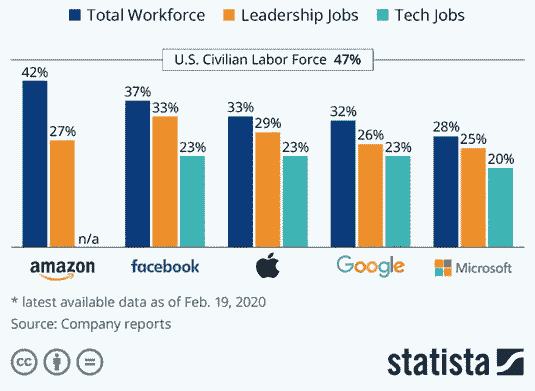

资料来源:Statista.com

在本文中，我将关注:

*   科技行业的性别差距及其存在的原因。
*   技术领域性别差距的数据可视化，尤其是在数据科学领域。
*   我们能做些什么。

# **科技领域的性别差异:统计数据**

蒂姆·莫斯霍尔德

在全世界范围内，女性在劳动力中的贡献一直在增加。仅在美国，职业女性的比例就攀升至 46.8%，远高于几十年前。然而，这些数字在科技领域要低得多:

*   26%的计算机相关工作由女性担任。
*   74%的女孩表达了对 STEM 领域职业的渴望。
*   然而，2018 年只有 9%的女毕业生学习了一门核心 STEM 学科。
*   不到 2%的技术团队包括女性。
*   有孩子的受过技术教育的女性中，几乎有一半会离职。

从上面的统计数据来看，很明显，科技行业是一个男性主导的行业，有相当大的性别差距需要弥合。

作为一名攻读计算机科学学位的女学生，我很好奇为什么我班上没有多少女生。

高中毕业后，我的大多数男性朋友似乎都渴望从事与工程和计算机科学相关的职业。另一方面，我的女性朋友(包括我自己)似乎倾向于心理学、艺术和新闻等学科。

在做了一些研究后，我想出了一些理由来解释女性在科技行业中的代表性不足。

## 缺乏兴趣

11 至 12 岁的女孩对 STEM 和技术表现出浓厚的兴趣。当他们长到 15 到 16 岁时，这种兴趣显然就消失了。这可能是由于同辈人的压力，或者行业内缺乏榜样。

## 不知道如何好好失败

女孩的成长方式在决定她们的职业选择方面也起着巨大的作用。当他们年轻时，男孩是冒险家和冒险家。总是有试错的空间，没有解决不了的问题。

另一方面，女孩总是被教导要谨慎行事。人们通常期望女孩尽善尽美，因为她们不像男孩那样冒险。这也可能是为什么女生在学校考试时表现更好的原因。

得到一个较低的分数，甚至只是一个 B，被视为一件坏事。因此，女孩倾向于遵守规则，听从指导，以获得完美的成绩，做得更好。

但是当涉及到像编码这样的事情时，没有办法让它变得完美。修复一个程序中的错误可能需要几天的时间，没有尝试和错误，什么都不会起作用。学习如何编码的过程就是学习失败。不幸的是，我们很多人都不知道如何去做。

我们天生需要完美。不能马上知道答案的不适会让许多完美主义者(主要是女孩)远离科技。

## 缺乏榜样

科技领域缺乏女性代表，这可能会让试图从事 STEM 职业的女孩感到缺乏灵感。

几乎我们所有人在努力追求事业的时候都会向另一个人寻求帮助。我们寻找行业中的领导者，并试图跟随他们的脚步。由于科技领域的女性如此之少，女孩们很难找到一条可以追随的道路，或者找到一个值得尊敬的人。

## 缺乏信心

如前所述，与男孩相比，女孩更希望自己做的每件事都尽善尽美。没有在第一次就把事情做好会伤害他们的自尊，降低他们的信心，并导致他们决定这不是适合他们的领域。

此外，只有当妇女完全符合要求时，她们才更有可能申请工作。另一方面，男性会在感觉自己达到 60%的要求时申请。

这可能会极大地影响他们在 IT 或数据科学等领域找到工作的机会，在这些领域，几乎不可能满足雇主发布的每一项工作要求。有些技能只需要在找到工作后，在*的基础上学习和积累。*

这些是我们看不到女性在技术或任何 STEM 领域平等代表性的一些主要原因。如果我们想缩小男女在科技领域的差距，我们需要首先解决这些问题。

我现在将使用 Python 执行一些数据分析，以可视化数据科学中的性别差距。这个分析将使用 Pandas、Seaborn 和 Plotly 库来完成，这些库需要首先安装，代码才能工作。

# **数据可视化**

我使用了来自 [2019 Kaggle ML 和 DS 调查](https://www.kaggle.com/c/kaggle-survey-2019/data?select=multiple_choice_responses.csv)的数据，为了这些可视化的目的，我只使用了`multiple_choice_responses.csv`文件。

我知道这些数据仅仅是从 19717 名被调查者那里收集的，而且这个样本人群并不能代表整个人群。然而，它让我们对实际人口有了一个很好的了解，也是我们能得到的最接近真实人口的数据。

## 读取文件

## 数据清理

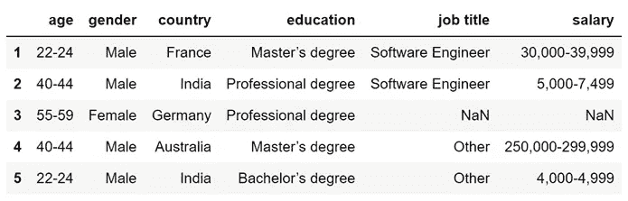

作者图片

## 可视化性别分布

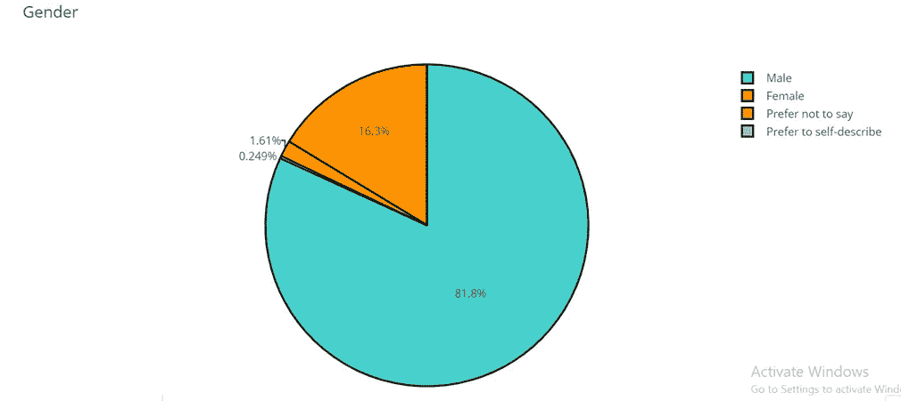

作者图片

如你所见，81.8%的调查对象是男性，只有 16%左右是女性。

## 可视化年龄分布

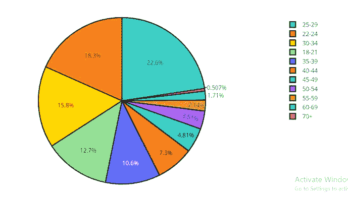

作者图片

大多数调查对象都很年轻，大约 20 至 30 岁。

## 按性别分列的所有受访者的年龄分布

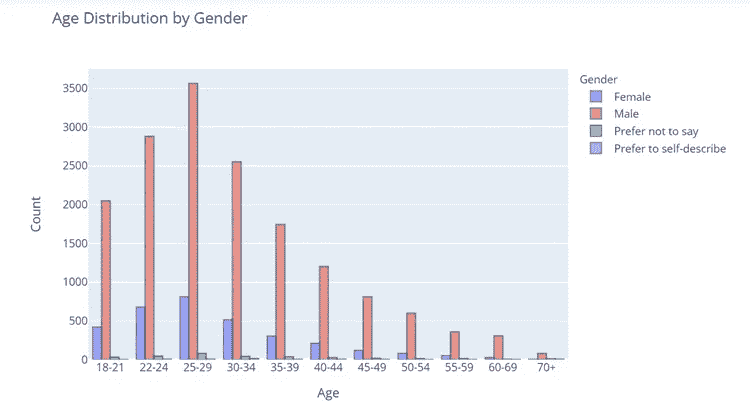

作者图片

## 教育水平

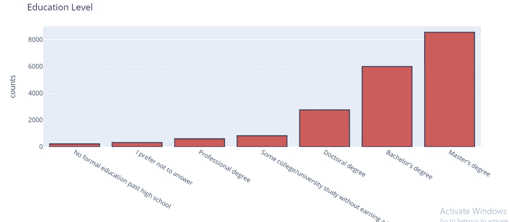

作者图片

大多数受访者拥有硕士学位，或至少学士学位。

## 教育水平和性别

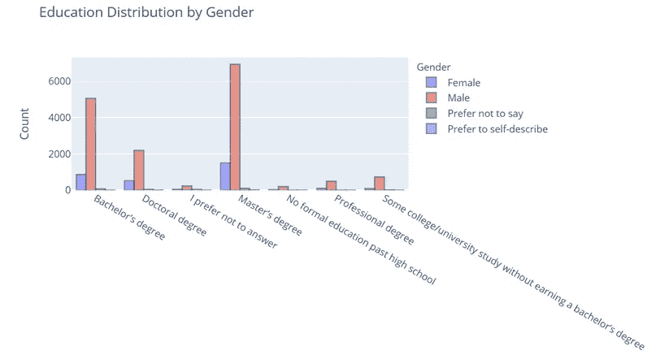

作者图片

男性和女性受访者的教育水平显示出相似的模式——女性受访者与男性受访者一样受教育程度高。

## 职称分布

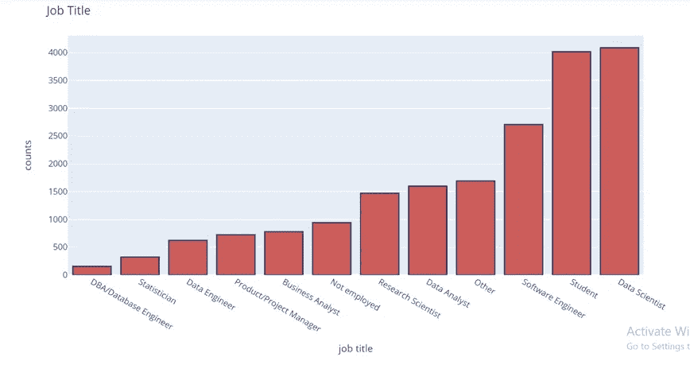

作者图片

大多数受访者似乎是数据科学家或学生。统计学家和数据库工程师屈指可数。

## 按性别分列的职称分布

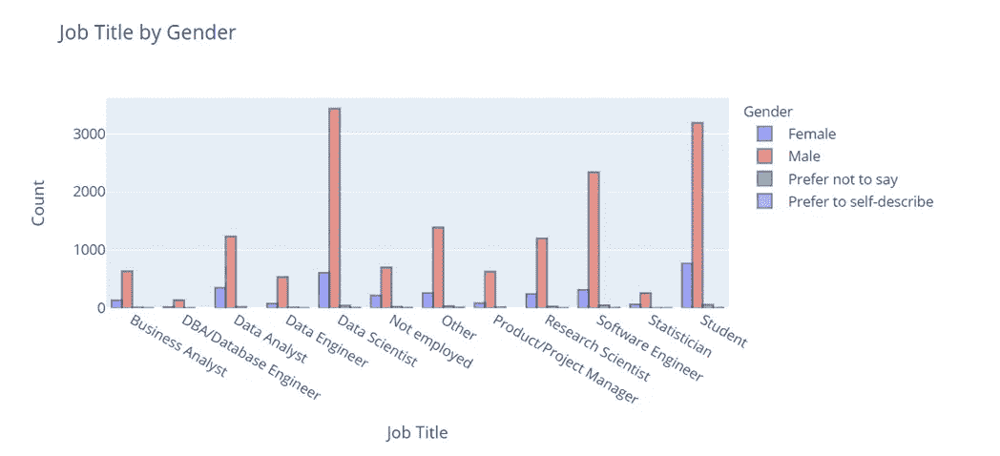

作者图片

## 工资分配

现在，我将想象一下所有受访者的工资分配情况:

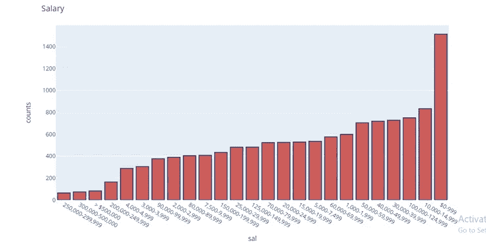

作者图片

## 薪资性别分布

最后，我将想象一下薪酬分配和受访者性别之间的关系:

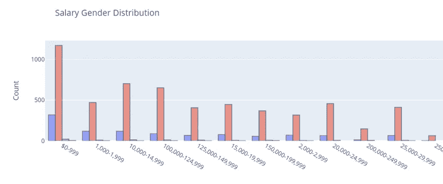

# **结论**

总之，科技行业的性别差异是真实的，女性在该领域的代表性严重不足。

那么，我们能做些什么呢？

已经从事这一行业的妇女可以为女孩开展特别项目，鼓励女孩加入这一领域。当试图寻找职业道路时，有一个导师或榜样可以仰视会有很大的帮助。

应该教育女孩们犯错误没什么，试错是生活的一部分。应该教的是勇气，而不是完美。这种心态将改变女孩的学习方式，鼓励她们探索不同的职业道路。

很多女孩，包括我自己，选择职业道路是基于我们对社会的贡献。医学和生物科学不是做到这一点的唯一途径——女孩需要接触到追求科技领域的职业生涯可能带来的巨大变化。

我们都必须尽自己的一份力量，鼓励女孩从事 STEM 职业并坚持下去。