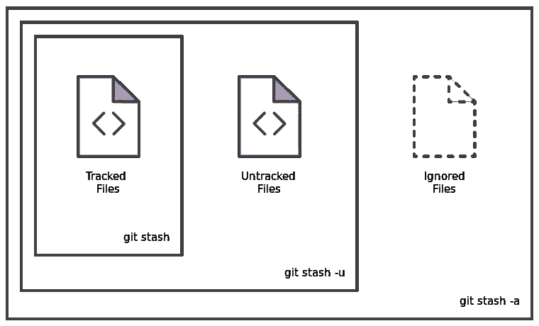
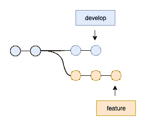
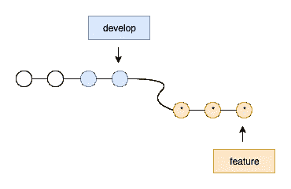
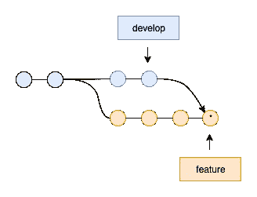

# 每个软件工程师都应该知道 Git 命令

> 原文：<https://betterprogramming.pub/the-git-commands-every-software-engineer-should-know-part-ii-875160a74e92>

## stash | Commit | Reflog | Merge vs . Rebase


格伦·卡斯滕斯-彼得斯在 [Unsplash](https://unsplash.com/s/photos/type-on-macbook?utm_source=unsplash&utm_medium=referral&utm_content=creditCopyText) 上拍摄的照片

这篇文章是每个软件工程师都应该知道的 Git 命令的延续。在这里阅读第 1 部分:

[](https://medium.com/swlh/the-git-commands-every-software-engineer-should-know-part-1-f2b3ebf5c2cf) [## 每个软件工程师都应该知道的 Git 命令(第一部分)

### 软件工程师最常用的 Git 命令。

medium.com](https://medium.com/swlh/the-git-commands-every-software-engineer-should-know-part-1-f2b3ebf5c2cf) 

在这篇文章中，我们将讨论临时存储变更，将变更保存到项目的历史中，利用历史，以及合并和重定基础策略。

# 1.暂时存储更改

```
git stash
```

`Git stash`将当前更改保存到一个临时位置，我们可以在以后应用或恢复。对我们来说，在不丢失我们一直在做的工作的情况下，重置头部的状态是很方便的。当我们的代码还没有准备好提交时，Stashing 使我们能够快速切换上下文，并处理其他事情。

为了在 stash 中应用最近的更改并保存这些更改，以便我们可以将其应用到不同的分支，我们使用了`git stash ***apply***` *。*

要应用并从 stash 中完全删除最近的更改，我们可以使用`git stash ***pop***` ***。***

默认情况下，`git stash`不会在我们的本地存储库中存储尚未暂存的新文件，也不会忽略文件。为了隐藏未被跟踪或忽略的文件，我们需要添加适当的选项。

```
git stash ***-u*** # or ***--include-untracked*** includes untracked files.
git stash ***-a*** # or ***--all*** includes all files.
```



Git 隐藏选项——图片来自[Atlassian.com](http://www.atlassian.com/)

我们可以通过多次运行`git stash` 来创建多个仓库。要列出所有可用的仓库，我们可以使用`git stash list`。

您可能会看到如下隐藏列表:

```
stash@{0}: WIP on develop: 3969d68 Refactor:- Localisations 
stash@{1}: WIP on develop: 3969d68 Refactor:- Localisations
stash@{2}: WIP on develop: 3969d68 Refactor:- Localisations
```

很难确定哪个是为了什么。因此，在隐藏时，最好使用以下方法提供更多的上下文:

```
git stash ***save*** *"we can provide more context here!"*
```

基于上下文，我们可以通过传递它的限定符来重新应用我们想要的存储。例如，如果我们有这样一个隐藏列表:

```
stash@{0}: on develop: Refactored Food Module
stash@{1}: on develop: Refactored Express Module
stash@{2}: on develop: Refactored Transport Module
```

既然我们想要重新应用 Express 模块的重构，即`stash@{1}` *，*我们可以使用`pop`或`apply`选项，就像这样:

```
git stash pop stash@{1} # re-apply and remove stash@{1}, or
git stash apply stash@{1} # re-apply but still keep stash@{1}
```

自然，栈在 git 存储库中被编码为提交对象。因此，我们可以从一个单独的存储中创建一个新的分支，如下所示:

```
git stash ***branch <branch_name> stash@{<qualifier>}***
```

这个命令将基于我们用`qualifier`创建的提交，检查一个新的分支为`branch_name`。然后将隐藏的修改弹出到上面。

一旦不再需要存储，我们可以像这样清除整个存储列表:

```
git stash ***clear***
```

要删除一个隐藏，我们可以使用这个:

```
git stash ***drop stash@{<qualifier>}***
```

当变更准备好提交时，我们可以进入下一步。

# 2.保存对项目历史记录的更改

```
git commit
```

保存更改的最简单的方法是提交被跟踪的文件，然后显示一条提交消息，如下所示

```
git commit ***-am*** *"This is an inline commit message"*
```

或者，我们也可以单独使用这些选项。使用`-m`选项可以让我们跳过文本编辑器，而是使用内嵌消息。使用`-a`选项使我们能够提交所有被跟踪的文件。

要提交一个选择性文件列表，我们可以使用`git add` 命令将文件选择到 stage 区域，以便下一次提交将包括这些文件。

```
git add *<file>* # stages all changes in <file>
git add *<directory>* # stage all changes in <directory>
git add ***-p*** # stages partial changes with manual selections
```

我们需要注意的是，在我们运行`git commit` *之前，`git add`不会保存代码更改。*

如果您想修改历史记录中的提交，该怎么办？`--amend`选项来拯救。

```
git commit ***--amend***
```

这将打开预先填充了我们之前输入的提交消息的已配置文本编辑器，我们还可以使用`-m`选项来处理内嵌消息。为了更新代码变更而不是提交消息，我们可以使用`--no-edit`选项。

```
git commit ***--amend --no-edit***
```

理论上，修改后的提交实际上是全新的提交，它替换了旧的提交。因此，可能会出现冲突的情况。

`--amend`选项只允许我们修改最后一次提交。为了能够做得更多，让我们进入下一部分。

# 3.利用项目的历史

```
git reflog
```

默认情况下，这将打印出 HEAD ref 的 `reflog`，它是对当前活动分支的符号引用。不仅如此，我们还可以通过使用

```
git reflog ***show --all***
```

或者，查看名为`branch_name`的特定分支的`reflog`:

```
git reflog ***show <branch_name>***
```

执行这些命令，我们可能会得到如下结果:

```
9f8399b (HEAD -> Refactor/Txn_Flow) HEAD@{0}: commit: Test commit
6f04f27 (origin/Refactor/Txn_Flow) HEAD@{1}: reset: moving to HEAD
1f04e29 (origin/Refactor/Txn_Flow_Test) HEAD@{2}: commit: Added correlationId
```

根据结果，我们可以挑选任何需要的提交，或者将当前 HEAD 重置回任何时间点。这对我们从`git rebase` 中检索或恢复任何丢失的提交或合并冲突非常有用。

例如，如果我们需要使用 hash `1f04e29`来挑选提交`Added correlationId` :

```
git cherry-pick *1f04e29*
```

或者，将当前的`HEAD`重置回`HEAD@{1}`:

每个 reflog 条目都有一个时间戳。我们可以利用这个属性按时间过滤`git reflog`。可以使用的一些时间限定符有:

*   `1.minute.ago`
*   `1.hour.ago`
*   `1.day.ago`
*   `1.week.ago`
*   `1.month.ago`
*   `1.year.ago`
*   `yesterday`
*   `2020-01-30.09:00:00`

这些时间限定符可以组合成`1.week.3.day.ago`并像本例一样使用，以查看当前`develop`分支与`develop.1.month.ago`分支之间的差异。

```
git diff develop@{0} develop@{1.month.ago}
```

它使我们能够了解在一段时间内发生的变化。

# 4.决定合并或重组我们的代码

`git merge`和`git rebase`是两个 Git 实用程序，专门用于将变更从一个分支合并到另一个分支。虽然合并总是一个向前移动的变化，有一个全新的合并提交，但 rebasing 通过为每个提交创建全新的提交，然后在原始分支中替换它们，重写了项目的历史。

为了更好地理解这一点，我们举个例子。假设我们的团队正在开发一个`develop`分支，我们正在开发一个`feature`分支。我们已经提交了一些更改，并且在`develop`中有一些提交是相关的，需要包括进来。因此，要合并来自`develop` *，*的提交，我们必须在两个选项中选择一个:合并或重设基础。



从 develop 派生出一个特性分支的例子

## **备选方案 1: git 重定基数**

```
git rebase feature develop# orgit checkout feature # make sure that we are on feature branch
git rebase develop # rebase feature branch onto develop
```

这将通过创建新的提交来替换原来的提交，从而将整个`feature`分支移动到`develop`分支的顶部。因此，由于没有冗余的合并提交，我们获得了更清晰的历史记录。此外，它有助于提交历史是线性的，没有任何分叉，并让我们更容易地浏览我们的历史。



*将功能分支重置为开发— *全新提交*

尽管如此，使用`git rebase` *时还是有取舍的。*

第一，当我们试图改写历史时，安全没有保证。某个时间点的一个错误会打乱后续的提交顺序。第二，可追溯性更难，因为我们没有包含分支的上下文。

根据我使用`git rebase`的经验，我们应该只在没有发布这个分支的提交历史时使用这种方法。在这一点上，我们可以随心所欲。否则，如果其他人在同一个基础上工作，他们稍后在合并他们的变更时会有冲突。因此，在使用`git rebase` *，*之前，让我们确保没有其他人正在使用这个分支。

## **选项 2: git 合并**

```
git merge feature develop# orgit checkout feature # make sure that we are on feature branch
git merge develop # merge develop branch into feature
```

当在`develop`分支中创建一个全新的合并提交时，这是一个更容易的选择。



将开发合并到特性分支中— *是一个全新的合并提交

现有分支不变。这有助于我们避免重定基础的潜在问题，并使我们更容易恢复合并。同样，合并也有其利弊。每当我们需要与其他分支合并时,`feature`分支将会有额外的合并提交。那些提交可能会弄乱历史，让我们的队友很难理解。

这就是第二部分。我希望你今天能学到一些新东西。请继续关注第 3 部分，在那里我们将讨论撤销变更的提交和检查存储库。