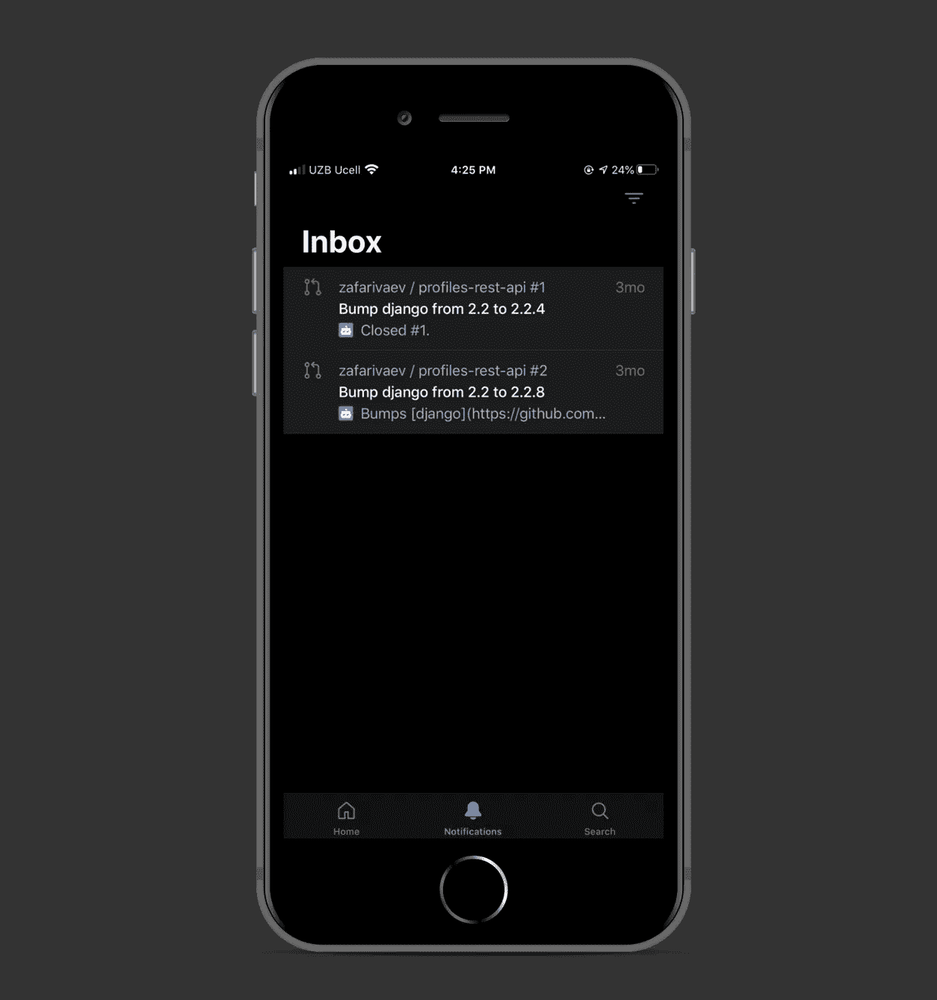
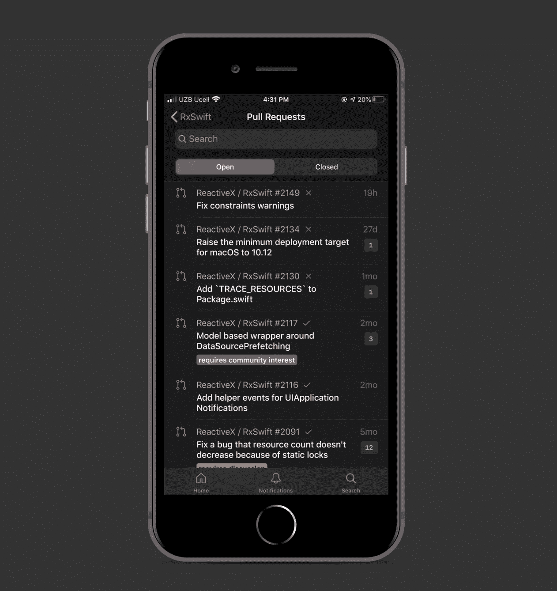
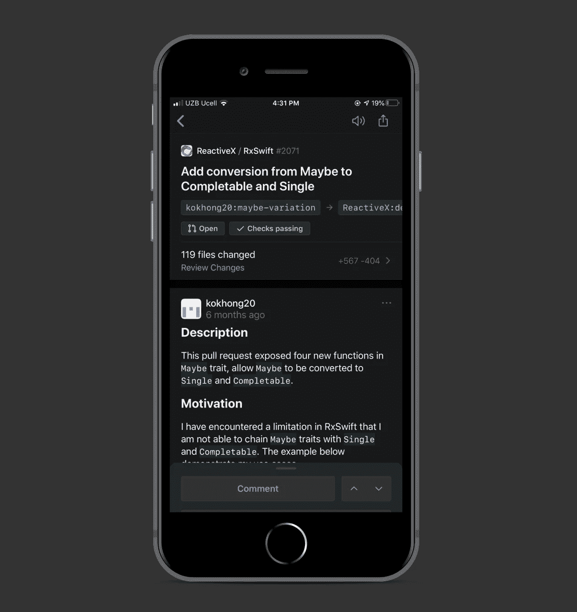
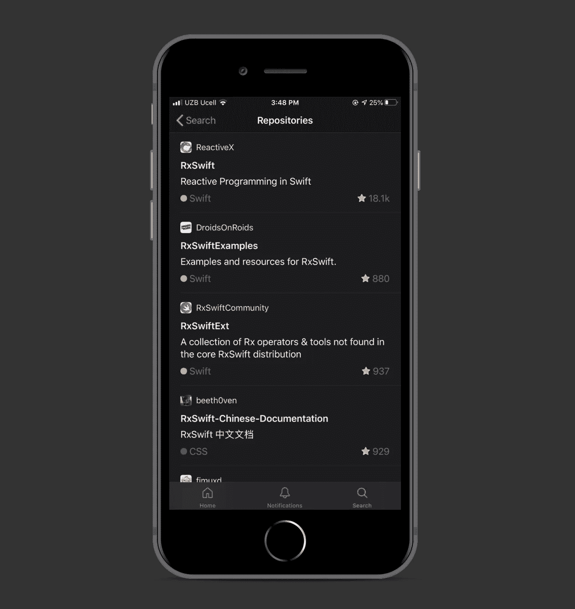
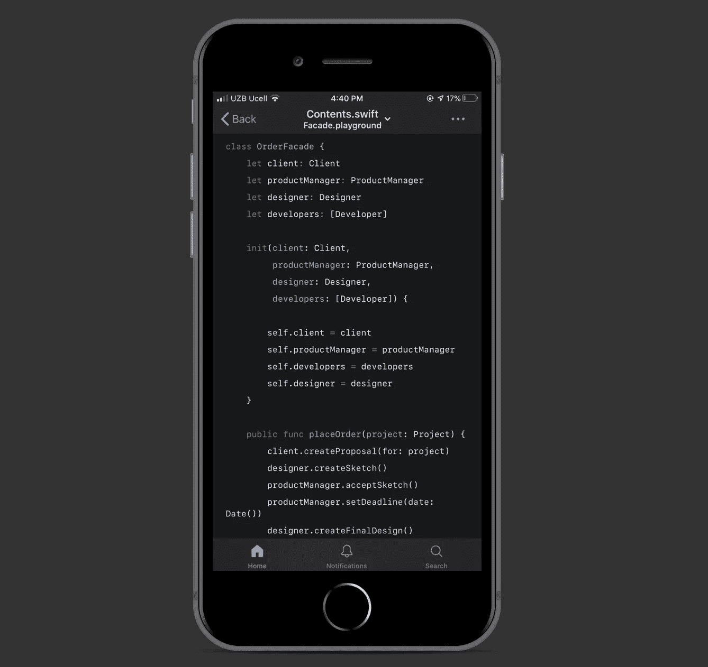

# GitHub 移动应用终于出测试版了

> 原文：<https://betterprogramming.pub/the-github-mobile-app-is-finally-out-of-beta-954c7c946f28>

## 为什么您应该立即下载此应用程序

照片由 [Unsplash](https://unsplash.com?utm_source=medium&utm_medium=referral) 上的 [mnm.all](https://unsplash.com/@mnm_all?utm_source=medium&utm_medium=referral) 拍摄

期待已久的 GitHub 移动应用终于出测试版了，你可以在 App Store 和 Google Play 上下载。

现在，开发人员可以在他们的智能手机和平板电脑上轻松地与他们的团队交流，跟踪任务，合并代码。

iOS 和 Android 应用的下载链接可以在文章的底部找到。

# 特征

在 iOS 应用程序的当前版本 1.0.0 (105)中，以下功能可用:

*   查看最新通知:

*   查看和回复问题和拉动式请求:

*   查看并合并拉式请求:

*   与成员一起组织项目任务
*   搜索和查看存储库:

*   浏览代码:

在官方 [GitHub 页面](https://github.com/mobile)上了解更多关于新 GitHub 应用的信息。

# 下载链接

## 适用于 iOS

 [## GitHub

### 在 GitHub 上，您可以做很多不需要复杂开发环境的事情，比如在

apps.apple.com](https://apps.apple.com/ru/app/github/id1477376905) 

## 适用于 Android

 [## GitHub-Google Play 上的应用程序

### 你可以在 GitHub 上做很多不需要复杂开发环境的事情——比如在一个…

play.google.com](https://play.google.com/store/apps/details?id=com.github.android) 

感谢阅读！