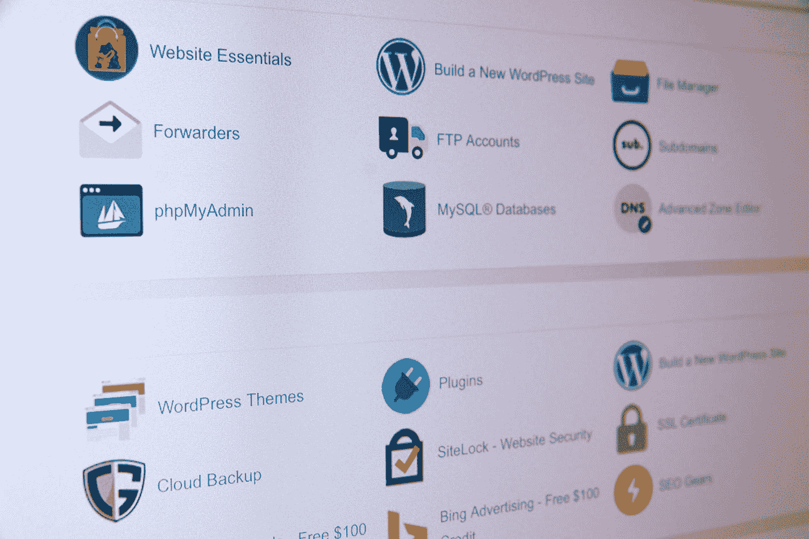

# 过去美好的时光已经一去不复返了

> 原文：<https://betterprogramming.pub/the-good-old-cpanel-times-is-gone-5b4d47cb8b20>

## 我现在比以往任何时候都更想念 Cpanel 时代

斯蒂芬·菲利普斯-Hostreviews.co.uk 在 [Unsplash](https://unsplash.com?utm_source=medium&utm_medium=referral) 上的照片

2015 年高中毕业后，我开始了解 Cpanel 和 FTPs。

这是我开始对技术感兴趣的时候，我渴望了解支撑一切的点点滴滴。

我第一次接触 Cpanel dashboards 是非常令人惊讶的，当时我购买了一些带有一些疯狂名称的自定义域，现在我真的对此一笑置之。

我发现使用 Cpanel 及其仪表板的总体体验是如此令人惊叹，一切看起来都很好。我从 2017 年开始用 Cpanel，也接触过其他种类的东西。

以 zip 文件的形式将内容上传到 Cpanel，将文件解压缩到服务器仪表板，配置文件，处理重定向，以及设置自定义电子邮件，这些对我来说都是非常神奇和简单的。我还是觉得是有史以来最好的服务器体验。

后来，我才意识到这项技术带给我的美好。我不知道你对此有何感受，但我发现 Cpanel 的体验非常棒。

# **善后事宜**

几年后，Netlify、Vercel 等公司崛起。这些技术震撼了开发人员的空间，减少了他们的顾虑。

初始设置后，您不需要进行任何配置。你只需要修改你的代码，把你的代码推送到 GitLab 或者你使用的任何版本控制平台，一切都会为你处理好。

考虑到编写代码有时非常繁忙，这是相当令人惊讶的；使用文件传输协议(FTP)将更改推送到 Cpanel 服务器可以节省您的时间。

我仍然认为许多人和公司仍然在使用 Cpanel 及其提供的体验，我会怀念这些。

我花了很多时间将代码推送到 GitHub，一切都搞定了。我唯一担心的是万一我的更改中断了生产，这种情况经常发生，这时我会反思并想放弃这项技术，再次进入 Cpanel。

我总体上认为并相信，未来的主机托管等将会彻底改变网络，一些令人惊叹的技术将会加入进来，改善用户体验。

目前使用 ***Netlify，Vercel，Heroku*** 的时候觉得很惊艳。太棒了，他们承诺了未来的很多事情。

据我所知，Cpanel 似乎仍然很好使用，尤其是如果你正在用 WordPress 为个人博客平台进行定制设计。

此外，值得注意的是，我所看到的许多自由职业者的工作仍然需要使用 Cpanel 进行托管，这使得它仍然适用。

但展望未来，我认为一些更好的替代方案将解决这个问题。让我们看看这些令人惊叹的技术将把我们带向何方。

综上所述，Cpanel 在今天仍然适用。虽然我最近不怎么用它，但是从一个自由职业者的角度来说，如果你想建立 WordPress 网站和定制博客页面，它仍然是一个很好的技能。