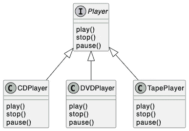

# 伟大的界面，第 1 部分

> 原文：<https://betterprogramming.pub/the-great-interface-part-1-561acf3e1a54>

## 编程到接口而不是实现


照片由[艾伦·坦纳](https://unsplash.com/@ellentanner?utm_source=medium&utm_medium=referral)在 [Unsplash](https://unsplash.com?utm_source=medium&utm_medium=referral) 拍摄

这些年来，我一直对界面的用法感到惊讶。接口是面向对象编程(OOP)的一个基本概念。我将写 3 篇文章来与你分享这个界面的一些常见用法，这是这个系列的第一篇。第一篇文章介绍了背景和基础知识。

面向对象编程(OOP)是软件开发的主流。要成为一名优秀的 OO 软件工程师，你可能已经读过 Robert C. Martin 的《坚实的设计原则》[2]和四人帮的《24 种设计模式》[3]。这些 OO 设计原则和模式背后有一个神奇的东西，那就是伟大的界面。我称之为“伟大”,因为我认为这个接口真的是一个伟大的发明，使许多最佳编程实践成为可能。

# 接口是什么？

面向对象的接口意味着一种类型的声明，带有一组函数，任何接口的实现都必须遵循这些函数。换句话说，接口设置了规则，即任何实现都应该能够做某些事情。大多数编程语言都支持该接口，但可能名称不同。例如，在 Java 和 Kotlin 中，我们直接使用“接口”。对于 C++，我们将需要使用只包含纯虚函数的抽象类；在 Swift 中，我们使用“协议”。为了简单起见，本文中的示例代码将使用 Java。



作者图片

上面的类图展示了一个简单的`Player`接口，实现它的具体类有三个，分别是`CDPlayer`、`DVDPlayer`和`TapePlayer`。

接口和三个类的示例代码如下所示。只是澄清一下，本文中的函数只是为了演示，所以您可能经常会发现函数只是打印一些东西。

接口的概念看起来非常简单。然而，这是 OOP 背后最强大的概念之一。它支持多态性。它使得实现大多数设计原则和模式成为可能。它可以模拟程序的一部分，并在不同的情况下轻松测试代码。

# **多态性**

多态性是该接口的根本优势。让我们继续前面的玩家例子。一个接口可以由多个类实现。播放器接口由 3 个类实现，它们都必须能够播放、停止和暂停。

例如，我们可以有一个类似下面代码的测试程序。Person 类被定义为有一个播放器，它可以被配置为构造函数中的一个参数。`Person`不需要知道它是什么样的玩家。但是，他只要想`listenToMusic`就可以跟玩家做“播放”、“停止”、“暂停”。

如果您运行上面的测试代码，您应该能够在控制台中获得如下所示的日志。

```
Jack started to listen to music.
play a CD
paused CD
play a CD
stopped CDTom started to listen to music.
play a DVD
paused DVD
play a DVD
stopped DVDLea started to listen to music.
play a Tape
paused Tape
play a Tape
stopped Tape
```

# 结论

这是我分享的第一篇关于伟大界面的文章。它涵盖了使用接口的基本概念和主要好处，即多态性。在[的下一篇文章](https://cullensun.medium.com/the-great-interface-part-2-84e0ee73ceb2)中，我将讲述更多关于接口的高级用法，例如使用接口实现一些面向对象的设计原则和设计模式。

# 参考

1.  你可以在 GitHub 的这里找到整个播放器包[的源代码。](https://github.com/CullenSUN/great_interface/tree/master/src/main/java/com/great/polymorphism)
2.  《干净的架构:软件结构和设计的工匠指南》，亚马逊的书。
3.  [设计模式:可重用面向对象软件的元素](https://www.amazon.com/gp/product/0201633612/ref=as_li_tl?ie=UTF8&camp=1789&creative=390957&creativeASIN=0201633612&linkCode=as2&tag=triatcraft-20&linkId=XRGUDJCGWC6AJNZM)，亚马逊的书。