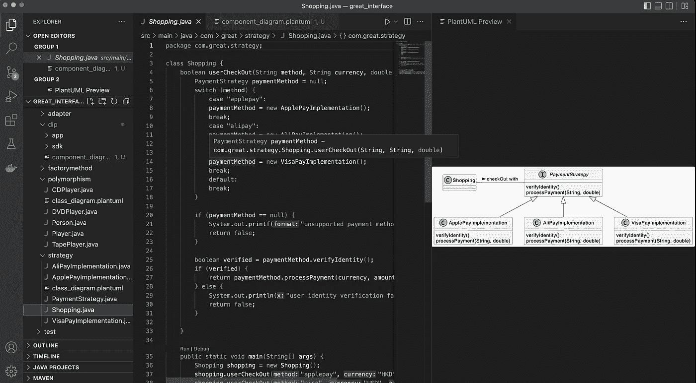
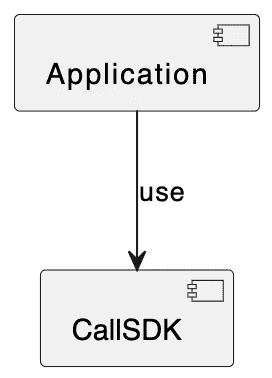
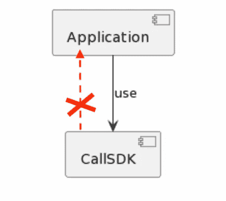
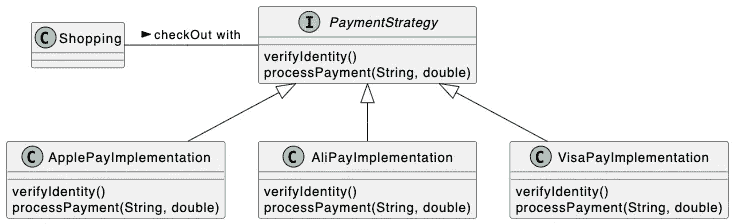
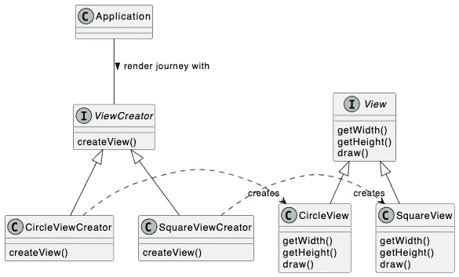
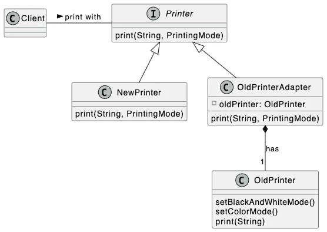

# 伟大的界面，第 2 部分

> 原文：<https://betterprogramming.pub/the-great-interface-part-2-84e0ee73ceb2>

## 编程到接口而不是实现。

作者图片:伟大的界面工程

我是一个干净的代码追求者。这些年来，我一直对界面的用法感到惊讶。接口是面向对象编程(OOP)的一个基本概念。

这是该系列的第二篇文章，通过它我从接口的角度来写 OOP。如果你错过了《T2》第一部，我建议你先看一遍。

在这篇文章中，我将关注如何使用接口来实现一些面向对象的设计原则和模式。

当你处理复杂的软件系统时，了解这些 OO 设计原则和模式是非常有益的。不能保证你会得到用它们写一段代码的最好方法，但是它们通常会产生可维护和可测试的软件。好吧，我们开始吧。

# 从属倒置原则

马丁在《干净的建筑》一书中提到了 5 个设计原则，被称为“坚固的”。最后一个原则“D”是依赖倒置原则(DIP)的标准，我发现它对打破依赖循环非常有用。下面是一个典型的例子。

我曾经开发过一个可以打 VOIP 电话的移动应用，我们会有一个如下图所示的组件图。根据 Clean 架构，经常变化的易失性软件将取决于更稳定的软件。该应用程序是易变的，因为它与用户界面相关，并且会经常改变，以不断改善用户体验；而 CallSDK 是一个稳定的组件，专注于不经常更改的低级功能。因此，应用程序依赖于 CallSDK。

作者图表

到目前为止，一切都很简单。但是，如果我们需要让应用程序从 CallSDK 中做一些事情，例如获取电池状态。直接思考可能是如下的组件设计。这会造成依赖循环，让应用和 CallSDK 高度耦合，这是非常不好的做法。CallSDK 不应该依赖于应用程序。

作者图表

为了打破两个组件之间的依赖循环，我们可以使用 DIP。下面的代码将让您大致了解它是如何工作的。接口`BatteryService`在 CallSDK 中定义，但在应用程序中实现。换句话说，应用程序依赖于 CallSDK 的`BatteryService`接口。使用 DIP 的结果是，依赖关系仍然从应用程序指向 CallSDK。

## **应用**

## **调用 SDK**

# 设计模式

四人帮的《设计模式》一书中有 24 种面向对象的设计模式[3]。在大多数情况下，界面起着重要的作用。我将在这里阐述几种常见的模式。它们是策略、工厂方法和适配器。如果你有兴趣了解更多，我强烈建议你读这本书。

## **策略模式**

当我们有一个复杂的开关情况时，策略模式是非常有用的。当您对每种情况都有不同的策略要执行时，通常会发生这种情况。使用策略模式使代码更干净。请看看下面显示的使用不同支付方式的示例购物应用程序。

作者的策略模式的类图

首先，我们定义接口`PaymentStrategy`，它由三个不同的具体支付类实现。

然后一个非常简单的`Shopping`类如下，允许用户用不同的方法支付。

## **工厂方法模式**

工厂方法是指将用于创建对象的方法。当移动应用变得越来越复杂时，工程师可能会决定在单独的框架/库中构建每个旅程。这是使用工厂方法模式的好地方，因为主机应用程序不知道为每个旅程创建什么具体的视图类。相反，宿主应用程序通过工厂方法接口将创建视图的任务委托给个人旅程。

作者工厂方法模式的类图

下面的`Common`包定义了每个旅程要实现的`View`和`ViewCreator`接口。

下面显示了一个简单的“循环旅程”,因此只要符合视图界面，该旅程就可以自由地创建其花哨的视图。请注意`CircleView`仅在包装内可见。

同样，另一个名为“广场之旅”的旅程如下图。

下面的应用程序模拟用户访问不同的旅程，将调用工厂方法分别创建不同的视图。

## **适配器模式**

想想看，当你去另一个国家旅行，你的电源插头与插座不匹配时，你需要一个电源适配器。当两个现有的接口不匹配时，使用适配器模式，因此我们需要创建一个适配器来使整个事情一起工作。下面的类图向您展示了一个非常有趣的老式打印机问题。

作者的适配器模式的类图

我们有一个非常老的打印机类，如下，我们不能修改它。

大多数打印客户端使用最新的 NewPrinter，它符合最新的打印机接口，如下所示。

为了以与新打印机完全相同的方式使用旧打印机，我们将创建一个适配器。给你。

然后，通过调用打印机接口中定义的相同函数，客户机可以很容易地用新旧打印机进行打印。适配器只是帮助旧打印机适应打印机接口。请看看下面的示例代码。

# 结论

我们已经在本文(第 2 部分)中讨论了很多。我们讨论了依赖倒置原则、策略模式、因素方法模式和适配器模式。所有这些都有接口作为设计的一部分。希望你发现它对更好地利用接口和使你的代码更整洁是有用的。

在下一篇文章(第 3 部分)中，我将与您分享测试期间接口的神奇用法。

# 参考

1.  你可以在 GitHub 的这里找到所有示例[的完整源代码。](https://github.com/CullenSUN/great_interface)
2.  [干净的架构:软件结构和设计的工匠指南](https://www.amazon.com/Clean-Architecture-Craftsmans-Software-Structure/dp/0134494164)，亚马逊的书。
3.  [设计模式:可重用面向对象软件的元素](https://www.amazon.com/gp/product/0201633612/ref=as_li_tl?ie=UTF8&camp=1789&creative=390957&creativeASIN=0201633612&linkCode=as2&tag=triatcraft-20&linkId=XRGUDJCGWC6AJNZM)，亚马逊的书。