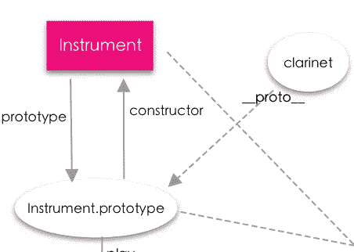
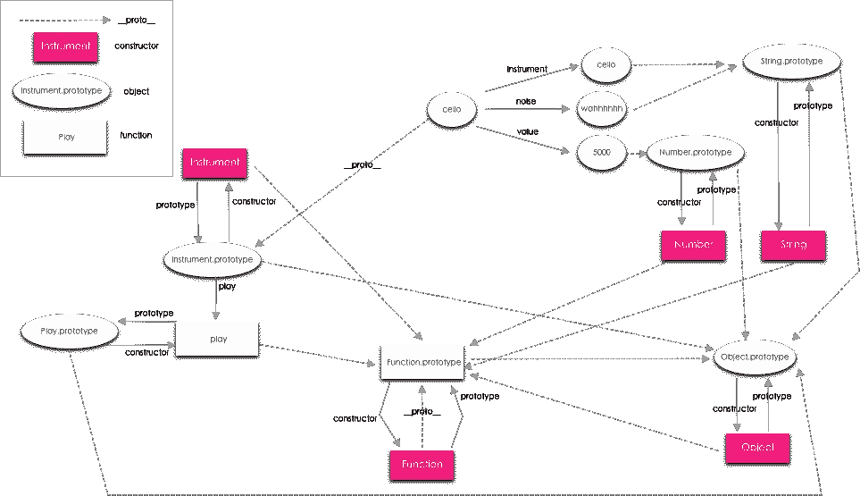
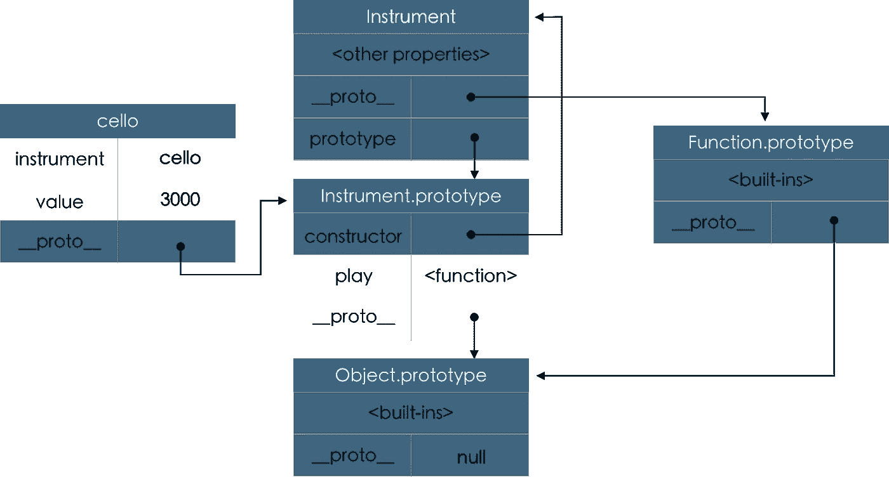

# 我希望我有 JavaScript 对象创建模式的指南

> 原文：<https://betterprogramming.pub/the-guide-i-wish-i-had-for-js-object-creation-patterns-e0af3043993d>

## 关于 JavaScript 中的对象创建，您需要知道的一切


马库斯·斯皮斯克在 [Unsplash](https://unsplash.com?utm_source=medium&utm_medium=referral) 上拍摄的照片

如果您正在学习 JavaScript 中的面向对象编程，您可能已经遇到过这些对象创建模式。对于试图锁定每种模式的心智模型、它们的优缺点以及如何对继承或财产委托建模的学生来说，本指南将非常有用。如果你是从[启动学校](https://launchschool.com/)开始的，在你完成第 1-4 课之前不要读这篇文章。

# 对象工厂

*对象工厂* 是返回对象的函数，可用于自动创建对象。所有的对象都有相同的“类型”,也就是说它们有相同的状态属性和相同的方法，但是使用`Object.getPrototypeOf`会返回`Object.prototype/{}`,所以你不能确定你用了什么函数来构造实例对象。

这种模式有一些缺点，包括内存效率低，因为每个新实例都有所有方法的完整副本，并且无法检出用于创建对象的匹配原型对象(原型是通用对象)。

```
> let cello = createInstrument("cello","squeak",500) 
> Object.getPrototypeOf(cello) // {}
```

要编写一个对象工厂函数，需要声明一个函数，该函数接受构成对象状态的参数。在函数体中，`return`一个对象字面量。应该使用下面的`instrument`、`noise`和`value`的参数来设置属性，并且可以添加方法。总的来说，您正在创建使用该函数创建的对象的骨架版本，并且所有属性都将添加到使用该函数创建的每个新对象中，因此内存效率很低。

您可能还会看到用箭头函数表达式编写的这种模式。如果您选择这种语法，请记住将对象括在括号中。默认情况下，JavaScript 假设您想在使用大括号`{}`时创建一个函数体。

尽管关系建模和代码冗余存在缺陷，一些开发人员认为使用工厂函数和*混合插件*编码是理想的，因为继承不能对所有场景建模。

# 具有混合功能的对象工厂

使用具有混合功能的对象工厂有利于对没有明确的*“*是-a”*关系的对象进行建模。在下面的例子中，我们可以创建三种不同且不相关的对象类型——鸭嘴兽(又名鸭嘴兽或鸭嘴兽)、企鹅和人类——它们有一些共同的行为，但不能以任何方式进行子类化。不是在每个对象工厂的方法中复制代码，而是使用`Object.assign`将*混合到*中，将所有可枚举的属性从源对象复制到目标对象中。*

*在代码中，`details`、`swim`和`layEggs`都是具有属性值的对象。创建三种不同类型的对象有三个功能:`createPlatypus`、`createPenguin`和`createHuman`。这三个函数可用于创建这些类型对象的新实例。*

*看一看`createPlatypus`，我们看到该函数带有一个名称参数。在函数体中，`Object.assign`用于将`details`、`swim`和`layEggs`对象的可枚举属性赋给一个空对象。在这三个对象的属性被复制到新对象之后，它使用`addDetails`方法，当我们使用`Object.assign`方法复制可枚举属性时，它被从`details`对象复制到`createPlatypus`。因此，它用 name 属性和来自`details`、`swim`和`layEggs`对象的方法创建了一个新的 platypus 对象。*

*如果您检查从这些函数实例化的对象的属性，您认为您会看到什么？*

```
*> let platypus = createPlatypus("platypus");
> let penguin = createPenguin("penguin");
> let human = createHuman("human");
> human
{ displayDetails: [Function: displayDetails], swim: [Function: swim], name: 'human' }
> penguin
{ displayDetails: [Function: displayDetails], swim: [Function: swim], layEggs: [Function: layEggs], name: 'penguin' }
> platypus
{ displayDetails: [Function: displayDetails], swim: [Function: swim], layEggs: [Function: layEggs], name: 'platypus'}*
```

*如果`addDetails`方法的使用令人困惑，这里有另一个版本，我们在函数本身中设置细节。请注意，在这些函数中，执行上下文将是全局对象，但是我们可以使用一个赋给变量的空对象来局部添加一些属性，如第 22–25 行所示。*

*请看下面的第 30–32 行，这里发生的事情是我们使用`Object.assign`方法将属性从`details`、`swim`和`layEggs`对象复制到目标中，这是一个空对象`{}`。然后我们链接另一个方法调用，使用对象现在拥有的`addDetails`，并添加我们在函数调用中传递的`name`参数。*

# *构造器模式*

**构造器模式*利用`[new](https://developer.mozilla.org/en-US/docs/Web/JavaScript/Reference/Operators/new)` [操作符](https://developer.mozilla.org/en-US/docs/Web/JavaScript/Reference/Operators/new)和一个函数来创建新对象。当用`new`操作符/关键字调用一个函数时，它变成一个构造函数，一些事情在幕后发生。下面的代码片段描述了这些步骤:*

*   *`clarinet`变量被分配给一个新对象，该对象是通过使用`new`操作符调用`Instrument`构造函数创建的。*

**

*图片来源:作者*

*   *`clarinet`对象的`[[Prototype]]` / `__proto__`属性被设置为构造函数的原型。*
*   *函数执行`(this)`的执行上下文指向新对象。*
*   *构造函数执行。*
*   *新对象被返回。*

# *具有原型的构造函数(伪经典模式)*

*在 JavaScript 中，函数有一个`prototype`属性，该属性有一个`constructor`属性指向函数。对于对象实例，由`new functionName()`实例化的对象的实际原型(`__proto__`属性)指向用于构造该对象的函数`functionName.prototype`的`prototype`属性。*

*为了避免在每个新构造的对象上定义函数，可以将函数添加到`Instrument.prototype`中，这样实例调用的方法可以委托给`Instrument`的`prototype`属性。*

*该图表+视频概述有助于展示这一切意味着什么:*

**

*图片来源:作者*

*要区分的主要内容是我们的`Instrument`函数上的`prototype`属性/对象与实例对象的原型之间的区别，后者通过内部的`[[Prototype]]` / `__proto__`属性链接。*

**

*使用伪经典模式代替对象工厂函数有几个主要优点。*

1.  *现在，您可以对对象之间的关系进行建模。*
2.  *共享行为存在于原型中，并被委托而不是被复制到每个新对象中。*
3.  *如果您需要修改原型中的行为/方法，它会自然地反映出来，您不需要编辑您的对象。*

# *伪经典模式的继承*

*伪经典是指构造函数继承如何模仿其他 OOP 语言中的类。*

*在伪经典继承中，一个构造函数的原型继承自另一个构造函数的原型，即子类型继承自超类型。*

*在代码中，`StringInstrument`构造函数创建的所有对象都继承自`StringInstrument.prototype`，而 T5 又继承自`Instrument.prototype`。因此，所有的弦乐器对象都可以访问来自`Instrument.prototype`的方法。*

*如果来自`Instrument.prototype`的方法需要被修改以与`StringInstrument.prototype`一起工作，我们可以在`StringInstrument.prototype`对象上用相同的方法属性名称定义它，这样它共享一个接口，即该方法可以在任一对象上被调用并返回预期的输出。*

*在下面的代码中，我们创建了两个函数，`Instrument`和`StringInstrument`。为了设置`prototype`属性，我们在第 16 行使用`Object.create()`。为什么我们要创建一个新的对象？如果我们将`Instrument`函数的现有原型分配给`StringInstrument`函数的`prototype`属性，我们将不再有继承结构，因为原型对象在内存中是相同的。*

*不要做什么:*

```
*. // code omitted for brevity
.
.
StringInstrument.prototype = Instrument.prototype; // **DON'T DO THIS**StringInstrument.prototype.tuneStrings = function() {             
    console.log("I have strings.")
}let oboe = new Instrument("oboe","squeaky squeak");*// Oboe will think it is both a string instrument + an instrument*oboe.tuneStrings(); // I have strings. => should be a TypeError
console.log(oboe instanceof StringInstrument); // true => should be false*
```

# *设置继承链的另一种方式*

*如果你看看你在`Instrument`和`StringInstrument`函数中设置的属性，你会发现它们是相似的。这表明您可以在`StringInstrument`中使用`Instrument`构造函数。为此，调用`Instrument`，将其执行上下文显式设置为`StringInstrument`的执行上下文，如下面的函数方法`call`所示。第一个参数是`this`，然后传递任意数量的参数。*

*以下是相同的内容，但使用了 ES6 类语法:*

*[MDN docs](https://developer.mozilla.org/en-US/docs/Learn/JavaScript/Objects/Inheritance#ECMAScript_2015_Classes) 有一个很好的概述，所以在这里它被改编成上面的代码:*

*   *`[constructor()](https://developer.mozilla.org/en-US/docs/Web/JavaScript/Reference/Classes/constructor)`方法定义了表示我们的`Instrument`类的构造函数。*
*   *`play()`是类方法。任何你想与类关联的方法都在构造函数后面的类中定义。*
*   *对于子类，新分配的对象的`this`初始化总是依赖于父类构造函数，也就是你正在扩展的类的构造函数。*
*   *这里我们扩展了`Instrument`类——`StringInstrument`子类是`Instrument`类的扩展。所以对于`StringInstrument`，`this`的初始化是由`Instrument`构造函数完成的。*
*   *要调用父构造函数，我们必须使用`[super()](https://developer.mozilla.org/en-US/docs/Web/JavaScript/Reference/Operators/super)` [运算符](https://developer.mozilla.org/en-US/docs/Web/JavaScript/Reference/Operators/super)。*

# *链接到其他对象的对象(OLOO)*

*OLOO 只关心与其他对象相关联的对象。OLOO 是一种委托模式，而不是继承模式。我们看什么对象想要委托给其他对象。OLOO 对象不使用构造函数或`.prototype`。*

*如果你用变量名称`cello`赋值为`let cello = Object.create(instrumentPrototype)`用`Object.create()`实例化一个新对象，这个对象当前没有属性。*

```
*> cello // {}*
```

*要使用 OLOO 模式完成对象的初始化，请使用 prototype 对象的初始化方法。通常使用`init`作为初始化方法的名称，但这不是必需的。当您使用`object.create`创建一个新对象时，您作为参数传递的对象是新对象的预期原型，所以现在来自`instrumentPrototype`对象的所有方法都可以通过属性委托提供给`cello`对象。*

*您可以使用`Object.getOwnPropertyNames(obj)`来验证这些方法没有被复制到新对象中。*

*由于这种模式非常类似于对象工厂，我们可以把它比作对象工厂。与对象工厂相比，OLOO 的主要优势是内存效率。用 OLOO 模式创建的所有对象都从原型对象继承方法，而工厂函数将方法复制到用工厂函数创建的每个新对象中。*

*让我知道如果你有任何进一步的问题，我可以写回信或添加更多的文章！*