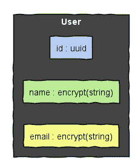

# MongoDB 字段级加密指南

> 原文：<https://betterprogramming.pub/the-guide-to-mongodb-field-level-encryption-55c5b0b90bf7>

## 如何更好地保护您和您客户的数据


照片由来自 [Pexels](https://www.pexels.com/photo/woman-draw-a-light-bulb-in-white-board-3758105/) 的[安德里亚·皮亚卡迪奥](https://www.pexels.com/@olly)拍摄

一如既往，虽然建立一个新项目很有趣，而且现在的大多数技术都很容易集成。但是一旦你开始考虑操作和数据安全，事情往往会变得更加棘手。MongoDB 提供了三个加密选项，其中两个只有企业许可才可用。

1.  静态加密从 3.2 版开始提供，但仅面向企业客户。
2.  自动字段级加密仅在 MongoDB 4.2 Enterprise 和 MongoDB Atlas 4.2 上可用。
3.  MongoDB 4.2 Community Edition(免费版本)提供了手动字段级加密。

只有付费许可证持有人有资格使用自动 MongoDB 加密。就收入而言，Mongo 的决定并不坏，对我们来说也不是一个巨大的挑战，因为我们仍然可以使用显式客户端字段级加密(CSFLE)。我们做了一些研究，找到了一些文档和指南，但没有足够的解释和解决方案。

我们构建了一个小的 MVP 和一个简短的测试，它将数据写入 MongoDB 实例，然后读取相同的文档，这就开始将所有的部分组合在一起。

我们的初步测试结果:

```
Users
    .getUser
      √ returns a user that was previously added (262ms)1 passing (337ms)
```

# 基础设施设置

## 加密密钥设置

MongoDB 使用一个叫做*信封加密*的概念来加密和解密数据。封装要求使用数据密钥对数据进行加密，并且数据密钥本身由另一个称为主密钥的密钥进行加密。这个过程的优点是您的数据密钥永远不会以纯文本的形式存储。在 MongoDB 上下文中，数据密钥将加密存储在数据库内部的专用集合中。就设置和操作而言，这增加了一些复杂性，但这都是为了更好的利益。

因此，我们需要创建一个主密钥，然后使用该主密钥生成一个数据密钥。根据定义，主密钥的长度必须正好是 96 个字节。一个 shell 命令就可以创建这个随机序列，并将其以 base64 编码存储在一个文本文件中。

```
**$** head -c 96 /dev/random | base64 -w0 > key.base64.txt
```

数据键的创建也是我们在数据库初始设置后运行的一次性任务。下面的脚本正是这样做的。

*   第 1 行—第 8 行:使用名为`__keys` 和数据库`encryption`的新集合以及主密钥创建加密选项。
*   第 10–13 行:连接到 MongoDB 实例并传递加密选项。
*   第 15 行:获取对 key vault 对象的引用。
*   第 17–20 行:创建一个名为`local`和`www`的新数据键。

数据键的别名`www`，我们稍后将在应用程序中使用它来引用数据键。我们建议不要在数据库服务器上运行脚本，而是在一次性服务器或容器中运行:

*   使用模板引擎替换生成服务器上的所有变量。如果你在 Kubernetes 上运行，把这个文件挂载成一个[秘密卷](https://kubernetes.io/docs/concepts/storage/volumes/#secret)来防止它被写到磁盘上。

```
mongo ./create-mongodb-data-key.js
```

*   填充环境变量，最好是容器或短期服务器的环境变量，将变量传递给`mongo` shell，并调用脚本。

```
mongo --eval 'mongo_root_user=\"$MONGO_ROOT_USER\", mongo_root_password=\"$MONGO_ROOT_PASSWORD\", mongo_host=\"MONGO_HOST\", encryption_master_key=\"$MONGO_ENCRYPTION_KEY\"' ./create-mongodb-data-key.js
```

# 客户端应用程序设置

## 运行时依赖关系

为了启用客户端加密，我们需要首先在服务器或容器中安装所需的 C 库。需要的 C 库是 [libbson](http://mongoc.org/libbson/current/index.html) 和 [libmongocrypt](http://mongoc.org/libmongoc/current/using_client_side_encryption.html) 。

我们还必须将相应的包装器库作为依赖项添加到我们的应用程序中。NodeJS 包装器的 npm 包叫做[MongoDB-client-encryption](https://www.npmjs.com/package/mongodb-client-encryption)；Java 包装器被称为 [mongodb-crypt](https://mvnrepository.com/artifact/org.mongodb/mongodb-crypt) ，可以在 Maven Central 上获得。

## 模式对象

创建完加密密钥后，我们可以继续安装客户端应用程序了。我们希望存储加密的数据，并强制规定特定字段不能未加密存储。通过这种方式，我们可以防止某些信息以纯文本形式存储，并防止任何直接访问数据库的人访问这些信息。

JSON 模式是执行模式验证的推荐方法。
[docs.mongodb.com](https://docs.mongodb.com/manual/core/schema-validation/)/

特定字段的加密等需求可以通过模式定义添加到 MongoDB 集合中。模式描述了 MongoDB 文档的结构和特征，因此可以定义以下内容:

*   必需和可选属性
*   属性名称及其类型
*   最小值和最大值
*   正则表达式，值必须匹配
*   枚举情况下的一组预定义值

MongoDB 推荐使用 JSON 模式来描述文档。JSON 模式是一个 JSON 对象，它概述了将用于模式验证的需求。

根据[文件](https://json-schema.org/)，

> “JSON Schema 是一个词汇表，允许您注释和验证 JSON 文档。
> 
> -描述您现有的数据格式。
> -提供清晰的人类和机器可读的文档。
> -验证对自动化测试有用的数据。确保客户提交数据的质量。"

我们的用户对象包含一个唯一的随机 id、一个名字和一个电子邮件地址。我们希望所有这些属性都是强制性的。此外，我们强制要求:

*   设置 id、姓名和电子邮件地址
*   id 是有效的 UUID
*   姓名和电子邮件地址被加密存储



具有 id、名称和电子邮件属性的用户对象

下面的 JSON 文件显示了包含我们需求的 JSON 模式对象的外观。

*   第 2 行–第 4 行:这个文档的元数据:文档的标题和我们将要定义的类型。
*   第 4 行—第 8 行:关键字`required` 定义了一个非可选属性数组。
*   第 9 行—第 29 行:关键字`properties`定义了一个已知属性的对象。
*   第 10 行—第 14 行:属性`id` 必须是一个字符串，并且匹配给定的正则表达式。
*   第 15 行—第 21 行:属性`name` 必须是用确定性算法加密的字符串。
*   第 22 行—第 28 行:属性`email` 必须是用非确定性算法加密的字符串。

确定性算法确保相同的值总是加密到相同的输出。这对于查找加密数据是必要的，因为它允许我们重建加密值，从而在数据库查询中使用它。

相反，非确定性随机算法确保相同值的加密产生不同的输出。因为输出会随着每次加密而改变，所以与确定性算法相比，计算输入值更加困难。安全方面，这是一个优势。缺点是我们不能查询用随机算法加密的数据。然而，我们仍然可以通过其他标准来查询文档。

在任何情况下，使用这些算法之一加密的数据都可以被有权使用主密钥的应用程序解密。因此，关于算法，我们主要必须决定是否要使用加密数据作为 MongoDB 查询的密钥。如果是，我们必须使用确定性算法。如果没有，我们可以使用随机化算法，它提供了更好的数据安全性。

## **模式验证**

上面显示的 JSON 模式必须添加到 MongoDB 集合中，以启用模式验证。在我们的例子中，我们在应用程序启动之后、第一个查询执行之前添加模式。由于我们的应用程序不是在弹性环境中运行，并且我们不希望出现流量高峰，所以这不是性能问题。在具有动态伸缩的高流量环境中运行的应用程序应该使用专用的应用程序/容器来更新模式，以提高性能并消除数据库的负载。

总之，这里有一个类，我们用它来创建、缓存和检索到 MongoDB 实例的连接。这个类还负责创建集合和启用 JSON 模式验证。

第 41 行–第 56 行:如果在当前集合中找不到该集合，则创建它。

第 58 行—第 64 行:从 schemas 文件夹中查找 schema 对象，并相应地更新当前集合的验证器。将验证级别设置为 strict，以便根据更新的模式验证所有现有的和新的文档。

插入新文档现在会失败，因为我们仍然需要添加实际的字段加密。客户端显示的错误消息非常普通，但是在我们的例子中，它与更新的加密需求直接相关。

我们的测试现在退出，并显示以下消息:

```
Users
    .getUser
      1) returns a user that was previously added0 passing (201ms)
  1 failing1) Users
       .getUser
         returns a user that was previously added:

    MongoError: Document failed validation
```

## 客户端加密的实现

最后的任务。让我们更新上面代码片段中显示的`mongodb-connection`类，以透明地处理加密和解密。因此，我们需要将主密钥和加密密钥集合名称以及一个活动的`MongoClient`传递给`ClientEncryption`构造函数。

```
this._clientEncryption = new ClientEncryption(this._client, {
  keyVaultNamespace: 'encryption.__keys',
  kmsProviders: {
    local: {
      key: Buffer.from(encryptionKey, 'base64') 
    }
  }
})
```

`ClientEncryption`是 mongodb-client-encryption 包中的一个类。`ClientEncryption`的实例有一个方法`enrypt`和`decrypt`，它们返回一个承诺，并将分别用加密或解密的数据进行解析。

我们需要实现的最后一件事是实际的加密。这是目前为止最简单的一步，所以让我们直接跳到结果。

第 14 行—第 21 行:在存储姓名和电子邮件之前，它们是加密的。加密后，加密模型将获得一个唯一的 UUID。

第 23 行——第 31 行:为了通过名字查找用户，我们首先加密名字，因为名字被加密存储在我们的数据库中。

最终测试结果:

```
Users
    .getUser
      √ returns a user that was previously added (262ms)1 passing (337ms)
```

# 摘要

MongoDB 提供了两种现成的客户端字段级加密(CSFLE)方法:自动和手动 CSFLE。Automatic CSFLE 是一个方便的特性，因为它可以基于 JSON 模式自动加密数据。不幸的是，它只适用于 MongoDB 企业版。每个运行 MongoDB Community Edition 的人都必须使用手动 CSFLE，这就是为什么我们在这里描述如何正确配置它。

设置 CSLFE 需要对 MongoDB 和客户端应用程序进行一些修改。最后，这些是提高我们客户数据的完整性、真实性和整体安全性的重要步骤。

# 资源

*   [CSFLE NPM 套餐](https://www.npmjs.com/package/mongodb-client-encryption)
*   [MongoDB CSFLE 指南](https://docs.mongodb.com/drivers/use-cases/client-side-field-level-encryption-guide)
*   [MongoDB Explicit CSFLE 手册](https://docs.mongodb.com/manual/core/security-explicit-client-side-encryption/)
*   [MongoDB 模式验证手册](https://docs.mongodb.com/manual/core/schema-validation/)
*   [JSON 模式主页](https://json-schema.org/)

感谢来到这里，也感谢你的阅读。