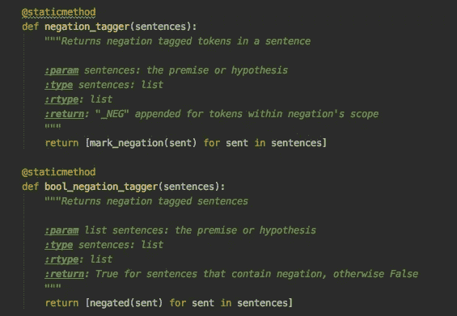

# 开始编写 Python 文档字符串

> 原文：<https://betterprogramming.pub/the-guide-to-python-docstrings-3d40340e824b>

## 简化你的生活和任何试图阅读你的代码的人的生活



每个人都写了很好的代码，但是需要在两个星期后进行复查，没有人知道为什么或者如何工作。我们每天都要处理糟糕的文档化代码。但事情不一定非要这样。

我再怎么强调编写可读代码的重要性也不为过，它等同于编写好的*文档字符串*。现在，在 Python 中，没有一种编写文档字符串的“完美”方式，因为没有一个单一的约定可以遵循。

为了让您的生活更轻松，我将这个故事中历史最悠久的 docstring 约定合并在一起，并选择了 [Sphinx](https://www.sphinx-doc.org/en/master/) 样式来详细阐述。Sphinx style 是官方的 Python 文档标准，我更喜欢它的易用性。

无论如何，这个故事将给出 docstrings 的约定和实现的一般概念，这是向 Python 代码添加适当文档的良好开端。

# 什么是 Docstring？

docstring 是单行或多行字符串文字，由模块、类、方法或函数开头的三个单引号或双引号`"""<description>"""`分隔，描述*该函数做什么*。

当且仅当它是函数中的第一条语句时，它才能被 Python 字节码编译器识别，并通过`__doc__`方法或`help()`函数作为运行时对象属性被访问。

## 最佳实践

1.  所有的模块、类、方法和函数，包括包中的`__init__`构造函数都应该有 docstrings。
2.  描述是大写的，有句尾标点。
3.  总是在文档字符串周围使用`"""Triple double quotes."""`。
4.  文档字符串是*而不是*后跟一个空行。

# 单行文档字符串

1.  单行 docstring 将函数或方法的效果规定为*命令* `"""Do this, return that"""`，而不是描述。
2.  如果*不是*是一个“签名”`function(a, b) -> list` ，重复函数/方法参数。

# 多行文档字符串

多行 docstring 也包含与单行 docstring 中相同的字符串文字行，但它后面是一个空行，以及函数参数和返回值的描述。

多行 docstrings 有多种约定，比如 [Google Format](https://sphinxcontrib-napoleon.readthedocs.io/en/latest/example_google.html) 和 [NumPy Format](https://numpydoc.readthedocs.io/en/latest/) ，但是最简单最传统的是 [Sphinx style](https://www.sphinx-doc.org/en/master/) 。

# 斯芬克斯风格

Sphinx style 是官方的 Python 文档标准。这也是 JetBrains 的 PyCharm (非常流行的 IDE)默认使用的[，在定义函数后输入三个引号，然后按 enter 键。](https://www.jetbrains.com/pycharm/help/creating-documentation-comments.html)

Sphinx style 使用一种轻量级标记语言的语法 [reStructuredText (reST)](https://docutils.sourceforge.io/rst.html) ，旨在:

1.  可由文档处理软件处理，如 [Docutils](https://docutils.sourceforge.io/) 。
2.  阅读和编写 Python 源代码的人类程序员容易读懂。如果你想深入了解这一点，可以看看这篇文章。

## Sphinx 语法

Sphinx 使用大多数编程语言都使用的`keyword(reserved word)`语法。最重要的关键字是:

*   `param`和`type`:参数值和变量类型。
*   `return`和`rtype`:返回值及其类型。
*   `:raises`:描述代码引发的任何错误。
*   `.. seealso::`:延伸阅读。
*   `.. notes::`:添加备注。
*   `.. warning::`:添加警告。

虽然这些关键字的顺序是不固定的，但是在整个项目中保持上述顺序是一个惯例。`seealso`、`notes`和`warning`的条目是可选的。

在本文中找到编写 Sphinx docstrings [的更详细教程。例如，您可以用`|`符号连接参数类型，如下所示:](https://sphinx-rtd-tutorial.readthedocs.io/en/latest/docstrings.html)

```
:param x: An integer, defaults to None
:type x: int:param y: An integer or string
:type y: int|string
```

## 斯芬克斯布局

这个 docstring 的一般布局如下所示。

```
*"""< Summary. >**:param <variable_name>: <variable_description>, defaults to <default_value>*
*:type <variable_name>: <variable_type>(, optional)* <other parameters and types>*:raises <error_type>: <error_description>*
<other exceptions>*:rtype: <return_type>
:return: <return_description>*
*"""*
```

差不多就是这样。

这些约定非常容易实现，对于内置函数、ide 和代码段来说是机器可读的，并且是为人类程序员提供优秀文档和可读函数的唯一方法。即使几个月后？