# 软件自动化的隐性成本

> 原文：<https://betterprogramming.pub/the-hidden-cost-of-software-automation-fa238bfb473b>

## 软件世界

## 自动化要避免的陷阱。过去的教训

照片由 [Lucas Santos](https://unsplash.com/@_staticvoid?utm_source=medium&utm_medium=referral) 在 [Unsplash](https://unsplash.com?utm_source=medium&utm_medium=referral) 上拍摄

"任何你做了两次以上的事情都必须被自动化."这听起来像一个伟大的报价。但是，要小心。自动化的成本不仅仅是自动化的过程。

这是我下面分享的一个真实案例。

# 真实的案例

在我们早期的移动开发中，有一段代码相对重复。它创建一个 SQL 表和一组函数，如插入、更新、删除等。，并连接到表的数据模型。

每次创建表时，都必须创建和复制表内容及其 SQL 命令功能。

## 识别重复过程

随着我们开始开发，越来越多的要求存储新数据，因此可能有更多的新表和 SQL 要编程。

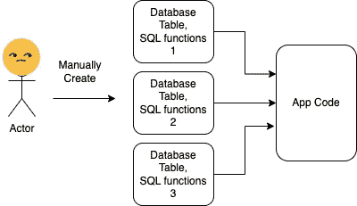

这太令人生畏了。

## 自动化 it —没有我们想象的那么难

因此，我们创建一个脚本，用最少的输入生成所有的样板代码，而不是手动复制和修改它。它运行良好，也融入了我们的 CI 流程。

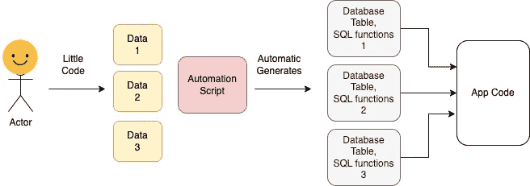

现在，我们不再复制代码，而是将一些固定数据提供给自动化脚本，自动化脚本将生成所有需要的 Java 代码，供我们的移动应用程序使用。

## 哦，我们需要一些修改

在创建了大约四到五个数据表之后，创建更多表的需求就停止了，因为更多的功能专注于增强应用程序的功能，而不是向其中插入更多数据。

后来，随着我们的深入，我们意识到我们需要修改一些 SQL 函数。变化很小，但只适用于某些表。

为定制变更修改自动化脚本是棘手且昂贵的。脚本是用另一种语言写的，要了解它做什么来改进它并不容易。

因为我们需要快速投入生产，所以我们的想法是，通过手动修改生成的代码来破解它。

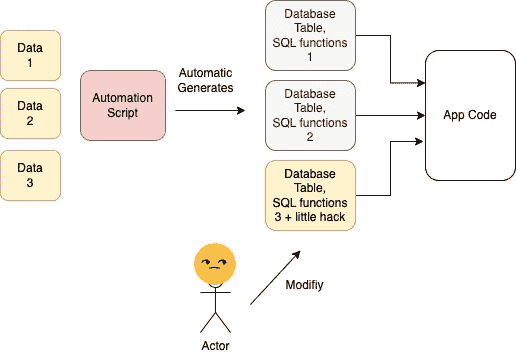

像往常一样，没有人有时间回来偿还科技债务。相反，需要在另一个表上进行另一个更改。同样的事情发生了——更多的手动修改。

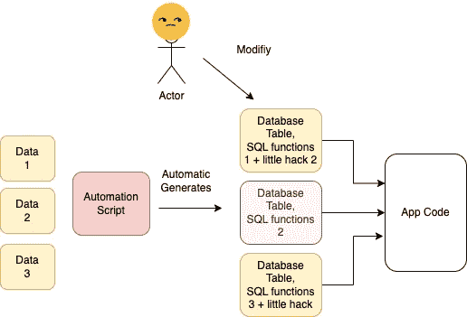

## 被放弃的生成代码没有所有权

根据生成代码的状态，没有人愿意声称拥有所有权并使用它。

代码很快变得陈旧，甚至更难理解它在里面做什么。如果需要任何进一步的改变，更多的黑客将被添加到应用程序的代码中，而不是绕过它。

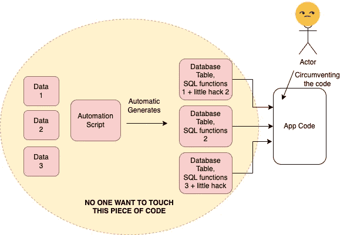

为了改善这种情况，我们不能再进行增量改进来进化代码。相反，需要对其内部进行重大改造。这都是没人想再拥有它的结果。

当我们认为一旦我们建立了自动化，它将把我们从工作中解放出来，我们不再需要担心它时，它的衰落就开始了。这是一个导致如此悲惨结果的谬误。

# 自动化比看起来更昂贵

当我们第一次想到自动化时，我们首先想到的是制造它们的复杂性，正如下面的迷因所示:

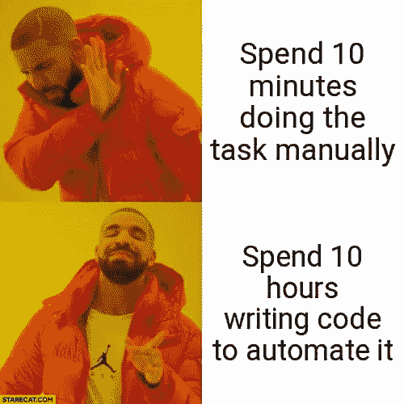

图片来自[https://stare cat . com/spend-10-minutes-do-the-task-manually vs . spend-10-hours-writing-code-to-automated-it-drake/](https://starecat.com/spend-10-minutes-doing-the-task-manually-vs-spend-10-hours-writing-code-to-automate-it-drake/)

我们都知道这一点。但这并不是自动化要求的全部成本。让我们看看其他的:

## 1.非常规成本

在软件开发中，我们通常使用行业提供的特定的常规开发流程。它们都得到了很好的支持，并且易于使用。

然而，为了实现特定于我们需求的自动化，我们必须做一些不同的事情，例如工具、流程、编程语言等。

我们下面的例子可以解释我的意思。

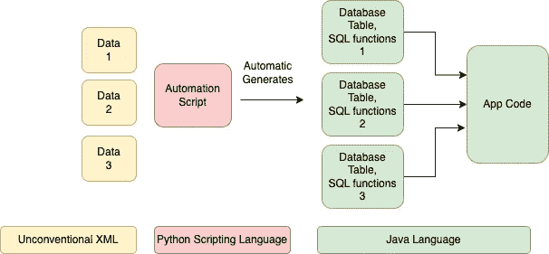

通常对于 Android 开发，我们只需要 Java 语言。我们需要一个擅长 Java 和 Android 开发的团队。

当我们添加上面的自动化时，我们使用了一个与 Android 开发流程不同的脚本。这意味着我们需要团队中有一个熟悉 Python 脚本的人。此外，我们需要确保我们按照 Python 的最佳实践来做，并继续更新。

Python 脚本的入口是一些非常规的 XML 标记。当有人新加入这个组时，他们需要学习特定的 XML 标记，这不是一个工业标准。对新员工来说，这不是一次很有激励性的增值体验。我们也不可能提前雇佣任何有这种知识的人。

当我们创建自动化时，需要考虑这些成本。为了尽可能减少非常规流量，我们应该尝试以下方法:

*   限制我们必须用来自动化它的变体。它的变体越多，它招致的非常规成本就越多。
*   尽量保持更好的社区支持的工业标准。如果我们遇到问题，我们知道我们并不孤单。这也是为什么大型组织更愿意花钱购买工具而不是使用免费工具的原因之一。它提供了更好的“支持”保证

## 3.维护成本

没有什么是免费的。即使我们自动化了一个过程，它也不是免费的。我们将人工工作的全部成本转移到创建和维护自动化的成本上。

很多时间被忽视的是自动化的维护成本。

假设自动化代码不需要改变和改进，仍然需要不时地升级工具或库。这些都是在创建自动化时不存在的未来开销。

它们不是免费的，当我们考虑自动化时，需要将它们考虑在内。

一个很简单的例子。

在 CI 流程之前，一家公司有一个管理整个流程的软件部门，有许多手动代码检查和交付流程。

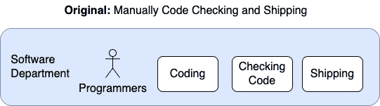

理想情况下，我们可以改进和自动化检查代码和运输，希望不会产生任何其他成本。但我们知道它不可持续，因为 CI 自动化知识需要不同领域的专业知识来改进它。

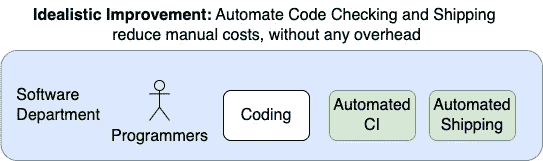

因此，为了保持可持续性，大多数公司创建了一个不同的团队，即开发运营团队，来维持 CI 流程。这些是所创建的自动化的“维护成本”。因此，它不是免费的。

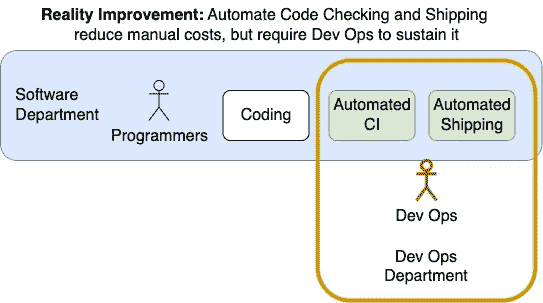

有了这些，我们就知道总自动化成本如何与下面的公式相等:

> 自动化成本=创建成本+维护成本

假设输出是相同的(数量和质量)，那么我们认为考虑自动化的简单数学就是确保

> (自动化创建+维护成本)
> <(人工工作成本)

这种简单的匹配是为了确保我们至少应该确保我们的总自动化成本不应该高于人工成本。

但这还不是全部…

## 3.语境损失成本

我们认为维护成本越低越好。虽然这是事实，但我们还需要考虑另一个重要因素。

一旦我们跨过了自动化成本(创建和维护)的门槛，自动化似乎就值得追求了。

但问题是，维护成本应该低到什么程度？下面是一个有三个选项的示例:

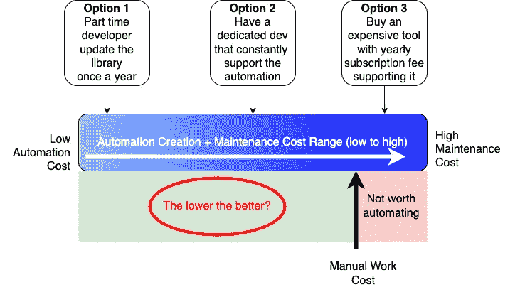

从简单的成本角度来看，方案 1 似乎是最好的。如果我们不需要转向自动化，为什么要有专门的开发人员呢？

但是如果我们不小心，我们会陷入一个潜在的更大的未来问题。让我举例说明。

以我们上面的例子为例。

假设我们的自动化做得如此之好，我们可以继续重复使用它而不做任何改变。创建这种自动化的投资回报率是最值得的！

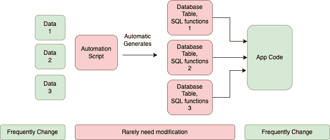

但是有一个警告。由于它的效率，多年来它的产量都没有变化。每个人用起来都很舒服。

过了一段时间，创建自动化的人不再在团队中。没有人觉得这是一个问题，因为它仍然工作。创造它的人甚至不记得它，因为它是在“几个世纪”前创造的。

但是像任何软件一样，没有什么是永恒的。总有一天，有些事情需要改变。这种自动化代码对整个团队来说就像一个黑匣子。我们不能对它进行渐进式的进化。唯一的选择是从零开始重新创建一切，而不参考过去内部所做的事情。

自动化程度越高，重建自动化的成本就越高。失去上下文的代价没有警告信号。这是一颗定时炸弹，不是如果，而是如果我们不注意它，它会在什么时候爆炸。

为了减轻这个问题，我们需要考虑到如果我们的维护成本太低所产生的“失去上下文”的成本。

以下是问题所在:

1.  我们不应该有太高的自动化成本(创建+维护),以至于最终的成本高于人工工作的成本
2.  我们不应该为了降低自动化成本(创建+维护)而走捷径，这样我们会冒着失去上下文或者失去对未来发展的控制的风险。

所以，如果我画同样的图，并考虑失去自动化环境的风险(A 点以下的任何东西)。

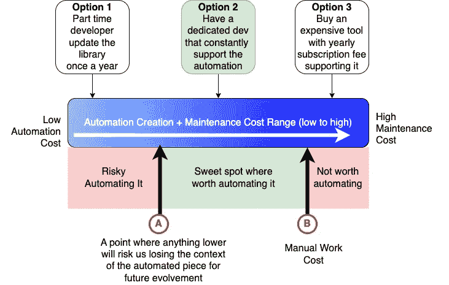

现在我们可以清楚地看到，A 点和 B 点之间的任何选项都是值得自动化的甜蜜点。理想情况下，我们希望尽可能接近 A。

从上面来看，

*   选项 3 不可用，因为它比手工操作成本更高。
*   尽管选项 1 成本较低，但它存在不值得追求的未来风险。
*   相反，选项 2 虽然成本更高，但是如果这部分自动化是在对业务至关重要的软件产品上，那么它是值得追求的。

# 自动化就像任何软件开发一样

为我们的软件开发创建一个自动化是软件开发的另一部分。创建它的初始成本只是冰山一角。如下所示，我们需要考虑保留它的后续成本。

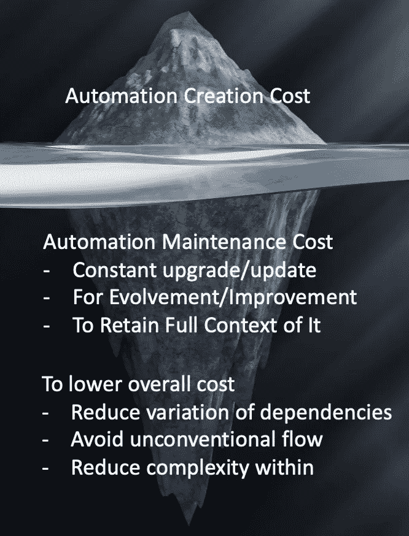

西蒙·李在 [Unsplash](https://unsplash.com?utm_source=medium&utm_medium=referral) 上拍摄的背景照片

我们软件的自动化部分需要不断地改变和改进。如果它保持不变，无人管理，它很快就会过时，成为一个隐藏的，未知的黑盒。我们要么继续支付费用来维护它，要么以后支付罚款，这可能会很昂贵。

让它得到维护的一个简单的秘密是有人拥有和维护它。这很简单，但经常被忽视，正如下面这篇文章所分享的:

 [## 代码所有权的重要性

### 良好拥有的代码是维护良好的代码

better 编程. pub](/the-underestimated-importance-of-clear-code-ownership-baed758e47b8) 

简而言之，“任何你做了两次以上的事情都必须自动化”不是一句好的引语。

相反，这可能是一个更好的引语，“您自动化的任何东西都必须维护。”