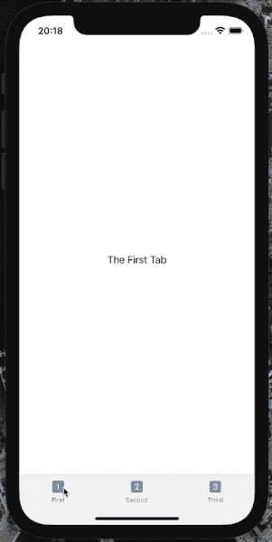
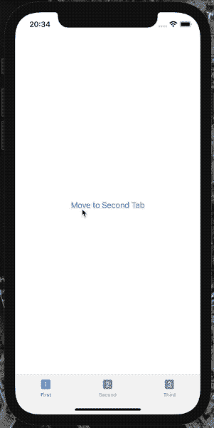
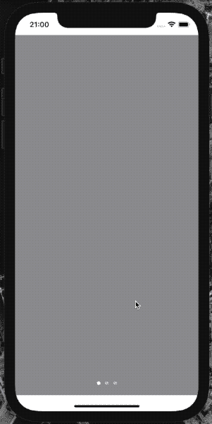

# SwiftUI 中隐藏的 TabView 秘密

> 原文：<https://betterprogramming.pub/the-hidden-secrets-of-tabview-in-ios-with-swiftui-5663b972386d>

## 探索各种样式，并以编程方式选择所需的选项卡


[Sigmund](https://unsplash.com/@sigmund) 在 [Unsplash](https://unsplash.com/?utm_source=medium&utm_medium=referral) 上拍照。

标签栏是 iOS 的一个至关重要的组件，从 iOS 2.0 就开始了。这个元素出现在 iOS 和 iPadOS 设备的底部，允许我们的应用程序用户在不同的视图或功能之间快速切换。

它是苹果应用的主要元素，就像音乐、播客和应用商店一样。


在 SwiftUI 中，我们有一个名为`TabView`的新元素，而不是 UIKit 中的`UITabBar`。在本文中，我们将研究如何使用它——尤其是如何使用`TabView`来显示页面指示器。

# SwiftUI 中初始化 TabView 的方法

现在，我们有两个选项来使用 SwiftUI 创建选项卡视图。我们可以控制选定的选项卡，也可以完全避免它。让我们探索这两种方法。

# 用 SwiftUI 创建 TabView

为了创建一个`TabView`元素，我们需要传递一个`Content`，它是 SwiftUI 视图的列表。为了将这个视图标记为标签栏项目，我们需要使用在描述标题和图像的`Label`中传递的`tabItem`视图修饰符。

现在让我们将所有这些放在代码中:

现在我们可以解开上面的代码了。每个选项卡只是一个`Text`视图，选项卡项目是一个带有标题和系统图像的`Label`，系统图像是一个 SF 符号。



# 以编程方式控制选定的选项卡

假设我们希望以编程方式控制选定的选项卡。在这种情况下，我们需要使用第二种方法来初始化方法。除了内容之外，我们需要传递一个状态变量来保存当前选中的选项卡。另一个关键步骤是用符合`Hashable`协议的值的`tag`修饰符标记每个选项卡。这就是 SwiftUI 布局引擎在选项卡之间的不同之处，并且可以理解独特性。

让我们一步一步地检查上面的代码。

首先，我们使用内部带有`Button`的`VStack`视图来选择下一个或者最后一个或者第一个选项卡。

然后，我们对每个选项卡项目使用`tag`修饰符。我们使用`Int`值类型来跟踪当前选择的选项卡。我们不局限于符合`Hashable`协议的`Int`值类型，但是如果我们愿意，我们可以使用我们的类型。为了简单起见，我们这次使用`Int`。



# 自定义选项卡视图

可悲的是，在 SwiftUI 中定制`TabView`的选项并不多。我们可以改变标签的图片和标题，但是这很简单。

我们可以更改默认的强调颜色。我们换成紫色吧:

```
TabView {
 // ...
}
.accentColor(.purple)
```


# SwiftUI 中的选项卡视图样式

在 SwiftUI 中，我们不局限于常规的选项卡栏样式。现在，我们有三种方法来改变`TabView`风格:

*   `DefaultTabViewStyle` —我们都知道的常规风格。
*   `PageTabViewStyle` —使用页面指示器滚动页面。
*   `CarouselTabViewStyle`—watch OS 的特定风格，我们不打算在本文中讨论。

# 创建滚动页面

为了用 SwiftUI 中的`TabView`创建滚动页面，我们需要调用`tabViewStyle`视图修饰符并传递一个`PageTabViewStyle`样式的实例:

如果我们想要隐藏页面指示器，我们为`PageTabViewStyle`实例指定`indexDisplayMode`参数，并将其设置为`.never`:

```
TabView {
  // ...
}
.tabViewStyle(PageTabViewStyle(indexDisplayMode: .never))
```



# TL；速度三角形定位法(dead reckoning)

屏幕底部的标签栏是现代 iOS 应用程序最重要的组成部分之一。苹果经常在他们的应用程序中使用它。

有了 SwiftUI，这个元素现在有了新的名字`TabView`。它允许我们添加选项卡视图，并以编程方式控制当前选定的选项卡。

`TabView`的隐藏特性是我们可以用它来显示带有页面指示器的多个标签，并且这些标签可以通过在它们之间滚动来控制。在 UIKit 中，我们用`UIPageViewController`做到了这一点。

# 链接

*   [样本代码](https://github.com/fassko/SwiftUITabView)
*   [人机界面指南——标签栏](https://developer.apple.com/design/human-interface-guidelines/ios/bars/tab-bars/)
*   [SwiftUI 文档— TabView](https://developer.apple.com/documentation/swiftui/tabview)
*   [如何用 TabView 在 SwiftUI 中创建标签栏](https://www.iosapptemplates.com/blog/swiftui/tabview-swiftui)
*   [添加 TabView 和 tabItem()](https://www.hackingwithswift.com/quick-start/swiftui/adding-tabview-and-tabitem)
*   [如何使用 TabView 在标签栏中嵌入视图](https://www.hackingwithswift.com/quick-start/swiftui/how-to-embed-views-in-a-tab-bar-using-tabview)
*   [引入 SwiftUI 选项卡视图并使用选项卡栏定制](https://www.appcoda.com/swiftui-tabview/)