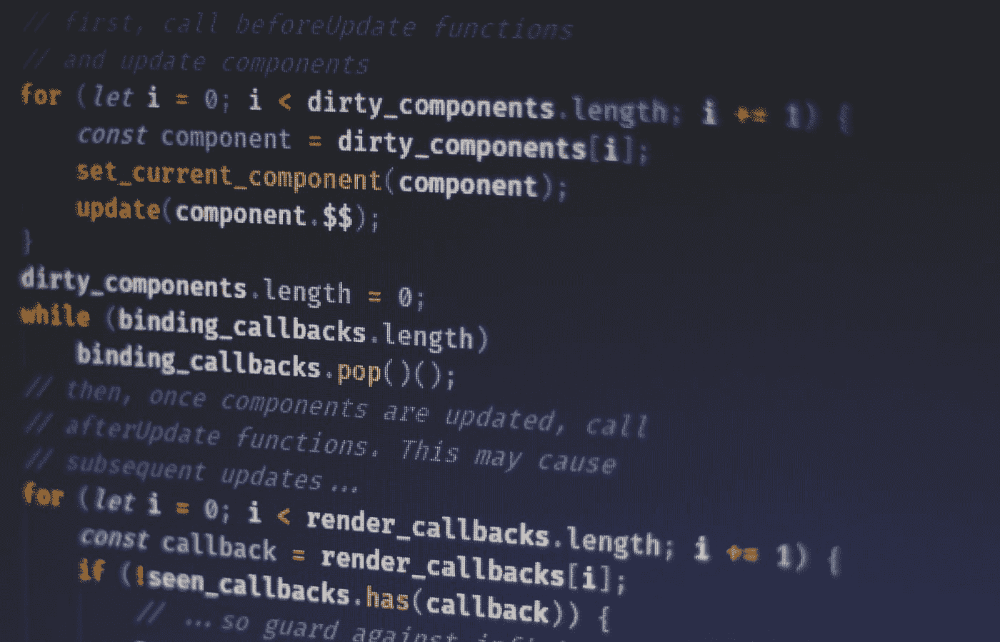

# 简而言之，DOM 操纵性能的历史

> 原文：<https://betterprogramming.pub/the-history-of-dom-manipulation-performance-in-a-nutshell-701247c19e83>

## 直接更新 DOM 成本很高。我们如何知道我们今天所知道的？

作者图片

那是 1998 年。我是一个十岁的孩子，对最近巴西在世界杯决赛中输给法国感到失望。法国人的大日子，尤其是足球迷。

不那么重要，但肯定不那么受欢迎，几个月后，那年发生了另一件大事:DOM 的首次发布！由 [WWW 联盟](https://en.wikipedia.org/wiki/World_Wide_Web_Consortium)创建，它是一个跨平台和独立于语言的接口，提供对表示文档、HTML 或 XML 的对象的定义和访问。

有多好？拥有一个逻辑树来代表你的网页的每一部分！它开启了太多我无法提及的可能性。这对我们网络开发者来说是一场革命。

发现的时刻。探索的时刻。

在真正的 DOM 发明之前，我们有一种叫做“DOM Level 0”或“Legacy DOM”的东西创建交互是可能的，但仅限于某些元素。

在第一个规范中，DOM 让我们能够访问完整的 HTML/XML 模型。2000 年，2 级出版。它介绍了[事件模型](https://en.wikipedia.org/wiki/DOM_events)。

开发人员不用花很长时间就可以发布库来简化 DOM 接口的使用。

# 值得纪念的图书馆

访问和操作 DOM 并不是一件愉快的任务。创建一个大的功能是不必要的，最终会产生一个巨大的代码库。jQuery 的出现使这种操作不那么冗长。

此外，jQuery 带来了更多的功能，如事件处理、CSS 动画和 Ajax。

但是操纵 DOM 的代价是什么呢？我相信这不是你第一次听说直接操纵 DOM 不好。它花费很多。但是为什么呢？为什么简单的属性更改可能意味着性能问题？

事实是，更新属性非常便宜和快速，但问题是更改本身会触发重新绘制和重新定位文档元素的流程( [repaint](https://developer.mozilla.org/pt-BR/docs/Web/Performance/Critical_rendering_path#paint) 和 [reflow](https://developer.mozilla.org/pt-BR/docs/Glossary/Reflow) )。这是通过复杂的内部算法来完成的。

一个简单的改变可以对树中的所有其他对象产生巨大的级联效应。即使是一个小操作，比如将一个元素上的`display: none;`改为`display: inline;`，也会导致周围更多元素的回流，并导致大部分重新绘制。

2010 年左右，jQuery 非常流行(现在仍在广泛使用)。尽管有一个问题 jQuery 没有解决:应用程序的复杂性使得前端数据成为一件需要认真处理的事情。数据越多，DOM 树中的变化就越多。

一个新的时代必须出现…

# 框架时代

我们的想法是抛弃网页这个术语，采用一种新的方法和思维方式:网络应用。不再有静态页面，不再有简单的交互和事件处理。世界宣称数据管理和 spa。web 应用程序需要一个状态，并且状态需要被管理。框架大爆发！

烬，流星，脊梁，淘汰赛，还有第一代最重要的:AngularJS。

我们的职业，前端工程师，前所未有地出现了。这些框架的想法很简单:为构建应用程序提供完整(或部分)的工具和指南。前端应用程序世界引入了惊人的特性:依赖注入、双向数据绑定、动态模板、服务、工厂等。

有很多发现的伟大时代。但随后一个问题出现了，并成为论坛和讨论组的共同话题:如何处理海量数据和管理复杂状态。双向数据绑定很容易变得一团糟，降低应用程序的性能。

随着应用程序变得越来越大，我们心爱的 DOM 没有得到很好的对待。以 AngularJS 为例，框架为每个控制器创建作用域。这些作用域模仿 DOM 结构，并提供观察器来观察变化。一旦发现变化，AngularJS 就会触发消化循环。一个循环将新旧值进行比较，并在 DOM 中应用更新。

从开发商的角度来看，这是令人兴奋和现代的。但是正如我前面提到的，DOM 的不断变化会导致性能下降。

这就是安古拉杰的遭遇。范围可以有嵌套的范围。观察器可以触发其他观察器。消化周期可以在不需要它的情况下运行多次。如果我们将双向数据绑定添加到这个场景中，很容易想象很难找到大型应用程序的真实来源——如果这个应用程序不是真正组织良好的话。

在这个时期，我开始了我的开发人员生涯。在学习了我的第一个框架(AngularJS)后，我非常兴奋，但过了一会儿，我又对性能问题感到沮丧。

此时，全世界的开发人员都明白性能是一个应该更加认真对待的话题。

# 表演的时代

这就是我们现在生活的时刻。激动的一刻。性能是一个热门话题。现在的应用程序有大量的数据。他们需要复杂的用户界面，离线的可能性，多平台等。

在求职面试中，应聘者会被问及许多问题:

*   虚拟 DOM 如何工作
*   Angular 的变化检测如何工作
*   什么是细粒度的反应性
*   WebAssembly 如何帮助提高性能
*   什么是阴影世界
*   什么是 web 组件

理解这些主题变得更加困难。

我们明白，如果我们需要改变 DOM，我们需要在不触发大规模回流的情况下精确地完成。复杂的算法和策略出现来解决这种情况。

## 虚拟 DOM

这一切都始于 2013 年 ReactJS 发布的一个新模式的引入:虚拟 DOM。数以百万计的开发者被这个令人惊叹的新图书馆所吸引。虚拟 DOM 背后的理念是什么？

精准更新，批量更新。

这个想法是有一个 DOM 的副本，由一个 JavaScript 对象表示。这个对象的每个属性代表原始 DOM 中的一个节点。因此，每当一个状态改变或者一个新的属性被输入到一个组件中，React 就会更新虚拟 DOM。

一种叫做调和的算法负责比较两个 DOM。如果发现差异，受影响的节点将被更新，避免更新整个或更大的 DOM。

这种方法使 React 成为一种趋势。

## 角度变化检测

Angular 的做法有点不同。它覆盖本机事件处理程序，并为每个组件生成更改检测脚本。这些工厂具有一些表示组件绑定的依赖关系。

这个工厂内部有一个名为`updateRenderer`的函数，每次 Angular 执行变更检测时都会调用这个函数。该函数获取绑定属性的当前值，并调用一个函数根据检索到的值检查它们。这样，Angular 为每个视图节点分别执行 DOM 更新。

## 细粒度反应性

该策略基于同步反应式编程的概念。想法是将模板编译成真实的 DOM 节点，并使用这种反应来更新这些节点。

这种反应性被 SolidJS，MobX，和 Svelte 使用。[下面详细讲解一下。](https://dev.to/ryansolid/a-hands-on-introduction-to-fine-grained-reactivity-3ndf)

这就是我们如何知道我们今天所知道的。随着应用程序的数据越来越大，复杂性越来越高，我们生活在一个对性能非常担忧的时代。

对于我在这篇文章中提到的每一个时刻，都有可能创建一个单独的帖子或者写一本关于它的书。我打算向您展示一些主要的变化，这些变化使我们理解了我们今天对 DOM 和应用程序性能的了解。

干杯。