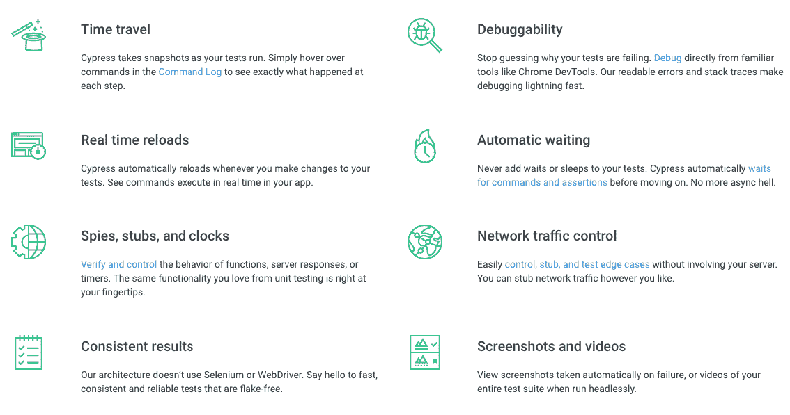
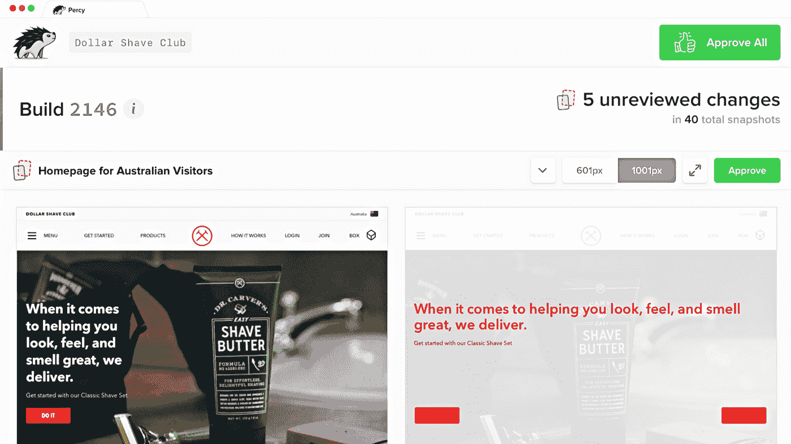

# Cypress 端到端浏览器测试指南

> 原文：<https://betterprogramming.pub/the-hitchhikers-guide-to-cypress-end-to-end-testing-bb4a460d8f61>

## 经过一年的柏树，决策，权衡，播种数据和更多的发现。

美国宇航局在 [Unsplash](https://unsplash.com?utm_source=medium&utm_medium=referral) 拍摄的照片

随着代码库变得越来越大，它的片段也变得越来越复杂，每一行都增加了一个潜在的 bug。最好的组织通过严格的测试来处理这个问题。

手工测试需要很多努力，这就是自动化测试的用武之地。现场最热门的框架之一是 [Cypress](https://www.cypress.io/) ，一个完整的端到端测试解决方案。

在过去，web 应用端到端测试是一件棘手的事情。很长一段时间以来，硒一直是主要的解决方案，有着悠久的历史。它有很好的浏览器兼容性，但是让你的测试保持一致很困难，因为它不是为应用程序测试而设计的。

这就是为什么当我听说 Cypress 时，我变得如此兴奋，承诺修复过去框架的所有旧的和损坏的方式。

在过去的一年中，我写了并回顾了将近 200 个测试场景(这是在一个小团队中)，我想写一些我希望在开始时就知道的东西，并分享我对迄今为止我与 Cypress 的旅程的想法。

# 盒子里有什么

如此多的功能集于一身

端到端测试一直是一种碎片化的体验。你需要带很多你自己的工具，例如，一个测试运行器，一个断言库，也许还有其他东西，比如模拟。

使用 Cypress，它将所有这些东西打包在一起，这使得设置和配置非常简单。不仅如此，该文档是我职业生涯中读过的最好的文档之一，对你可能遇到的一切都有[指导。](https://docs.cypress.io/guides/guides/command-line.html#Installation)

他们不仅很好地告诉你如何使用产品，还对[架构](https://docs.cypress.io/guides/overview/key-differences.html#Architecture)、[古怪测试](https://docs.cypress.io/guides/overview/key-differences.html#Flake-resistant)和[最佳实践](https://docs.cypress.io/guides/references/best-practices.html)进行了深入的解释。

# 样机研究

我的第一次柏树测试！

如果有机会，在采用这种规模的任何东西之前，我总是认为先在一个小项目上测试它是一个好主意，只是为了获得一种感觉。在倡导之前，我把它加到了我的个人博客上，只是想看看体验如何。

一个非常简单的场景:

*   加载应用程序。
*   转到索引页。
*   单击第一篇博客文章链接。
*   显示断言内容。

我被我花的时间之短震惊了，不到一个小时。这实际上就像[为测试本身](https://github.com/aleccool213/blog/blob/eb20d81a1bd10ba6037d5ac26ee5142ce951d7df/cypress/integration/home_page_spec.js#L8)、[、](https://github.com/aleccool213/blog/blob/60aa908e27aa83a539e563498b34f71a93167ec6/package.json#L70) `[package.json](https://github.com/aleccool213/blog/blob/60aa908e27aa83a539e563498b34f71a93167ec6/package.json#L70)`中的 npm 脚本、[在 CircleCI](https://github.com/aleccool213/blog/blob/8fa71b2486660e0175ee49cea1559112a224f146/circle.yml#L39) 中运行它一样简单。

赛普拉斯不仅完成了断言，还录制了视频！如果我使用 [CircleCI Cypress Orb](https://github.com/cypress-io/circleci-orb) 的话，这个设置会更快。

这让我在很短的时间内获得了大量的测试覆盖率。这个概念证明足以让我的团队相信，当开始编写端到端自动化测试时，Cypress 是正确的选择。

# 决策和权衡

我们在 [Yolk](https://www.yolk.ai/) 拥有的基于浏览器的产品与服务器端 API 完全分离，它们从服务器端 API 获取数据、构建并单独提供服务。

当决定编写端到端测试时，这提供了一些前进的方向。您可以将后端与前端一起部署并测试，就像应用程序在生产中一样，或者完全模拟 API 响应。

使用真正的后端意味着在 CI 上运行时会加速潜在的内存密集型进程，但您可以确保应用接近生产。

通过模仿 API 响应，您测试的栈更少，冒着剔除不真实响应的风险，并且不得不担心保持它们最新的额外维护。

我们决定部署与我们正在测试的应用程序相关的后台实例。这个决定对我们来说很容易做出，因为我们已经有了一个 CLI 工具来完成大部分困难的工作。

这个工具(恰当地命名为 yolk-cli)为应用程序下载最新的 Docker 映像，并知道如何用最少的配置提升产品。这使得让真正的 API 在 CI 上工作不是太大的任务。

事实证明，在 CircleCI 上运行两三个大型 Python 应用程序和几个 [Next.js](https://nextjs.org/) 服务器确实会很快耗尽内存限制。

我们联系了 CircleCI，他们让我们访问了他们的大型资源类(高达 16GB 的 RAM)，得分！

# 播种数据

我们面临的下一个挑战是播种数据。您的测试场景必须彼此共享尽可能少的状态。这是一个测试基础，T4·赛普拉斯在他们的指南中提到了这个问题。

在调试为什么会出错时，让测试场景与数据无关会有很大帮助。另一方面，通过 UI 创建所有数据会导致测试变慢，这是一个平衡。

这将是你的应用程序如何工作高度定制，但我会进入我们的工作。

再一次回到我们的 CLI 工具，它有几个命令，播种一些基本数据。这些命令如下所示:

`yolk seed-articles`

`yolk seed-bots`

例如，使用应用程序的基础数据、静态数据或非常高级的实体，可以加快这一过程，并且易于在每个 CI 构建中运行。

下一部分将为实体提供种子数据，这些数据可能更特定于单个测试。这就是争论的地方，对此没有灵丹妙药。

我们决定针对这些情况直接调用 API，并使用 [Cypress 自定义命令](https://docs.cypress.io/api/cypress-api/custom-commands.html#Syntax)来发起这些请求。这是一个不错的选择，因为我们使用的是 GraphQL 使用 API 的定制命令易于编写和记录。

为您的测试将反复执行的操作编写定制命令是整合所有代码的好方法，而不仅仅是数据种子！

# 用小黄瓜编写场景

如果你以前写过端到端测试，你可能熟悉黄瓜使用的[小黄瓜](https://cucumber.io/docs/gherkin/)语法。

这是一种富有表现力的、类似英语的方式来编写测试场景。它可以帮助记录您的特性，非开发人员也可以帮助编写测试用例。我们发现了一种使用插件将该文件语法集成到 Cypress 中的方法。

编写完这些命令后，插件将转到 Cypress 来实际运行实现:

# 主张要素和最佳做法

归根结底，端到端测试只是确保页面上的元素具有正确的内容。当编写 Cypress 测试时，90%的时间都需要选择元素并查看它们的内部。

Cypress 有一个标准的`[get()](https://docs.cypress.io/api/commands/get.html#Syntax)`命令，向您展示了一个类似 jQuery 的选择器，这对于使用过 Selenium 的人来说应该很熟悉。

这个选择器的问题是它可能会被错误地使用，而且你不能(用代码)强制它的使用。欢迎 [cypress-testing-library](https://github.com/testing-library/cypress-testing-library) ，一个由社区中伟大的测试倡导者 [Kent C. Dodds](https://kentcdodds.com/) 维护的精彩工具。

这个插件公开了无数以`find`为前缀的命令，其工作方式类似于`get()`在原生 Cypress 中的工作方式。

所有这些命令都有助于选择器[适应变化](https://kentcdodds.com/blog/making-your-ui-tests-resilient-to-change)。随着应用程序的进展，这对测试如何保持一致性会产生巨大的影响。

# 排除故障

如果您以前曾经使用过 Selenium，您会知道调试端到端测试有点像一场噩梦。

有了赛普拉斯，这种痛苦降到了历史最低点。作为核心产品的焦点，能够调试是你的 Cypress 之旅中比较愉快的体验之一。像大多数事情一样，[他们有一个很好的指导让你开始](https://on.cypress.io/plugins-guide)。

他们提到的大部分事情都很棒，但是你最可能遇到的情况是选择器不正确。对于这种情况，GUI 是找出问题所在的好方法。

[有一个很好的视频解释了如何编写你的第一个测试](https://vimeo.com/237115455)，它展示了 GUI 的运行。

# 视觉测试和捕捉回归

端到端测试的另一个关键部分是事物的外观。HTML 和 CSS 对你的应用程序在不同场景下的外观有很大的影响。

Cypress 可以给你很多关于你的应用程序如何工作的报道，但是当你想要断言它的外观时，它就开始崩溃了。

尤其是当涉及到浏览器兼容性和您的应用所使用的不同屏幕尺寸时，如果没有正确实施[视觉快照测试](https://blog.hichroma.com/visual-testing-the-pragmatic-way-to-test-uis-18c8da617ecf)，视觉退化很难被捕捉到。

我们最终得到的解决方案是[珀西](https://percy.io/)，因为它很好地与赛普拉斯和[故事书](https://storybook.js.org/)整合在一起。它能做的是获取当前在 Cypress 测试场景中呈现的 HTML 和 CSS，并将其发送到 Percy 的服务器。

然后，Percy 在其内部浏览器上呈现标记，Chrome 和 Firefox 是选项。Percy 知道您的 Cypress 测试正在哪个特性分支中运行，并将其与您配置的基本分支进行比较。

当您不知道代码是否改变了应用程序中某个组件的外观时，这可以让您对拉请求充满信心。如果您的 Cypress 测试中有大量断言 CSS 值或事物应该是什么样子的代码，那么这可以节省大量时间。

热门提示:您可以通过创建一个新的`takeSnapshot`自定义命令，让 Cypress 在本地拍摄快照，然后仅在启用 Percy 时使用它:

# 并行构建和 Cypress 仪表板

一旦测试运行开始变得足够长，您将开始寻找其他策略来加速它们。

由于 Cypress 在每次运行时都以干净的状态运行特性场景文件，因此可以执行并行化。你可以决定你自己的平衡策略，如何分解你的测试，但是 Cypress Dashboard 的托管版本提供了一种自动实现的方法。

假设我可以负担得起三个 CircleCI 容器来运行我的 Cypress 测试。

首先，我在[my circle ci job step config](https://circleci.com/docs/2.0/parallelism-faster-jobs/)中定义了`parallelism: 3`。这将使您的作业的三个实例旋转起来，所有实例都有不同的作业 id。把这些证件交给赛普拉斯，你就可以去比赛了。

如果正确设置了 Cypress Dashboard，该服务将告诉您容器应该运行哪些测试。下面是一个配置示例:

这件事的超级巧妙之处在于 Cypress Dashboard 知道你过去的测试历史和它们的速度。它将使用这些知识，通过确保容器获得运行测试的平衡负载来优化您的并行构建！

如果这对你没有多大意义，不要担心， [Cypress 已经回答了如何做这个](https://docs.cypress.io/faq/questions/dashboard-faq.html#My-CI-setup-is-based-on-Docker-but-is-very-custom-How-can-I-load-balance-my-test-runs)。

# 浏览器支持

不幸的是，如果你的组织需要对 IE11 的支持，你就没那么幸运了。[赛普拉斯团队已经明确表示他们不会支持它](https://github.com/cypress-io/cypress/issues/310#issuecomment-337349727)。

GitHub 上有一个令人难以置信的帖子，我真的希望你能通读一下。它解释了为什么他们正在缓慢地推出它，而没有从一开始就选择 WebDriver 并编写他们自己的自定义驱动程序。

对于 Yolk 的我们来说，我们需要 IE11 支持我们的一些应用程序。我们在 IE11 中不断得到回归，需要更全面的测试覆盖。

我们决定使用 [Browserstack Automate](https://www.browserstack.com/automate) 和 Selenium 来覆盖这些应用。对于 CI，我们已经在 Cypress 中构建并运行了应用程序，我们只需要添加一个新的构建步骤，使用 [Browserstack 本地代理](https://github.com/browserstack/browserstack-local-nodejs)运行这些测试。

对于测试本身，我们决定将硒和黄瓜结合起来，这是一种常见的搭配。为了使这个过程更容易，我们将小黄瓜`.feature`文件复制到一个新文件夹中，并编写了特定的基于 Selenium 的 step 实现。

我想到的一个很酷的概念是在 Cypress 和 Selenium 上重用相同的`.feature`文件。如果任何人对此有想法，请在下面评论你的建议。

这取决于你在多大程度上采用这种策略，并决定重复测试覆盖对你来说是否值得。对我们来说，在 I.E.11 中至少有快乐路径端到端测试覆盖给了我们部署时巨大的信心，所以成本是值得的。

在我看来，事情并没有看起来那么糟糕，我们的 Cypress 测试覆盖了基于 Chromium 的浏览器(Firefox 支持即将推出)，我们的 Selenium 测试覆盖了 I.E.11。

随着 I.E.11 越来越多地被淘汰，甚至在企业中，对硒的需求将消失，对 Cypress 的需求将变得更大。

# 额外收获:类型脚本支持和代码覆盖率

我前面提到的所有库和模块都支持 TypeScript。

让 TypeScript 与 Cypress 一起工作不需要很多配置，从长远来看这是完全值得的。你所需要的只是与 Cypress 集成的 webpack、TS 配置和插件文件。赛普拉斯提供的一个很好的指南是他们网站上的[。](https://docs.cypress.io/guides/tooling/typescript-support.html)

我知道很多人想知道代码覆盖率和生成报告，Cypress 也可以做到这一点！再说一次，[有一个很好的插件](https://github.com/cypress-io/code-coverage)可以让你做到这一点。

一个警告是，它会将覆盖率计数器附加到您的代码上，因此运行您的测试将会更慢，并且可能不会模拟生产。这里的一个好策略是偶尔在本地生成它们，看看你做得怎么样。

如果你的后端和前端都在 TypeScript 中，那么当 Cypress 运行时，一个很酷的想法是让代码覆盖率在两个应用中运行。然后你可以看到你的整个应用程序的覆盖范围！