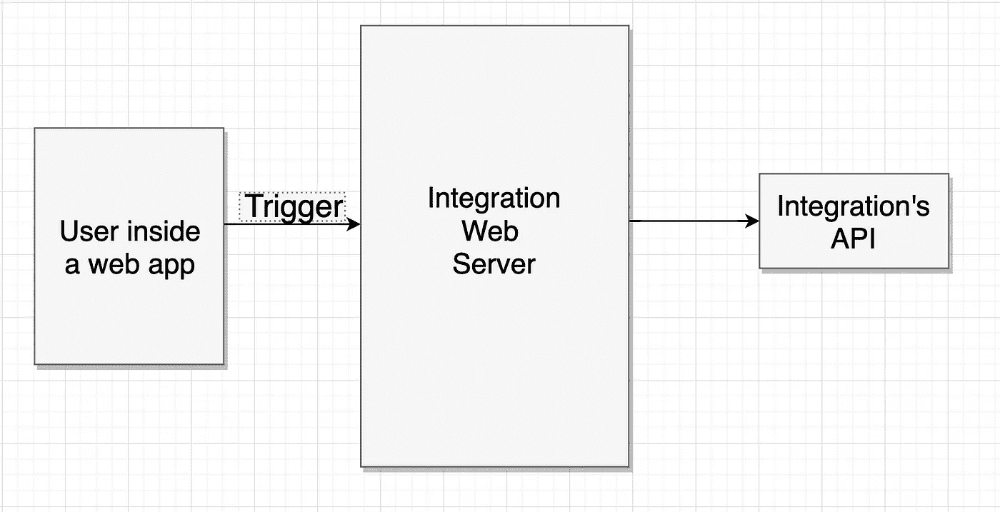
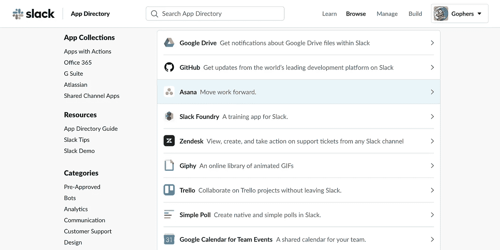
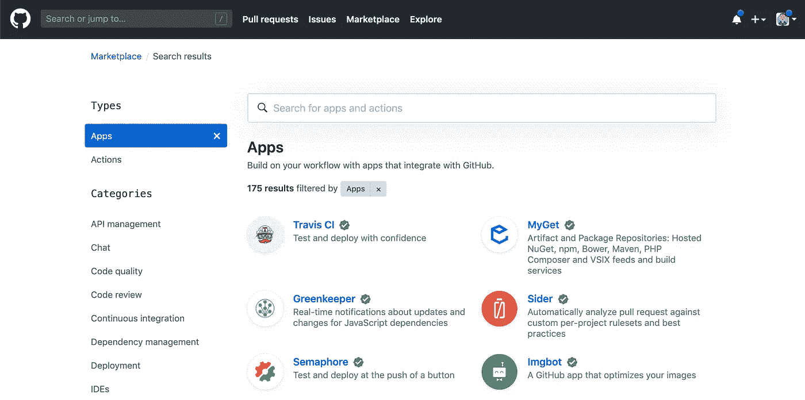

# 集成的搭便车指南

> 原文：<https://betterprogramming.pub/the-hitchhikers-guide-to-integrations-87f0fa2bfc54>

## 集成正在接管网络——以下是你应该了解的内容


图片来源:贾斯汀·沙利文/盖蒂图片社

# 什么是集成？

集成就是将不同的软件结合在一起，通过新的易用性给用户带来好处。

它们可以相互交谈，读取数据，并在对方体内执行操作。集成的一个简单例子是 Google 日历松弛集成。你可以在 Slack 中查看你的日程表，更新活动，更新邀请。


一个好的集成将两个实体连接在一起——那些应该连接在一起的实体。如果客户没有发现价值，那么你可能就不应该创造价值。将股票图片连接到谷歌日历的集成可能是不必要的。

整合帮助你停留在一个地方；你不需要到处跳舞来做事。他们都在同一个地方。Slack 市场上有 1800 个集成。Slack 内部有很多以前必须放在其他地方的功能。

# 如何构建一个集成？

最有可能的是，您需要构建自己的 web 应用程序。您可以通过 Zapier 构建自己的集成，而无需使用代码。但是我稍后会更多地讨论 Zapier。

在进行集成时，您应该了解两个关键概念:API 和 Webhooks。

## **原料药**

当我们构建集成时，我们实际上只是想出一种方法来操纵或推断数据。我们从一个应用程序内部对另一个应用程序执行操作。

API 是让我们进入其他应用程序的关键。它们允许我们在其他应用程序中执行操作，并通过相对简单的 HTTP 调用检索数据。

如果你想了解更多关于 API 是如何工作的，你应该看看我的另一篇文章，[“使用 Web APIs 的实用指南”](https://medium.com/better-programming/a-no-nonsense-guide-to-working-with-web-apis-55ca899a607)

## **网钩**

我以前曾将 Webhook 定义为“在 web 上运行的功能”

通常会有东西调用或者*触发*你的 Webhook，它会发送一个 HTTP 请求到其他地方。我会用我之前的 Google Calendar 和 Slack 的集成例子来解释。

在空闲时，我可以键入:

```
/calendar get coffee with Ross & Chandler at 2:00pm
```

这将被发送到谷歌日历的集成网络服务器，在那里它会说，“嘿！Alec 想要创建一个新事件！我将把这些数据发送给 API 来创建一个新事件！”

然后，它将被发送到 API 来创建一个新的日历事件。我通过使用一个`/calendar`命令触发了**web hook，然后它接受这个命令并对 API 执行一个 HTTP 调用。**

****

# **什么是集成市场？**

**像 Slack、GitHub 和 Hubspot 这样的大公司已经普及了集成市场。它们并不复杂；它们是一大堆网络应用。**

**市场通常可供任何人提交他们自己的集成。人们可以通过他们的 API 创建集成，当它准备好了，提交它成为公共的。**

**从技术上讲，他们不容易拥有。您需要有一个强大的、记录良好的 API。此外，您需要有人审查集成提交，并确保他们不是恶意的。**

# **押注于整合的公司**

## ****松弛****

**Slack 是一款特别适合与集成使用的应用程序。我认为如果 Slack 没有像现在这样多的集成，它就不会这么成功。**

**使用 Slack 的人倾向于在工作中生活在其中。有很多文章都在讨论懈怠是如何没有效率的，它们都倾向于指出这样一个事实:我们整天都在懈怠中度过。**

**因此，如果我们把所有的时间都花在空闲时间上，为什么不确保我们可以在空闲时间里做其他的事情呢？**

****

**松弛应用程序目录**

## ****扎皮尔****

****

**Zapier 不是一家依赖整合的公司，而是一家负责创造整合的公司。Zapier 在一定程度上是一个创建集成的无代码解决方案。**

**Zapier 有 1500 多个应用程序，您可以将它们连接在一起，进行自己的集成。这有点像乐高积木，你可以拼在一起，做出自己的定制集成。**

**您可以选择一个触发器，然后选择可以在触发器触发后发生的操作(抱歉，这是双关语)。**

**我之所以称 Zapier 为“部分无代码”解决方案，是因为制作一个乐高积木需要相当多的代码。将一个应用程序连接到 Zapier 可能需要很多代码。**

## ****GitHub****

****

**Github 的市场**

**GitHub 早已成为数百万开发者共同分享代码的必备工具。现在，他们正带头支持数百种其他小型开发工具。**

**GitHub 上的集成确实帮助开发者不仅变得更快，而且产生更可靠的代码。**

**CI/CD 集成，如 [Travis CI](https://github.com/marketplace/travis-ci) 确保每个新的代码分支通过测试套件。其他流行的集成，如[dependent bot、](https://github.com/marketplace/dependabot-preview)开放了 pull 请求来修复代码中已知的安全缺陷。**

# **结论**

**集成有助于整合我们今天生活中使用的所有网络应用。它们应该使事情更容易、更快地完成。**

**集成并不太难编程，因为大多数时候它们只是将数据从一个地方传递到另一个地方。由于它们的共生关系，企业可以通过集成繁荣发展。**

**如果你想建立一个有趣而实用的副业项目或者帮助推广你自己的业务，尝试建立一个集成。**