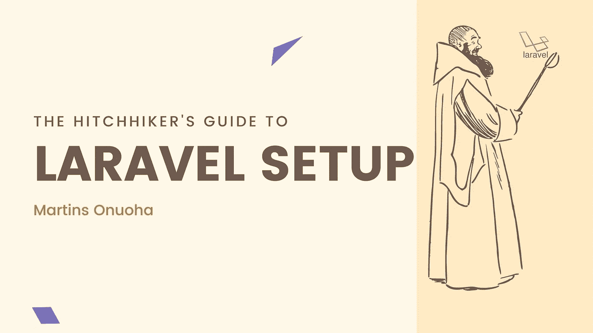
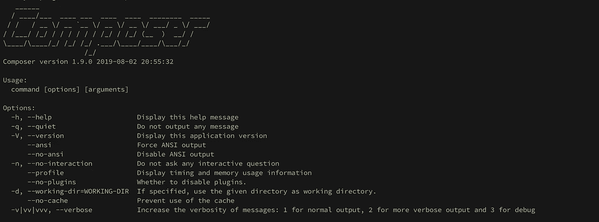
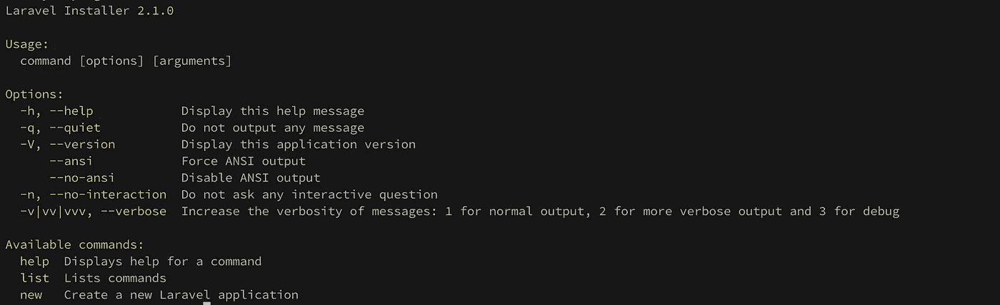
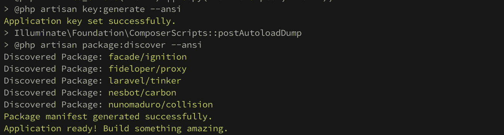
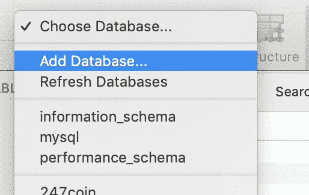

# Laravel 设置的搭便车指南

> 原文：<https://betterprogramming.pub/the-hitchhikers-guide-to-laravel-setup-6c1fd98c2670>

## 设置 Laravel 的逐步指南



> [在](https://devjavu.space/post/the-hitchhiker-s-guide-to-laravel-setup/)的黑暗模式下阅读这篇文章，轻松复制并粘贴代码示例，并在 [Devjavu](https://devjavu.space/) 上发现更多类似的内容。

[](https://devjavu.space/post/the-hitchhiker-s-guide-to-laravel-setup/) [## Laravel 设置指南| Devjavu

### 这是一个在你的机器上设置 Laravel 的简单指南。Laravel，如果你还不知道的话，是…

devjavu.space](https://devjavu.space/post/the-hitchhiker-s-guide-to-laravel-setup/) 

这是一个在你的机器上设置 Laravel 的简单指南。 [Laravel](https://laravel.com/) *，*如果你还不知道的话，是一个 PHP 框架，用于以更具表现力和结构化的方式构建健壮的 web 应用程序。请随意查看 Laravel 的[网站](https://laravel.com/docs/6.x)上的文档。

曾经摆弄过 CLI 的开发人员应该对这里的大部分过程很熟悉。要继续学习，您应该已经使用过终端(Unix)或命令行(Windows)。

# 入门(PHP 7.3)

要开始使用 Laravel，您需要安装的第一个也是最明显的东西是 PHP。既然 Laravel 是一个 PHP 框架，没有它就不行。

## Windows 操作系统

要在您的 Windows 机器上安装和设置 PHP，您可以:

*   决定采用一些优秀的一体化解决方案，在一个安装文件中包含 **Apache** 、 **PHP** 、 **MySQL** 和其他应用程序；例如 [XAMPP](http://www.apachefriends.org/en/xampp.html) 。
*   或者，使用可从[php.net](http://www.php.net/downloads.php)获得的官方安装程序。

如果您是 web 开发的新手，我会推荐第一个选项，因为它简单明了，并且为您设置好了一切(包括烦人的环境变量)。

## 马科斯

对于最新 macOS 版本的用户，您应该已经默认安装了 PHP。您可以通过打开您的终端并键入:`$ php -v`来验证这一点。

你拥有的 PHP 版本很可能是 5.x 左右，但是可以安装的最新版本是 7.3(在这篇文章发表的时候)。

***PHP 7.4*** *定于 2019 年 11 月 28 日* ***发布*** *。下一个****PHP****7 minor****release****应该会再次提升性能，提高代码可读性/可维护性。*

要安装 PHP 7.3，请打开终端并运行以下命令:

```
$ curl -s [http://php-osx.liip.ch/install.sh](http://php-osx.liip.ch/install.sh) | bash -s 7.3$ export PATH=/usr/local/php5/bin:$PATH$ php -v
```

## 使用 brew 安装

也可以用自制软件安装 PHP。家酿是一个 macOS 的软件包管理器。首先，卸载任何现有版本的 PHP。

```
brew remove — force — ignore-dependencies httpdbrew remove — force — ignore-dependencies php70-xdebug php71-xdebugbrew remove — force — ignore-dependencies php70-Imagick php71-Imagickbrew remove — ignore-dependencies — force php70 php71 php72
```

然后，安装 php@7.2，升级到 7.3。

```
brew install php php@7.2
```

完成后，您可以升级:

```
brew upgrade php@7.2brew upgrade php
```

## Linux 操作系统

对于 Linux 用户来说，大部分的软件包安装将由您的软件包管理器来处理。比如在 Ubuntu 中， **apt** 是管理 Linux 包的默认包管理器。要开始在 ubuntu 上安装 PHP，首先，使用以下命令将您的 Ubuntu OS 包更新到最新版本:

```
sudo apt update && sudo apt upgrade
```

下一步是安装 web 服务器。根据您的喜好，您可以选择 Apache 或 Nginx。它们的工作方式非常相似，但配置不同。

要安装 Apache web 服务器，请从终端运行以下命令:

```
sudo apt install apache2
```

然后，您可以启动 Apache2 服务器:

```
systemctl start apache2
```

为了方便起见，您可以为 Apache 启用 autostart，这样每次重新启动计算机时，Apache 都会自动启动:

```
systemctl enable apache2
```

您需要添加一个 PPA 来将 php7.3 放入您的存储库中:

```
sudo add-apt-repository ppa:ondrej/phpsudo apt update
```

一旦你的包被更新，你可以安装 PHP:

```
sudo apt install php7.3 php7.3-cli php7.3-common
```

如果你需要安装 PHP 扩展，你也可以使用 apt 包管理器获得它们:

```
sudo apt install php-pear php7.3-curl php7.3-dev php7.3-gd php7.3-mbstring php7.3-zip php7.3-mysql php7.3-xml php7.3-fpm libapache2-mod-php7.3 php7.3-imagick php7.3-recode php7.3-tidy php7.3-xmlrpc php7.3-intl
```

## macOS 上的 PHP 扩展

家酿已经正式放弃对 PHP 扩展的支持。不过扩展还是可以用`pecl`安装的。

这里有一个列表，列出了您需要为 Laravel 开发安装的扩展。

*   BCMath PHP 扩展
*   c 类型 PHP 扩展
*   JSON PHP 扩展
*   Mbstring PHP 扩展
*   OpenSSL PHP 扩展
*   PDO PHP 扩展
*   令牌化器 PHP 扩展
*   XML PHP 扩展

使用 Perl:

```
pecl install extension_name
```

# 安装作曲者

像大多数 PHP 框架一样，Laravel 也使用 [Composer](https://getcomposer.org/) 来管理它的依赖项

要安装 Composer，您可以在终端中相应地运行以下命令:

```
php -r "copy('https://getcomposer.org/installer', 'composer-setup.php');"php -r "if (hash_file('sha384', 'composer-setup.php') === 'a5c698ffe4b8e849a443b120cd5ba38043260d5c4023dbf93e1558871f1f07f58274fc6f4c93bcfd858c6bd0775cd8d1') { echo 'Installer verified'; } else { echo 'Installer corrupt'; unlink('composer-setup.php'); } echo PHP_EOL;"php composer-setup.phpphp -r "unlink('composer-setup.php');"
```

上面的四行将:

*   将安装程序下载到当前目录。
*   验证安装者 SHA-384，你也可以在这里交叉检查[。](https://composer.github.io/pubkeys.html)
*   运行安装程序。
*   移除安装程序。

如果安装成功，您应该能够在终端中键入`composer`,并看到当前安装的 composer 版本和命令选项。



作曲命令

# 安装 Laravel

安装 composer 后，我们可以继续安装 Laravel，如下所示:

```
composer global require laravel/installer
```

安装完成后，您需要确认您的路径中有 composer 系统范围的供应商 bin 目录。这使得`laravel` 可以作为内部命令从终端访问。

您可能会在以下位置找到供应商目录:

*   macOS 和 GNU / Linux 发行版:`$HOME/.composer/vendor/bin`
*   视窗:`%USERPROFILE%\AppData\Roaming\Composer\vendor\bin`

一旦您找到 composer 供应商 bin 目录，您可以通过打开 **~/将它添加到您的路径中。巴沙尔**或者 **~/。面向 macOS 用户的文本编辑器中的 bash_profile** (或者从带有 vim 或 nano 的终端中)。同样，如果你使用像 [Zsh](https://ohmyz.sh/) 这样的 Unix shell 扩展，你可以打开 **~/。zshrc** 并添加下面一行:

```
export PATH="$PATH:$HOME/.composer/vendor/bin"
```

关闭该文件，并在您的终端中运行以下命令，以使更改生效:

```
source ~/.bashrcsource ~/.bash_profilesource ~/.zshrc
```

完成后，您应该可以在终端上访问 Laravel 命令:



Laravel 命令

此时，你可以松一口气了。我们已经基本完成了在机器上设置 Laravel 的工作，可以直接开始构建 Laravel 应用程序了。

# Laravel 入门

有了 Laravel CLI，构建新的 Laravel 应用程序变得前所未有的简单。从终端创建新的应用程序:

```
laravel new application_name
```



成功生成新应用程序后，您应该会在终端上看到这个消息。然后，您可以进入应用程序根文件夹并启动应用程序:

```
cd application_name
```

使用以下内容运行应用程序:

```
php artisan serve
```

*Laravel 开发服务器启动:*[*http://127 . 0 . 0 . 1:8000*](http://127.0.0.1:8000)

您可以在浏览器中打开 URL([http://127 . 0 . 0 . 1:8000](http://127.0.0.1:8000))来查看您的新 Laravel 应用程序。

## 数据库ˌ资料库

Laravel 可以完美地处理关系数据库，包括 PostgreSQL 和 MySQL。如果您的本地机器上还没有安装 MySQL，下面是关于如何安装 MySQL 的官方文档:

*   对于 Unix / Linux:

 [## MySQL :: MySQL 8.0 参考手册::2.2 使用通用二进制文件在 Unix/Linux 上安装 MySQL

### Oracle 提供了一组 MySQL 的二进制发行版。这些包括以…形式的通用二进制发行版

dev.mysql.com](https://dev.mysql.com/doc/refman/8.0/en/binary-installation.html) 

*   对于 Windows:

 [## MySQL :: MySQL 8.0 参考手册::2.3 在 Microsoft Windows 上安装 MySQL

### MySQL 8.0 Server 需要 Microsoft Visual C++ 2015 可再发行软件包才能在 Windows 平台上运行。用户…

dev.mysql.com](https://dev.mysql.com/doc/refman/8.0/en/windows-installation.html) 

*   对于 macOS:

 [## MySQL :: MySQL 8.0 参考手册::2.4 在 macOS 上安装 MySQL

### 有关 MySQL 服务器支持的 macOS 版本列表，请参阅…

dev.mysql.com](https://dev.mysql.com/doc/refman/8.0/en/osx-installation.html) 

一旦安装了 MySQL，您就可以安装一个数据库客户机来管理您的数据库和表。我会向 macOS 用户推荐 [Sequel Pro](https://www.sequelpro.com/) 或者适用于多个平台的 [MySQL Workbench](https://www.mysql.com/products/workbench/) 。

从您的 MySQL 数据库客户端，您可以创建一个新的数据库，并给它一个朗朗上口的名字。



创建新的数据库

然后您可以配置您的 Laravel 项目来使用您创建的新数据库。在任何代码编辑器中打开您的应用程序文件夹，并编辑**。env** 文件:

```
DB_CONNECTION=mysql
DB_HOST=127.0.0.1
DB_PORT=3306
DB_DATABASE=new_database
DB_USERNAME=grimebuttom
DB_PASSWORD=foolstark
```

设置完成后，您就可以成功运行迁移了:

```
php artisan migrate:fresh
```

如果您坚持到底，我希望您的机器上有一个 Laravel 的工作设置。

去建造一些令人惊叹的东西吧！

嘶！如果您不确定下一步该去哪里，您可以尝试创建一个实际的 [Laravel 应用程序](https://medium.com/js-dojo/build-a-simple-blog-with-multiple-image-upload-using-laravel-vue-5517de920796)。