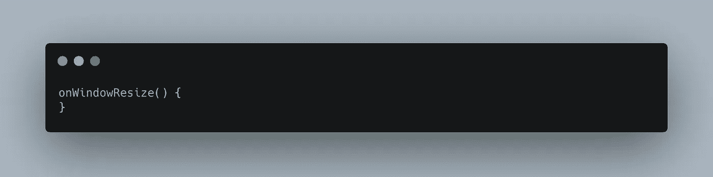
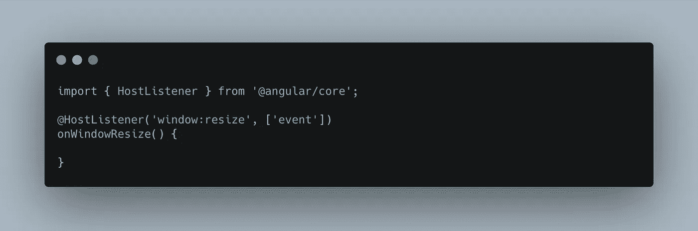
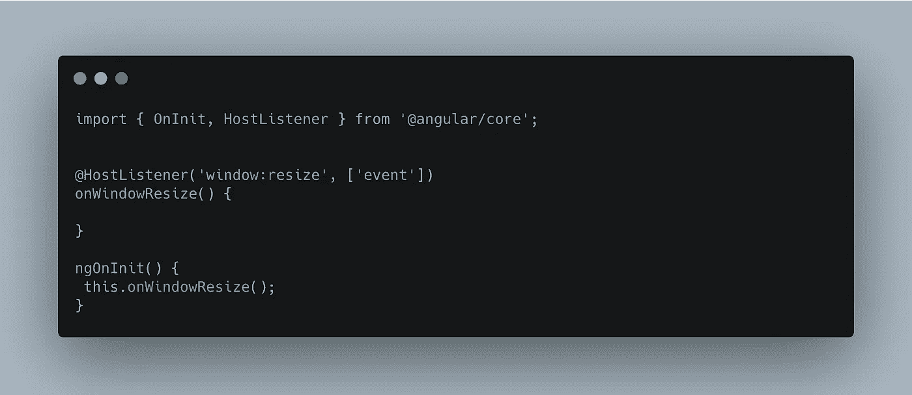
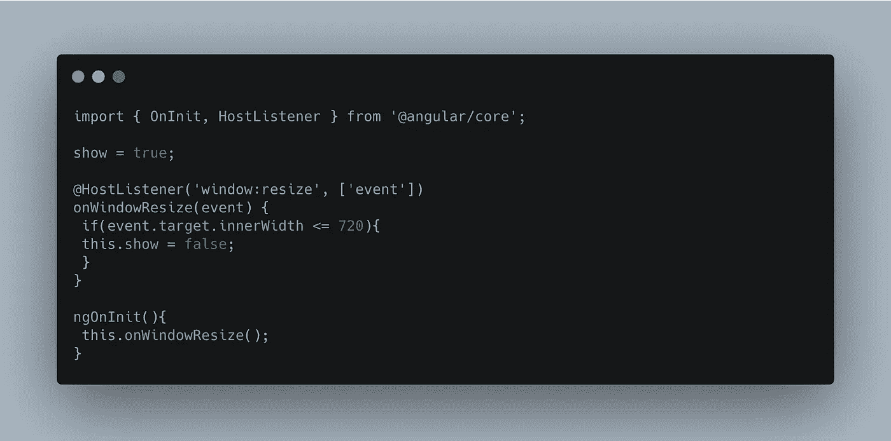
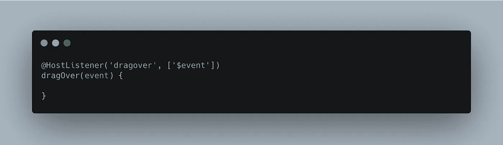

# Angular 2+中的 HostListener 装饰器

> 原文：<https://betterprogramming.pub/the-hostlistener-decorator-in-angular-2-fb80bc8b03>

## 了解主机监听器

[克里斯托夫辊](https://unsplash.com/@krisroller?utm_source=medium&utm_medium=referral)在 [Unsplash](https://unsplash.com?utm_source=medium&utm_medium=referral) 上拍照

我想用 Angular 来讨论一些人们真正忽略的东西(至少从我的经验来看)。想一想你想在前端应用程序中实现的任何东西——有一种有角度的方法可以实现它。您可以使用各种可用的概念和编程技术，但是请相信我，如果您深入研究，您会发现 Angular 中规定的方法。

其中一个技术/概念就是我想写的。我们都遇到过这样的情况，我们必须让我们的应用程序监听一些事件，如点击、窗口大小调整等。在某种程度上，应用程序必须响应那些被激发的事件。实现这一点的一种方法是使用`HostListener`装饰器。

装饰者就像函数一样，可以用来向它们所附加的任何东西添加元数据、属性或函数。装饰者有很多种类型，你可以在“[深入探讨有棱角的装饰者](https://ultimatecourses.com/blog/angular-decorators)”中读到更多关于它们的内容

假设我们需要让应用程序对窗口大小的变化做出响应。这里有一个`HostListener`的完美用例。

首先，我们创建一个方法来处理这个问题。假设我们称之为`onWindowResize`。

现在我们需要给方法添加一个`HostListener`装饰器。在 decorator 中，我们需要提供我们想要收听的事件类型。在这种情况下，这是一个`window:resize`事件，就像这样:

我们可以在`ngOnInit`生命周期中调用这个方法

这是我们告诉应用程序总是监听`window:resize`事件。然后，我们可以指出我们希望在该事件的发出上实现什么。比方说，当窗口的内部宽度低于 720 像素时，我们想要隐藏应用程序模板的一部分，或者我们想要将一个类应用到给定窗口高度的模板元素，等等。用例是无穷无尽的。

这就是了。这是`HostListener`装饰器的一个基本用法。它可用于瞄准各种事件，如`dragLeave`、`dragOver`等。，像这样:

请随时放下你对这篇文章的评论和意见。感谢您的阅读！