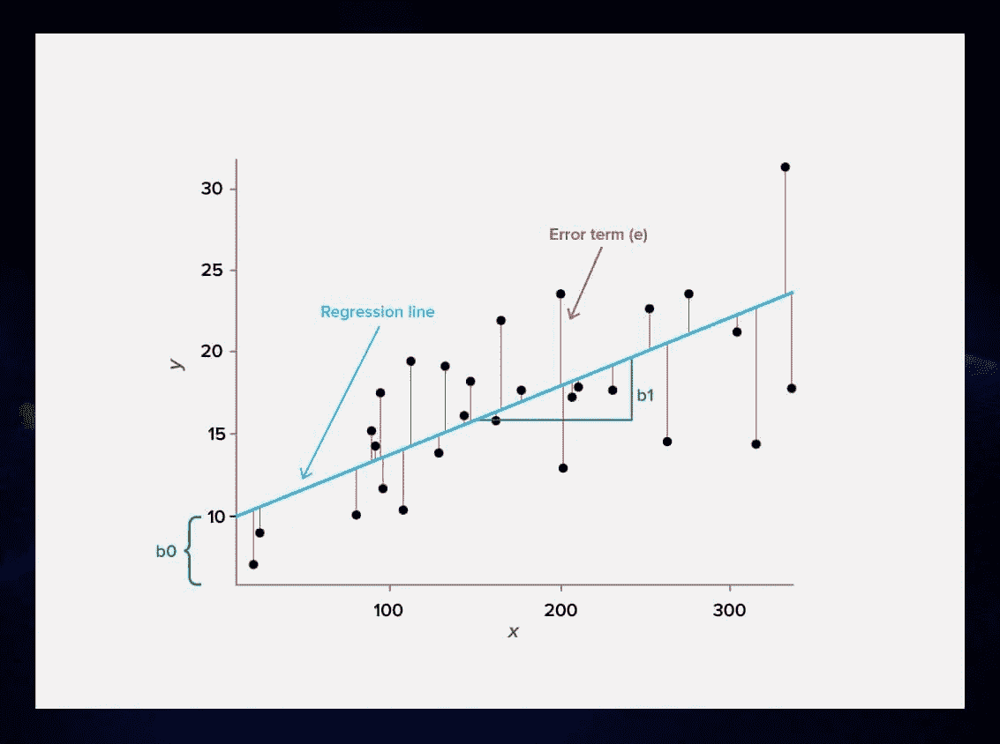
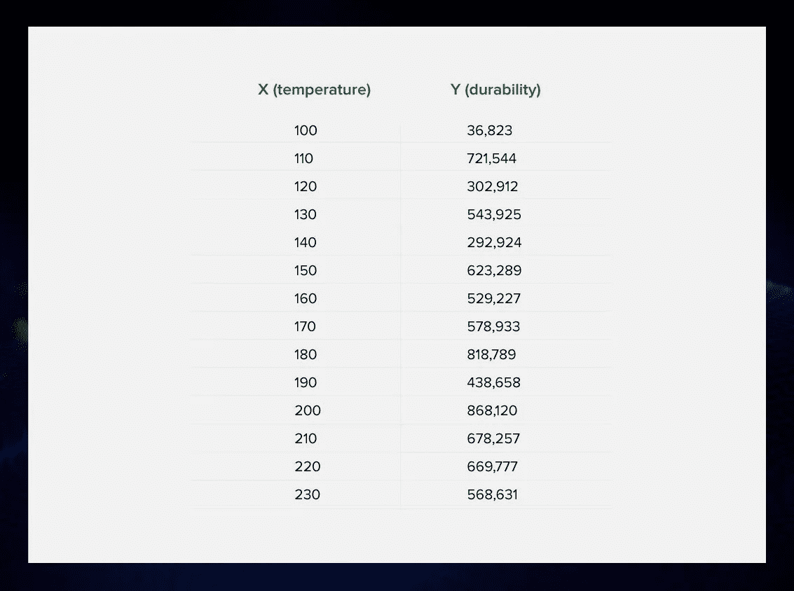
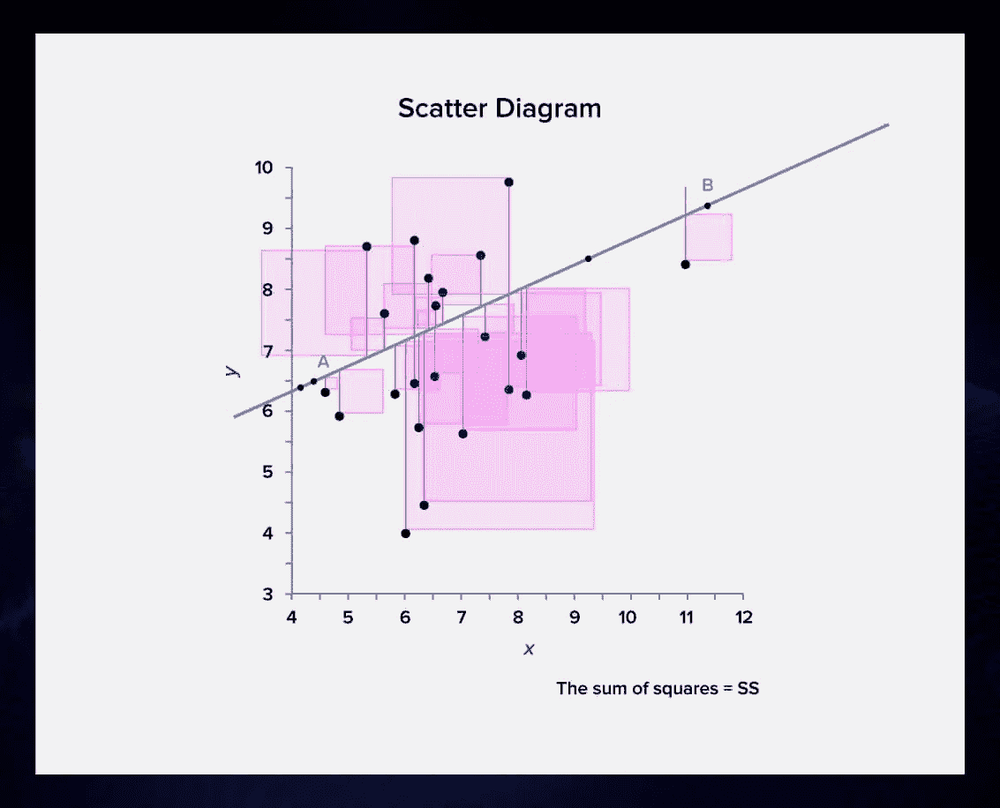
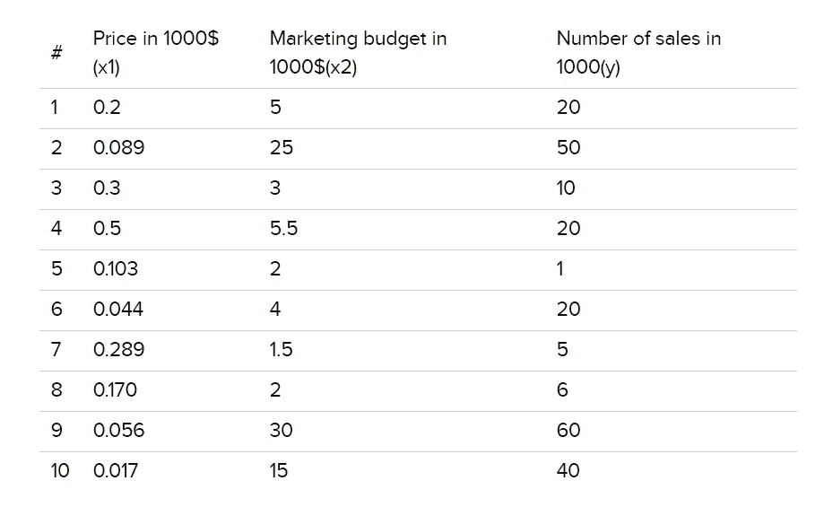
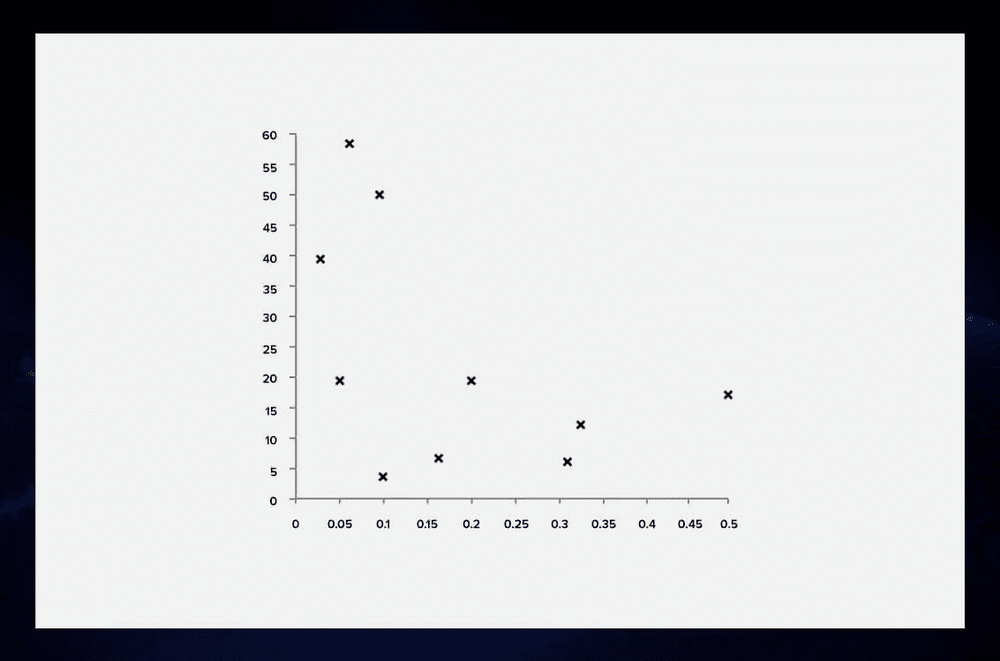
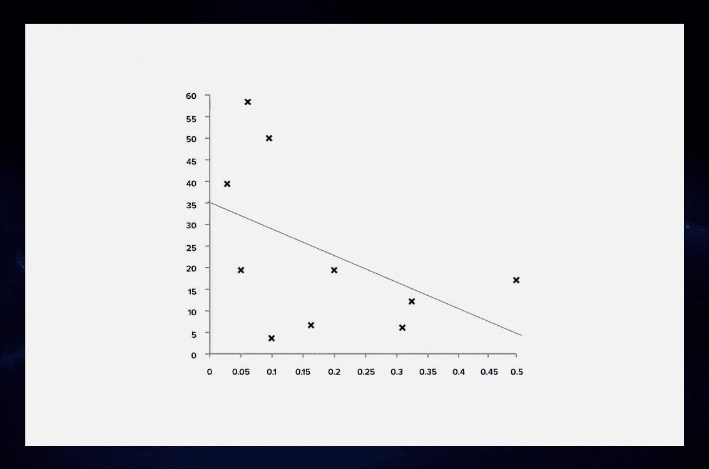
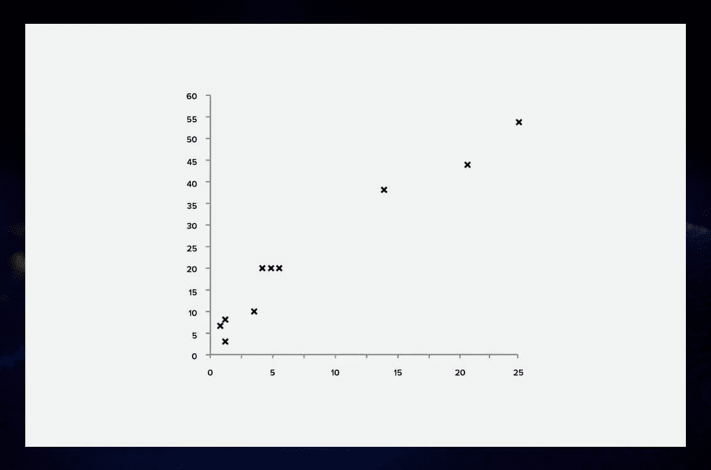
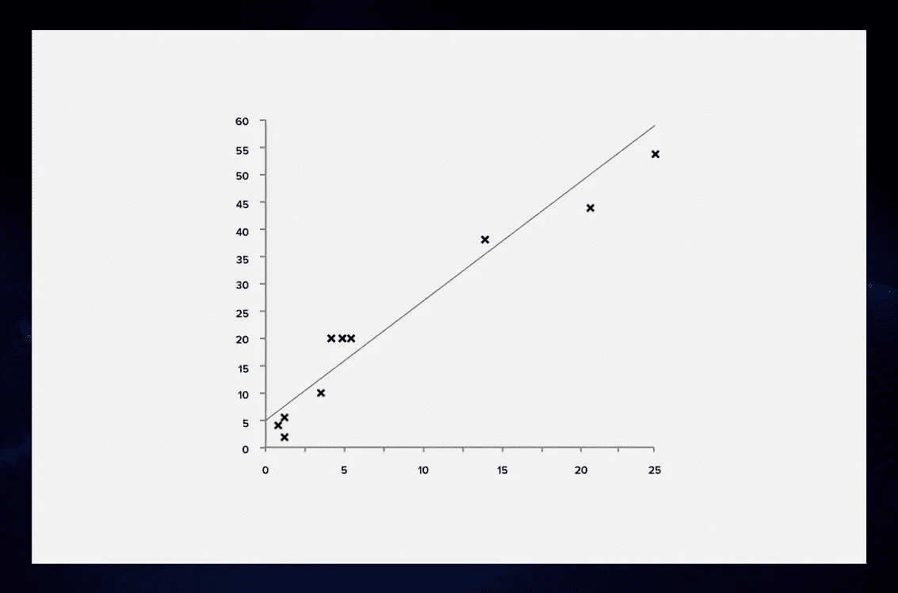
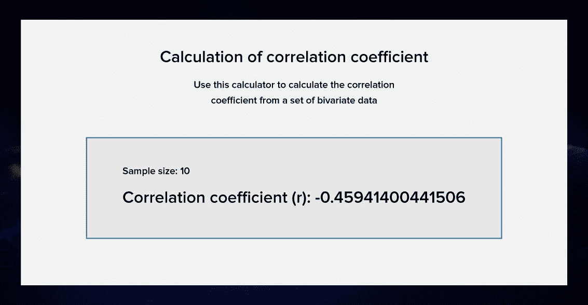

# 回归分析的方法和原因

> 原文：<https://betterprogramming.pub/the-hows-and-whys-of-regression-analysis-beed5190f8cb>

## 了解线性回归如何帮助你预测未来

由[艾萨克·史密斯](https://unsplash.com/photos/AT77Q0Njnt0)在 [Unsplash](https://unsplash.com/) 拍摄的照片。

机器学习专家从数学中借用了回归分析的方法，因为它们允许仅用一个已知变量(以及多个变量)进行预测。它们对金融分析、天气预报、医疗诊断和许多其他领域都很有用。

# 统计学中的回归是什么？

*回归分析*确定一个因变量和一组自变量之间的关系。这听起来有点复杂，我们来看一个例子。

想象一下你经营自己的餐馆。你有一个收小费的服务员。这些小费的多少通常与这顿饭的总金额有关。它们越大，食物就越贵。

你有一份订单编号和收到的小费的清单。如果您试图仅用小费数据(因变量)来重建每顿饭的份量，这将是简单线性回归分析的一个例子。

(这个例子借用了 Brandon Foltz 的[壮丽视频。)](https://www.youtube.com/watch?v=ZkjP5RJLQF4&t=9s)

一个类似的例子是试图根据公寓的大小来预测它的价格。虽然这个估计并不完美，但大公寓通常比小公寓贵。

老实说，简单的线性回归并不是机器学习中唯一的回归类型——甚至不是最实用的一种。然而，这是最容易理解的。

# 回归模型的表示

线性回归模型的表示是线性方程:

`Y = a + bX`

在这个等式中， *Y* 是我们试图预测的值。 *X* 为独立输入值。关于参数: *b* 代表每个输入值所乘以的系数，而 *a* (截距系数)是我们最后加上的系数。改变 *b* 会影响直线的斜率，而改变 *a* 可使直线沿 *y-* 轴上下移动。

# ML 的回归类型

现在让我们看看机器学习中使用的线性回归分析的常见类型。我们将在这里了解四种基本技术。[其他回归模型](https://www.analyticsvidhya.com/blog/2015/08/comprehensive-guide-regression/#:~:text=Regression%20analysis%20is%20a%20form,effect%20relationship%20between%20the%20variables.)也可以找到，但它们并不常用。

## 简单线性回归

*简单线性回归*使用一个独立变量来解释或预测结果。

例如，您有一个关于电缆温度及其耐用性的样本数据表。现在，您可以进行简单的线性回归来创建一个模型，该模型可以根据电缆的温度来预测电缆的耐用性。

你用简单回归做出的预测通常会相当不准确。电缆的耐用性不仅仅取决于温度，还取决于许多其他因素:磨损、车厢重量、湿度和其他因素。这就是为什么简单的线性回归通常不用于解决现实生活中的任务。

## 用于机器学习的多元线性回归

与简单的线性回归不同， [*多元线性回归*](https://www.investopedia.com/terms/m/mlr.asp) 使用多个解释变量来预测一个响应变量的相关结果。

多元线性回归模型如下所示:

`Y = a + B₁X₁ + B₂X₂ + B₃X₃ + … + BₜXₜ`

这里， *Y* 是你试图预测的变量，*X*s 是你用来预测 *Y 的变量，a* 是截距，*b*s 是回归系数——它们显示了某个 *X* 的变化预测了 *Y* 的变化，其他条件都相同。

在现实生活中，多元回归可以被 ML-powered 算法用来根据类似股票的波动预测股票的价格。

然而，说变量越多，ML 预测越准确是错误的。

**多元线性回归问题**

使用多元回归可能会出现两个问题:*过度拟合*和*多重共线性。*

*   *过度拟合*意味着你用多元回归建立的模型变得太窄，不能很好地概括。它在你的机器学习模型的训练集上工作正常，但在之前没有提到的项目上不能正常工作。
*   *多重共线性*描述了自变量和因变量之间以及自变量本身之间存在相关性的情况。我们不希望这种情况发生，因为它会导致模型产生误导性的结果。

为了正确地进行这种类型的分析，您需要仔细准备您的数据。我们将在这篇文章的后面讨论这个问题。

## 普通最小二乘法

另一种线性回归方法是*普通最小二乘法。*该程序通过最小化残差的总和，帮助您找到一组数据点的最佳直线。

每个数据点代表一个自变量和一个因变量之间的关系(这是我们试图预测的)。

为了直观地表示回归，首先绘制数据点，然后绘制一条直线，该直线与数据点之间的距离平方和(残差)最小。在普通的最小二乘法中，这通常是通过偏导数找到局部最小值来实现的。

## 梯度下降

[*梯度下降*](https://ml-cheatsheet.readthedocs.io/en/latest/gradient_descent.html#:~:text=Gradient%20descent%20is%20an%20optimization,the%20parameters%20of%20our%20model.) 用于模型的优化和微调。

梯度下降是通过在函数给出较小结果的方向上重复改变参数来寻找接近函数局部最小值的东西的过程。

在线性回归的上下文中，我们可以使用它来迭代地找到残差平方和最小的线，而无需计算系数的最佳值。

我们从模型每个参数的随机值开始，计算误差平方和。然后，我们迭代地更新参数，使得平方差的和小于原始参数。我们这样做，直到总和不再减少。此时，GD 已经*收敛，*并且我们拥有的参数应该为我们提供一个局部最小值。

当您应用这个技术时，您需要选择一个*学习率*，它决定了在过程的每次迭代中改进步骤的大小。重复该过程，直到达到最小平方和误差，或者不可能进一步改进。

当我们谈到梯度下降时，学习率是一个重要的概念。它描述了所需步骤的大小。当学习率很高时，你可以在每一步中发现更多的信息，但是有影响准确性的风险。在步长足够大的情况下，GD 算法根本无法收敛。较低的学习率更准确，但是我们重新计算这些值如此频繁，以至于变得低效。梯度下降需要大量时间，因此增加的精度通常不值得。

实际上，当你有许多变量或数据点时，梯度下降是有用的，因为计算答案可能是昂贵的。在大多数情况下，它会产生一条类似于 OLS 画的线。

## 正规化

这种线性回归技术试图通过添加有助于避免过度拟合的限制或预先假设来降低模型的复杂性。

这些[正则化方法](https://en.wikipedia.org/wiki/Regularization_(mathematics))在自变量之间存在多重共线性且使用普通最小二乘法导致过度拟合时有所帮助:

*   *Lasso 回归:*普通最小二乘法也改为最小化系数的绝对和(称为 *L1 正则化*)。通常，在过度拟合的情况下，我们会得到非常大的系数。我们可以通过不仅最小化误差之和，而且最小化系数的某个函数来避免它。
*   *岭回归:*普通最小二乘法被改变成也最小化系数的平方绝对和(称为 *L2 正则化*)。

# 数据准备和回归预测

现在让我们一步一步来看，你如何在 ML 中处理一个回归问题。

## 1.生成潜在变量列表

分析你的问题，找出潜在的独立变量，这将有助于你预测因变量。例如，您可以使用回归来预测产品价格和营销预算对销售额的影响。

## 2.收集变量数据

现在是时候收集历史数据样本了。每个公司都记录他们所有产品的销售、营销预算和价格。对于我们的回归模型，我们需要一个如下所示的数据集:

## 3.使用散点图和相关性检查每个自变量和因变量之间的关系

将数据点放在散点图上是一种直观的方式，可以看出变量之间是否存在线性关系。我在 calculator 上使用了[线性回归计算器，](http://www.alcula.com/calculators/statistics/linear-regression/#gsc.tab=0)但是你可以使用任何你喜欢的工具。

先说价格和销售数量的关系。

我们可以用一条线来拟合观察到的数据。

现在我们需要检查变量之间的相关性。为此，我使用了在线计算器。

相关性等于-0.441。这叫做*负相关*:一个变量增加，另一个变量减少。价格越高，销售数量越少。

但是，我们也想检查我们投入营销的钱和销售数量之间的关系。

这是我们的数据点在散点图上的样子。

我们可以看到营销预算和售出商品数量之间有明显的相关性。

事实上，当我们计算系数时(再次使用[Acula.com](http://Acula.com)，我们得到 0.967。越接近 1，变量之间的相关性越高。在这种情况下，我们看到一个*强正相关*。

## 4.检查自变量之间的关系

建立精确模型的一个重要步骤是检查自变量之间是否存在相关性。否则，我们将无法判断哪个因素影响了产量，我们的努力将毫无意义。

哦，不——这两个变量之间确实存在关联。我们做什么呢

## 5.在分析中使用非冗余的独立变量来发现最佳拟合模型

如果你发现自己处在两个独立变量相关的情况下，你就有风险了。在专业术语中，这样的变量被称为*冗余*。如果冗余是适度的，它只能影响解释。但是，它们通常会给模型增加噪声。有人认为多余的变量是纯粹的恶，我不能怪他们。

所以在我们的例子中，我们不会用两个变量来预测。使用我们的散点图，我们可以看到营销预算和销售额之间有很强的相关性，因此我们将在模型中使用营销预算变量。

## 6.使用 ML 模型进行预测

我的例子被大大简化了。在现实生活中，你可能会有两个以上的变量来做预测。你可以用这个计划去掉多余的或者无用的变量。根据需要多次执行这些步骤。

现在，您已经准备好使用机器学习来创建线性回归模型。

# 提及回归模型/算法的机器学习资源

如果您想了解更多关于回归的知识，请查看这些有价值的资源:

*   布兰登·福尔茨的统计 101。这个 YouTube 频道旨在帮助 ML 初学者和绝望的一年级学生理解统计学最重要的概念。布兰登慢慢来，总是在解释的同时提供现实生活中的例子。他有一整个系列致力于不同的回归方法和相关概念。
*   [与 Josh Starmer 的 StatQuest】。永远有趣的乔希·斯塔默会让你爱上统计学。您将学习如何将回归和其他 ML 模型应用到现实生活中。](https://www.youtube.com/user/joshstarmer)
*   如果没有提供关于不同机器学习主题的详细信息，包括回归，机器学习大师就不是一个机器学习大师博客。
*   [塞罗凯尔的博客](https://serokell.io/blog)。我们定期发布关于[人工智能](https://serokell.io/blog/ai)和[机器学习算法](https://serokell.io/blog/machine-learning)的新资料。