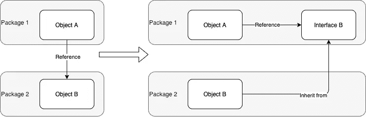

# 改进任何软件设计解决方案的 ID 原则

> 原文：<https://betterprogramming.pub/the-id-principle-for-improving-any-software-design-solution-b375db8cc823>

## 程序员世界

## 导致其他伟大软件设计思想的单一原则


[Rohan Makhecha](https://unsplash.com/@rohanmakhecha?utm_source=medium&utm_medium=referral) 在 [Unsplash](https://unsplash.com?utm_source=medium&utm_medium=referral) 上拍摄的照片

有许多软件解决方案原则。怎么才能全部学会？如果我们遇到一个软件设计问题，我们是否应该仔细检查我们的软件设计原则库，看看哪一个合适？

当我试图找出伟大的软件原则之间的共同点时，我开始看到它们之间的共同特征。我来分享一下我所看到的，看看你是否也有同样的想法。

首先，让我们看看一些伟大的原则。

# 依赖注入原理

如果我们有一段代码，如下"

```
fun getPrices(): Prices { val prices = LocalRepository().getPrices() if (prices == null) {
        return NetworkRepository().getPrices() 
    } return prices
}
```

虽然上面的代码有效，但并不好。这是因为，`getPrices()`完全依赖于`LocalRepository`和`NetworkRepository`。这意味着:

*   测试`getPrices`很难，因为我们不能轻易模仿`LocalRepository`和`NetworkRepository`
*   如果我们改变到一个新的本地或网络存储库，我们必须改变这个功能内容。它不能轻易改变。

要解决这个问题，我们应该总是注入依赖项，而不是仅仅在函数中创建它们。

```
fun getPrices(
   **localRepositpory**: LocalRepository,
   **networkRepositpory**: networkRepository
): Prices { val prices = **localRepositpory**.getPrices() if (prices == null) {
        return **networkRepositpory**.getPrices() 
   } return prices
}
```

我们应该使该功能独立于本地和网络存储库。

# 依赖性倒置原则

这是第五个坚实的原则。它颠倒了依赖关系，以解耦两个对象的强关联关系。



如上图所示，对象 A 最初依赖于对象 b。依赖反转原则使对象 A 不再直接依赖于对象 b。

一个简单的代码示例:

```
fun calculate(operation: Add, v1: Int, v2: Int): Int {    
   return operation.compute(value1, value2)
}class Add {
   fun compute(v1: Int, v2: Int) = v1 + v2
}
```

`calculate`功能直接依赖于`Add`。这使得`calculate`在它可以执行的操作中非常不灵活。

但是，如果我们反过来，却引入了如下所示的接口:

```
fun calculate(operation: Operation, v1: Int, v2: Int): Int {    
   return operation.compute(value1, value2)
}interface Operation {
   override fun compute(v1: Int, v2: Int): Int
}class Add: Operation {
   override fun compute(v1: Int, v2: Int) = v1 + v2
}
```

我们可以让`calculate` *独立依赖*`Add`。这也让我们可以很容易地添加`Sub`函数，使函数更具可扩展性。

```
class Sub: Operation {
   override fun compute(v1: Int, v2: Int) = v1 - v2
}
```

# 偏好组合而非继承

这是近来另一个经常被提倡的设计实践。

想象一下，如果我们有以下情况:

```
interface Job {
   fun work()
}class Programmer: Job {
   override fun work() = "Code"
}class John: Programmer
```

John 是程序员，所以`John`继承了`Programmer`类。但是这种编程方式非常不灵活，因为约翰可能会换工作。如果我们从继承改为合成，如下:

```
interface Job {
   fun work()
}class Programmer: Job {
   override fun work() = "Code"
}class John(val job: Job)
```

那么与其`John`是个`Programmer`，不如`John`干脆有个`Job`。这使得`John` *独立依赖于特定的`Job`*。我们可以随时改变他的工作，而不需要改变它的继承性。

# 独立自主原则

从上面的例子中，我们可以看到原始设计的一个共同挑战是对对方的强烈依赖。这种依赖性削弱了其改变和灵活的能力。

克服这一限制的解决方案是:

> 通过使依赖关系间接依赖于特定的实体，找到一种放松依赖关系的方法。这将使它看起来独立，而实际上它仍然对实体有一些依赖。我称之为**独立依赖**。

这种方法将使解决方案获得灵活性的好处，同时依赖于特定的实体，并改进软件设计的原始方法。

简而言之，让你的依赖不要像永久的直接父子关系，你不能动态地脱离，而是像雇主和雇员的关系，其中一方*独立依赖另一方*。人们需要它来谋生，但需要时可以随时改变。

这个原则在任何方法中都是通用的，可以用来改进任何有局限性的现有软件设计解决方案。您可以在以下文章中找到更多示例:

[](https://towardsdatascience.com/the-root-of-all-software-design-challenge-independent-or-dependent-31252051bf0e) [## 所有软件设计挑战的根源:独立还是依赖

### 独立依赖设计:许多软件设计方案的蓝图

towardsdatascience.com](https://towardsdatascience.com/the-root-of-all-software-design-challenge-independent-or-dependent-31252051bf0e) 

试试吧，让我知道效果如何。