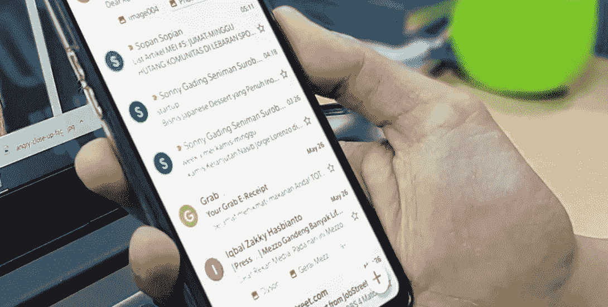
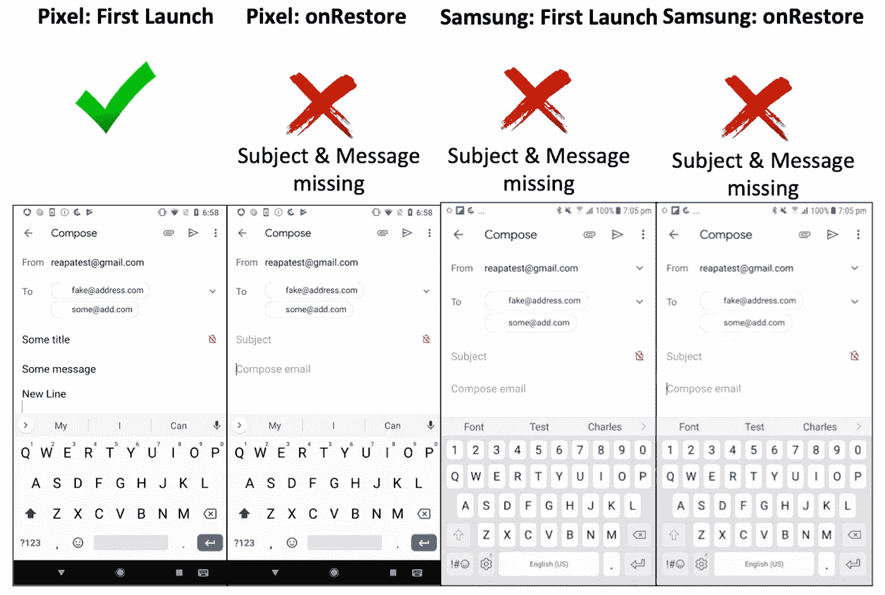
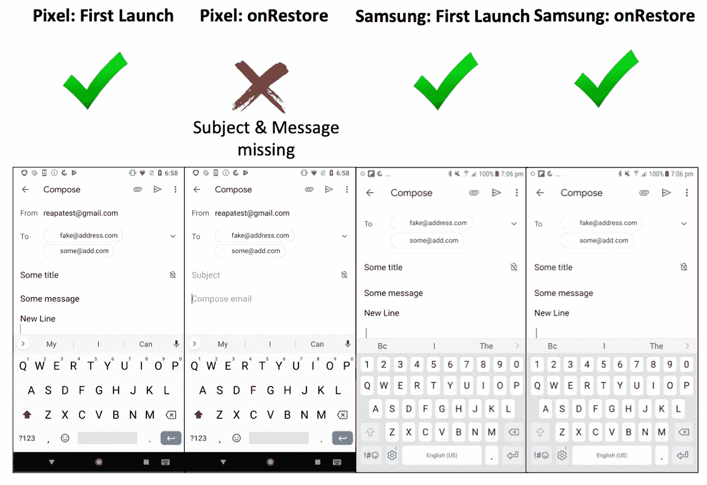
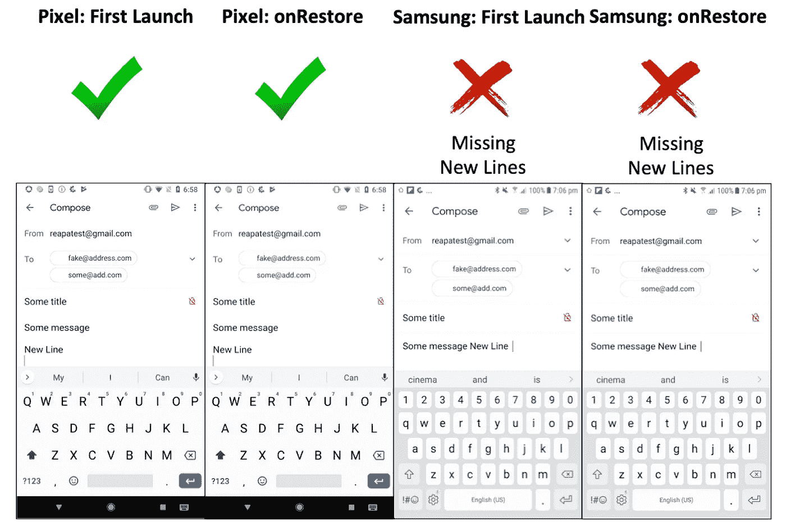
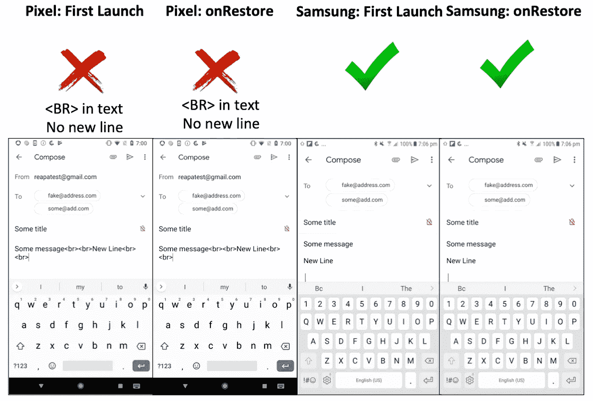

# 安卓系统中不完善的“发送邮件”功能

> 原文：<https://betterprogramming.pub/the-imperfect-android-send-email-action-59610dfd1c2d>

## 使用创建电子邮件意图查看设备间的问题



图片由 [Yogas Design](https://unsplash.com/@yogasdesign) 在 [Unsplash](https://unsplash.com/photos/J6Qn9sE4aKM) 上拍摄

发送电子邮件是任何应用程序的重要组成部分。即使在最简单的应用程序中，发送电子邮件也可以用来提供对应用程序的反馈。Android 提供了使用意图动作的能力。

然而，在创建电子邮件意图中提供的各种方法在不同的设备上具有不同的问题。如果我们想要一个完美的应用程序，这些问题并不令人讨厌。了解它们可以帮助我们了解如何减轻它们。

# 测试场景

在继续之前，下面是我的测试场景。

## 设备变体

1.  Pixel 2 SDK 8.1 —首次发布
2.  Pixel 2 SDK 8.1 —电子邮件应用程序的背景/前景(不保持活动)
3.  三星 Galaxy S7 Edge SDK 7.0 —首次发布
4.  三星 Galaxy S7 Edge SDK 7.0 —电子邮件应用程序的后台/前台(不保持活动)

## 使用的内容

对于前三种方法，我使用下面的文字。

```
val addresses = *listOf*(
    "fake@address.com", "some@add.com").*toTypedArray*()
val subject = "Some title"
val text = "Some message\n\nNew Line\n\n"
```

对于最后一种方法，我使用下面的文本。

```
val addresses = *listOf*(
    "fake@address.com", "some@add.com").*toTypedArray*()
val subject = "Some title"
val text = "Some message<br><br>New Line<br><br>"
```

# 方法 1。意向数据+额外数据

```
private fun mailtoTypeEmailCreation(
    addresses: Array<String>, subject: String, text: String) { val intent = Intent(Intent.*ACTION_SENDTO*).*apply* **{** val mailto = "mailto:" + addresses.*joinToString*(",")
        *data* = Uri.parse(mailto)
        putExtra(Intent.*EXTRA_SUBJECT*, subject)
        putExtra(Intent.*EXTRA_TEXT*, text)
    **}**if (intent.resolveActivity(*packageManager*) != null) {
        startActivity(intent)
    }
}
```

在这种方法中，我们将`intent.data`中的`mailto`与电子邮件一起使用。内容使用`EXTRA_SUBJECT`和`EXTRA_TEXT`。

这只适用于 Pixel 的首次电子邮件发布。使用 onRestore 时不起作用。对三星根本不管用。



# 方法二。所有额外意图

```
private fun latestExampleEmailCreation(
    addresses: Array<String>, subject: String, text: String) {
    val intent = Intent(Intent.*ACTION_SENDTO*).*apply* **{** *data* = Uri.parse("mailto:")
        putExtra(Intent.*EXTRA_EMAIL*, addresses)
        putExtra(Intent.*EXTRA_SUBJECT*, subject)
        putExtra(Intent.*EXTRA_TEXT*, text)
    **}** if (intent.resolveActivity(*packageManager*) != null) {
        startActivity(intent)
    }
}
```

这是 Android 开发者指南中分享的[官方方法](https://developer.android.com/guide/components/intents-common)。

这看起来只对 Pixel 和三星首次推出都好。onRestore 为三星工作。但在 Pixel Gmail onRestore 上，主题和邮件不见了。



# 方法三。所有意向数据

```
private fun intentDataEmailCreation(
    addresses: Array<String>, subject: String, text: String) {
    val intent = Intent(Intent.*ACTION_SENDTO*).*apply* **{** *type* = "message/rfc822"
        val uriText = String.*format*("mailto:%s?subject=%s&body=%s",
            addresses.*joinToString*(","), subject, text)
        *data* = Uri.parse(uriText)
    **}** if (intent.resolveActivity(*packageManager*) != null) {
        startActivity(intent)
    }
}
```

这充分利用了 Mailto 的语法，根据[https://www . lab nol . org/internet/email/learn-Mailto-syntax/6748/](https://www.labnol.org/internet/email/learn-mailto-syntax/6748/)

在 Pixel 上，这是完美的，因为 first launch 和 onRestore 都可以工作。但它在三星的 Gmail 上不起作用，因为`/n`被忽略了



# 方法 4。所有带有/n 的意图数据被替换为

这与方法 3 相同。，除了使用 HTML 格式的语法(即将`/n`替换为`<br>`)。

通过这种方法，它在三星上运行良好。然而，在像素上,`<br>`被保留并且不产生新的行。



所以正如你在上面看到的，没有完美的解决方案。最好的方法是方法 2。唯一的问题是 Pixel email onRestore 不能保存主题和信息。这可能是 Gmail 应用程序的问题，所以让 Gmail 来解决它。

可以在 [GitHub](https://github.com/elye/demo_android_email_action_intent) 上获取代码。

感谢阅读。