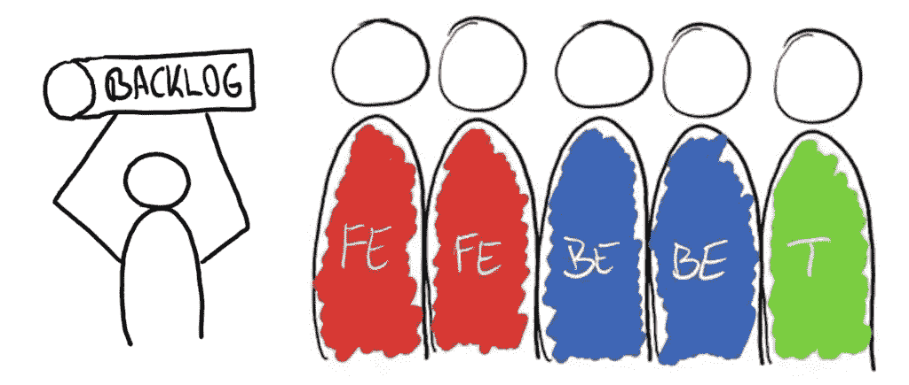
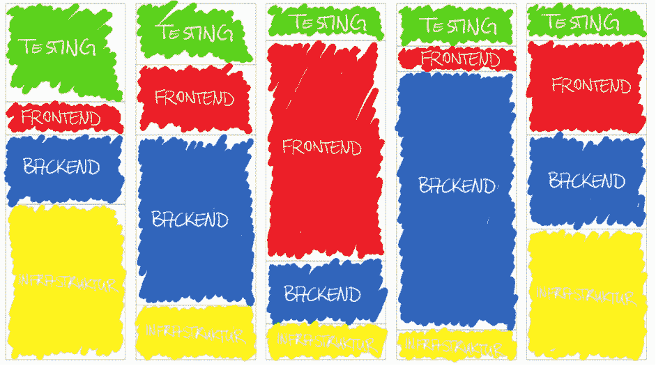
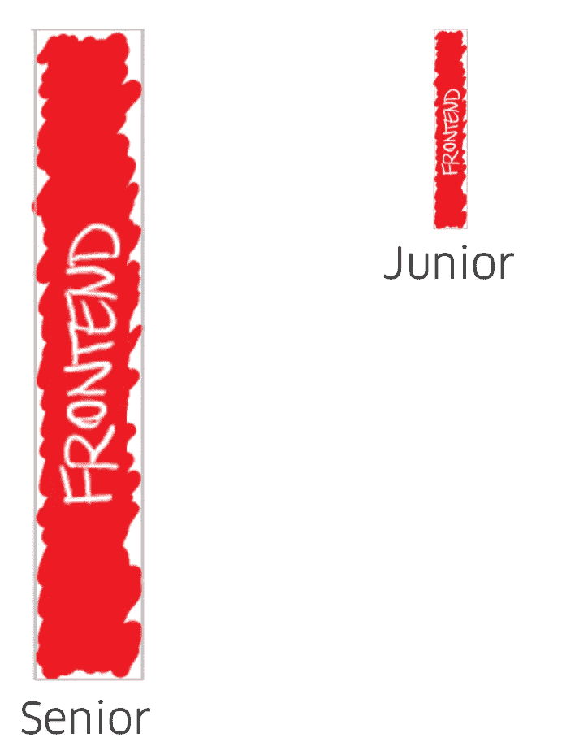
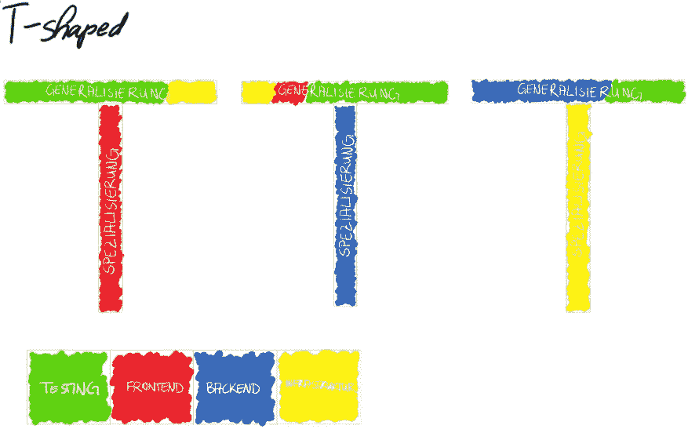

# 成为 T 型工程师的重要性

> 原文：<https://betterprogramming.pub/the-importance-of-being-t-shaped-215439f464d2>

## 以及一些培养这种文化的方法

安特·罗泽茨基在 [Unsplash](https://unsplash.com?utm_source=medium&utm_medium=referral) 上的照片

我相信经验或资历是关于你对众所周知的和广泛存在的问题的解决方案。你已经建立了一个个人工具箱，没人能从你那里拿走。

我在职业生涯中不断遇到的一个问题是面临瓶颈或总线因素，这些因素限制了一个组织发挥其潜力。

我提出的一个主要问题是:“团队和关键流程是否依赖于单个个人？”

了解这些瓶颈在哪里并不复杂。当你听到这样的陈述时，要保持高度警惕:

"我们不能这样做，因为布雷特生病了或正在度假."

“我们不能做这个项目，因为布雷特是唯一一个拥有这种专业知识的人，而且完全致力于其他项目。”

"我正在等待后端的完成，开始做用户界面."

"我们不能发布，因为测试人员仍在测试."

布雷特这个名字不是我随便选的。布雷特是吉恩·金、凯文·贝尔和乔治·斯帕福德所著的《凤凰计划:一部关于 IR、DevOps 和帮助你的企业成功的小说》中的一个重要角色。

Brett 代表了那些因其独特的技能或知识而成为瓶颈的人，这些技能或知识是关于既没有记录也没有自动化的手动过程的。

让我使用跨职能团队开发软件来更详细地解释这个问题——因为这是我擅长的领域。

让我们从一个拥有 PO、两名后端工程师、两名前端工程师和一名测试人员的团队开始:

如果每个人都健康并在场，这种工程能力将如下实现:40%后端，40%前端，20%测试。

让我们假设这个团队从零开始开发一个新产品。首先，这个团队将专注于一些基础工作，如基础设施、架构和样板代码。

测试人员和前端工程师在这个阶段往往没有得到充分利用，因为他们依赖后端和基础设施同事的工作。我不打算关注如何集成基础设施，因为我打算在另一篇文章中写 DevOps。

在后面的阶段，后端工程师编写前端工程师使用的 API，测试人员测试所有东西。

非常有序的工作流程。这样的工作流容易出现瓶颈、上下文切换和“这不关我的事”的态度。此外，你不能有一个与你的团队成员的专业化相对应的需求。

请看下图。它根据团队正在工作的产品阶段显示了不断变化的需求。

当团队成员在等待他们的同事完成他们的任务时，一个典型的情况是通过开始处理尚未确定优先级的任务和项目来有效地利用他们的时间，从而增加团队的 WIP 并分散团队的注意力。

那么，如何才能解决这个困境呢？我了解到，促进基于协作和 T 型工程师的文化是一个可行的解决方案。

# 那么，什么是 T 形呢？

当人们有一个特定的知识领域时，他们被称为 I 型，因为他们有一个专业，随着时间的推移越来越深。初级和高级 UI 工程师的区别在于他们在前端开发的特定知识领域的知识深度。

如果人们开始在他们专业以外的领域学习，他们会自动拓宽他们的知识面。它们逐渐变得更加 T 型，如下图所示。

因此，在你的组织中培养“T 型身材”需要什么？以下是答案:

# 紧迫感

首先，人们应该意识到他们面临的问题。否则，他们不会理解你的提议。

当你看到一个瓶颈或者团队在他们的敏捷框架中以瀑布模式工作时，大声说出来！

提问:“如果布雷特不在，谁能照顾这个系统？”“谁在自动化测试？”，“如果测试人员生病了，你怎么有信心你的发布会没事？”。

不要接受任何借口，比如“我没有时间教别人”，“我有很多紧急任务”，“我们可以在结束这个项目后开始进行知识转移”，或者“我稍后将为这个功能编写测试。”

过一段时间，人们就会明白了。让每个人都站在同一立场上是很重要的。这篇文章中的所有图片都是名为“DevOps 和 T 形——打破筒仓”的展示的一部分。(衷心感谢我的同事马蒂亚斯·科尔斯拍摄的这些美丽的照片)

2018 年初，我用这个演示文稿与所有开发团队一起举办了研讨会。从这几天开始，我们得到了员工对 T 型身材的认同，现在是时候做一些改变了！

# 每个人都是工程师

我们改变了所有开发人员和测试人员的头衔。现在他们都是工程师，而不是后端开发人员、测试人员或前端程序员。

如果合适的话，他们可以把自己的专业放在括号内，比如 Engineer (UI)。我们的大多数工程师选择跳过他们的专业。

# 每个人都是大师和学徒

分享知识是一种责任，而不是“拥有就好”。

向他人学习并对产品的各个方面感兴趣是团队合作和所有权的主要方面。

允许人们变得更广阔的另一个积极方面是给他们一个广阔的领域来发展自己，而不是将他们的发展限制在一个单一的学科。

这里还有几个推广 T 型文化的方法:

*   **质量是每个人都关心的问题** —所有团队成员都有责任交付高质量的产品，而不仅仅是专业知识是质量保证的工程师。对质量的承诺是我相信所有工程师都应该自动化测试的原因。
*   **自动化一切** —工作代码是团队可以拥有的最好的文档，尤其是当团队开发它的时候。避免手动步骤和只存在于个人头脑中的知识。
*   **重视对个人活动的贡献**——资历不是你能做什么，而是你能让你的组织和队友实现什么。
*   重视长期业绩胜于短期收益——投资 T 型股是一项长期努力，你需要耐心去收获它的果实。否则，你将会避免结对编程、知识共享和其他需要放置 T 形的活动。

# 总结

T-Shaping 是关于避免团队中的瓶颈，分享知识，促进合作，以及其他从长远来看将增加团队凝聚力、专注度和绩效的措施。

你不能点一个像披萨一样的 T 型文化，你和你的团队必须努力工作才能让它融入你的 DNA 中，但是它的好处是值得的！