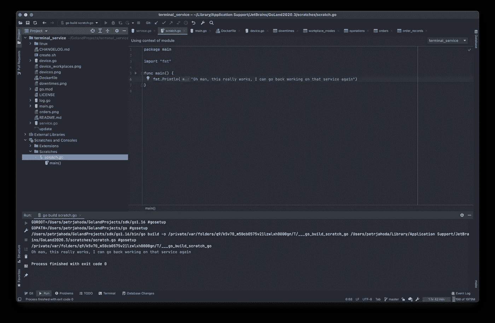

# 涂鸦在编程中的重要性

> 原文：<https://betterprogramming.pub/the-importance-of-doodling-in-programming-2e46d47035d9>

## 通过写下来来理清你的想法

卢卡斯·兰兹在 [Unsplash](https://unsplash.com?utm_source=medium&utm_medium=referral) 上的照片

你涂鸦吗？你曾经涂鸦过吗？

编程的时候会涂鸦吗？

我说的这个术语，编程中的涂鸦，是什么意思？

# 一般涂鸦

根据维基百科的定义，涂鸦是指你在全神贯注的时候画的画。

我们大多数人上学时都经历过这种情况。重要的事情被解释了，但是你正在你的笔记本上画一些东西。

如果你年纪较大，不在学校，而是在一家公司……很有可能，你会在那里开会。你有没有发现总有人乱涂乱画？是你吗？

恭喜你。你没有失去你小时候所拥有的——玩耍的天赋。

维基百科的定义将涂鸦与无聊联系在一起，但如果你是成年人，问问自己:为什么？

是无聊吗？还是有什么心事需要表达？那是在呼吁关注吗？

# 编程中的涂鸦

如果你是程序员，很有可能你还是喜欢玩的。你还怀着那个孩子。如果你发现自己在问这样的问题，“如果我这样做呢？”以及“这是如何工作的？”以及“当我这样做时，它会做什么？”你还有那个小孩在你体内。

问这种问题，你就是在涂鸦。在你的脑海里。当你需要做一些重要的事情时，你有没有想过这些问题？当最后期限临近时。

你需要做那项工作！不是在玩问题，对吧？

但是如果你继续编码，你将不会得到安宁。这些问题一次又一次地出现。即使在你完成工作之后。

你去睡觉，他们仍然在那里。你正在驾驶你的汽车，然后砰的一声。还在。看电影。还在。

涂鸦是天堂还是地狱？

我把涂鸦视为一种天赋。

如果你没有它，你就是没有它。如果你有它但没有使用它，你就浪费了别人想要的东西。但是如果你拥有它，并且你正在使用它，你就在不断地改善你自己和你的生活。你在使用你的天赋。

# 编程时涂鸦

几乎任何事情，涂鸦都有两面性。

不好的上面描述了。你不解决这些问题，就不会休息。

好的一面帮助你提高，几乎是免费的，因为那些问题不是你问的，它们是自己来的。

那么，当你在写人生中最重要的几行代码时，当这些问题出现时，你能做什么呢？

你只能做一件事来摆脱这个问题:写下来。然后回去写代码。

## 现在有三种可能性:

1.  如果您现在可以专注于编码，那么最初的工作就完成了。
2.  如果你头脑中还有那个问题，你需要写下更多。也许那会有帮助。
3.  但是如果你写了很多，你仍然不能专注于编码(仍然被那个问题分心)，那么没有比开始真正的编程涂鸦更好的事情可做了。如果你不立即停止，你的实际工作就会受到影响。

第一个和第二个答案只做了一件事:推迟真正的编程涂鸦。第三个答案是直接的。

你可以将这种区分作为一种工具，来认识到你所提问题的重要性。

如果你有一个问题，写下来后你还能正常工作，那么这个问题的重要性就低了。如果你需要多写那个问题，然后正常工作，那个想法的重要性是中等。但是如果你不能工作，不管你写了多少行，这个问题或者想法是非常重要的。你必须现在就开始努力。

# 编程涂鸦

所以，现在就开始解决这个问题(或想法)。很有可能，它会改善你正在做的工作。很有可能，它会防止你在工作中犯某种错误。

为自己创建一个目录(如果你还没有的话),命名为刮痕、涂鸦、测试、样本……等等。带着你的问题和想法在这里玩耍。

因为你不是第一个有这种天赋的人，这种涂鸦可能已经在你的工作工具中实现了。所以你一边工作一边涂鸦！

下面是我选择的 IDE——scratchs 中一个涂鸦实现的截图。你的 IDE 应该有类似的东西。

一边工作一边用，两全其美。您仍然在您的工作环境中，只需点击几下您的工作代码。你正在写下你的问题和想法(谁知道呢，也许和这个项目有关)。你可以把这些涂鸦转化成可行的答案。

最棒的是，你的涂鸦和你的重要项目一起保存。它们不会像那些纸质的一样消失。

如果你很容易被自己的问题和想法分心，那就庆幸吧。有些人没有太多的问题和想法。

你才是设定方向的人，而不是他们。

利用这种天赋，不要让它蒙羞。

一边编程一边涂鸦。