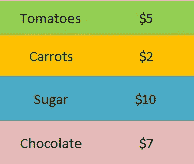
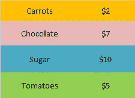
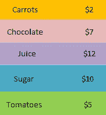

# 哈希映射的重要性

> 原文：<https://betterprogramming.pub/the-importance-of-hash-maps-831884307806>

## *哈希映射可以解决一大堆不同的问题*


照片由 [Héctor J. Rivas](https://unsplash.com/@hjrc33?utm_source=medium&utm_medium=referral) 在 [Unsplash](https://unsplash.com?utm_source=medium&utm_medium=referral) 上拍摄。

哈希是计算机科学中的一种传统方法，称为哈希映射的数据结构用于存储键值对*。*除了存储键值对，哈希映射还可以用来解决计算机科学中的各种问题。当与优先级队列和其他容器适配器(如堆栈和队列)一起使用时，哈希映射可以通过降低运行时间的复杂性来加快问题的解决。

让我们深入了解哈希映射的基本概念，它们在 C++中的用法，以及对一些最重要问题的应用。

# **哈希映射背后的概念**

哈希映射通常将元素存储为键值对。考虑这个例子:我们想将一个食品杂货列表及其价格存储到哈希映射中。商品的名称作为一个键，它的价格就是价值。这个键值对存储在一个哈希映射中，如下所示:



价格存储在无序地图中的项目。

在无序散列映射(也称为无序映射)中，存储键值的顺序没有保证。当我们将一个项目插入到无序的散列图中时，它可以驻留在`Map`对象中的任何位置。如果我们想要严格地按照键的升序排列项目，我们可以使用有序散列映射或简单的映射。对于上述示例，项目在地图中的存储方式如下:



价格存储在地图中的项目。

这些键按照字典顺序从最小的字母 *c* 开始排序。当一个价格为*【12】*的新物品如果汁需要添加到地图中时，它被插入到巧克力之后的位置 3，以保持字典顺序*。***

****

**果汁加入地图。**

# **编码哈希映射**

**无序映射和映射是 C++中标准模板库(STL)的一部分。要声明地图和无序地图*，*运行以下命令:**

```
**map<key_type, value_type>mp;unordered_map<key_type, value_type>unmp;**
```

**`key_type`和`value_type`可以是标准数据类型，如`int`、`float`、`char`、`pair`等。**

**大多数成员函数对于`unordered_map`和`map object`是通用的。让我们来看看其中的一些函数。**

## ****1。将项目插入散列图****

**要将项目插入到`unordered_map`或`map`中，运行以下命令:**

```
**mp.insert(pair<key_name, value>);**
```

**`key_name`和`value` 分别是要插入到`map`中的项目名称和值。在上例中，我们将`Carrots` 作为`key_name`*`$2`*作为`value` *。*我们也可以使用赋值操作符插入项目:****

```
**mp["Carrots"] = 2;**
```

## **2.从哈希映射中删除项目**

**要从哈希映射中删除一个条目，我们使用`erase` 函数:**

```
**mp.erase(mp.begin()); //Delete an item at startmp.erase("Carrots"); //Delete an item with key "Carrots"mp.erase(mp.begin(), mp.end()); //Delete all items in the map**
```

## **3.在哈希映射中查找项目**

**为了在散列图中找到一个条目，我们使用了`find` 函数:**

```
**const_iterator itr = mp.find("Carrots");**
```

**如果在映射中找到了`Carrots` ，那么`itr` 包含散列映射中元素的迭代器。如果没有找到指定的键，`itr` 包含`unordered_map::end`的值。**

## ****4。其他哈希映射函数****

**下面是哈希映射中使用的一些其他常用函数:**

```
**value = mp.at("Carrots"); //Returns the value at key cnt = mp.count("Carrots"); //Returns the total number of carrotis_empty = mp.empty(); //Returns if the Hash Map is Emptytotal_size = mp.size(); //Returns the total number of items**
```

# **哈希映射的应用**

**使用散列映射的最大优点之一是它们为搜索、插入和删除操作提供了一个恒定的时间 *O(1)* 。这使得它们更适用于与查找重复项、查找项目频率和查找不同元素相关的问题。**

## ****1。与项目频率相关的问题****

**哈希映射对于解决大多数与项目频率相关的问题非常有用。这类问题的一个例子是在字符串列表中查找常见字符。如果一个项目在所有字符串中出现两次，则需要在输出中包含两次:**

```
****Input:** ["bella","label","roller"]
**Output:** ["e","l","l"]**
```

**为了解决这个问题，我们可以使用两个`for` 循环来比较一个字符串和其他字符串的列表。但是这种方法的时间复杂度是 O(n ) 。为了最小化时间复杂度，我们可以使用哈希映射将字符存储为键，将字符串编号和频率存储为一对值。然后，我们可以迭代哈希映射来检查所有字符串中的常见字符及其出现频率。这就把时间复杂度降低到了 *O(n)* 。**

## ****2。字典****

**字典是另一个更频繁使用散列映射的常见例子。如果我们要制作一个搜索单词意思的在线门户，我们将在后端建立一个词典来存储单词及其意思。当用户搜索一个单词时，它使用`find` 散列函数来检索其含义。**

## ****3。文件系统****

**哈希映射用于链接文件名和文件路径。为了存储文件名和路径与该文件在磁盘上的物理位置之间的对应关系，系统使用映射。该映射通常以哈希表的形式实现。**

## ****4。密码验证****

**考虑一个 web 应用程序，当用户输入用户名和密码时，它允许用户登录和验证。在大多数现代系统中，用户名和密码不会以纯文本形式发送到后端服务器进行身份验证。相反，它们被编码为哈希值并发送给服务器。然后，服务器用存储的哈希值检查接收到的哈希值。如果匹配，则允许用户登录。为此使用了特殊的加密函数，因此用户是安全的。**

## ****5。云中的存储优化****

**Dropbox 在云端使用哈希表进行存储优化。假设有多个用户将同一个视频上传到他们的 Dropbox 账户。由于存储同一视频的多个副本会消耗太多的存储空间，Dropbox 存储文件的单个副本，并提供链接供每个用户访问。当一个新用户上传同一个文件时，Dropbox 会计算文件的哈希值。如果它与哈希表中存储的值匹配，则向用户返回该文件的链接。**

## ****6。编译器操作****

**为了识别编程语言中的关键字，编译器将它们存储在哈希表中。然后，编译器用哈希表检查程序，以验证程序语法是否正确。**

# **结论**

**这些只是使用哈希映射的几个应用程序。哈希映射是每个开发人员都需要知道的最重要的工具之一。这使得解决问题变得更快更容易——尤其是处理项目频率的问题。**