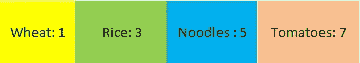
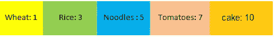
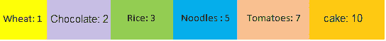

# 优先级队列的重要性

> 原文：<https://betterprogramming.pub/the-importance-of-priority-queues-f87e1f5ac842>

## *优先级队列可以解决一大堆不同的问题*


利瓦伊·琼斯在 [Unsplash](https://unsplash.com?utm_source=medium&utm_medium=referral) 拍摄的照片。

优先级队列*、*也称为堆、*、*是计算机科学中一个经常被误解和低估的概念。尽管优先级队列非常简单，但它可以作为强大的工具来解决计算机科学中一些众所周知的问题。

本文主要关注优先级队列的基本概念，它们在 C++中的用法，以及对一些最重要问题的应用。

# 优先级队列背后的概念

顾名思义，优先级队列包含具有与之相关联的优先级的元素。我们先举一个简单的例子。

假设我们有一个食品杂货清单，并为它们附加了一个优先级。让我们将它们关联为插入到优先级队列中的键值对，如下所示:



具有优先级的食品杂货清单

`Tomatoes`位于队列的顶部，具有最高的优先级，其次是`Noodles`、`Rice`和`Wheat`、*。*假设我们要推送一个名为`Cake` 的项目，优先级等于10 *。*当我们将`Cake`推入优先级队列时，队列会检查该物品的优先级是否高于`Tomatoes` (7)。如果是，那么它被插入到队列的顶部。新队列如下所示:



添加到优先级队列顶部的蛋糕

现在，假设我们想要推送优先级等于 2 的另一个杂货项目(`Chocolate` ) )。在这种情况下，`Chocolate` (2)的优先级低于`Cake` (10)的优先级。因此队列弹出项目`Cake`并检查下一个项目`Tomatoes` (7)。情况与`Cake`类似——队列弹出`Tomatoes`。同样的规则也适用于`Noodles` (5)和`Rice` (3)。

该队列现在包含一个项目，`Wheat` (1)，位于队列的顶部。`Cake` (2)的优先级比`Wheat` (1)高，所以它被放在队列的顶部。从队列中弹出的项目按顺序放回后进先出。因此`Rice`、`Noodles`、`Tomatoes`和`Cake`被放回到优先级队列中，如下所示:



中间插入巧克力的优先队列

优先级队列的概念很简单。根据优先级将项目插入队列，从队列顶部弹出优先级最高的项目。

# **编码优先级队列**

优先级队列是 C++标准模板库(STL)的一部分。它们属于容器适配器的基本组，如堆栈和队列。他们是这样声明的:

```
priority_queue<type>pq;
```

`Type`表示任何变量类型，如`int`、`char`、`float`等。

默认情况下，具有最高值(优先级)的元素位于队列的顶部。所有元素以降序排列在队列中。如果我们希望将具有最低值的元素放在队列的顶部，并按升序对元素进行排序，那么可以更改声明:

```
priority_queue<type, greater<type>>pq;
```

如果我们想对优先级队列中的元素进行自定义排序，那么使用自定义函数`myOrder`声明优先级队列:

```
priority_queue<type, vector<type>, myOrder>pq;
```

自定义函数需要是名为`myOrder` *的结构或类的一部分。*假设我们想要返回队列顶部具有最高值的元素。然后我们会返回`p1.val < p2.val`。

```
struct myOrder{ bool operator()(type const& p1, type const& p2){ //Write your own custom order function. For example, we order elements in decreasing order and return element with the highest value. return p1.val < p2.val; } };
```

要将一个元素推入优先级队列*`pq`*我们使用:**

```
**pq.push(item);**
```

**类似地，为了从优先级队列中弹出一个项目，我们使用:**

```
**pq.pop();**
```

**为了访问队列顶部的元素，我们使用:**

```
**type item = pq.top();**
```

**为了检查队列的大小，我们使用:**

```
**size_type t = pq.size();**
```

**要检查优先级队列是否为空，我们使用:**

```
**bool is_empty = pq.empty();**
```

**其他函数，如`emplace`和`swap`，用于插入新的项目，并与其他优先级队列交换。**

# **优先级队列的应用**

## **1.排序堆**

**这一类别中的一个经典问题是找到前 *k* 个频繁项目*。给定一个非空的单词列表，返回 k 个最频繁出现的元素。由于答案需要按降序排序，因此我们使用`max heap`来实现这一目的:***

```
****Input:** ["the", "day", "is", "sunny", "the", "the", "the", "sunny", "is", "is"], k = 4
**Output:** ["the", "is", "sunny", "day"]
**Explanation:** "the", "is", "sunny" and "day" are the four most frequent words,
    with the number of occurrence being 4, 3, 2 and 1 respectively.**
```

**这个问题的解决方案包括使用无序映射将单词存储为一个`key`，将频率存储为一个`value` *。*我们根据频率*将字推入优先级队列。*出现频率最高的单词存储在队列的顶部。然后我们从队列中弹出单词并返回结果。**

*排序堆的其他例子有 *k* 个最接近原点的点、*第 k 个*-流中最大的元素、*第 k 个*-排序矩阵中最小的元素、寻找具有最小和的 *k 个*对，等等。另外，堆排序——一种经典的排序算法——使用优先级队列对元素进行排序。*

## *2.负载平衡*

*堆扮演重要角色的另一个经典问题是负载平衡。负载平衡是一种计算机联网方法，涉及在多个计算资源之间分配工作负载。考虑分布式环境中负责执行多项任务的 n 个服务器。假设有一个来自用户的新请求。该请求需要被路由到具有最小工作负载和最大阈值的服务器。过载的服务器有一个阈值< 0。*

*为了解决这样的问题，我们用`max heap` 来存储阈值*。*具有最大阈值和最小负载的服务器存储在优先级队列的顶部。这个服务器从队列中弹出，负责执行新的用户请求。*

## *3.数据压缩*

*霍夫曼编码是一种无损数据压缩算法，其中数据中的每个字符都分配有一个可变长度的代码。最不常用的字符得到最大的代码，最常用的字符得到最小的代码。以这种方式编码数据既简单又高效。使用优先级队列存储带频率的字符和`max heap`树来压缩数据可以帮助解决这个问题。JPEG 和 MP3 多媒体编解码器使用霍夫曼编码进行数据压缩。*

## *4.图形算法*

*Dijkstra 的最短路径算法和Prim 的算法以寻找从源到目标的最短路径而闻名。我们需要存储节点的邻接矩阵以及从*节点 i* 到*节点 j 的开销。* `Min heap` 可用于存储路径和与之相关的开销。成本最低的路径位于优先级队列的顶部。它会弹出，用于计算从源节点到目标节点的最短路径。*

## *5.人工智能算法*

*A*搜索算法是人工智能领域中用于寻路和图遍历的最好和最流行的技术之一。优先队列，在 A*搜索算法中也称为边缘，跟踪游戏中未探索的路线。总路径长度上的最低边界路由(即具有最短路径的路由)被赋予最高优先级。它被存储在队列的顶部。这条路线在游戏中用于以后的寻路。*

*这些应用只是使用优先级队列的几个例子。优先级队列的使用范围很广。它目前正在几个领域使用。因此，优先级队列，一个计算机科学中的基本概念，可以作为解决一些最有趣问题的有力工具。*

*感谢阅读！*