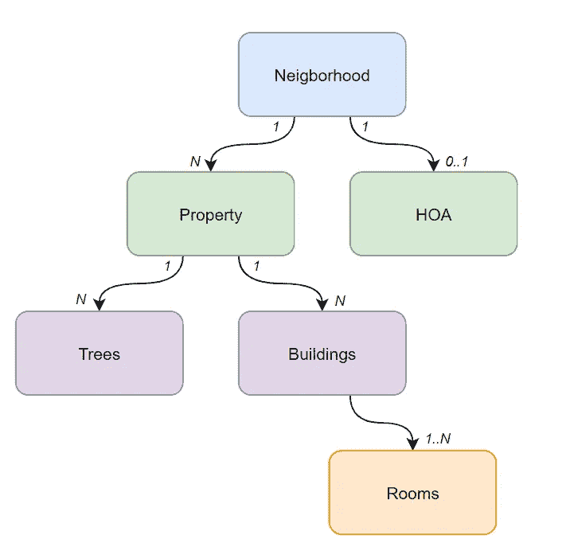

# 正确的无服务器 API 设计的重要性

> 原文：<https://betterprogramming.pub/the-importance-of-proper-serverless-api-design-878dfc3d3fcf>

## 无服务器使您能够在几分钟内创建 API。但是仅仅因为你可以，并不意味着你应该


[活动发起人](https://unsplash.com/@campaign_creators?utm_source=unsplash&utm_medium=referral&utm_content=creditCopyText)在 [Unsplash](https://unsplash.com/s/photos/whiteboard?utm_source=unsplash&utm_medium=referral&utm_content=creditCopyText) 上的照片

上周，我正在解决一个生产问题。这个问题表明，一些共享文件没有出现在我们的应用程序中，即使它们已经被共享了多次。

看起来这是一个很简单的问题。

我去 CloudWatch 查看负责共享文件的 lambda 的日志。但是没有错误。一切似乎都很顺利。

所以我查看了 DynamoDB 中“丢失”的一些文件，看看它们是否处于奇怪的状态。又一次，一切似乎都已就绪。日志中没有任何错误是有道理的，数据看起来都是正确的。

我试着自己重现。我从头开始，但一切似乎又恢复了正常。我觉得一切都很好。所以我去了 bug 报告的区域，果然，文件不见了。

*到底发生了什么事？*

我花了很多时间查看 lambda 文件中同样的 100 行代码。只是盯着它看。在我脑子里走来走去，试图找出哪里可能会出错。

然后我遇到了一个转折点。我将报告问题的区域与我试图重现的区域进行了比较，发现了一些问题。我只分享了 7 或 8 个文件，但本期报道的那位分享了 2000 个。*这一定是数据大小的问题*。

回到代码中，我看到当我们查询数据时，我们加载了所有的数据。所有文件，相关实体，作品。但是我们不传呼。DynamoDB 在单个查询中最多可以检索 1 MB 的数据。这是我的问题。

当 DynamoDB 的结果超过 1 MB 的限制时，它会在响应中返回一个`LastEvaluatedKey`,这样您就可以从它停止的地方开始运行后续的查询。

代码忽略了这一点。我从未想到用户会在生产中拥有这么多数据。因此，我后退一步，思考我们建立了什么，哪里出了问题。

这一切都归结于糟糕的 REST API 设计和糟糕的 NoSQL 数据建模。

# 分离你的实体

REST 的一个重要方面是它允许直观地深入到您的实体中。如果实体有子代，您应该有一个端点来加载实体，还有一个端点来加载子代。如果孩子有孩子，你就有一个端点来加载孩子的孩子(等等)。假设我们有下面描述的实体模型:



*街坊实体关系图(ERD)*

该视图显示了一个 4 级实体层次结构，其中`neighborhood`位于顶层，它有两个子实体*属性*和 *HOA(业主协会)*。对于 RESTful API 设计，端点的结构如下:

```
/neighborhoods/{neighborhoodId} /neighborhoods/{neighborhoodId}/properties /neighborhoods/{neighborhoodId}/hoa
```

端点结构是从层次结构的顶部开始，并为您遍历的每个层添加一个路径。

在我们的下一层中，`property`实体有两个子实体，`trees`和`buildings`。我们将把这些组织成:

```
/neighborhoods/{neighborhoodId}/properties/{propertyId}/trees /neighborhoods/{neighborhoodId}/properties/{propertyId}/buildings
```

我们可以看到`buildings`有一个名为`rooms`的子实体。因此，我们将这些端点构造为:

```
/neighborhoods/{neighborhoodId}/properties/{propertyId}/buildings/{buildingId}/rooms /neighborhoods/{neighborhoodId}/properties/{propertyId}/buildings/{buildingId}/rooms/{roomId}
```

上面列出的每个端点都将返回 url 中列出的最后一个实体(假设这些都是 **GET** 端点)。

*   `/neighborhoods/{neighboorhoodId}`返回关于`neighborhood`实体的数据
*   `/neighborhoods/{neighborhoodId}/properties/{propertyId}`返回关于特定`property`实体的数据
*   `/neighborhoods/{neighborhoodId}/properties/{propertyId}/buildings/{buildingId}/rooms`返回特定`building`中所有*房间*的列表

以这种方式构造您的数据和端点不仅是一种实现 REST 的行业标准方式，也是一种帮助您识别和设计 NoSQL 访问模式的方式。

如果您让`/neighborhoods/{neighborhoodId}`端点返回关于`neighborhood`、`properties`、`HOA`、`trees`、`buildings`和`rooms`的详细信息，您将会有一个大规模的 API 调用，它会使[严重地过量获取](https://www.howtographql.com/basics/1-graphql-is-the-better-rest/#:~:text=Overfetching%20means%20that%20a%20client,JSON%20array%20with%20user%20data.)数据，并且会向您收取过多的费用来调用 DynamoDB 的数据库。

# 单一和多实体 NoSQL 设计

如果您坚持 REST 标准，您应该总是有一种简单的方法来获得实体列表并通过 id 获得单个实体。

有了 DynamoDB，就可以用 [*组合键*](https://aws.amazon.com/blogs/database/choosing-the-right-dynamodb-partition-key) 采取下钻的方式。这意味着您可以构建您的散列和范围键来包含多个实体，以便查询您的列表或获得单个实体。

例如，对于一个属性，我可以像这样构造我的散列和范围键:

```
pk: `${neighborhoodId}#${propertyId}`, 
sk: `metadata`
```

我可以像这样过载排序/范围键:

```
pk: `${neighborhoodId}#${propertyId}`, 
sk: `building#${buildingId}`
```

因此，如果我想获得*属性*的细节，我可以用第一个`pk/sk`组合做一个`GetItem`。如果我想获得关于那个属性的一个列表，我可以使用相同的 pk，但是在这里查询。如果我想获得某个特定建筑的详细信息，我可以用该建筑的`pk/sk`做一个`GetItem`。

您想要避免的是构建一个需要 [FilterExpression](https://docs.aws.amazon.com/amazondynamodb/latest/APIReference/API_Query.html#DDB-Query-request-FilterExpression) 来查找您想要的数据的结构。在查询之后应用一个`FilterExpression`，这意味着您为所有的[读取容量单元(rcu)](https://docs.aws.amazon.com/amazondynamodb/latest/developerguide/HowItWorks.ReadWriteCapacityMode.html#HowItWorks.requests)付费。

无服务器就是为你所使用的东西付费，你不希望不必要地为你永远不会使用的阅读付费。如果您发现自己处于可能过度使用`FilterExpression`的情况，后退一步，看看是否可以用不同的方式处理您的数据模型。

我正在研究的虫子碰到了这个。我们围绕共享文件设计了一个不恰当的数据模型，这导致我们结合使用了`FilterExpressions`和查询后过滤。这是一些严重的过度提取！

因此，我们很快就遇到了这个问题(这个问题被忽略了很久), DynamoDB 返回了`LastEvaluatedKey`,通知我们有更多的数据要加载。

但是因为我们没有预料到如此大量的数据，所以我们的代码没有在响应中检查这一点。这导致我们不能处理所有的实体，并且看起来文件丢失了。

如果我们正确设计了数据模型，所有这些都是可以避免的。

# 为大量行动制定计划

使用适当的 REST 设计，您的端点应该是一串名词。它们提供了一种简单的方法来获得元素的层次结构。但是如果您的应用程序要同时更新数百(或数千)个实体，该怎么办呢？

您可能需要为每个实体更新调用一个 API。无服务器 API 绝对可以扩展以满足需求。*但是应该是*吗？如果一个用户执行一个操作导致了 1000 个 API 调用，那么如果 10 个用户同时执行这个操作会发生什么呢？100 个用户呢？

在并发 lambda 执行的情况下，您将很快遇到一些服务限制[。你总是可以增加这些限制，但是，你应该这样做吗？](https://docs.aws.amazon.com/lambda/latest/dg/gettingstarted-limits.html)

> 有时候打破规则是可以的。不要做原教旨主义者。

在像这样的场景中，单个用户试图同时更新数百或数千个实体，这时可能需要一个**批处理操作端点**。一个[批处理动作端点](https://www.mscharhag.com/api-design/bulk-and-batch-operations)是否是 RESTful 可以被讨论，但是在某些情况下，它是绝对必要的。

如果我们试图更新 1000 个实体，那么调用 10 次 100 可能比调用 1000 次 1 更好。这将保持您的并发 lambda 计数下降，并有助于避免瓶颈。

对于高吞吐量端点，另一种选择是直接从 API Gateway 集成到 SQS，这样您就可以控制批处理大小并限制从队列中读取的 lambda 函数的并发执行。

# 改变永远不会太晚

如果您发现自己在开始项目时不知道访问模式或高流量端点，那也没关系！使用您所知道的和您预期的主要用例。

有很多方法可以在你完成之前获得洞察力。阿尔贝托·赛唯雅的[《正确的 It》一书](https://www.pretotyping.org/)讲述了你可以采取的降低风险和提前设计的策略。

如果你已经构建了你的软件，并且开始遇到像我一样的问题，*解决问题永远不会太晚*。您可以构建新的端点，修改现有的端点，或者废弃一些不再使用的端点。只要确保你的应用程序在生产中不会产生[突破性的变化](https://blog.postman.com/how-to-catch-breaking-changes-before-they-happen/)就行了。

您可以重新设计数据模型。在无服务器数据模型之间迁移分为五个步骤:

1.  **设计** —根据您已知/预期的访问模式开发您的数据模型
2.  **添加** —将新数据模型与旧数据模型并排添加到您的 lambdas 中
3.  **Convert** —创建一个 lambda，将旧的数据模型转换为新的数据模型(确保保留旧的实体，以防出错！)
4.  **移动** —更新您的用户界面或集成，以使用您的新端点或版本，或者访问您的新数据模型的查询字符串参数
5.  **删除** —在所有东西都被迁移后，删除支持旧数据模型的代码。您也可以删除旧数据

该方法特别适用于遵循 [CI/CD 方法](/are-you-really-ready-for-ci-cd-9a8bf6d01b8a)的应用。当您一点一点地进行更改时，您必须确保迁移成功，没有任何停机时间。

使用指标来确定您呼叫最多的端点。是否有任何运行的并发执行比其他运行的多得多？是同一个用户打了大量的电话吗？对于 lambda 函数，您可以获得[难以置信的有价值的洞察力](https://docs.aws.amazon.com/lambda/latest/dg/monitoring-insights.html),让您挑选出异常值和批量操作的候选者。

软件，尤其是无服务器软件，应该处于不断重构的[状态](/how-to-refactor-serverless-applications-the-right-way-fb5e80c71d36)。您可以深入了解应用程序每天的使用情况，添加功能，调试问题。这些事情中的每一件都是改进您的应用程序的学习机会。

> *你永远不会比现在知道得更少。*

利用这些见解来改进您的数据模型，优化性能和成本，并为您的用户带来[愉悦的体验](https://medium.com/swlh/design-to-delight-raising-the-bar-on-software-design-a1eec234188b)。

编码快乐！