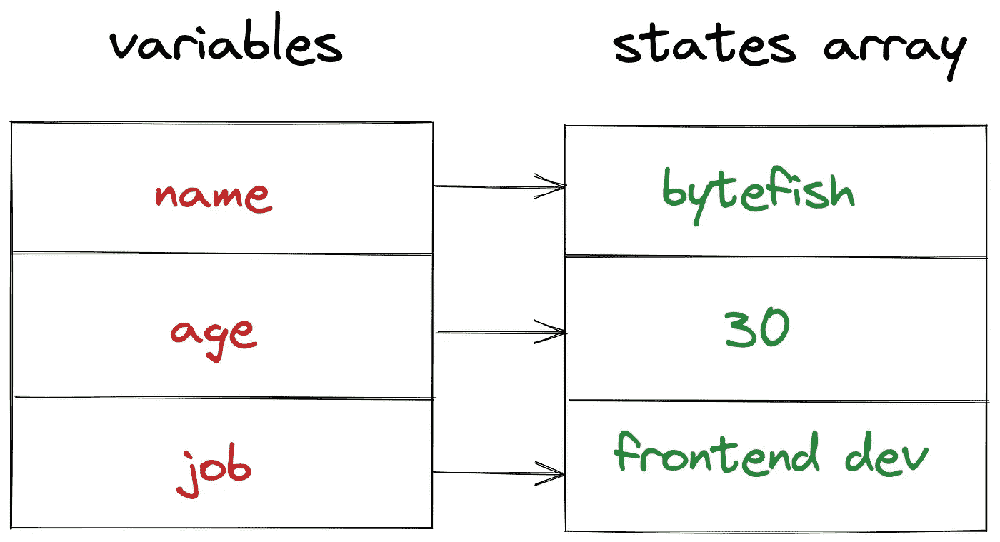
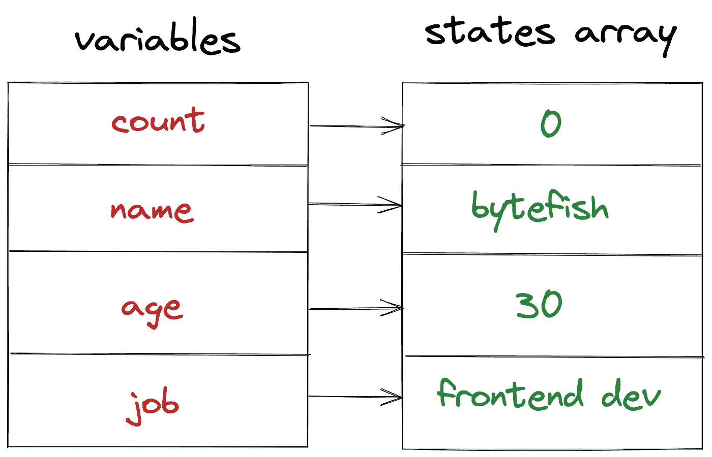
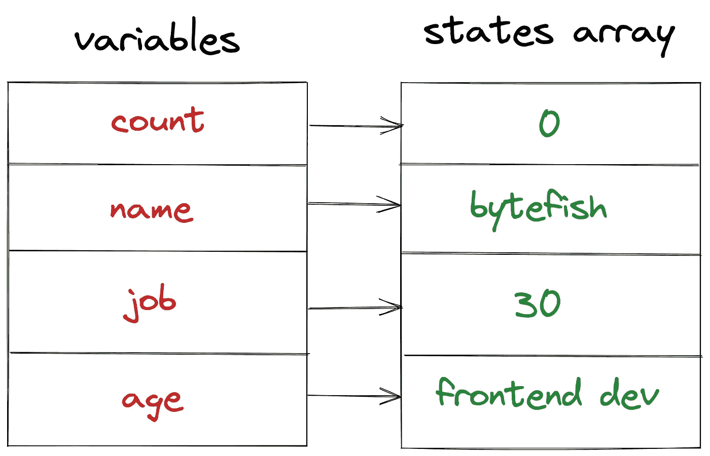
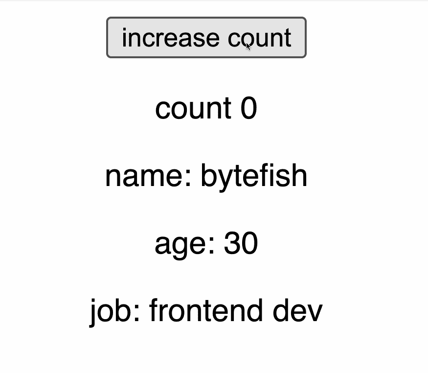
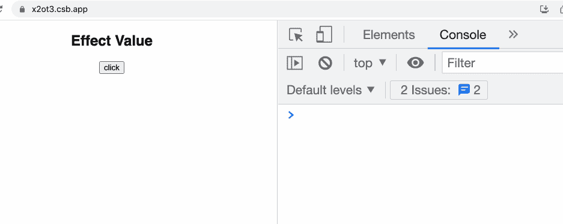
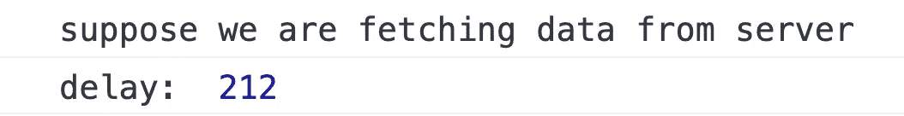

# React Hooks 的不雅部分

> 原文：<https://betterprogramming.pub/the-inelegant-part-of-react-hooks-d83a3052a8b>

## 如果你真的喜欢它，你应该理解它的缺点。


自从 React 16.8 版本正式发布钩子之后，React 钩子在 React 生态系统中迅速流行起来。它解决了 Mixins 问题，并与功能组件和纤程架构实现了近乎完美的结合。

但是世界上没有十全十美的东西。无论你多么喜欢一个工具，你都必须了解这个工具的不足之处，以便更好地使用它。社区里已经有成吨的文章在赞美 React Hooks，我不需要重复了。在这里，我将是坏人，谈论反应钩的不雅设计。

# 不雅的命名规则

先说一个简单的小问题，就是 React 要求我们在命名钩子的时候以`use`开头。

总的来说，这个要求是合理的，并且使得在我们的代码中区分钩子和普通函数更加容易。但在某些情况下会导致奇怪的命名，比如`useAddToCart`、`useFetchPosts`，不符合语法规则，读起来怪怪的。

# 挂钩调用顺序的限制

在官方文档的钩子规则部分，我们被要求遵循这个规则:

> 只调用顶层的钩子。不要在循环、条件或嵌套函数中调用钩子。

这意味着我们可以编写这样的代码:

```
const [name, setName] = useState('bytefish')
const [age, setAge] = useState(30);
const [job, setJob] = useState('frontend dev');
```

但是我们不应该这样写代码:

```
const [name, setName] = useState('bytefish')if(Math.random() > 0.5){
  const [age, setAge] = useState(30);
  const [job, setJob] = useState('frontend dev');
}
```

## 它为什么会有这个规律？

因为 React 在源代码中使用一个数组来存储组件的状态，并且每次组件被重新渲染时，它都按顺序读取这个数组。

如果`useState`在不同的重渲染中调用顺序不同，会导致变量和状态的不正确匹配。

通常，每次制作渲染器时，变量和状态都是这样匹配的。



但是如果你像这样写代码:

然后，在第一个渲染中，变量和状态如下所示:



第二次渲染时，由于判断语句的存在，变量的顺序发生了变化，但状态没有变化。



然后错误发生了:



现场演示:

## 不雅部分

我说这个设计丑，主要是因为规则不直观。写 JavaScript 的时候，可以按照自己喜欢的任何顺序声明变量和赋值，不会影响最终结果。

```
let age;
let job;if (Math.random() > 0.5) {
  age = 30
  job = 'frontend dev'
} else {
  job = 'frontend dev'
  age = 30;
}// it's ok
```

但是在 React 钩子中，突然要求我们按照固定的顺序调用钩子。

假设你去一个国家旅行，突然被当地警察逮捕。原因是:根据当地法律，人们不应该用左脚离开房子，而是用右脚。你因为先把左脚伸出门外而被捕。

你会惊讶吗？如果当地法律不允许偷窃和抢劫，那么我们都可以理解，这是理所当然的。但是你能接受因为左脚踏出去而被逮捕吗？

回到我们的问题。由于自身的设计缺陷，React Hook 使得用户不得不依靠自己的经验来遵守这个奇怪的规则。

当然，你可以使用类似`eslint-plugin-react-hooks`这样的检查工具，但那终究没有解决底层问题。

最理想的 API 应该是开发人员认知负担最小的。比如数学相关的函数，无论开发者调用什么环境，层次有多深，调用顺序是什么样的，只要参数符合要求，都可以正常工作。

> React 钩子已经失去了这种简单的美感。

# 混淆使用效果

useEffect 的传统写法是这样的:

```
const [value] =  useState(0)React.useEffect(() => { console.log("effect happen")}, [value])
```

每次`value`变化都会触发此效果。

但是如果我这样写呢？

```
function App(){ React.useEffect(() => { console.log("effect happen") }, [Date.now()]) return <div>...</div>
}
```

你觉得这个效果什么时候会触发？我们知道时间总是在变化的，每次调用`Date.now()`的返回值总是不同的。那么效果发生多少次会打印在控制台里呢？

答案是曾经。该效果在组件第一次渲染时触发一次，之后不会再触发。

但是如果你简单地把这个组件修改成这样:

你会发现，每点击一次按钮，上面的效果就会被触发一次。



现场演示:

为什么会这样呢？这里其实有一个潜规则:只有组件被重新渲染，才有可能触发效果。

在第一段代码中，初始渲染后不会触发重新渲染，因此效果不会再次触发。

在第二段代码中，如果我们点击按钮，`count`会发生变化，会触发重新渲染，然后 React 会发现`Date.now()`的返回值发生了变化，就会触发这个效果。

但是让我们看看这两段代码。其实`useEffect`本身并没有被修改。唯一改变的是这个组件中是否存在另一个状态，但其行为不同。

这种行为实际上很不自然:

*   首先，`useEffect`的`deps`参数允许我们在语法层面不使用 state。但是当我们用普通变量作为它的`deps`时，它不能及时感知因变量的变化。
*   然后，当`useEffect`的主体保持不变，而我们只是改变了`count`，却触发了效果。

我觉得这个设计很矛盾，很混乱。

另一个例子:

这里第二个效果不依赖于变量`a`，但是`a`的变化会导致第二个效果触发。虽然我们之前解释过这种行为，但是怎么说呢，还是显得有点奇怪。

可以从之前的 CodeSanbox 获得现场演示。

# 使用效果和组件安装

假设我们想在组件创建后向服务器请求一次数据，应该如何编写代码？

最直接的写法是这样的:

```
const [data, setData] = useState(null)

function fetchData(){
  console.log('suppose we are fetching data from server')
  setData({
    data: 'data from sever'
  })
}

fetchData()
```

但是组件一直在重新渲染，所以这个函数会重复执行。为了避免这种情况，我们可以使用`useEffect`。

```
*useEffect*(() => {
  fetchData()
}, [])
```

但是问题又来了。这样写的话，效果的触发时机类似于 componentDidMount，会在组件挂载后执行。

但是如果组件渲染结构复杂，层次太深，DidMount 会很晚，导致请求发送的很晚。

示例:

在我的测试中，效果等待了 200 毫秒才开始执行。



在一些渲染逻辑复杂的项目中，延迟会更长。

这个问题的一个解决方案是使用`useRef`:

这样，可以快速发送请求，而不会导致重复调用的问题。

事实上，我们最初的目的很简单:在组件创建后立即向服务器请求数据，但是您发现编写起来很不舒服。

useEffect，字面意思是当一个效果出现的时候就会被执行。同时，它可以依赖于某些状态，并在这些状态改变后被触发。看来我们可以用`useEffect`作为状态监视器。但是在这里我们发现了它的另一种机制:当组件被挂载时，它将被触发一次。

状态的改变和组件生命周期应该是两回事，但是 useEffect 把这两个概念结合在了一起。这种设计也容易产生混乱。

# 最后的

这篇文章没有任何反对 React 钩子的意思。React 挂钩有很多很棒的设计。事实上，我仍然在我的项目中大量使用钩子。

只是想和大家探讨一下 Hooks 中的一些问题，让大家更合理的使用。