# SwiftUI 中状态属性的内部工作方式

> 原文：<https://betterprogramming.pub/the-inner-workings-of-state-properties-in-swiftui-8409ef39a7bd>

## 这不是魔法——尽管看起来是

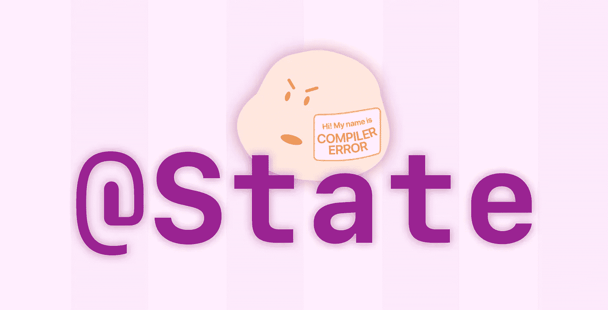

嘿！澄清一下，这篇文章是关于`@State`属性(SwiftUI 特有的)而不是状态的[一般概念。它们是相关的，但是状态本身只是一个想法，而`@State`属性是一个实际的、可见的、有形的对象。它也非常通用，几乎像魔术一样…](https://medium.com/macoclock/what-is-state-in-swift-8d6a7c51d95b)

# 背景

如果您一直在使用 SwiftUI，那么很可能您曾经创建了一个属性，并试图更改它的值，却得到了这个奇怪的错误:“不能给属性赋值:‘self’是不可变的。”

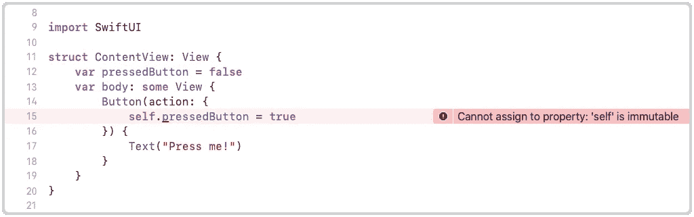

嗯……‘自我’是不可改变的？

上面，`pressedButton`是一个`var`，所以它的值是 mutable(可变的)——但是错误消息说“自我”是不可变的！

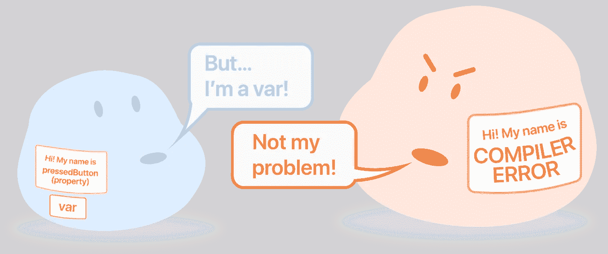

所以`pressedButton`是可变的，而`self`不是？让我们查找错误信息。

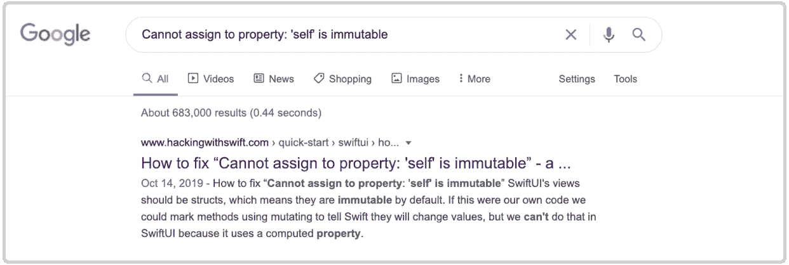[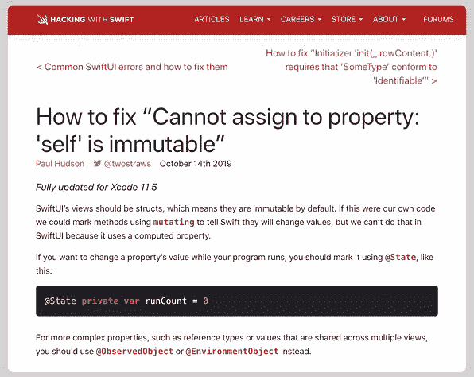](https://www.hackingwithswift.com/quick-start/swiftui/how-to-fix-cannot-assign-to-property-self-is-immutable)

用 Swift 进行黑客攻击告诉我们“如果你想在程序运行时改变一个属性的值，你应该用`@State`来标记它。”好吧，让我们看看它是否有效…

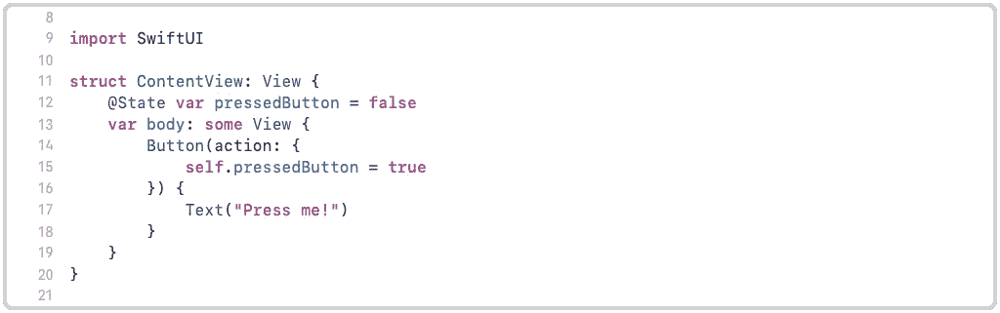

在变量前加上` @ State 可以了！

这很容易解决！但是它是如何摆脱“`self`不可变”的错误的——它使`self`可变了吗？

答案比我预想的要有趣得多(也复杂得多，唉)。就在上周，我还以为`@State`属性是专门用来链接 UI 元素的——就像这样:

在这里，圆角矩形访问`@State var rectangleIsGreen`并在属性值改变时自动更新:

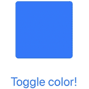

所以`@State`属性用于与 UI 同步…但是这与修复“`self`不可变”错误有什么关系呢？`@State`是某种万能魔粉吗？不完全是…

# 研究

看起来`@State`属性可以做两件事:

1.  修复一个错误:“无法分配给属性:`self`是不可变的。”
2.  与 UI 同步并自动更新。

这越来越令人困惑，所以让我们做一些研究！

## 能力#1 |修复一个错误:“不能给属性赋值:‘self’是不可变的”

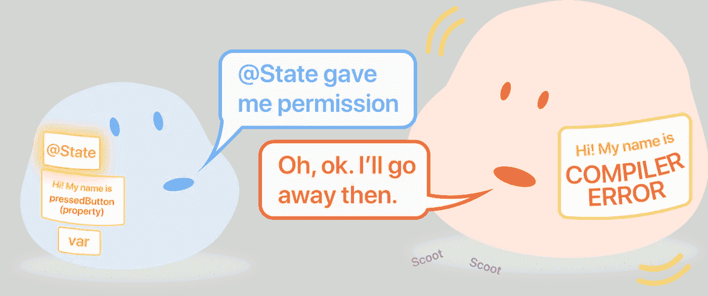

记住，Hacking With Swift 说“如果你想在你的程序运行时改变一个属性的值，你应该用`State`来标记它。”好了，让我们[回到教程](https://www.hackingwithswift.com/quick-start/swiftui/how-to-fix-cannot-assign-to-property-self-is-immutable)读解释:

> “SwiftUI 的视图应该是 structs，这意味着它们在默认情况下是不可变的。如果这是我们自己的代码，我们可以使用`mutating`标记方法，告诉 Swift 它们将更改值，但我们不能在 SwiftUI 中这样做，因为它使用计算属性。”

当然，有道理…有点。这里有一个总结:

*   SwiftUI 视图是结构
*   默认情况下，结构是不可变的(所以里面的值也是不可变的)
*   标有`mutating`的方法(函数)可以改变属性值
*   但是这在 SwiftUI 中是不允许的，因为它使用了一个计算属性

这提供了相当多的信息，我们现在知道错误在某种程度上与结构有关——但是我们仍然不知道*为什么用`@State`标记属性会修复错误。在我们深入研究之前，让我们看看`@State`的其他能力。*

## 能力 2 |与用户界面同步并自动更新


如何用`@State`属性同步 UI 的部分内容在几乎所有 SwiftUI 教程中都有涉及，比如这篇。我们去看看。

[](https://www.hackingwithswift.com/quick-start/swiftui/working-with-state) [## 与国家合作

### Paul Hudson @twostraws 针对 Xcode 11.5 全面更新，所有应用都会改变状态。例如，用户可能已经点击了…

www.hackingwithswift.com](https://www.hackingwithswift.com/quick-start/swiftui/working-with-state) 

我们要找的东西在第三段(在上面的教程中)…

> “…如果我们在[properties]之前添加了特殊的`@State`属性，SwiftUI 将自动监视更改并更新使用该状态的视图的任何部分。”

就像在普通的 UIKit 编程中一样，为了*使用那个状态，*也就是访问属性的值(在本例中是一个布尔值)，只需引用属性的名称:

```
struct ContentView: View {
@State var **rectangleIsGreen** = false
    var body: some View {
        RoundedRectangle(cornerRadius: 5)
        .fill(**rectangleIsGreen** ? Color.green : Color.blue)
    }
}
```

这里我们使用[三元运算符](https://www.hackingwithswift.com/sixty/3/7/the-ternary-operator)根据`**rectangleIsGreen**`属性的值确定矩形的颜色。我们可以这样改变它:

```
**rectangleIsGreen** = true
```

等等——这听起来很熟悉。难道我们的“`self`是不可变的”错误不是在我们试图改变一个属性值时发生，并在我们用`@State`标记它时消失吗？有趣的是——在`@State`中一定有什么东西允许结构可变或者不可变。事实证明，在`@State`中有很多有待发现的东西。让我们潜得更深！

# 深潜水

## 实验:保持[干燥](https://dzone.com/articles/is-your-code-dry-or-wet)

让我们从这段代码开始:

在上面的代码片段中，我们在一个`HStack`中有两个圆角矩形和一个按钮。它们与`@State`属性`rectangleIsGreen`同步。目前，我们与“不要重复你自己”(干)正好相反:我们不是干，而是把所有事情都写两遍(湿)🤣。不管怎样，结果是这样的:

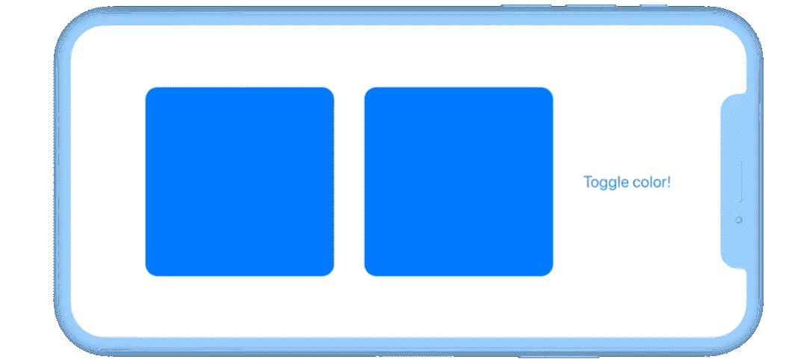

但是不管我们是干的还是湿的，把你的代码分解成更小的组件总是一个好主意——它变得可重用和更容易阅读。

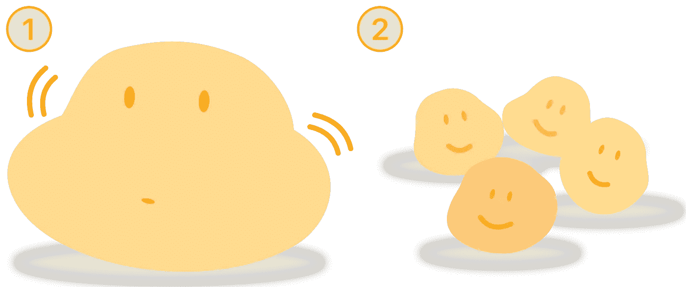

假设我们想要将圆角矩形的代码从我们原来的`ContentView`移动到它自己的结构中，我们称之为`ColorView`(同样，SwiftUI 视图应该总是结构)。

圆角矩形在其自身的结构中仍然需要与来自`ContentView.`的`**rectangleIsGreen**`的值同步，但是如果我们简单地将它的引用从`ContentView`向下传递到`ColorView`，这将违反苹果的规则—[官方文档](https://developer.apple.com/documentation/swiftui/state)说:

> 您应该只从视图主体内部访问状态属性…将您的状态属性声明为私有，以防止视图的客户端访问它

这意味着，在我们的例子中，`**rectangleIsGreen**` 不应该从`ColorView`访问。但是我们*需要*才能访问！嗯…

从子结构(在本例中是`ColorView`)访问父属性的值的正确方法是创建一个双向连接。我们可以用相同的值同步两个独立的属性，每个结构一个——通过在`ColorView`中添加一个`@Binding`属性。

`ContentView` *中的`@State`属性和*`@Binding`属性会指向同一个值，双方都可以读写。

等等，什么？`@Binding`？我们甚至没有报道完`@State`！尽管如此，不要担心— `@Binding`非常容易理解！不过，让我们先写下`ColorView`的代码。

1.  创建一个名为`ColorView`的新结构。
2.  在`ColorView`内部，添加圆角矩形的代码。
3.  然后，再次在`ColorView`中，创建一个名为`**colorRectangleIsGreen**`的`@Binding`属性(名称并不重要，可以与`ContentView`中的`**rectangleIsGreen**`属性相同，但是我在其中添加了`color`，以便于区分)。

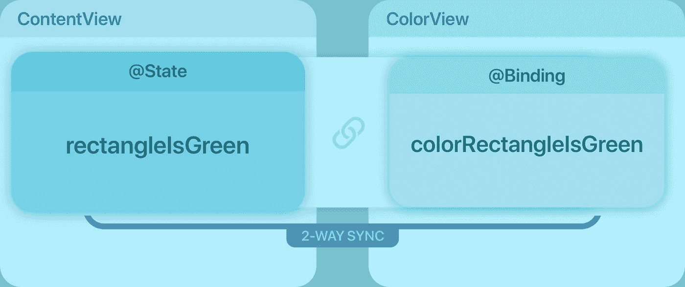

双向连接！在“ContentView”内部，通过“rectangleIsGreen”访问该值。在“ColorView”内部，通过“colorRectangleIsGreen”访问该值。

只要我们提供类型(在这种情况下，是一个布尔值)，属性`@Binding`就不需要默认值——结构自动拥有[隐式初始化器](https://docs.swift.org/swift-book/LanguageGuide/Initialization.html#ID214)。

`ColorView`的代码现在应该是这样的:

现在我们已经完成了圆角矩形的构造，回到`ContentView`，我们可以…

1.  删除两个圆角矩形的代码。
2.  用两个初始化的`ColorView`替换它们。

删除很容易，所以先删除圆角矩形。

但是，我们如何实例化`ColorView` s 呢？我们需要指定`rectangleIsGreen`应该与`colorRectangleIsGreen`同步。让我们尝试使用 Xcode 的自动完成功能，看看我们需要什么。

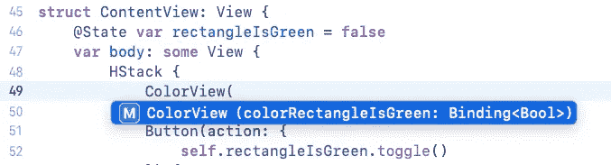

啊哈！所以看起来`ColorView`期望一个`Binding<Bool>`作为它的`colorRectangleIsGreen`属性。现在唯一能填空的一定是`@State`属性，也就是`rectangleIsGreen`。我们试试吧！

但是等等…有一个错误。

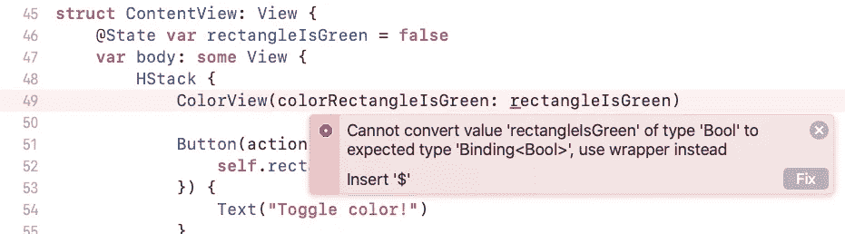

错误显示`rectangleIsGreen`是一个`Bool`而不是一个`Binding<Bool>`。然而，编译器提供了一个修复方法:只需添加`$`。好吧…

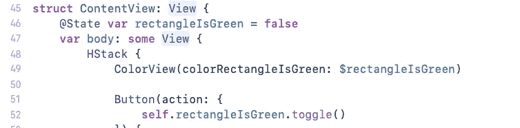

所以…成功了！但是什么是`$`？

简而言之:这是一个自动生成的属性。在 SwiftUI 中，标有`@State`(或`@Binding` …我将在本文末尾解释)的属性不仅仅是一个属性。**是三个属性！**

什么？三处房产？！

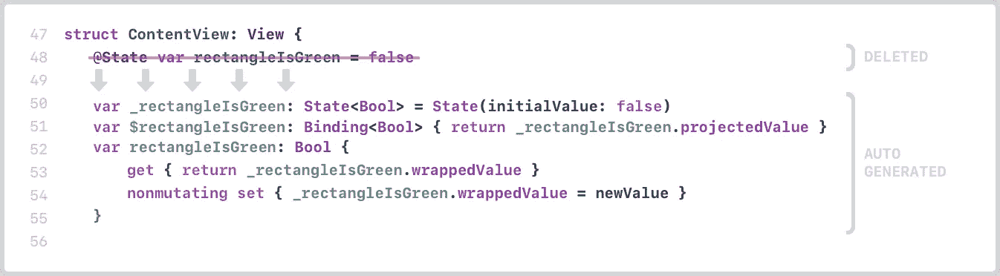

基本上，当我们第一次写下`rectangleIsGreen`属性时，Xcode 的编译器[自动将](https://nalexn.github.io/stranger-things-swiftui-state/) *翻译成*三个属性。它们是不可见的(包含在@State 中，这是一个[属性包装器](https://github.com/apple/swift-evolution/blob/master/proposals/0258-property-wrappers.md#projections))——你看不到它们，但是当你引用它们时它们会工作。然后，Xcode 删除了原来的`rectangleIsGreen` `@State`属性——但是你还是可以看到。

好的…这是很多信息。我将单独解释每个属性。先说第一个。

## `1\. '_rectangleIsGreen'`

基本上，这就是`@State`属性本身。如你所见，它的初始值是我们第一次输入的值— `false`。

其他自动生成的属性将从该属性中获取它们的值，因为该属性包括:

*   `wrappedValue`，这是布尔值
*   `projectedValue`，即`Binding`值，用于与其他视图同步……听起来很熟悉。

此外，如果您需要手动编写初始化块，您可以使用该属性，在 Swift Playgrounds 中，您有时需要这样做。

```
@State **var** rectangleIsGreen: Bool**init**(rectangleIsGreen: State<Bool>) {
  **self**.**_**rectangleIsGreen = rectangleIsGreen
}
```

## `2\. '$rectangleIsGreen'`

看到{}s 了吗？这意味着这是一个计算属性，这也意味着它*计算*它将返回的值。

但是等等...计算的属性不需要一个`get`(用于返回值)，有时还需要一个`set`(用于修改其他属性)吗？

```
var computedProperty: Bool {
  get { return true } // set is optional
}
```

是的，但是`set`是可选的——如果你没有它，你可以完全省略`get`。

```
var computedProperty: Bool { // anything inside here is the get!
  return true
}
```

你甚至可以不写`return`而让它变得更快(或者更懒……我想我更喜欢更快)。

```
var computedProperty: Bool {
  true
}
```

总之，`$rectangleIsGreen`得到了`_rectangleIsGreen`的`projectedValue`并返回它。同样，`projectedValue`是用于同步视图的。这就是为什么我们在初始化`ColorView`时必须使用`$rectangleIsGreen`而不是`rectangleIsGreen`。啊哈！

## `3\. 'rectangleIsGreen'`

这似乎是最简单的属性，因为它前面没有下划线或美元符号…但实际上在它下面有一些逻辑。看到`get`和`set`了吗？这意味着它也是一个计算属性！

*   当您`get`属性(引用它)时，它返回的值是`_rectangleIsGreen`的包装值。记住，`_rectangleIsGreen`是`@State`属性本身，包含了`wrappedValue`和`projectedValue`。在这里，我们想要的是`wrappedValue`，它是一个简单的布尔值。
*   当你`set`属性时，它也需要更新`@State`属性，也就是`_rectangleIsGreen`。`newValue`是 Swift 中的一个专业关键词，简单来说就是新价值。

等等……但是什么是`nonmutating`？还有为什么只有`set`前面有`nonmutating`？

这就是`@State`修复“`self`不可变”错误的方法。

# 移动到身体上

记得 Hacking With Swift 说过:

> “如果这是我们自己的代码，我们可以使用`*mutating*`标记方法，告诉 Swift 它们将改变值，但我们不能在 SwiftUI 中这样做，因为它使用计算属性。”

好的…另外，记住计算属性是在返回值之前做一些计算的属性？好吧，仔细看看`body`——它看起来像一个计算属性吗？

```
**var** body: **some** View {
  ...
}
```

答:是的，`body`是一个计算属性。它没有一个`return`语句，但是花括号{}给出了它。尽管您看不到`get`或`set`，但您知道花括号中的内容是`get`(因为计算属性必须总是有一个`get`)。

在 Swift 中，在一个结构的计算属性中，你不能改变其他属性。这就是为什么我们得到了“`self`是不可变的”错误，因为我们试图在`body`内部变异`pressedButton`(在第一个例子中)。

但是为什么呢？在 Swift 中，结构是值类型。这意味着无论何时你改变一个结构，它实际上并没有改变——它只是用你的改变创建了一个新的结构并替换了旧的结构。

这就是为什么如果你想改变一个结构或者它的一个属性，你需要用`var`来声明它。

```
var contentView = ContentView()
```

然而，当你创建一个结构时，编译器不知道它是用`var`还是`let`来声明。如果它是用`let`声明的，那么该结构中的函数或计算属性将不能改变同一结构中的其他属性。

这就是为什么你必须用`mutating`来标记它们，这样编译器就知道你要从内部进行修改，并防止你在以后将`struct`声明为`let`。

因此，为了避免错误而不使用`@State`，我们可以将`mutating`关键字添加到`body`的`get`中，如下所示:

```
**var** body: **some** View {
  mutating get {
    ...
  }
}
```

但是……因为`ContentView`需要符合`View`，所以不行——swift ui 的`View`不允许`get`变异。

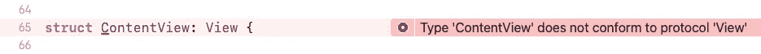

即使 SwiftUI 允许，我们也不希望将自己局限于将`ContentView`作为一个变量——记住，因为我们添加了`mutating`属性，编译器会阻止我们将`ContentView`声明为`let`。这可能会限制您的代码。


“按下按钮”示例—用“let”声明

但是有了`@State`，你*可以*用`let`声明一个 struct。什么？怎么会？这里再次出现了`nonmutating`属性。那是`@State`不那么秘密的酱。

让我们再来看看编译器生成的`rectangleIsGreen`属性。

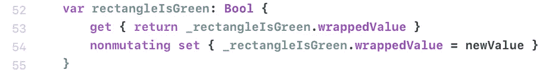

默认情况下，在 computed properties 中，`get`是`nonmutating`而`set`是`mutating` …但是如果你让`set` `nonmutating`，你告诉编译器这个*不会让*改变它所在的结构。让我们回到`pressedButton`的例子，在那里使用`nonmutating`:

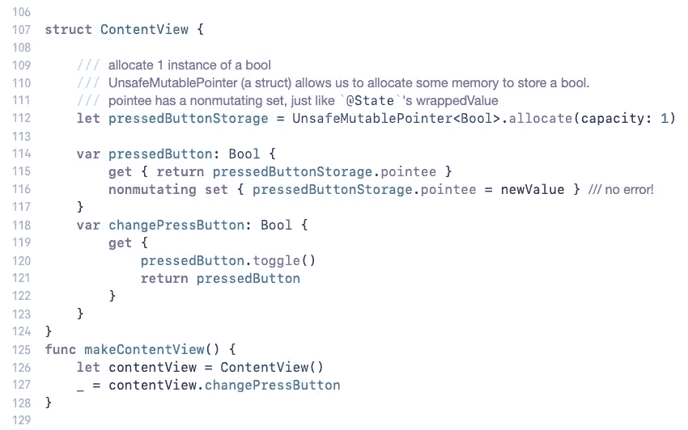

改编自 Rob Mayoff 的回答[此处](https://forums.swift.org/t/why-i-can-mutate-state-var-how-does-state-property-wrapper-work-inside/27209/2)。这将会泄漏内存，但这只是一个例子。

这里，我们没有改变`ContentView`——我们只是修改了`pressedButtonStorage`的一个属性，它是一个`let`。

所以我们设法从一个存储属性中改变了另一个属性的值，有效地解决了我们最初的问题！

然而，上面的代码很难管理。顾名思义，`UnsafeMutablePointer`是不安全的……我们需要注意手动存储和释放内存。它花了大约 10 行代码，而`@State`只是在属性前添加了六个字符！

```
**@State** var pressedButton = false
↑↑↑↑↑↑ *6 characters!*
```

# 干燥实验

既然我们已经把一切都整理好了，我们就可以完成我们的干燥实验了。下面是最终代码！

还有最后一件事:`@Binding`。还记得我说过标有`@State` *或* `@Binding` 的属性会自动生成三个属性吗？

`@State`和`@Binding`的唯一区别是`@Binding`需要有一个父节点。那个家长可以是`@Binding`或者`@State`——没关系。

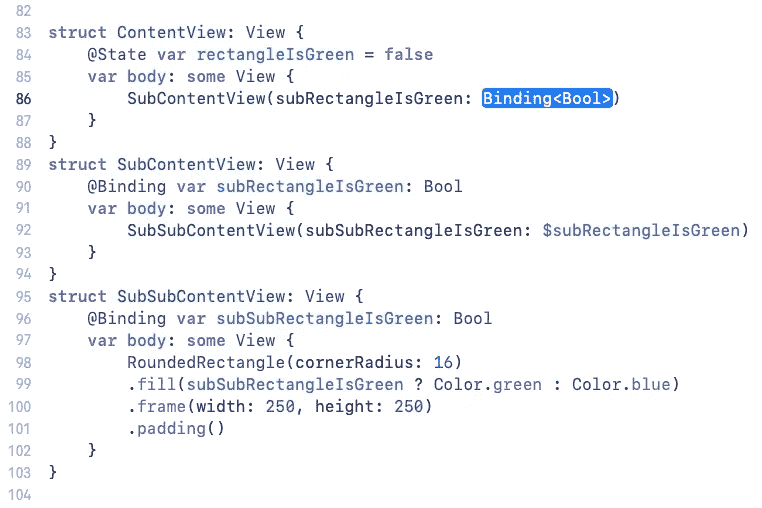

我们可以拥有尽可能多的子结构，全部同步在一起，但是我们需要从某个地方获得初始的`Binding<Bool>`

*   从`@State var rectangleIsGreen`属性内部
*   从`@State var rectangleIsGreen`属性的自动生成的`_rectangleIsGreen`属性内部
*   从`@State var rectangleIsGreen`属性自动生成的`_rectangleIsGreen`属性的`projectedValue`属性中。

感谢阅读！

# 资源

[](https://forums.swift.org/t/why-i-can-mutate-state-var-how-does-state-property-wrapper-work-inside/27209) [## 为什么我可以变异@State var？@State 属性包装器内部是如何工作的？

### 变异常规成员变量获取错误:“无法分配给属性:“self”是不可变的”“无法在…上使用变异成员

forums.swift.org](https://forums.swift.org/t/why-i-can-mutate-state-var-how-does-state-property-wrapper-work-inside/27209) [](https://nalexn.github.io/stranger-things-swiftui-state/) [## 斯威夫图伊州的怪事

### 像许多其他开发人员一样，我从苹果的精彩教程开始了对 SwiftUI 的实际了解，该教程…

nalexn.github.io](https://nalexn.github.io/stranger-things-swiftui-state/)  [## 如何修复“无法分配给属性:“self”是不可变的”

### Paul Hudson @twostraws 针对 Xcode 11.5 全面更新 SwiftUI 的视图应该是 structs，也就是说它们是不可变的…

www.hackingwithswift.com](https://www.hackingwithswift.com/quick-start/swiftui/how-to-fix-cannot-assign-to-property-self-is-immutable)