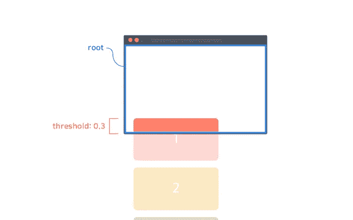

# 了解 IntersectionObserver API

> 原文：<https://betterprogramming.pub/the-intersectionobserver-b19fca5a194e>

## 这远没有听起来那么可怕，我会告诉你的

路口观察者是如何工作的

IntersectionObserver 是所有主流浏览器都支持的浏览器 API。它有一个有点吓人的名字和一个有点混乱的 API。但这不应该阻止我们使用它，因为它为我们提供了一些非常酷的功能。

通常，这个 API 非常适合:

*   懒惰的东西
*   跟踪元素的视图内度量
*   无限卷轴

简而言之，API 可以帮助确定一个 HTML 元素是否与另一个元素相交，或者更常见的是，一个元素是否与视口相交。

从高层次来看，API 需要 3 样东西

1.  HTML 元素
2.  配置对象
3.  回调函数

由于这个 API 有点奇怪，我写了一个小包装器来帮助使用这个 API

IntersectionObserver API 的包装器

现在我不打算深入讨论参数的细节，因为它们在[这里](https://developer.chrome.com/blog/intersectionobserver/)有详细描述

我将使用一个简单的例子，它包含一个 id 为`target`的 HTML 元素和一些配置，这些配置将在该元素与视窗“相交”时执行回调函数。

使用上述包装器的方式如下所示

有了这两个部分，我们可以快速地组装一个可以使用这个功能的演示

StackBlitz 示例

上面的例子只是将一些内容打印到控制台并修改一些文本。但是如果你开始围绕这个模式构建更多的逻辑，你可以开始延迟加载你的一些代码或图像(尽管``可能很快会得到广泛的支持)

您可以使用上面的方法进行内部跟踪，来计算有多少人滚动到了您页面上的某一点。

在我的专业工作中，我们使用上面的方法来检测元素何时进入视口，并刷新它(外部资源),如果自上次刷新以来已经超过 30 秒。

只要有可能，我总是喜欢使用浏览器 API，因为它让我免去了很多考虑边缘情况的麻烦。

保持懒惰！