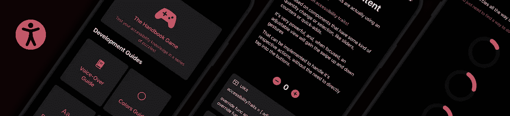
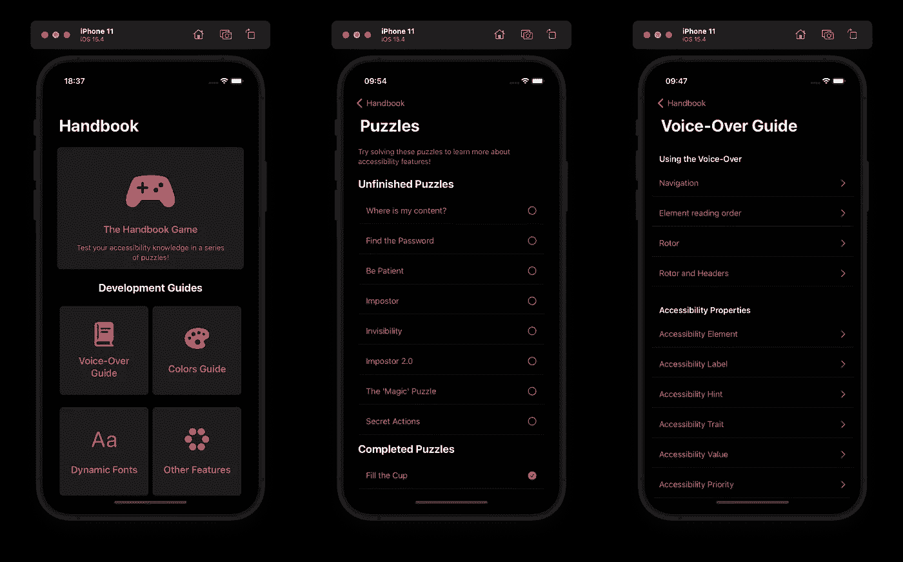
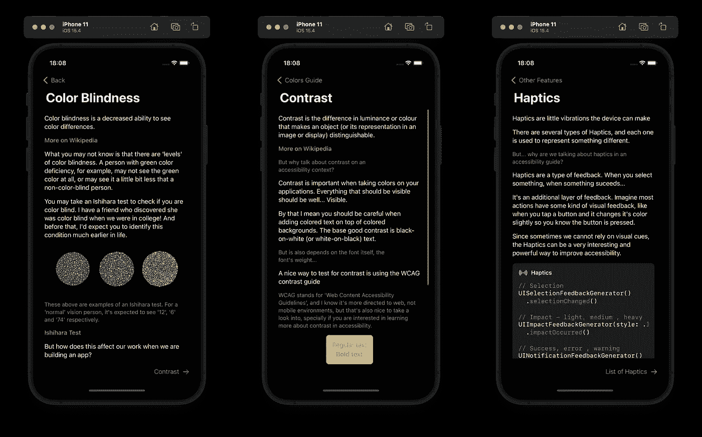
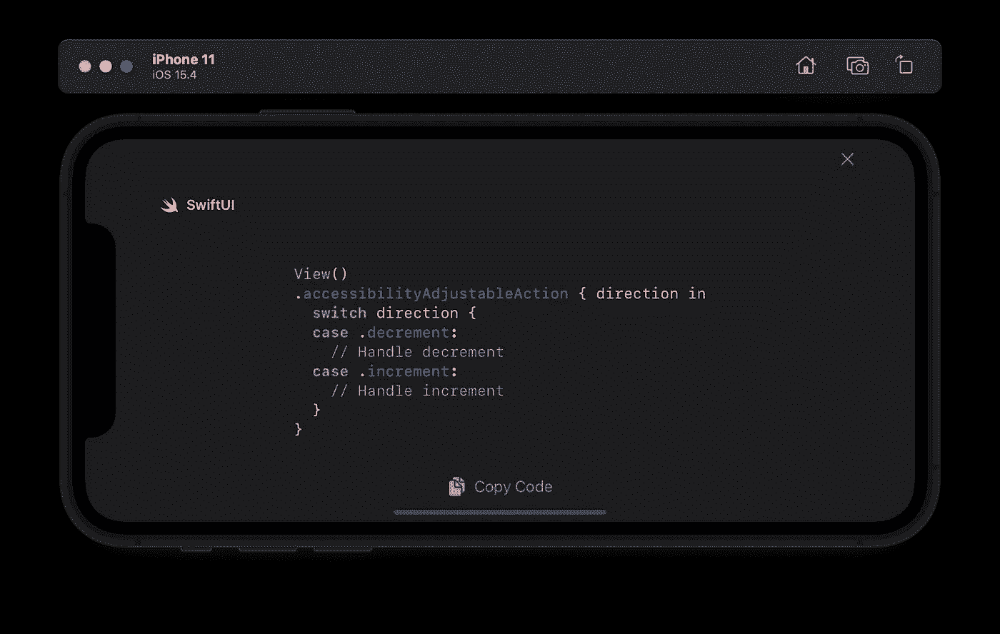
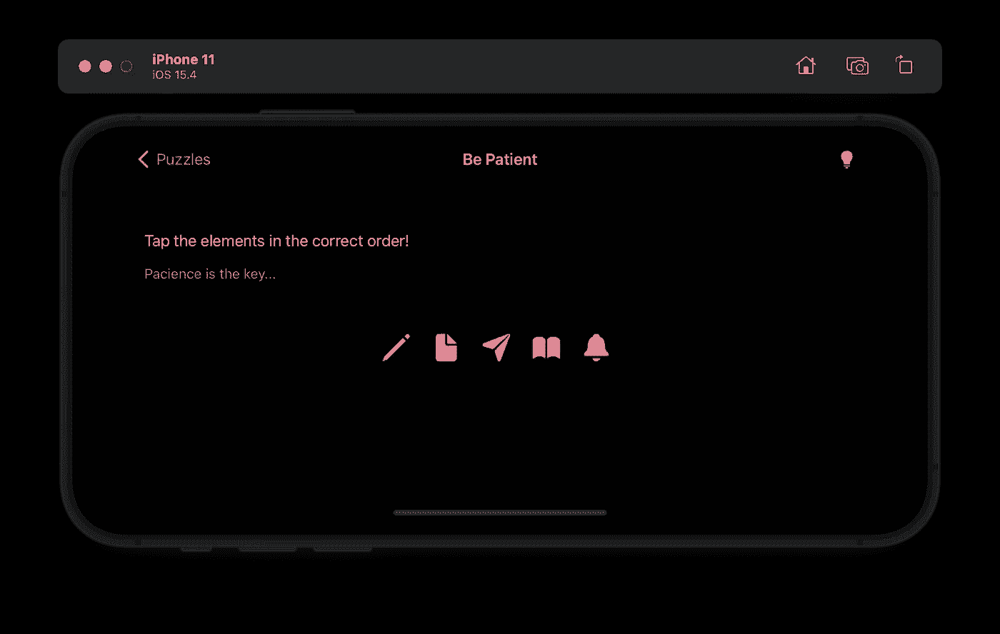

# iOS 可访问性手册

> 原文：<https://betterprogramming.pub/the-ios-accessibility-handbook-17e7be2701d0>

## 制作一个可访问性指南，您可以在学习的同时测试其功能

如果你在这里，我相信你有兴趣了解更多关于 iOS 可访问性的知识。也许你有兴趣实现它们以获得一个更易访问的应用程序，或者更好地理解一个可访问性选项在 iOS 中被启用时的行为。

但是我总是发现要找到所有这些东西有点困难。你需要事先知道你在找什么，这样你才能找到这些内容。简单地在网上阅读并不能让你自己测试它是如何工作的。

所以，我决定做一个向导。一些简单的东西，可以把你能在 iOS 上找到的所有辅助功能和选项结合起来，还有例子和实现指南。

这就是为什么我写了这本无障碍手册。

# 在应用程序中创建指南

我们正在讨论 iOS 的可访问性，所以，没有什么比使用相同的系统将指南带入生活更好的了，对吗？

主屏幕和谜题索引以及**辅助功能手册**上的画外音指南。

## 它是如何工作的？

对我来说，学习 iOS 可访问性最令人沮丧的部分是在网上找到内容，但不太确定当我在实际设备上使用它们时，这些变化会如何表现。

*如果我这样实现它，会发生什么？
什么是自定义动作？
当我打开增强对比度时会发生什么？*

因此，该手册试图填补这一空白。不仅要描述该特性，而且要成为该特性实现时的一个活生生的例子，这样你就可以马上自己尝试了！

## 超越画外音

大多数时候，当我们谈论 iOS 和移动辅助功能时，我们往往只关注屏幕阅读器。

这不是一个问题，通常，它们是在实现新布局时需要更多考虑的事情。但是可访问性并不止于此，在实现或设计应用程序时，您应该考虑整个领域的事情。

**辅助功能手册**中不关注 VoiceOver 的内容和实现示例。

这是我想做的另一件事:传播关于其他辅助功能的知识和意识。也许它们与实现没有直接关系，也许这是你在设计应用程序时应该考虑的事情，但我相信更好地了解它们，知道它们的存在是很重要的。

## UIKit、SwiftUI 和开源

如果没有如何实现一切的代码示例，iOS 可访问性指南将是不完整的。

所以，我在所有的特性中添加了代码示例，包括 **UIKit** 和 **SwiftUI** 。我知道大多数拥有原生应用的公司仍然在使用 **UIKit** 或者正在迁移到 **SwiftUI、**所以了解这两个框架之间的区别并学习如何在实施过程中发现问题是很重要的。

可访问性可调操作的代码示例。[在这里找到示例代码](https://github.com/giovaninppc/AccessibilityHandbook/blob/main/Accessibility%20Handbook/Book/VoiceOverGuide/Interaction/Pages/AdjustablePage.swift)。

但是我们走得更远:整个项目都是开源的。您可以找到每个页面和每个示例的真实实现，还可以通过为应用程序带来新的想法和示例来扩展内容。

 [## GitHub -可访问性手册:iOS 可访问性指南

### 用 SwiftUI 编写的 iOS 可访问性指南，包含 SwiftUI 和 UIKit 中的示例，以及一个帮助学习的益智游戏…

github.com](https://github.com/giovaninppc/AccessibilityHandbook) 

# 边玩边学

老实说，阅读实现文档和指南有点无聊。我试图找到一种更有趣的方式来学习 iOS 的可访问性。所以，我想出了**游戏手册**:一系列需要一些辅助功能或选项来解决的谜题。

**无障碍手册**上的一个谜题示例。使用 VoiceOver 时，元素上的辅助功能提示会告诉您轻按图标的正确顺序。没有它，就不可能找到正确的顺序。

这个想法并不难，挑战本身就是找到如何启用正确的可访问性选项，或者如何使用它们进行导航。这有两个主要目的:

*   帮助发现新的辅助功能和选项；
*   通过模拟这些特征有用的情况来创造同理心；

第一个**很棒，我已经谈了一点，我认为很难一次找到很多关于可访问性主题的例子和文档。**

但是第二个更好。我正在努力创造那个*‘啊哈！’*解谜时获得的瞬间，结合使用辅助功能选项。通过这种方式，我希望用户在浏览应该如何实现可访问性的例子时，能够更深入地理解可访问性的重要性。

## 一次完整的经历

整个应用程序就是一个例子。从源代码到应用程序运行到示例。

这意味着你可以使用 iOS 上的任何辅助工具，并查看应用程序的行为。让字体变大，增加对比度，打开画外音，降低透明度…

我相信你会找到一个很好的例子，它展示了这些特性和可访问性选项，以及代码示例和源代码。

## 从这里去哪里？

[**无障碍手册**](https://apps.apple.com/us/app/accessibility-handbook/id6443476485) 可在 AppStore 下载。

但是，也一定要检查项目的[源代码](https://github.com/giovaninppc/AccessibilityHandbook)！报告您发现的任何问题，并给出关于功能、内容和实现的建议。我希望它是协作性的，并且随着我们对 iOS 可访问性的了解越来越多，随着我们自己的世界不断扩大，它会不断成长。还有，这么多例子，你可能会从中学到新的东西！

我还有更多关于 iOS 可访问性的媒介、更大的例子、单元测试和你可能甚至不知道的特性:

*   [**iOS 辅助功能反转颜色**](https://giovani-pereira.medium.com/ios-accessibility-invert-colors-ba9aa705add5)
*   [**Ta(l)王者一大步**](https://medium.com/ifood-engineering/ta-l-king-a-big-step-2d260b7179e2)
*   [**测试手势和动作**](https://medium.com/macoclock/testing-gestures-and-actions-8235188434f3)

并且一如既往的保持兴趣。随着操作系统及其辅助功能的发展，新事物将会出现，您了解的越多，您就能更好地识别和解决应用程序中的辅助功能问题。

感谢阅读！