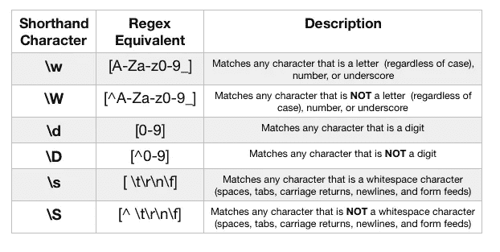

# 正则表达式的乐趣，第 2 部分:字符类

> 原文：<https://betterprogramming.pub/the-joy-of-regular-expressions-part-2-character-classes-5de72d6a58ae>

*关于正则表达式系列的第二篇文章*

照片由 [Artem Sapegin](https://unsplash.com/@sapegin?utm_source=unsplash&utm_medium=referral&utm_content=creditCopyText) 在 [Unsplash](https://unsplash.com/search/photos/javascript?utm_source=unsplash&utm_medium=referral&utm_content=creditCopyText) 拍摄

请注意，如标题所示，这篇文章是一个系列的一部分。[点击这里阅读:正则表达式的快乐，第 1 部分:什么是正则表达式？](https://medium.com/better-programming/the-joy-of-regular-expressions-part-1-what-is-regex-539dc581e282)

如前所述，这是一篇面向 JavaScript 的文章。所有的例子都是使用 JS 中的`.test()`方法完成的。也就是说，这种逻辑可以跨几种语言应用，尽管语法可能略有不同。

要快速搜索这篇文章中的关键词(字符类，`^`插入符号，否定字符类，连字符，速记字符类，单词字符，空白字符，点)，只需使用`CTRL/CMD+ F`函数。

在出现的搜索栏中，键入一个井号`#`，后跟一个术语(不要用空格分隔多于一个单词的术语)。这将直接带您到涵盖该术语的部分，而不必滚动。

一如既往，我强烈推荐并鼓励访问 Jan Goyvaerts 的网站，[regular-expressions . info](https://www.regular-expressions.info/)。它以一种彻底的、实用的格式保存了关于 regex 的信息，并作为程序员进一步探索这一概念的重要资源。

# 入门指南

欢迎回到我关于正则表达式系列的另一篇文章。我们上一次离开是在第 1 部分中，这里介绍了正则表达式的概念，以及与之相关的关键术语和锚的用法。

在那篇文章中，我们简要地提到了字符类，它是正则表达式的一部分，对程序员来说是不可或缺的。

在这篇文章中，我们将深入探讨他们的利用和与角色群体合作的能力。

# 什么是角色类？

如果你没有读过上一篇文章，我们将会更详细地介绍什么是字符类，这样你就可以理解这些工具是如何在正则表达式中使用的，以及为什么。

字符类是一种告诉正则表达式引擎您想要一个组内字符的匹配的方式。

例如，我们可以使用一个简单的字符类，比如`/[aeiou]/`，它将匹配一个单词中的所有元音。

这样，我们就在对发动机说:“在管柱中，匹配 *a* ，或 *e* ，或 *i* ，或 *o* ，或 *u* 。如果不是那些字符中的一个，它就不是匹配的。”

考虑下面的例子:

在这个例子中，我们将字符类缩短为`/[ae]/`，只匹配字符 *a* 或 *e* 。

这适用于像*灰色*和*灰色*这样的字符串，因为其中有一个 *a* 或 *e* 。它对字符串*粉色*无效，因为该字符串不包含 *a* 也不包含 *e.*

# 在字符类中使用连字符可以在一定范围内搜索字符

#连字符，#范围。

虽然搜索元音字母的正则表达式相对较短，但想象一下，在一个字符类中，您希望匹配任何小写字母。

这将创建一个长得几乎难以辨认的正则表达式，看起来有点像`[abcdefghijklmnopqrstuvwxyz]`。这在技术上是可行的，但是不直观，写出来也很痛苦。

相反，我们可以使用一个*连字符*来告诉正则表达式引擎在一个*字符范围*内进行搜索。

例如， `/[a-z]/`将匹配所有小写字母，`/[A-Z]/`将匹配所有大写字母。你甚至可以非常具体，只需要匹配字母表的前五个字母，然后输入`/[a-e]/`就可以了。

至此，我们已经看到了如何使用我们自己的字符来匹配几个不同的字符或一系列字符。但是如果我们想做相反的事情呢？

假设我们要匹配一个辅音——换句话说，任何字母是*而不是* a、e、I、o 或 u。幸运的是，字符类也可以提供排除功能。

# 使用^(插入符号)指定一组不匹配的字符

# `^`插入符号(字符类)，#negatedcharacterclass

当用在字符类的括号中时，`^`(插入符号)表示 regex 引擎匹配除字符类中包含的字符之外的任何字符。

当以这种方式构建字符类时，它被称为*否定字符类。*

回到我们之前的例子，假设我们想要匹配一个辅音。我们可以键入/ `[^aeiou]/`，它将匹配除字符类中的字符之外的任何字符。

下面是更多的例子:

请记住，正则表达式引擎按顺序读取内容。对于第四行和第五行，我们检查“q-不是 U 的任何东西”是否在提供的字符串中

*   在第一行代码中，我们查看字符串中是否有非元音字母的字符。字符串中没有元音，所以我们返回了`true`。
*   在第二行代码中，我们查看字符串`‘64’`中是否存在数字以外的字符。他们没有，所以我们把`false`拿回来了。
*   在第三行代码中，我们查看字符串`‘Nintendo 64’`中是否存在数字以外的字符。这个字符串中有数字，但是我们有大写字符，小写字符，以及一个空白字符在
    这个字符串中，所以`true`被返回。
*   在第四行代码中，我们寻找一个紧随其后的不是字符`u`的`q`。这失败了，因为我们遇到的第一个`q`后面是字符`u`，遇到的第二个`q`后面没有任何内容，因为它是字符串的结尾。因此，我们得到了返回的`false`。
*   在第五行代码中，我们寻找一个紧接着不是字符`u`的`q`。我们看到第一个`q`(在“问题”中)后面跟着一个`u`，所以失败了。我们看下一个`q`，后面跟着一个`?`字符。因为`?`不是一个`u`，所以这个传递，我们得到返回的`true`。

至此，我们已经看到了如何编写字符类来包含和排除某些字符组/范围。

您可能会发现编写一些更常用的字符类既冗长又乏味。然而，有一个解决方案——速记字符类！

# 速记字符类提供了一种编写字符类的简化方法

#单词字符，#空格字符

因为有些字符是常用的，所以有几个快捷键供我们使用，而不是敲出来什么的，比如`[a-zA-Z0–9_]`。

这些快捷方式被称为速记字符或速记字符类。

有几个我们可以使用:

通过使用速记字符类，我们可以用一种极端截短的方式书写常用的字符组/范围。请注意，对于\s 和\S，类的开头包含一个空格。

上表向我们介绍了通常被称为*单词字符*的东西，它被认为是任何字母数字字符，不区分大小写，或下划线字符。

它还向我们介绍了`whitespace characters`；代表任何形式空白的字符，无论是常规空格、制表符、换行符等等。

请特别注意这个表格的标题——虽然许多形式的空格都有转义字符，但是最基本的形式，一个简单的空格，仅仅被表示为一个空格。

例如，如果我们用正则表达式`/ /`对字符串`Super Mario`运行`.test`，我们将得到返回的`true`，因为正则表达式只是一个空格字符，并且在提供的字符串中的`S`和`M`之间存在一个空格字符。

使用速记字符类的例子可以在下面的要点中看到:

这个要点中包含了相当多的信息，但是只要你理解了每个速记字符类的基本用法，你就应该很好，并且可以从那里开始。

试着用你自己的创作来修改这些要点，看看哪些行得通，哪些行不通。

我们看到这些快捷键覆盖了很多字符，但是仍然没有一个正则表达式匹配到目前为止我们看到的所有字符。

我们可能会遇到这样的情况，我们只需要检测是否有任何形式的输入被检测到，或者我们有一个字符串，我们不需要关心其中有什么字符。对于这样的情况，我们可以使用点字符。

# 点元字符几乎匹配任何正则表达式字符

#点

dot `.`元字符在技术上不是一个字符类，但是可以以非常相似的方式使用。

点匹配几乎任何字符，除了 JavaScript 中的换行符。

为了避开这个界限，regular-expressions.info 建议使用字符类`[/s/S]`。

如前所述，这些速记字符分别匹配任何空白字符和任何非空白字符。

通过结合使用这两者，我们创建了一个匹配每个字符的字符类。

点字符匹配除换行符之外的几乎所有字符。为了使字符类匹配任何可能的字符，包括换行符，我们使用[\s\S]字符类

# 结论

恭喜您，您已经成功阅读了本系列关于正则表达式的第二部分！

到本文结束时，您应该理解字符类包含字符组或字符范围，并且这些组在字符和模式匹配方面可以是包含性的或排他性的。

我们还学习了一种书写许多常用字符类的速记方法，并接触了点字符，其用法与字符类非常相似。

一定要看看这篇文章中包含的 GitHub gists，并使用其他资源来进一步扩展你的角色类知识。

在下一篇文章中，我们将讨论量词，以及它们的使用如何允许字符重复，或者使字符在匹配方面可选。

到时候见！