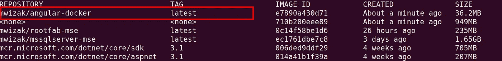
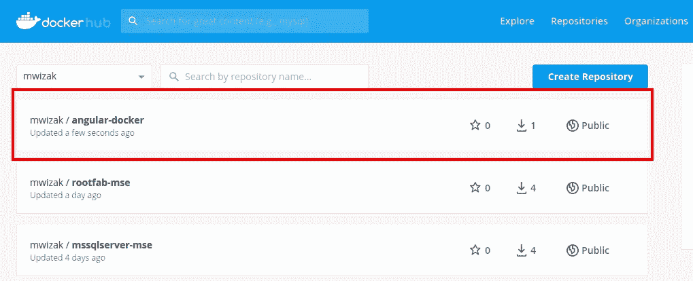

# 创建 Docker 图像的关键:Docker 文件关键字

> 原文：<https://betterprogramming.pub/the-key-to-creating-docker-images-dockerfile-keywords-57f25d7e5fa6>

## 用 Angular 中的一个例子理解 Dockerfile 关键字


照片由[乌帕德克·马特米](https://unsplash.com/@thefallofmath?utm_source=unsplash&utm_medium=referral&utm_content=creditCopyText)在 [Unsplash](https://unsplash.com/s/photos/container?utm_source=unsplash&utm_medium=referral&utm_content=creditCopyText) 上拍摄。

码头工人席卷了我们的行业。它革新并简化了我们运送、部署和设置软件开发环境的方式。

在本文中，我将解释大多数 Docker 图片中使用的主要 Docker 关键字。为了实用起见，我们将创建一个角度应用程序的 Docker 图像。在本文结束时，您应该已经掌握了相关知识，能够:

*   创建您自己的自定义 Docker 图像。
*   运行您的 Docker 图像。
*   将您的 Docker 图像推送到注册表。

# 创建角度项目

要通过名为 angular-docker 的 CLI 创建 Angular 项目，只需在命令提示符下键入以下内容:

```
$ ng new angular-docker
```

只需在随后出现的提示中按回车键，就可以使用默认设置。

# 添加 Dockerfile

将名为`Dockerfile`的文件添加到新创建的 Angular 项目的根目录中。注意:文件名没有扩展名。

*Docker 文件包含构建 Docker 映像的指令，还定义了执行容器的入口点(即映像的运行实例)。*

*将 Docker 文件中的每一行代码想象成一个层，在这个层中，您给出了构建或运行 Docker 映像的相关指令。*

*现在，复制下面的代码行，并将它们粘贴到新创建的 docker 文件中:*

```
*# Comment can be placed here.
FROM node:10.21.0-alpine as builder
WORKDIR /app
COPY package.json package-lock.json ./
RUN npm install
COPY . .
RUN npm run build --prodFROM nginx:1.16.0-alpine as server
COPY --from=builder /app/dist/angular-docker /usr/share/nginx/html
EXPOSE 80
CMD ["nginx", "-g", "daemon off;"]*
```

# *解释的关键字*

*按照惯例，Docker 使用所有大写字母作为 Docker 关键字，正如您在上面的文件中看到的那样。我强烈建议你坚持这样做。*

## *评论*

*在 Dockerfile 中，`***#***` (散列)字符代表一行注释。请参见上面 Dockerfile 文件第一行中的示例注释。*

## *1.从*

*`FROM`关键字指定了我们希望在其上构建图像的基础图像。您会发现，大多数 Docker 图像都以关键字`FROM`开头。这里的核心概念是不要重新发明轮子。有很多官方支持的基础映像，所以在它们的基础上构建。*

```
*FROM node:10.21.0-alpine as builder*
```

*在 docker 文件中，我们指定了两个基本映像。上面的关键字`FROM`只是说我们将使用 Node-alpine 作为我们的图像所基于的基础图像。我们用名称`builder`标记它，因为我们将主要使用它来构建我们的应用程序。*

*在 docker 文件的后面，我们还指定了另一个基础图像，我们将使用它来服务我们的应用程序(标记为`server`)。它基于流行的 NGINX 服务器。*

```
*FROM nginx:1.16.0-alpine as server*
```

## *2.工作方向*

*`WORKDIR`在我们构建的图像中设置工作目录或上下文。*

*在本例中，我们用下面的语句将工作目录设置为映像中的`app`文件夹:*

```
*WORKDIR /app*
```

*一旦我们设置了上下文，所有后续的命令都在指定上下文的根目录下运行，除非另有说明。在本例中，它是`app` 目录。*

## *3.复制*

*关键字`COPY`几乎是不言自明的。它只是将内容从一个文件夹复制到另一个文件夹中。为此，您可以指定源和目标，或者指定要复制的文件和映像中的目标文件夹。*

*从上面的 Dockerfile 文件中，我们注意到`COPY`关键字出现了几次。*

*我们第一次使用`COPY`关键字如下:*

```
*COPY package.json package-lock.json ./*
```

*这里，我们显式地指定了要复制到映像中的文件。我们将应用程序中的`package.json`和`package-lock.json`文件复制到映像的工作目录中，即`app`。*

*第二次，我们使用`COPY`关键字将所有源代码从我们的应用程序根文件夹复制到 Docker images 的工作目录(`app`):*

```
*COPY . .*
```

*在 Dockerfile 文件的末尾，我们还有一个`COPY`关键字。在这里，我们使用它从构建阶段创建的`dist`文件夹中复制所有内容，并将其转储到 NGINX 服务器 HTML 目录中:*

```
*COPY --from=builder /app/dist/angular-docker /usr/share/nginx/html*
```

*除了 COPY 关键字，docker 还提供了 ADD 关键字。它可以用于从 HTTP URL 复制 zip 文件或内容。*

## *4.奔跑*

*如果您想运行一个特定的 Linux 命令，那么`RUN`关键字就是您要找的。在上面的 Dockerfile 文件中，`RUN`关键字被使用了两次。*

*首先，通过运行`npm install`命令，在 Docker 映像的工作上下文中恢复 npm 依赖关系:*

```
*RUN npm install*
```

*稍后，`RUN`关键字用于在应用程序映像中进行生产构建:*

```
*RUN npm run build --prod*
```

## *5.揭露*

*`EXPOSE`关键字用于向外界公开 Docker 映像内部的端口:*

```
*EXPOSE 80*
```

*在本例中，我们公开了端口 80 上的 Docker 映像，我们可以在运行容器时使用它。*

## *6.煤矿管理局*

*`CMD`关键字有点类似于上面讨论的`RUN`关键字。它还用于运行 Linux 命令。但是与运行构建映像命令的`RUN`关键字不同的是，`CMD`关键字用于在容器启动时运行 Linux 命令(即在一个活动映像中)。*

*此外，Docker 还提供了`ENTRYPOINT`关键字，可以用来代替`CMD`关键字，也可以和它一起使用。*

*关于`CMD`和`ENTRYPOINT`关键词的更详细讨论，请查看[Bhargav Bachina](https://medium.com/bb-tutorials-and-thoughts/docker-entrypoint-vs-cmd-8934cfdf78f3)撰写的这篇文章。*

```
*CMD ["nginx", "-g", "daemon off;"]*
```

*当 Docker 映像运行时，上面的命令将启动 NGINX 服务器，并提供生产版本中的静态文件。*

# *构建图像*

*最后，我们可以基于上面的 Docker 文件构建我们的 Docker 映像。我们将简单地运行以下命令:*

```
*$ docker build -t mwizak/angular-docker -f Dockerfile .*
```

*在本例中，我们用名称`mwizak/angular-docker`标记了 Docker 图像。此外，我们指定 Dockerfile 文件指令的位置。*

*注意:`mwizak`是我的 docker 注册表的名称。你可以使用它或者用你喜欢的任何名字来代替它。*

*映像构建完成后，您可以使用以下命令检查它是否在本地 Docker 映像中列出:*

```
*$ docker images*
```

*您应该得到类似下面的输出。新创建的图像以红色突出显示:*

**

# *运行图像*

*为了运行新的映像，我们将使用它的映像名称。只需运行下面的命令:*

```
*$ docker run -ti --rm -p 8080:80 mwizak/angular-docker* 
```

*我们已经指定 Docker 图像应用程序应该在 HTTP 端口 8080 上运行，该端口映射到图像内部的端口 80。*

*在你的浏览器中进入 [http:localhost:8080/](/localhost:8080/) ，你会发现你的 Angular 应用程序作为 Docker 容器运行。*

# *将图像推送到注册表*

*这个过程对于创建 Docker 映像来说并不是必需的，但是如果您想要轻松地共享您新创建的 Docker 映像，您可以将它推送到 Docker 注册表，以便人们在本地 PC 上获取和运行。*

*在我的例子中，我在 Docker Hub 上有一个注册中心，但它可能在任何地方(Azure、AWS 等)。).*

*要将图像推送到 Docker Hub，您首先必须登录您的帐户。运行命令:*

```
 *$ docker login*
```

*通过身份验证后，您可以使用以下命令将映像推送到注册表中:*

```
*$ docker push mwizak/angular-docker*
```

*其中`mwizak`是您的 Docker Hub 注册帐户的名称。*

*登录您的 Docker hub，图像应如下所示:*

**

# *结论*

*在本文中，我们创建了一个 Angular 应用程序，并将其打包在一个 Docker 映像中。我们使用 Node-alpine 构建图像应用程序，然后使用 NGINX 服务静态文件。*

*之后，我们在一个容器中运行新创建的映像，然后将它推送到 Docker Hub 注册中心。*

*关于 Docker 的进一步阅读，请查看诺兰·格雷斯的这个 [Docker 系列](https://medium.com/pintail-labs/docker-series-what-is-docker-9eddca88f434)。*