# GitHub 的 Atom 编辑器的关键

> 原文：<https://betterprogramming.pub/the-keys-of-atom-d7fa52454c24>

## Atom 快捷方式列表使您的编码之旅更加容易

照片由 [Sergi Kabrera](https://unsplash.com/@skabrera?utm_source=unsplash&utm_medium=referral&utm_content=creditCopyText) 在 [Unsplash](https://unsplash.com/search/photos/keyboard?utm_source=unsplash&utm_medium=referral&utm_content=creditCopyText) 上拍摄

# 文本编辑器

当你学习一项新技能时，你必须熟悉的第一个概念是帮助你完成这项技能所需的工具。为了学会骑自行车，我们需要一辆真正的自行车。为了学习如何编写代码，我们需要一个文本编辑器。

这就是 Atom 派上用场的地方。Atom 是一款文本编辑器，于 2014 年发布，由 [GitHub](https://github.com/) *打造。它被称为“21 世纪的可破解文本编辑器”。*

作为熨斗学校的学生和编程初学者，我选择的“自行车”是 Atom。像所有第一辆“自行车”一样，它们有着特殊的意义，需要我们去了解它们是如何工作的。

你不会想知道我谷歌了多少次“如何在 Atom 中<something>”。我创建这个列表是为了帮助你加强和编辑的关系。你会发现通用的 Atom 和批量编辑快捷方式、软件包和其他方式，让你在担心为什么会得到`NoMethodError`时少一份担心。</something>

请随意阅读`command + G`这篇文章，寻找具体的内容！

# 常规快捷方式

1.  `command + shift + D`

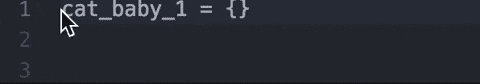

通过将光标放在特定的代码行上，Atom 会在您点击`D`时复制并粘贴该行代码。

2.`control + command + up/down`

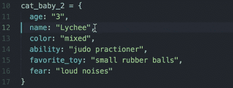

如果您需要上下移动一行而不删除它，您可以使用`up`或`down`键改变所选行的位置。

3.`command + [ or ]`

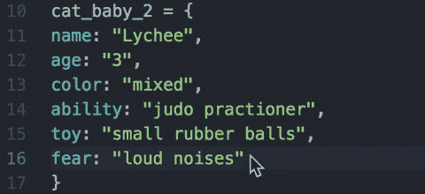

我为没有缩进而感到内疚——这个快捷方式将向前或向后移动代码(甚至是以前缩进的工作)。对于左缩进，使用`[`键，对于右缩进，使用`]`。

4.`control + click + “Split Up/Down/Left/Right”`

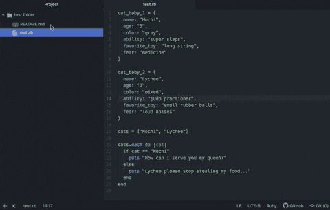

需要再看一下`README.md`？通过点击特定的文件，Atom 可以让您选择让某些面板相邻或上下打开！

5.`command + /`

不同的语言有不同的注释掉代码的方式，所以试图记住是否有正确数量的`#’s`或`-’s`的日子已经一去不复返了。通过选择多行，您还可以注释掉整个代码块。

6.`command + F`

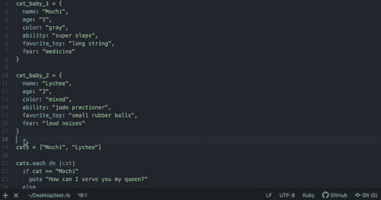

如果你要在一个充满大量代码的文件中搜索一个特定的单词，你可以打开一个搜索栏，它会高亮显示与该搜索匹配的文本。通过点击 enter，您可以浏览每一个匹配项。

# 批量编辑

7.`command + click`

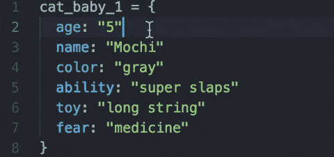

如果您需要同时在几个不同的地方，这将使您拥有多个光标，允许您在这些特定的地方进行编辑。

8.`command + D`

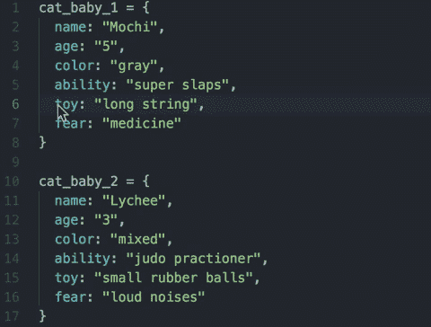

编码过程的一部分是回去编辑你的代码，所以重命名变量经常发生。如果您将光标放在特定的位置并一个接一个地按住上面的命令，Atom 会选择高亮显示的代码作为模式，再次单击`D`，您就可以一个接一个地获得高亮显示的匹配。您可以使用`command + U`取消选择突出显示的代码。

9.`command + control + G`

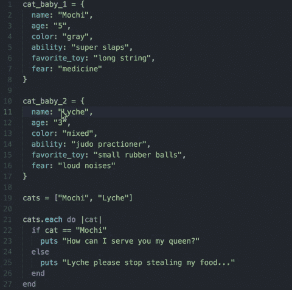

如果您知道您需要*某段特定代码的所有*实例，这将突出显示并批量选择所有实例。如果你对每个名词都用“name ”,这就特别有用了。

# 包装

这里有一些软件包可以定制你的“自行车”,让你在不熟悉的领域出发时感觉更舒服一些。您可以通过进入您的`Preferences`，然后进入左侧的`Install`，并通过不同的选项进行搜索来访问软件包。记住要使用你的包。

1.  `vk-terminal`

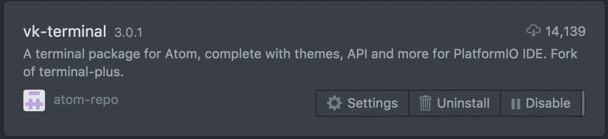

在终端窗口之间来回切换可能很烦人。 [Vk-terminal](http://v) 允许您使用`control + ``在当前 Atom 窗口中调出一个终端窗口。

2.`minimap`

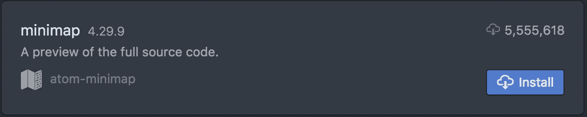

如果你是一个可视化者，你需要看到你所有的努力工作的满足感，`minimap`会给你一个显示在你右手边的所有代码的小版本，你可以用它来导航到你代码的某些区域。

3.`beautify`

我把`beautify`包括在内是因为使用美化的时候想到了短语*程序员天生懒惰*。我不建议初学者这么做，因为习惯使用某些约定来编写代码很重要。

美化所做的是给你的代码“漂亮”，完美的缩进和对齐的代码，易于阅读。这对于那些深陷于学习一门语言的抽象概念而忘记匹配他们的结束标签或结束语句(肯定不是指我自己)的人来说是非常好的。

# 其他酷的东西

1.  `Soft Wrap`

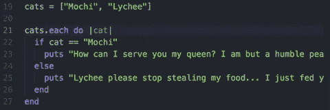

学习成为一名程序员将会让你创建大量的代码块，并以“长远的方式”做事。当你有一百万个不同的窗口同时打开时，通过进入`Preferences`，然后你左边的`Editor`标签，滚动到`Soft Wrap`，这有助于看到你所有的代码。

2. `Show Indent Guide`

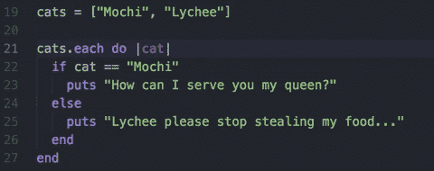

通过`Preferences`下的`Editor`标签启用`show indent guide`，你会在需要缩进的地方看到一条白线。当你试图匹配所有条件句的结束语句，查看 HTML 页面，寻找丢失的结束指示符时，这是非常有用的。

3.`Split Screen Application Windows`

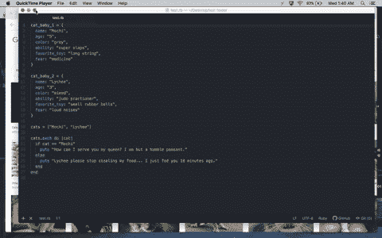

我家里没有电脑，也没有显示器，所以有能力为谷歌时刻分割屏幕是必须的。首先你全屏显示你的编辑器并导航回你的桌面。然后你可以在你的编辑器旁边抓取任何你想要的窗口(更像是一个浏览器)，进入同一个全屏空间。

它应该挪过去和编辑坐在一起！目前，每个全屏页面只能有两个窗口，但是可以有多个全屏页面。

3.`control + command + spacebar`

对于 Atom 来说，这不是一个很大的学习需求，但是如果你觉得有必要在你的代码、你的`README.md`或者互联网上任何允许你输入的地方添加表情符号，你可以使用这个快捷方式。

# 最后的想法

现在，不知道如何使用编辑器的恐惧已经消失了，你离成为一名合格的开发人员又近了一步。至少当你在其他编码新手面前大量编辑和修改一个变量时，你会看起来很酷。

尽管您可能不总是使用 Atom，但还是要花时间去了解您的编辑器以及它能为您和您的代码带来的所有好处。