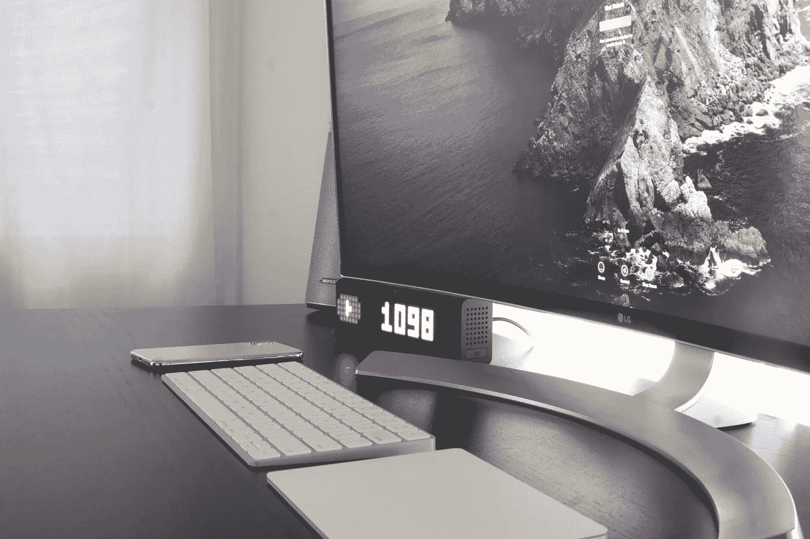
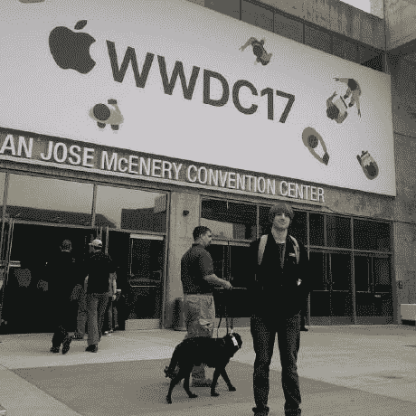

# 成功提交 WWDC 奖学金的关键

> 原文：<https://betterprogramming.pub/the-keys-to-a-successful-wwdc-scholarship-submission-8cbbf5eb2281>

## 创造力胜过复杂性。帮助你的应用脱颖而出的 3 个技巧

由[麦克斯韦·尼尔森](https://unsplash.com/@maxcodes?utm_source=unsplash&utm_medium=referral&utm_content=creditCopyText)在 [Unsplash](https://unsplash.com/s/photos/wwdc?utm_source=unsplash&utm_medium=referral&utm_content=creditCopyText) 拍摄的照片。

2017 年，我获得了苹果 WWDC 奖学金。这样，我就可以直接体验主题演讲，拿到年度夹克(李维斯在我那一年)，并参加会后狂欢。

最近更名为 Swift 学生挑战赛的 WWDC 奖学金是一项年度奖学金，颁发给大约 350 名学生(从小学到大学)。该奖学金让你有机会去圣荷西，亲自参加 WWDC，而不必支付机票。还向学者提供食宿。

在过去的几年里，获胜的要求是成为一名学生并提交一个视觉互动的 Swift 操场。

通过与其他学者的交谈和对我成功申请的思考，我总结出了三个确保成功申请的关键技巧。

# **1。确保你的声音在**中闪耀

这并不是一个艰难的编码挑战——最好这样对待它。

与需要严格实践并高度关注算法和实现的编码竞赛和面试相比，Swift 学生挑战赛是以互动和创新的方式展示您的能力。

虽然你必须很好地了解 Swift 和 Swift Playgrounds 开发，但不要过分强调实现。在我被接受的作品中，我的游戏场的第一行是`//DOES NOt WOrk`(大写字母不正确)。现在，我的操场确实工作了，但这只是显示了挑战的趣味性。这是关于在操场上玩得开心，并且做一些苹果公司的工程师会认为很酷的东西。

苹果也想通过你的游乐场了解你。确保你的声音不会在你写的所有代码中变得混乱。

我提交给 WWDC 的是一个数学问答游戏，当你回答问题时，关于我的信息开始活跃起来。我仍然有一个在 SpriteKit 和我用 Core Animation 制作的动画中运行的问答游戏，但是它并没有冲淡我想要的东西。

我的操场不是一个数学游戏——它是一个展示我是谁以及我为什么要申请的橱窗。

# **2。创造力>复杂性**

换句话说，当一个好的动画比一个复杂的算法更好的时候。

正如我上面所说的，你应该专注于展示你的声音，而不是进行最复杂的技术提交。使用 [wwdc GitHub 账户](https://github.com/wwdc)，你可以查看其他学生从 2014 年开始提交的作品。我注意到的一件事是，一个项目在技术上有多复杂，或者它使用了多少库，与它被选中的机会之间真的没有关联。如果你自己看看，许多成功的提交只有一个库被列为已用。

然而，我相信在你的项目的创造性和独特性与它被选中的可能性之间有着直接的联系。当我在 2017 年与其他学者交谈时，我总是对每个人提交的*多酷*印象深刻。虽然被认为是一个幼稚的词，但我认为*酷*在这种情况下是一个非常恰当的描述。

每个获奖项目都是独一无二的。每个获奖的项目都实现了一些其他人没有真正想过要实现的东西。每个获奖项目都很有创意。每个项目都很酷。

我记得我奖学金那一年最酷的*项目中有两个是视觉互动 3D 太阳能系统和支持将其他人的游乐场拖入其中的 MacOS classic 的翻拍版。你的项目肯定不需要像这两个项目一样具有技术挑战性——我的和我朋友的都不需要——但它必须一样有创意，一样与众不同，一样酷。*

# 3.早点开始(真的早点)

WWDC 大约在每年的六月初举行。从逻辑上讲，学者的提交系统大约在同一时间开放，截止日期大约在同一时间结束。围绕这个计划。

你能做的提高机会的最好的事情之一就是在提交系统开放之前就开始头脑风暴。因为这既是对你编码能力的测试，也是对创造力的挑战，所以想出一个独特的创意将是你最大的挑战之一。提前想出有创意的想法将有助于确保你仍然有足够的时间来实现它，并且这个想法是完全充实的。

当我申请 WWDC18 时，我认为我没有被录取的主要原因是我等了太久才提出我的想法。因此，我觉得选择第一个出现在我脑海中的想法(从来不是一个好的策略)并付诸实施是仓促之举。如果我事先选择了一个更有创造性的想法，我就不会如此匆忙地去实现它，我的想法也可以得到改进和重复。

如果你真的是一个积极进取的人，你甚至可以在挑战开始前就开始研究如何实现你的想法，甚至开始实施。由于提交指南在几年内没有改变(它一直在提交一个视觉互动的 Swift playground)，可以肯定的是，在未来几年内它将会是这样。因此，你可以开始充实你将如何构建你的 Swift 操场，并在提交前一两周开始编码。

考虑到这一点，我不会建议提前几个月开始。如果你这样做，很可能你会做出太复杂的东西，不适合这个比赛。你也会因为一个有趣的、相对快速的挑战而紧张。

# 在 Swift 学生挑战赛中取得成功

如果你记住这是一个有趣的挑战，不仅要展示你的编码能力，还要展示你为评委创造独特体验的能力，你会做得很好。

不要着急提交，记得要让它独一无二！也许几年后我会在那里见到你！

我在 Dub Dub 17！