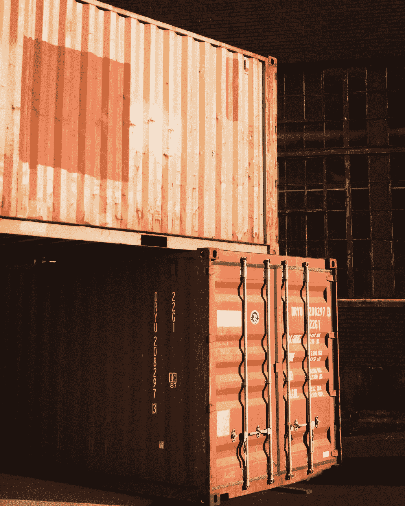
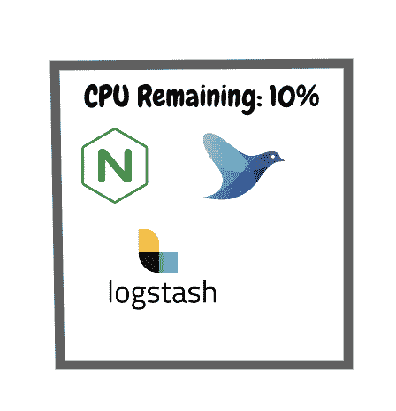
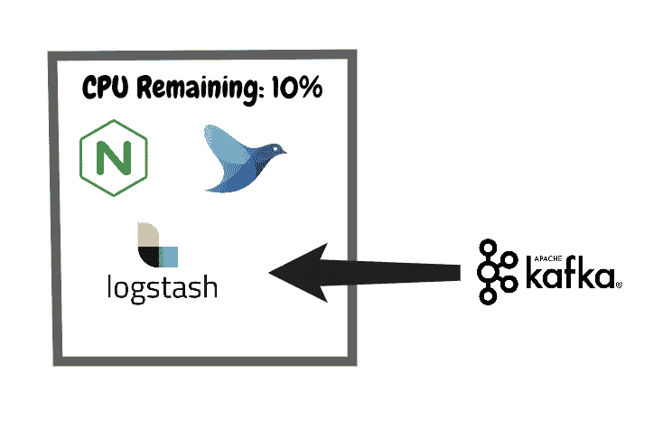
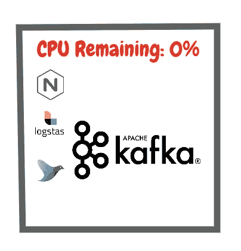
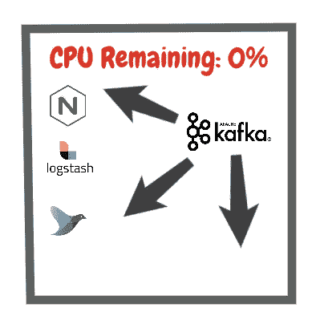
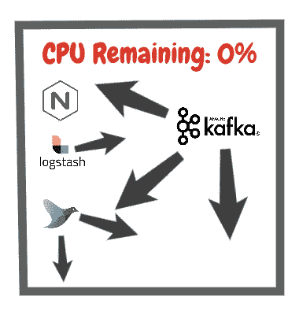
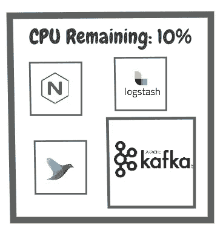

# Kubernetes 服务质量难题

> 原文：<https://betterprogramming.pub/the-kubernetes-quality-of-service-conundrum-eebbbb5f89cf>

## 什么是服务质量，为什么它很重要？



照片由[大阪日兴](https://unsplash.com/@nosaka?utm_source=unsplash&utm_medium=referral&utm_content=creditCopyText)在 [Unsplash](https://unsplash.com/s/photos/container?utm_source=unsplash&utm_medium=referral&utm_content=creditCopyText) 上拍摄

作为一个 [Kubernetes](https://kubernetes.io/) 集群的管理员，我犯的第一个错误就是为我们的 pod 设置了错误的“服务质量”(QoS)。

在 Kubernetes 中，QoS 非常重要，但是很少被讨论。我不知道为什么。如果你弄错了，你可以用核武器摧毁整个节点。

# 什么是服务质量？

顾名思义，一个 pod 的 QoS 值决定了该 pod 的服务质量。QoS 可以有三个值— `BestEffort`、`Burstable`和`Guaranteed`。

我将对这些价值观进行分类，并让您了解为什么您会选择这一解决方案。

# 尽力而为

我要说一些大多数人都会同意的话。`BestEffort`豆荚*危险*。

为了让您的 pod 有一个`BestEffort`服务质量，您绝对不需要在任何容器中提供资源声明，在那个 pod 中运行。

例如，下面的部署定义将被部署为`BestEffort`:

```
apiVersion: apps/v1 *# for versions before 1.9.0 use apps/v1beta2*
kind: Deployment
metadata:
  name: nginx-deployment
spec:
  selector:
    matchLabels:
      app: nginx
  replicas: 2 *# tells deployment to run 2 pods matching the template*
  template:
    metadata:
      labels:
        app: nginx
    spec:
      containers:
      - name: nginx
        image: nginx:1.7.9
        ports:
        - containerPort: 80
```

当你宣布没有资源时，Kubernetes 不知道把豆荚放在哪里。一些节点非常繁忙，一些节点非常安静，但是因为您没有告诉您的集群您的部署需要多少空间，所以它被迫猜测。

这就是最大努力的含义。它会尽最大努力，但你没有给它太多的工作。

## 但是是什么让它们如此危险呢？

考虑下面的场景。您有一个只有一个节点的集群，该节点非常繁忙。它已经运行了许多应用程序。



忽略这些通常占用空间小的应用程序消耗太多的事实！

现在，这些圆荚体中的每一个都表现良好，并且已经申报了它们的资源。但是随之而来的是一个没有任何资源声明的流氓 pod。

您已经很忙的节点是我们唯一可以调度的地方，所以 Kubernetes API 忠实地部署它。就像罐头上写的，“尽最大努力”。



情节变得复杂了…

但是你的新豆荚是一个绝对的怪物，它开始以惊人的速度消耗资源。

好吧，正如我们所知，Kubernetes 杀死使用超过其使用限制的豆荚，对不对？但是没有使用限制。Kubernetes 不知道什么是不良行为，所以它坚持。尽最大努力。



反派揭秘！

它不仅会让你的其他 pod 挨饿，但除非你在你的节点上有一些特定的监控，否则它会逐步升级并消耗 CPU，否则这些 CPU 会被分配给真正重要的事情，如 *kubelet* 。

您的节点进入黑暗状态，在某些平台上，群集可能需要 15 分钟以上才能自我修复。

## 治疗

只是不要部署`BestEffort`吊舱。我知道一些豆荚可能非常小，它们永远不会引起问题，但如果是这样的话，只需给它们分配非常少的资源。

不值得冒这个险。流氓`BestEffort`吊舱的潜在副作用是灾难性的，减轻这些副作用是一个需要解决的重要问题。简单地不允许`BestEffort`吊舱要容易得多。

# 可爆发的

一个`Burstable`的服务质量比一个`BestEffort`的 pod 好一点。这种情况发生在你声明了对资源的基本请求，但是你的限制高于你的请求。

```
apiVersion: v1
kind: Pod
metadata:
  name: qos-demo
  namespace: qos-example
spec:
  containers:
  - name: qos-demo-ctr
    image: nginx
    resources:
      limits:
        memory: "512Mi"
        cpu: "1024m"
      requests:
        memory: "200Mi"
        cpu: "700m"
```

这比我们的第一个例子好多了。如果我们从一开始就知道我们的 pod 会很忙，我们可以告诉 Kubernetes 给它更多的喘息空间。

这与像 [cluster-autoscaler](https://github.com/kubernetes/autoscaler/tree/master/cluster-autoscaler) 这样的工具配合得很好，因为它可以为集群安排一个新节点。这限制了节点 CPU 饥饿的可能性，但并没有消除它。



卡夫卡向四面八方生长，但这没关系。

因为你的吊舱是`Burstable`，它们仍然可以扩展到另一个并引起问题。

现在，如果一个豆荚一次做这个，没问题，对吗？你明智地计划了你的资源。但是如果一次长出多个豆荚呢？这通常被称为“噪音邻居”问题。



鲁尔·卢

你的处境和以前一样。您不会意外地部署一个庞大的 pod，但是一些不幸的事件可能会导致一个节点上的中断甚至 CPU 饥饿。

## 治疗

这个有点价值判断。一些豆荚闲置了很长时间，也许一个小时，它们就开始忙碌起来。在另外的 23 小时里抓住资源不放是没有意义的。所以你做出选择。风险与回报。

`Burstable`服务质量是一种出色的 k8s 原生方法，用于优化您集群中的成本，它不像`BestEffort`服务质量那样非黑即白。

如果 pod 能够快速自我修复，并且您能够忍受短暂的中断，`Burstable`可能是一个节省资金的好方法。把你注意力集中在上限上。如果所有 pod 的上限都比运行它们的节点的容量高几倍，那么您可能遇到了问题。

# 担保

这个是老大。这是运行容器最昂贵的方式，但是这些容器获得了非常好的稳定性。

```
apiVersion: v1
kind: Pod
metadata:
  name: qos-demo
  namespace: qos-example
spec:
  containers:
  - name: qos-demo-ctr
    image: nginx
    resources:
      limits:
        memory: "512Mi"
        cpu: "1024m"
      requests:
        memory: "512Mi"
        cpu: "1024m"
```

当您的 pod 请求和限制完全相同时，就实现了一个`Guaranteed` QoS。这消除了向外扩展到更多 CPU 的可能性，但是它保留了您的容器将要需要的确切数量。

如果你清楚你的 pod 需要多少资源，这是一个很好的选择。

它消除了集群中的邻居干扰问题，但是要注意，在 Kubernetes 环境之外的节点上运行的任何东西，比如嵌入到服务器映像中的监控和扫描工具，仍然会引起问题。没有灵丹妙药。



价格昂贵，但坚固耐用

# 问题是

如果一切都是`Guaranteed`，你将会烧钱。pod 保留的资源越多，您需要的节点就越多。这些节点会闲置在那里，无所事事地增加您的云预算，而不会为您的群集带来任何实际价值。

您需要在资源可伸缩性和 pod 弹性之间找到理想的平衡。对每一份申请都要具体情况具体分析，避免硬性的、昂贵的一刀切规则，比如“*从现在起一切都有保证！”。*

这是所有的乐趣和游戏，直到杰夫·贝索斯出现在你的门口，收回你的房子。

我在 [twitter](https://twitter.com/chris_cooney) 上讨论各种话题，从 K8s 到混沌工程。