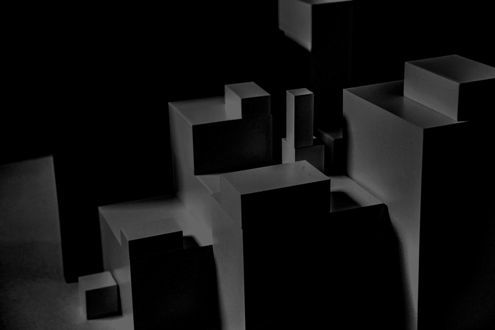
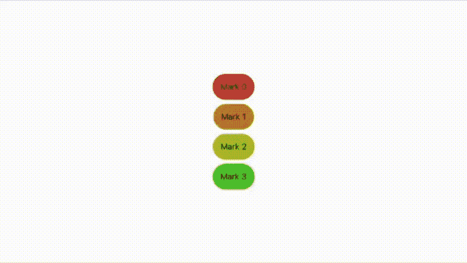
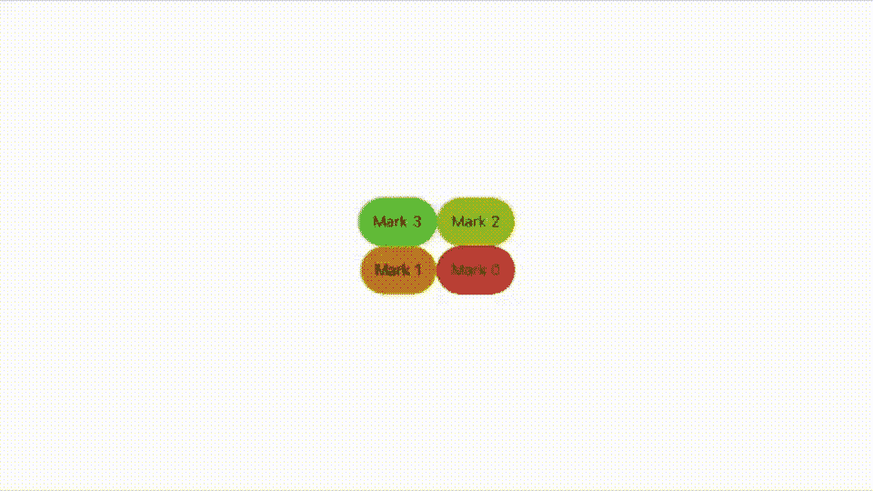
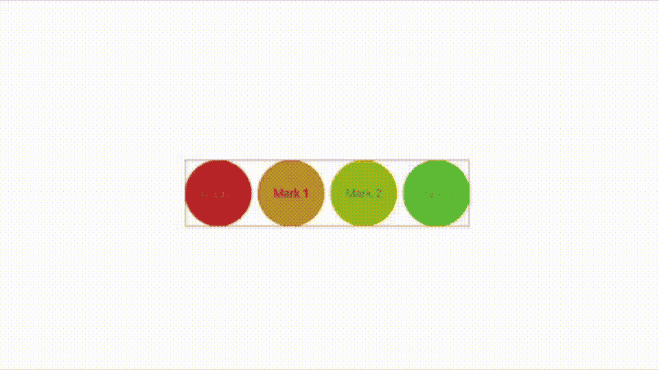
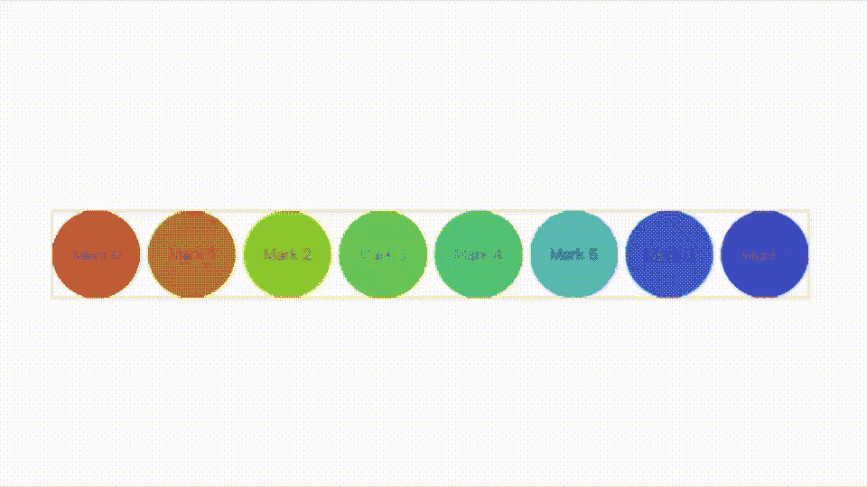

# iOS 16 中的 SwiftUI 布局协议

> 原文：<https://betterprogramming.pub/the-layout-protocol-in-ios-16-c86b31d87d1a>

## SwiftUI 中引入的新协议的实用视图

照片由[埃斯特焦](https://unsplash.com/@estherrj?utm_source=medium&utm_medium=referral)在 [Unsplash](https://unsplash.com?utm_source=medium&utm_medium=referral) 拍摄

当我开始编码时，没有什么框架可言。当你想在屏幕上画一个圆的时候，需要比现在多几十行甚至更多的代码。随着科学的发展，抽象和框架的概念已经成为前进的方向。

今天，如果我想用 SwiftUI 框架画一个圆，只需要几行就可以了。它是好的，但要付出代价；抽象程度越高，灵活性就越小，这是一种权衡。

当苹果推出 SwiftUI 时，目标之一是让屏幕布局比过去 20 年 UIKit 更容易。它引入了三个主要的容器来布局您的窗口:HStack、VStack 和 ZStack。但是对于一些人来说，做他们在 UIKit 中已经习惯的布局代价太高了。它们在 SwiftUI 中看起来复杂而杂乱。

苹果试图通过引入布局协议来解决这个问题，暴露那些主要容器的底层，这样你就可以改变它们的行为。请和我一起阅读这篇文章，看看这个新协议的一些实际用途和实现，让我们用自己的布局规则创建自己的容器。

# 模板

让我从这个模板开始，在这个模板中，我可以在不同的布局之间切换，并在操作过程中定义新的布局:

您在这里看到的是一个视图，您可以在其中选择任何标准布局，并使用布局协议在它们之间移动。

使用 SwiftUI 中的布局协议在不同容器之间移动

到目前为止，这里没什么新东西。

让我们添加一些代码来创建一个新的布局。我想做的是把我的四个视图放在一个正方形里。在布局协议中，我需要定义两个方法。这是基本代码:

布局协议的简单示例

现在，将它添加到枚举`Algo`中，并尝试一下:

在标准视图和自定义视图之间切换

抽象的美妙之处在于——在没有布局协议的情况下做到这一点是可能的，但是代码会复杂得多。

但是，我知道你在想什么，它们不是角。我想把视图放在角落里。下面是相同代码的另一个版本:

如您所料，这将视图放置在角落。请注意，我在它周围设置了一个边框，这样当我切换容器时，您可以更好地看到发生了什么。

在标准视图和自定义视图之间切换

当然，如果你看了 WWDC20 上的视频，他们做了一个更复杂的布局——一个基于圆形的布局。这背后的代码如下:

这个动画 GIF 展示了它的样子。

在标准视图和自定义视图之间切换

所有这些让我结束了这次旅行。我希望你在阅读的时候学到了一些东西；我确实写了它。