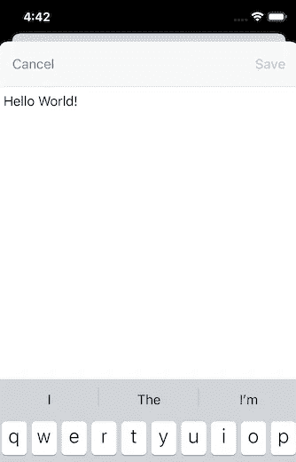

# 使用关闭模式视图时的 iOS 生命周期。iOS 13 中的页面表

> 原文：<https://betterprogramming.pub/the-lifecycle-and-control-when-dismissing-a-modal-view-with-pagesheet-in-ios-13-4bbd1e3e1ec7>

## 新模态视图被取消时的两个关键行为点

[安娜斯塔西娅·杰尼娜](https://unsplash.com/@disguise_truth?utm_source=unsplash&utm_medium=referral&utm_content=creditCopyText)在 [Unsplash](https://unsplash.com/s/photos/page-sheet?utm_source=unsplash&utm_medium=referral&utm_content=creditCopyText) 上的照片

从 iOS 13 开始，你已经可以默认实现半模态行为作为屏幕过渡，并通过向下滑动关闭模态视图。

# `UIAdaptivePresentationControllerDelegate`的新实例方法

*   `presentationControllerDidAttemptToDismiss(_:)`
*   `presentationControllerShouldDismiss(_;)`
*   `presentationControllerWillDismiss(_;)`
*   `presentationControllerDidDismiss(_;)`

# 使用关闭模式视图时的生命周期。通过滑动获取页面

当您使用委托方法时，您必须在消除模态视图时了解生命周期。你看看[一些 WWDC19 的幻灯片](https://devstreaming-cdn.apple.com/videos/wwdc/2019/224xnuourakjstfak/224/224_modernizing_your_ui_for_ios_13.pdf?dl=1)就很容易理解了。

*   如果`isModalPresentation`为`true`，则调用`DidAttemptToDismiss`。
*   如果`isModalPresentation`为`false`或未配置，则依次调用以下方法:`ShouldDismiss`->-`WillDismiss`->-`DidDismiss`。

## 什么是 isModalPresentation？

`isModalPresentation`是 iOS 13 新增的`UIViewController`属性。

如果该属性为`true`，则显示在屏幕上的视图会被阻止关闭。换句话说，当属性为`true`时，不能通过向下滑动来关闭模态视图。

在这种情况下，使用`DidAttemptToDismiss`是有益的。向下滑动时触发的事件调用的委托方法，`isModalPresentation`为`true`。

因此，您可以在方便的时候运行`dismiss(animate: true)`，在 delegate 方法中处理诸如显示对话框之类的事情。

> "这个属性的默认值是 false。当您将其设置为 true 时，UIKit 会忽略视图控制器边界之外的事件，并防止视图控制器在屏幕上时以交互方式关闭。— [苹果开发者文档](https://developer.apple.com/documentation/uikit/uiviewcontroller/3229894-ismodalinpresentation)

# 使用向下滑动模态视图时的两种控制模式。页面

当用`.pageSheet`向下滑动模态视图时，由于`viewWillAppear`永远不会在父视图控制器上被调用，所以当您想要将值、事件等传递给父视图控制器时，您必须使用前面提到的委托方法。

下面是实现的两种一般模式。

## 模式 1:用*关闭模态视图时不控制行为。页面表*

当您将`.isModalPresentation`设置为 false 或 nothing 时，由于可以调用委托方法`ShouldDismiss`->-`WillDismiss`->-`DidDismiss`，您可以通过委托或使用`WillDismiss`或`DidDismiss`的闭包方法来传递事件。

添加:我注意到上面的实现有一个问题。委托方法是在模式视图完全关闭后调用的，因此，根据后面的处理，可能会有一点延迟。

如果是这样，你最好在`DidAttemptToDismiss`中调用`dismiss`并通过委托方法或闭包传递事件，因为性能会稍微快一些(大约 0.5 秒)。

## **模式 2:用。pageSheet(引自苹果示例代码)**

[苹果样本代码](https://developer.apple.com/documentation/uikit/view_controllers/disabling_pulling_down_a_sheet)设置`isModalPresentation`为真并使用`presentationControllerDidAttemptToDismiss(_:)`。

它是如何工作的？

1.  如果您在模式视图中编辑文本，然后向下滑动，应用程序会显示一个对话框，确认您是要保存还是放弃更改。
2.  当您在对话框中选择一个动作时，应用程序运行`dismiss(animated: true)`。向父视图控制器传递值和传播事件也同时发生。

# 包扎

在新模态视图被驳回时的行为中，您必须掌握以下关键点。

*   根据`isModalPresentation`，生命周期会发生显著变化。
*   在关闭模态视图时，不会在父视图控制器上调用`viewWillAppear`。

# 资源

*   [本文由@hirothings](https://qiita.com/hirothings/items/554288583d581a8a929c) 原创日文文章
*   [为 iOS 13 更新您的用户界面(WWDC19)](https://developer.apple.com/videos/play/wwdc2019/224)
*   [禁止下拉表单(示例代码)](https://developer.apple.com/documentation/uikit/view_controllers/disabling_pulling_down_a_sheet)