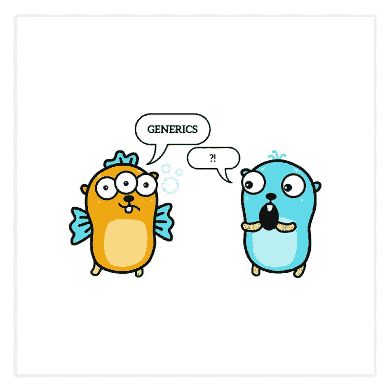
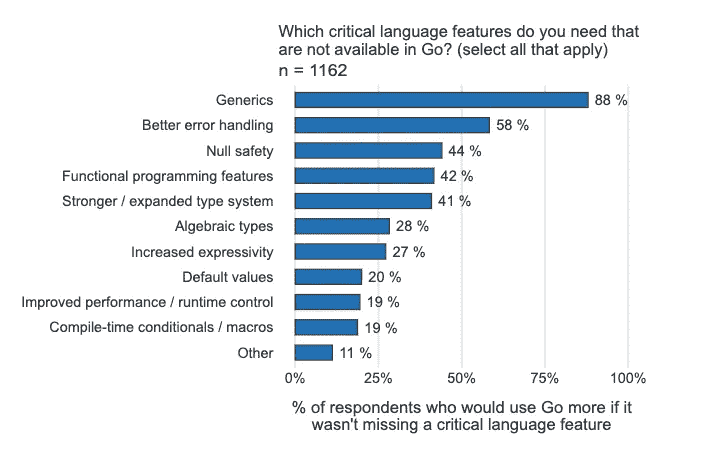

# 期待已久的 Go 特性:泛型

> 原文：<https://betterprogramming.pub/the-long-awaited-go-feature-generics-4808f565dbe1>

## 在 Go 中使用泛型的简短指南



自诞生以来，Go 因许多原因而受到称赞，但也因其他原因而受到批评，这是本故事主题的主要痛点:泛型。或者说是缺少它们。

首先，这个决定背后的原因是保持语言的简单，因为这是 Go 的哲学。

来自 Go 的常见问题:

> Go 旨在作为一种编写服务器程序的语言，随着时间的推移，这种语言易于维护。(更多背景资料见[本文](https://go.dev/talks/2012/splash.article)。)设计集中在可伸缩性、可读性和并发性等方面。多态编程在当时对语言的目标来说似乎并不重要，因此为了简单起见被忽略了。
> 
> […]
> 
> 泛型很方便，但是它们的代价是类型系统和运行时的复杂性。我们还没有找到一种设计能提供与复杂性相称的价值，尽管我们在继续思考它。与此同时，Go 内置的映射和切片，加上使用空接口构造容器的能力(通过显式拆箱),意味着在许多情况下可以编写代码来做泛型所能做的事情，即使不太流畅。

# 什么是泛型？

有时候，实现可以处理任何数据类型的数据结构或算法是很有用的，比如对数组的每个元素执行操作的函数，而不管数据类型如何。例如，如果我们想要迭代一个元素数组，在控制台上打印每个元素——到目前为止，这样做的唯一方法是这样的:

```
 func Print(arr []interface{}) {for _, elem := range arr {
   switch o := i.(type) {
        case int64:
            fmt.Printf("%5d\n", o)
        case float64:
            fmt.Printf("%7.3f\n", o)
        case string:
            fmt.Printf("%s\n", o)
        default: // covers structs and such
            fmt.Printf("%+v\n", o)
    }
}
}
```

依我拙见，不太实际。

泛型是 Go 开发团队要求最多的功能，如下图所示，该图摘自 [Go 2020 调查](https://go.dev/blog/survey2020-results):



泛型是目前最受欢迎的特性

已经听到了请求，泛型将在 1.18 版本中发布(预计在 2022 年 2 月发布)。

这并不意味着在那之前我们不能玩得开心。发布日期是生产就绪版本，我们现在可以访问 beta 2(你可以在这里了解如何安装它)。事不宜迟，让我们进入 Go 泛型吧！

# 定义通用函数

要定义一个泛型函数，我们必须将泛型类型标识符放在方括号中，在函数名之后，参数之前，后面跟有单词`any`。

这样，我们可以传递任何数据类型的任何切片，并打印出来。让我们用一段 int，另一段 string 和最后一段 struct 来试试。

我们得到以下控制台输出:

```
1
2
3
4
hello
i'm
using
generics
{Matthew}
{John}
```

正如我们所看到的，每种数据类型都用相同的函数打印出来。耶！

# 限制

有一种方法可以通过使用约束来限制我们的泛型函数可以接受的数据类型。例如，我们可能希望将允许的类型限制为可以转换为字符串的数据类型。为此，我们用函数`String() string`创建一个接口`Stringer`，并创建通用数据类型`T Stringer`。这样，该函数将只接受实现了`String() string`函数的类型。

控制台输出:

```
Matthew Johnson
John Johnson
```

## 可比约束

我们可以声明一个`comparable`泛型类型，将参数限制为可以与操作数`==`和`!=`一起使用的数据类型。让我们创建一个通用函数，它计算数组中某个值的出现次数，然后用一个 string 数组和一个 int 数组执行它:

控制台输出:

```
3
2
2
3
```

## 几种类型

我们可以声明一个只接受特定数据类型的函数:

控制台输出:

```
6
14.3
```

我们还可以用一系列数据类型声明一个接口:

```
type Addable type {
  int | int32 | int64 | float32 | float64 | uint | uint32 | uint64
}
```

但是如果我们在可添加数据类型和别名之间执行加法

类型:

我们得到以下错误:

```
./main.go:17:17: myInt does not implement Addable (possibly missing ~ for int in constraint Addable)
```

正如错误消息所说，我们可以简单地通过在`Addable`接口中的`int`数据类型声明之前添加`~`来解决这个问题。这样任何别名类型的`int`都实现了 Addable。这适用于我们想要实现 Addable 的任何别名。例如，如果我们想要用一个别名`float64`来实现 Addable，我们应该在`float64`数据类型声明之前添加`~`。

现在成功了:

```
9
```

## 混合的

约束也可以在新的界面中混合在一起

```
type ComparableStringer interface {
     comparable     
     String() string 
}
```

这样，通用数据类型`T ComparableStringer`将只接受实现`String() string`方法并且是`comparable`的类型。

我省略了一些关于 Go 泛型的主题，以使这成为一篇轻松的阅读，所以请确保您继续学习它们！

编码快乐！