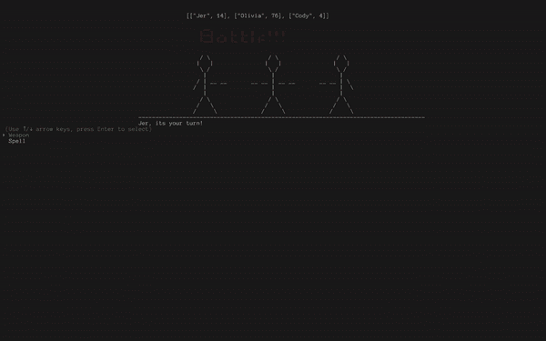

# 元编程的魔力

> 原文：<https://betterprogramming.pub/the-magic-of-metaprogramming-732f0300a5c7>

## 用抽象的魔法改造你的程序

莎拉·埃勒斯的照片

技术与科学有着美好的关系。几十年的热情研究，忠实地遵循科学方法，已经产生了数字工具，任何以前的人类时代都会将其称为魔法。

我也发现自己偶尔会被技术的明显魔力所迷惑。

最近，在学习面向对象编程(OOP)时，我遇到了一个看似神奇的概念，叫做*元编程*。虽然元编程在某些语言中非常流行，但它可以用于抽象出几乎任何项目中的问题。

在我们讲解核心概念时，我将使用 Ruby 的例子，但是你可以在几乎任何编程语言中应用这些知识。

# 定义

首先，元编程是什么意思？

前缀“meta”现在经常被抛出，而且经常是不正确的，所以我们必须为我们的讨论确定一个确切的定义。

出于我们的目的，前缀“元”意味着*某种东西以一种完全自我参照的方式作用于世界*。

所以，举例来说，元魔法是一个魔法作用于*魔法*的法术。元文本是讨论*文本*本身的文本。元程序是以编程方式作用于*程序*的程序。

一个简单的定义可以是:

> "元编程是为我们编写代码的实践."

# 例子

Ruby 编程语言允许重复的任务被简化和抽象。让我们来看一个用来使实例变量可访问的典型例子。

假设我们正在创建一个`Wizard`班级来组织霍格沃茨所有的学生和老师。

到目前为止，我们的代码缺少如何导航到这些数据的说明。任何试图读取关于向导*或*更新向导信息的尝试都会导致错误，因为计算机没有任何描述该过程的方法。

要解决这个问题，可以在`Wizard` `class`中定义实例方法。

有了这个设置，我们就可以调用和更新任何特定巫师的房屋分配。

但是如果我们保存 20 或 30 个实例变量，以及每个向导呢？代码会非常乏味和重复——增加出错的可能性和不必要的复杂性。

我们可以用一点魔法一劳永逸地解决这个问题。

为了编写每个新的`class`来为每个实例变量编写这些方法，我们必须在 Ruby 语言中前进一层，编写`Class`类。

在 Ruby 中，关键字`class`不仅仅是一个定义，也是一个表达式，用于评估`class`的每个实例。因此，包含在`Class`T3 中的抽象方法可以在每个新实例上运行。

如果运行该文件，输出将是:

`Hello World!`

所以我们现在有能力编写一个抽象的方法，在任何我们想要的类中为我们编写代码！

上面应用的一些方法可以有一篇自己的文章，([就像这个](https://rubymonk.com/learning/books/2-metaprogramming-ruby/chapters/25-dynamic-methods/lessons/72-define-method))但是，幸运的是，它们对代码的描述足够清晰易懂。

这就是元编程真正令人兴奋的地方！

现在 Ruby `Class` `class`有了我们的`magically_write_my_code`方法，我们可以在任何新类上调用它来动态编写我们的代码。

现在是魔法…

我们现在已经成功地编写了为我们编写功能代码的代码！

虽然这是一个简单的例子，而且是一个已经用`attr_accessor`、`attr_writer`和`attr_reader`宏为我们编写了的例子，但它展示了编写抽象代码的能力，这些代码可以在各种环境下为我们编写代码。

让我们把这个新观点应用到另一个例子中。

在一个[项目](https://github.com/jollyjerr/Git_Forknite)中，我和我的两个朋友正在创建一个小型多人 CLI 游戏，我们遇到了一个问题，即相对于仍然活着的玩家数量，如何渲染合适的屏幕。

忠于面向对象的设计模式，我们创建了一个`Screen`类，并调用该类中的不同方法来呈现适当的屏幕。

例如，`Screen.three`将返回三个简笔画的图片，而`Screen.five`将返回五个。然而，当玩家开始无序死亡时，麻烦就出现了。

为了编写灵活的代码，我们必须尝试元编程！

我们开发了一种`refresh_screen`方法来:

1.  参考数据库，计算活着的玩家数量。
2.  `[send](https://apidock.com/ruby/Object/send)`调用`Screen`类以返回适当的屏幕。

换句话说，我们开发了一种方法来为我们动态元编程一行代码——它改变了我们的游戏。

为了计算活着的玩家的数量，我们计算从数据库中选择的玩家数组中的元素，这些玩家的健康状态大于零。

这条线`Screen.send(numbers_to_name[number_of_players])`包含了一点点魔力。根据存活玩家的数量，`refresh_screen`方法将返回不同的代码行。

这使得我们的`refresh_screen`方法对活着的玩家数量完全是动态的，不管顺序如何，并且为程序创建了一个简单的方法来处理游戏中可能出现的不同情况。

尽管这是一个简单的真实例子，但它展示了让代码为您编写代码所提供的强大功能和灵活性！

# 结论

抽象、灵活性和逻辑自治都提供给了愿意投入元编码初始工作的程序员。

虽然本文关注的是简单的例子，但是许多复杂的系统都是基于这些概念开发的。

[动态 ORM 的](https://queue.acm.org/detail.cfm?id=1394140)、灵活的后端和[加速的机器学习](http://www-compsci.swan.ac.uk/~csphil/CS335/chapt5.pdf)都是通过元编程获得的，未来只会为能够围绕多样化输入构建程序的抽象系统看起来更光明。

照片由 Cory C 拍摄。

如果没有别的，重要的是提醒我们自己编码从来都不是魔术。

每当我们看到一个看似神奇的新概念时，我们可以慢慢地研究其内部工作，直到只剩下选择、迭代和数据操作。