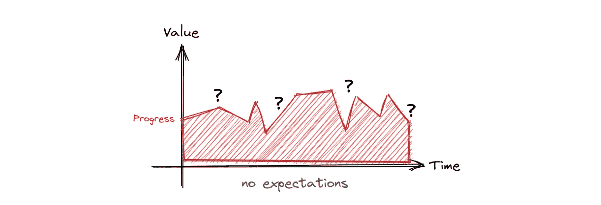
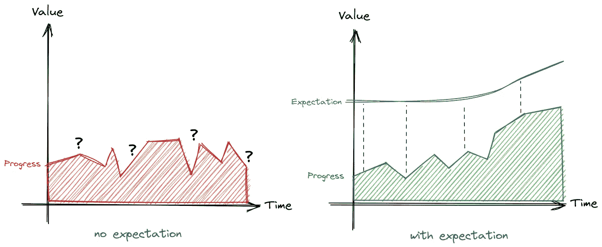
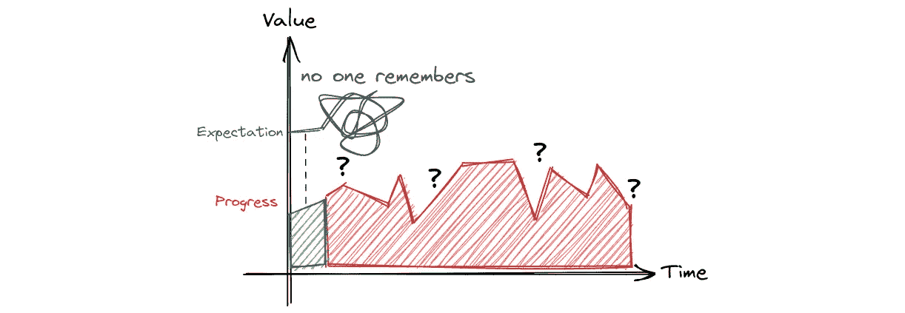
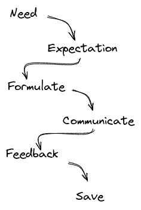
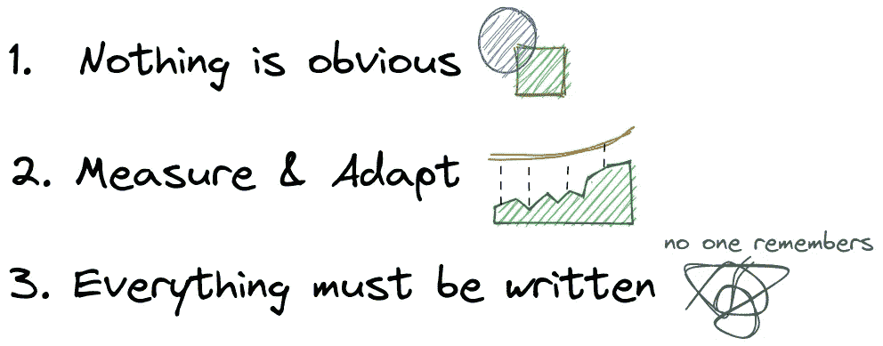

# 设定期望的魔力

> 原文：<https://betterprogramming.pub/the-magic-of-setting-expectations-978ba7316df8>

## 如何将期望作为成长和卓越的工具

图片来源:作者

有多少次你在绩效评估或回顾会上注意到以下短语？

*   "你为什么不帮助约翰(初级开发人员)入职？"
*   根据你的经验，我以为你会承担那部分责任
*   “我在那个领域没有看到任何增长，因此你不会得到提升”

如果你想避免这种情况，有一个强大的工具叫做期望，关键是要响亮而清晰地设定它们。

# 不，这不明显

我是说，这很明显，不是吗？

你的团队中发生了一些事情，可能是一个任务没有完成，或者是一个团队成员没有承担责任。你可能会发现自己在说“我以为很明显 X 会完成”。许多事情对*你*来说似乎显而易见，对*你的团队*来说可能并不明显。

人们来自不同的背景、生活和工作经历，这些造就了他们的期望。对于一个在授权团队中工作了几年的人来说，团队显然可以影响产品决策，但对于另一个团队成员来说，这可能是第一次。作为他们的经理，你有责任确保人们知道对他们的期望。

# 测量工具

没有期望，就很难给自己定基准，这就是为什么许多人不能以他们期望的速度成长。通过设定期望值，你的团队成员将能够看到方向并以可迭代的方式工作。

在左边，你可以看到一个没有期望的人的成长进步，他们的经理认为他们知道自己的价值。在右边，经理不断设定期望值，并根据增长情况调整期望值。

有或没有

1.  我希望你更加独立
2.  我希望你来领导这个项目
3.  我希望你能掌控团队之外的交流
4.  我希望你能指导我们的低年级学生
5.  …

# 写或忘记

不明确的期望比没有期望更糟糕，因此写下期望是非常关键的。很多次我听到经理们抱怨他们**确实**设定了期望，但是团队却不能满足他们。

没人记得会发生什么…

当你试图分析哪里出了问题时，你会意识到这些期望并没有写在任何地方，它们充其量是在一次会议上或在一次咖啡聊天中设定的。我确实理解，对一些人来说，在口头交流中表达他们的想法要容易得多，但是……如果没有写下来，他们会忘记，或者改变(这更糟糕)。

这个过程需要简单，你考虑一个期望，你首先把它写下来，然后再想一想，在你确定你可以用书面或口头的方式传达它之后。你应该总是从你的成员那里得到一些最低限度的反馈，这是为了确保他们理解并适应他们的现实。

设定期望的理想流程

1.  出现了一种需求
2.  你会想到一个预期的结果
3.  把思想写成文字
4.  异步或同步通信
5.  获得反馈并改进
6.  保存并记录

# 一些实际使用案例

## 卓越绩效🏁

你的团队正在进行一个新的计划，它可能是一个新的特性或者一个重构活动。作为团队的领导者，你肯定你的团队会取得最好的成绩，这是显而易见的😉

这对您的团队来说可能不太明显，因为拥有一页最终期望的书面页面将帮助团队弄清楚如何计划和验证他们的输出。除此之外，团队将能够获得对他们工作的反馈，并在下次改进。

## 个人成长🐤

你的一个高级团队成员似乎在孤立地工作，你注意到初级成员没有提高他们的技能，团队也没有成长。

你的资深团队成员可能意识到他们的责任之一是指导和辅导他们的年轻成员。在下一次一对一的谈话中，让他们知道你希望他们和其他人一起工作，即使是以任务为代价。

## 团队文化🎮

事情似乎朝着对你的团队有利的方向发展。你成功地完成了富有挑战性的活动，并取得了很好的结果，但是你开始注意到许多人变得有毒。许多会议都以糟糕的品味告终。

这是一个实质性的问题，它不会自己解决。你必须做的第一件事是宣布你期望团队成员如何相互沟通。值得一提的是，这只是一个起点，但它将为团队提供一种方法来衡量事情是否朝着正确的方向发展。

让我们回顾一下，

