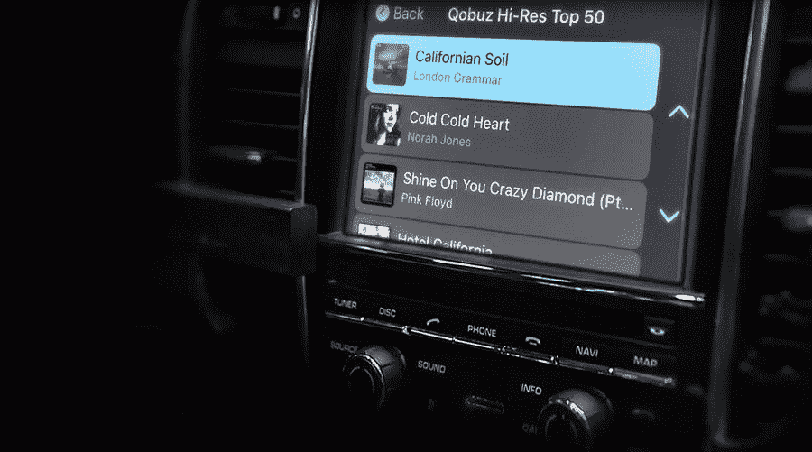
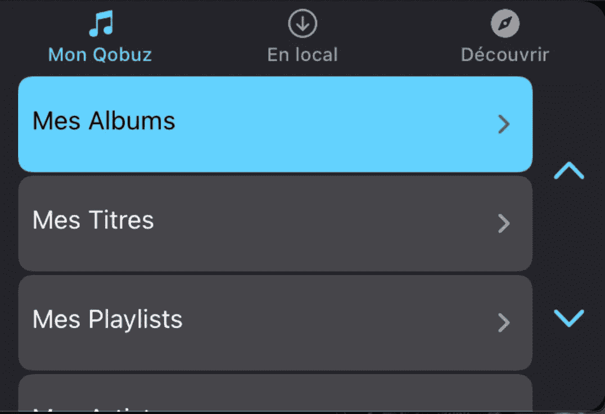

# 一个 CarPlay 音频应用程序的制作

> 原文：<https://betterprogramming.pub/the-making-of-a-carplay-audio-application-18df87c36eae>

## 一个关于 Qobuz 的 CarPlay 应用的故事



照片来自 [Hifipig](https://www.hifipig.com/qobuz-my-weekly-q-and-qobuz-carplay-online/)

在为高质量高保真音乐流媒体服务 Qobuz 工作时，我负责重新制作我们的 CarPlay 应用程序，这个应用程序存在一些问题。法国 context 公司 Qobuz 正在美国音响发烧友市场占有份额，我们收到了美国用户对我们的 CarPlay 应用程序的负面反馈，他们真的喜欢在车里听音乐。

由于我们的目标是拥有优质声音的优质用户，我们显然需要提供优质的体验，即使是在他们的车里。因此，我们开始着手修复和改进我们的 CarPlay 应用程序。遗憾的是，我很难在互联网上找到音频应用的例子。现在，我们的新应用程序已经启动并运行，我想我应该给自己添加一些关于制作 CarPlay 音频应用程序的内容，并包括一些关于开发过程的反馈。所以让我们开始吧！

# 2021 年 CarPlay 开发套件的状况

我很幸运，也让我惊喜的是，苹果在 2020 年的 iOS 14 中宣布了一个新的框架，巧妙地命名为 CarPlay，它引入了一种新的更现代的方法来开发 CarPlay 应用程序。好消息！我不能说我是老方法的忠实粉丝，那就是使用 MediaPlayer 框架。它对开发人员不友好，有一个奇怪的实现，我发现自己不得不多次编写代码来解决我的问题。1/10，不推荐。

但是回到 2021 年，我们支持 iOS 12.0 和更高版本，由于新的 CarPlay 套件只能从 iOS 14.0 开始提供，为了给我们所有的用户提供 CarPlay 体验，我别无选择，只能同时处理这两种方法。因为我不认为，在 2022 年，谈论旧的方式是相关的，我将主要用 CarPlay Kit 覆盖我的工作，并快速谈论 MediaPlayer。

但是如果你不得不在旧版本的 iOS 上使用这个框架(运气不好)并且遇到了麻烦，请随时在 Medium 上给我发消息，我会看看是否能帮到你:)。

# CarPlay 套件，新方式

因为我想有一个好的开始，所以我决定使用 CarPlay 框架来解决这个版本，这是一个旨在代表未来的版本，显然也是两个版本中最重要的版本。事情是这样运作的:

## 权利

首先，权利。你需要在这里越过[，提供你的申请信息。苹果公司会审查它，如果它符合他们的标准，会积极地通知你。](https://developer.apple.com/documentation/carplay/requesting_carplay_entitlements)

一旦它被接受，您必须创建一个包含这个新授权的新配置文件，并将其添加到您的项目中。

然后，在`Entitlement.plist`文件中(如果不存在，则创建一个)，通过放置以下键来结束:

```
<key>com.apple.developer.carplay-audio</key>
<true/>
```

## 设置场景

自从 iOS 13 推出以来，苹果一直在推动一种新的方法来处理你的应用程序的不同屏幕(这可能是你的主应用程序、CarPlay 应用程序，或者是你在 iPad 上的分屏视图中复制的应用程序)，这就是`UIScene`。如果你像我们一样在 Qobuz 没有或不支持这个，那么，你需要做一点工作，然后再推进你的花式 CarPlay 应用程序新一代。

在我们的例子中，我们有两个不同的场景:一个名为`AppSceneDelegate`，另一个名为`CarplaySceneDelegate`。这里的名字不言自明。在创建了这些场景之后，在`Info.plist`里面添加了一个新的键:`UIApplicationSceneManifest`。它包含一个描述应用程序内部场景的字典。

在这里，您首先要指定您的应用程序将支持多个场景，然后是各种属性，最值得注意的是代表场景入口点的类的名称(因此在我们的例子中，`AppSceneDelegate`和`CarplaySceneDelegate`)。你可以在下面看看我们的场景清单是如何表示的，但是如果你想要更多的信息，请查看苹果的相关文档:

但是等等，是什么使我告诉你的那些类成为`UIScene`？根据 Apple 文档，`UIScene`是实现`UISceneDelegate`的类，提供在应用程序生命周期中调用的方法。似曾相识？的确，它注定要取代`AppDelegate`。

当填充`AppSceneDelegate`中的方法时，我实际上从我们的`AppDelegate`中转移了代码，因为我让场景接管启动 iOS 13。这个其实不多说，但是对于`CarplaySceneDelegate`，还有最后一件事要做，就是让它符合`CPTemplateApplicationSceneDelegate`。嗯，实际上没有需要添加的方法，但仍然有两个方法在我们今天的应用程序中使用:

```
templateApplicationScene(_ , didConnect:)
templateApplicationScene(_ , didDisconnectInterfaceController:)
```

它是我们的 CarPlay 应用程序的入口和出口点。在这些方法中，进行了一个简单的调用:

```
//Entry point
carplayTemplateManager.connect(interfaceController)//Exit point
carplayTemplateManager.disconnect()
```

但是这个`carplayTemplateManager`是什么？嗯，这是类型为`CarplayTemplateManager`的`CarplaySceneDelegate`的属性。这是一个处理所有与我们的 iOS 版本 14 及以上的 CarPlay 应用程序相关的代码的类，也是开发的下一步。

## CarplayTemplateManager

现在是时候真正构建我们的应用程序了！顾名思义，构建 CarPlay 应用程序是基于模板的。基类是`CPTemplate`，在我们的例子中，我们使用`CPTabBarTemplate`，它提供了与`UITabBarController`相似的体验



原谅我的法语，但你可以清楚地看到我们的 CarPlay 应用程序有三个标签

最基本的是建立一个根模板，在这种情况下是`CPTabBarTemplate`，然后为每个菜单和子菜单创建其他模板和项目。我们的根模板初始化的基本代码如下所示:

```
var tabTemplates = [CPTemplate]()
tabTemplates.append(myQobuzTemplate())
tabTemplates.append(localLibraryTemplate())
tabTemplates.append(discoverTemplate())
self.carplayInterfaceController!
    .setRootTemplate(CPTabBarTemplate(templates: tabTemplates), 
                     animated: true, completion: nil)
```

在我看来，这是开发人员友好的代码。非常容易设置，非常容易阅读和理解，并且它马上产生一个结果。爱死了。

对于每个选项卡，都会创建一个`CPListTemplate`。该模板由`CPListItem`填充。我用了一点代码来创建 My Qobuz 模板，只是为了向您展示总体思路(请记住，为了清楚起见，我也修改了一点，真正的方法要长一点)

有趣的部分肯定是`CPListItem`中的属性处理器。分配给它的代码块将在用户点击列表项时执行。如果在内部进行了异步操作，CarPlay kit 会自动在项目上放置一个滚轮微调器，等待操作完成。

在上面的例子中，没有异步操作，而是创建了另一个模板，使用方法`*pushTemplate(:)*`将该模板推送到接口上。它肯定会提醒你如何与一个`UINavigationController`互动。这使得它更加友好。

这是我们创建`CPListItem`的方法之一。在这个例子中，有一个异步操作，从我们的 web 服务加载相册。当点击成功模块时，一个由`CPListItem`组成的数组被创建，每个数组代表一个专辑，被分配给一个`CPListTemplate`，然后被推送到`carplayInterfaceController`。最后要注意的是`*completion()*`。它是由 handler 属性提供的参数。调用它让处理程序知道您已经完成了操作，并且它可以继续执行。

最后一件事:在我们的 track `CPListItem`处理程序中，我们不推送定制模板，而是这样做:

```
self.pushNowPlayingTemplate()
```

`NowPlayingTemplate`是 CarPlay kit 提供的默认模板，可配置按钮(随机播放、重复播放等)、播放曲目的插图、曲目队列以及工作播放器所需的一切。模板是标准的，这意味着除了一些按钮，我们有或多或少相同的播放器看起来像 Spotify 或 Apple Music。

仅此而已。剩下的代码只是更多的`CPListTemplate`和更多的`CPListItem`创作放在一起，瞧，你得到了一个 CarPlay 音频应用程序，它有一个干净的用户界面和良好的 UX。

# 简单说说 MediaPlayer，老方法

正如我所说的，我不会涉及我使用 MediaPlayer 框架的开发冒险的细节，因为这个版本的代码库注定要尽快在垃圾桶中完成。这里还有一些小细节可以帮助你。

## 限制

不要忘记指定您的 CarPlay 应用程序的限制。你必须限制屏幕上的项目数量(`contentLimitItemCount`)和导航树的深度(`contentLimitTreeDepth`)。苹果建议树的深度不要超过 5，但他们也明确指出汽车制造商可以控制这些数字，并可以根据各种参数(如车速等)实现自己的算法。

关于`contentLimitItemCount`，在出现性能问题后，我将 200 设置为任意数字。这就是我说的那种黑客。

```
var contentLimitItemCount: Int = 200
var contentLimitTreeDepth: Int = 5
```

## 复制新方式

从 CarPlay Kit 开始，我从他们的 API 中获得灵感，在旧版本的开发过程中帮助我。所以最后我有了自己版本的基本款，如下图:

```
class CarplayContentItem: MPContentItem {
    var subItems: [CarplayContentItem] = []
    var handler: (@escaping (Error?) -> Void)->() = { _ in }
}
```

由于这段代码，它使得实现有点类似。只是工作不太顺利。我有很多性能问题，我不得不到处改进，这让我为少数用户浪费了很多时间。有点令人沮丧，但最终，我们所有的用户都被覆盖了，所以这是值得的(我还是会尽快把这段代码扔到最近的垃圾桶里)。

# 结论

开发这个特性对大多数人来说绝对是一件有趣的事情。这也是令人难以置信的回报，甚至在一些新闻文章中被提及(像[这个](https://www.whathifi.com/us/news/qobuz-unveils-new-personalised-playlists-and-carplay-online-features))，所以我肯定会接受。我在美国自驾游的时候也能使用它(我在法国没有车)，这也增加了一些满足感:)。

我希望你会发现这篇文章的某些部分对你的 CarPlay 音频应用程序(或任何其他种类的 CarPlay 应用程序)的开发有用。

你可以在这里查看苹果[的开发指南](https://developer.apple.com/carplay/documentation/CarPlay-App-Programming-Guide.pdf)。这对我很有帮助，尤其是在设置基础的时候。

祝大家编码愉快，安全驾驶！