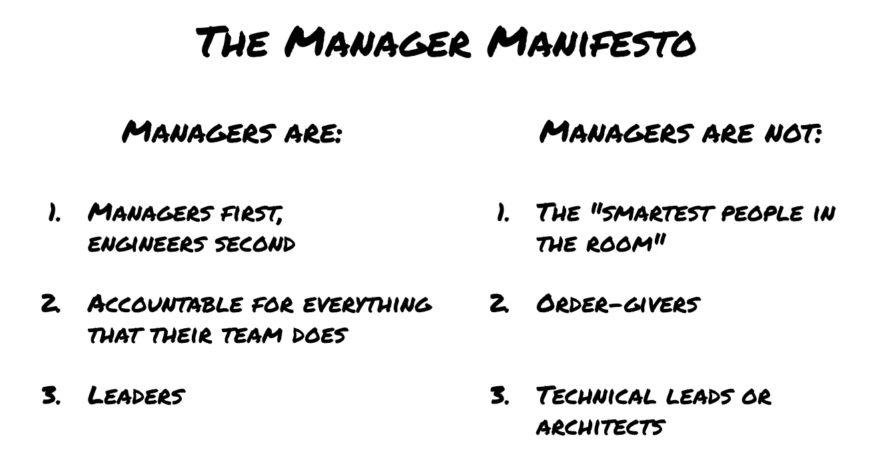

# 经理的宣言

> 原文：<https://betterprogramming.pub/the-manager-manifesto-bb6e22aa30ad>

## 当你过渡到工程管理时，采取正确的心态

对于工程师来说，最重要的职业决定之一是是否进入管理层。一方面，这似乎是唯一的自然增长途径。也有可能是你发现自己有领导团队的天赋。另一方面，它可能会让你远离最初让你成为伟大工程师的东西，也就是你每天编写的技术和代码。

那么你应该如何看待这个选择呢？

在这一系列的文章中，我将谈论“进入管理层”的真正含义，以及如何与你本质上是一名工程师的事实相平衡，以及另一条道路是什么样子的。对于试图“鱼和熊掌兼得”并走混合道路，我会提出一些警告。

让我从一个固执的立场开始:

1.  软件工程和工程管理是不同的工作。
2.  仅仅因为你第一次很棒，并不意味着你第二次也会很棒。
3.  然而，只有当你擅长第一步时，你才会在第二步中表现出色。
4.  认识到这一点并提供双轨制的公司比不认识这一点的公司更有效。

我不会在这里列举一个工程经理的所有责任；这是一个很长的列表，考虑到“人的问题”的开放性，很难整理。(我推荐[这篇博文](https://www.codementor.io/blog/how-to-be-the-engineering-manager-your-company-needs-1yahjbf97x)，它详细介绍了这个角色)。

关键在于这是一份完全不同的工作。虽然你最终仍在与技术和软件打交道，但你正专注于通过人来完成你的工作:协调、组织、激励、鼓舞、支持、指导……这个清单还在继续。

因为你的工作非常不同，所以你的整个运作模式也非常不同(看看这篇经典的《保罗·格拉厄姆邮报》上的[经理时间表和](http://www.paulgraham.com/makersschedule.html)制造商时间表)。这是同时成为一名伟大的经理和工程师非常困难的关键原因之一。

此外，在做新工作(工程经理)的同时继续做你的老工作(工程师)，你会抑制你自己在新工作中的成长和效率，你可能也会抑制团队中其他人的成长。这是否意味着你需要一夜之间“冷火鸡”停止编码？不，一点也不。但是，当你成为一名经理时，你需要采取一种明确的心态转变。

这就是为什么我写了《工程经理宣言》,对工程经理的工作和真正做好这项工作所需的心态做了一个非常清晰的陈述。

让我们逐一分析这些要点。

# 经理第一，工程师第二

经理需要有技术才能在需要时适当地帮助和建议团队，但这不再是他们工作中最重要的属性…他们对人的敏锐是最重要的。

换句话说，如果可以选择，你应该把时间集中在哪里？1)获得更多的实际专业知识来推动某个技术决策，或者 2)确保您团队中的某个人拥有这种专业知识并能够为团队推动正确的决策？这两样你都需要做，但是经理应该在这两方面花更多的时间。

最基本的一点是你仍然需要技术来做 2)。否则你如何知道团队正在做出正确的决定？关键的考虑是你需要在什么样的技术细节水平上理解这个主题，以确保正确的决策。您真的需要进入代码吗？或者一个更概念性的层次就足够了吗？你能利用团队外其他人的专业知识来帮助你吗？

如果你在利用你的团队的第二个选择中成功了，你**扩大了你的影响**，因为其他人正在做你本来会做的事情。而且它给你更多的时间去做其他方面的工作！

但是在代码中，这意味着更少的时间，最终没有时间。如果你还没有准备好，就不要走这条路。

# 对他们团队所做的一切负责

经理们分享成功的功劳，承担失败的责任，不管他们是否直接参与。这一点对于理解这份工作的“全包”性质来说再重要不过了。

假设您团队中的某个人引入了一个糟糕的 bug，绕过了代码审查，直接交付到产品中，导致了影响业务的中断。这一切都发生在一个晴朗的夜晚，你却毫不知情。你负责吗？

最肯定！此人在您的团队中。也许你雇了他们，也许没有。也许这个人是一个高水平的执行者，这是一个罕见的事故或过程差距。也许这个人表现不佳，也许你已经意识到了，并且正在和他们一起工作。也许其他人应该跳出来帮忙。这些都不能改变你最终要为这个团队的所作所为负责的事实。你需要掌握主动权，决定如何改善未来的情况。

同时，反之亦然。如果你的团队中有人做了很棒的事情，即使不在你个人的关注范围内，这种积极的成功确实归功于你这个经理！这并不意味着你应该为你团队的工作邀功；一个伟大的经理会因为团队的胜利而给予他们信任，同时也会因为失败而承担责任。但是请放心，最终你会被你的团队的成就所衡量，无论是好是坏。

所以请记住，即使你团队中的不同人负责某些任务，你也是有责任的。不管怎样。如果团队的这种“全包”所有权激励了你，你就在正确的轨道上。

# 领袖

关于领导和管理之间的区别，已经有很多文章了。有人说领导力是关于愿景和未来(“什么”和“为什么”)，管理是关于执行和现在(“如何”和“何时”)。还有人说，领导力是推动变革，而管理是保持事情平稳运行。

现实是，伟大的工程经理也需要成为优秀的领导者。他们需要确保他们的团队与公司的目标和战略保持一致，但也能够让他们的团队进行创新，想出新的做事方法，从而对业务产生积极影响。他们需要知道他们的团队何时需要灵感或空间，何时需要运营改进或具体计划。

作为领导者和管理者，他们需要在自己的团队中培养领导者。这些未来的领导者可能是崭露头角的工程经理，也可能是 IC 轨道上崭露头角的高级工程师(我们将在另一篇文章中讨论)。

有意义吗？现在我们来谈谈伟大的工程经理都不是什么:

# “房间里最聪明的人”

一个伟大的工程经理必须能够雇佣、培养和留住团队中比他们更优秀的工程师。这既是为了不断提高团队的才能和能力水平，也是为了适应这样一个事实，即经理没有时间继续做一名伟大的工程师，他们的实践技能会随着时间的推移而下降。

伟大的工程师希望有一个他们尊重的经理，包括他们的技术经验和方向，但他们也希望有一个知道自己的局限性以及何时听从团队做出正确决定的经理。

# 发号施令者

提供强有力的领导(包括清晰的愿景和优先事项)和独裁式地指导团队活动之间有很大的区别。伟大的工程师不会对被命令到处跑做出好的反应；取而代之的是，他们需要被安排在这样的位置上，在那里他们理解目标并得到真正闪耀所需的支持。

我非常相信《驱动力》一书的作者丹·平克的作品，他在书中展示了激励个人并使其工作表现最佳的主要方式是确保他们能够找到自主性、掌控力和目标。这三个方面中最基本的是自主性；最优秀的人需要空间来发挥他们的最大潜力。

思考这种方法的另一种方式是，“告诉你的团队为什么，和他们一起做什么，把如何做留给他们。”如果你希望成为一名经理的事情之一是“发号施令”，你应该重新考虑。你需要时不时地这样做，但这不应该是你选择这条职业道路的原因。

# 技术领导或架构师

就像工程管理一样，高级技术领导本身就是一项工作，要做好这项工作，你需要专注于它。因此，虽然工程经理以前是一名有能力的工程师，并且有丰富的经验，可以不时地“参与进来”并满足这些需求，但他们必须非常小心，以尽量减少这种情况。

相反，他们应该发展他们的团队，并与组织中的其他人合作(比如同事或首席工程师)，以确保做出正确的技术决策。

有一次一位导师告诉我，“小心不要扮演建筑师。有时候这真的很诱人，但是即使你对某件事有非常强烈的信念，你也不会有足够的时间去深入研究或者坚持到底。相反，把你的领导聚集在一起，确保他们深入思考问题并做出好的决定。并时刻评估你是否有合适的人在这个房间里。”

# 但是等等，我不想只做人事经理！

如果你读到这里，希望你能明白我并不喜欢一些人称之为“纯人员管理”的东西。业内有一种误解，认为某些类型的经理只需与他们的直接下属进行一对一沟通，关注他们的职业发展和幸福，并将他们分配到其他人领导的项目中，就能取得成功。我不同意这种观点。

相反，我发现伟大的工程经理保持着很强的技术能力，即使他们不再每天编码或者根本不编码。他们了解团队工作的领域，并领导关键项目和计划成功完成。他们关注产品速度、代码库的健康和卓越运营，而不仅仅是团队士气和保留。

然而，如果你不接受这样一种心态，即作为一名经理，你的工作与你以前的工程师工作有着根本的不同，那么你在这两个职位上的效率都会降低。牢记经理宣言！

# 还有什么？

在以后的文章中，我们将探讨几个相关主题:

1.  [员工工程师职业道路](https://lbruhmuller.medium.com/the-staff-engineer-statute-bff4f0cf1810)，以及双重职业阶梯如何成为工程文化的重要组成部分
2.  将您的组织分成多个团队的最佳方式，以及工程经理和员工工程师如何合作
3.  一个工程经理的发展阶段，从一个新晋升的工程师到一个准备跃升为主管或副总裁的人。