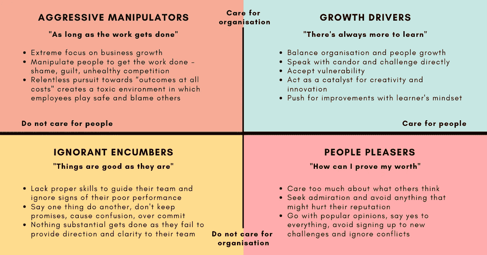

# 经理版

> 原文：<https://betterprogramming.pub/the-managers-edition-1f2efb611938>

## 从更好的规划中精选的管理建议

嘿，更好的编程读者们，

又是一个星期五，我希望你们都做得很好。最近，我们看到 Github 和 Open AI 发布了一个新的 AI 工具— [Copilot](https://copilot.github.com/) 。程序员现在有一个人工智能编程助手来帮助编写整个函数。别担心，它不会取代你们的工作。然而，如果你喜欢复制粘贴解决方案，这可能会减少你对谷歌的依赖。

在之前的时事通讯中介绍了双方的面试经历后，是时候使用一些管理手段了。事不宜迟，这里有五个更好的编程贡献者为经理们分享他们的经验。

在 [Unsplash](https://unsplash.com/?utm_source=unsplash&utm_medium=referral&utm_content=creditCopyText) 上 [airfocus](https://unsplash.com/@airfocus?utm_source=unsplash&utm_medium=referral&utm_content=creditCopyText) 拍摄的照片。

## [项目经理需要发展的最有价值的技能](/the-most-valuable-skill-project-managers-need-ba93d68787c3)

作为一名经理，决策是最关键的任务——这使得说不成为一项有价值的技能。但是你如何做到这一点而不激怒你的利益相关者呢？Mayra Boppre 将她多年的经验简化为四个实际行动。

作者照片。

## 你是哪种类型的经理？

在与数百名经理共事后，维尼塔列出了大多数人认同的四种类型。你是积极的操纵者、讨人喜欢的人、无知的累赘，还是成长的驱动者？

让-路易·波林在 [Unsplash](https://unsplash.com/?utm_source=medium&utm_medium=referral) 上拍摄的照片

## [你在工程经理的职业生涯中会遇到的 7 种人](/the-7-types-of-people-youll-meet-in-your-career-as-an-engineering-manager-e2d333165944)

谈到类型，经理们在工作中遇到和处理不同类型的人是很常见的。在科技行业工作了 20 年后，伊莎贝尔·尼奥(Isabel Nyo)记下了你会遇到的 7 种人。“想成为英雄”就是其中之一。看看剩下的六个故事。

@巴奇普·unsplash.com

## [优秀技术经理的 30 个特质](/30-traits-of-a-good-technical-manager-fca89e68f057)

作为一名技术领导者，需要具备哪些条件才能脱颖而出？有耐心、及时做出坚定的决定、提供公正、有益的反馈是你可以从[吴俊](https://medium.com/u/330285ecbc54?source=post_page-----1f2efb611938--------------------------------)的作品中学到的 30 个特质中的三个。

迪伦·吉利斯在 [Unsplash](https://unsplash.com/?utm_source=unsplash&utm_medium=referral&utm_content=creditCopyText) 上的照片。

## [你能问软件开发者的最糟糕的问题](/the-worst-question-you-can-ask-a-software-developer-ddbcd5956eb4)

开发人员和经理总是有一种尴尬的关系——就像采访者和被采访者。而是“你什么时候能做完？”是一个开发者讨厌回答的问题。 [Blake Norrish](https://medium.com/u/7a01e12c0530?source=post_page-----1f2efb611938--------------------------------) 向我们展示了这个问题的问题所在，以及你应该问什么。

我很想知道您的想法以及您希望我们涵盖的任何特定主题。

在那之前，一切都结束了。感谢阅读！

Anupam 和更好的编程团队