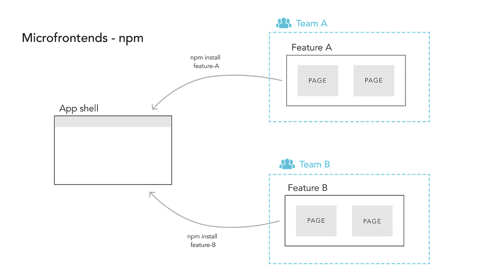
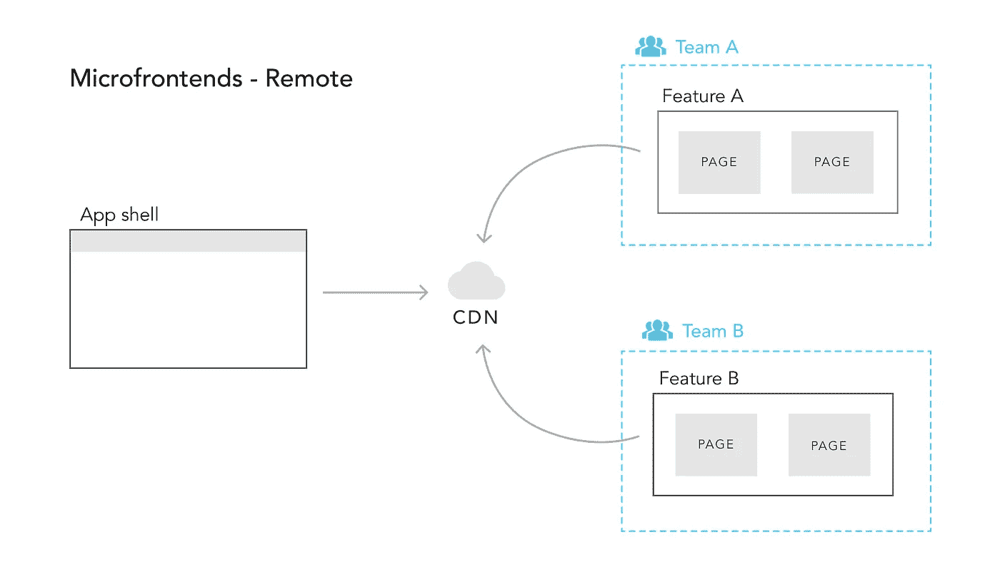
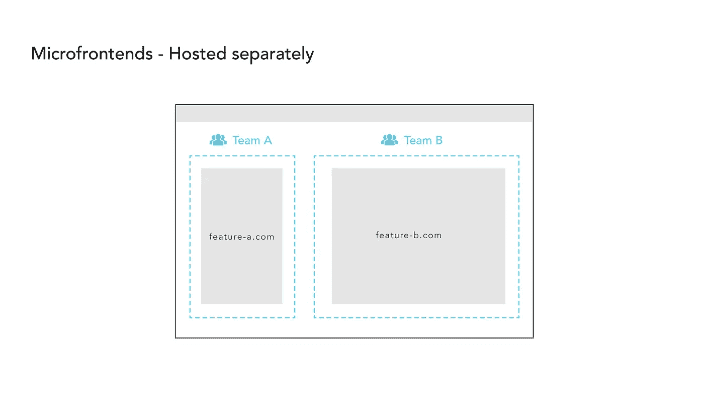

# 多种口味的微前端

> 原文：<https://betterprogramming.pub/the-many-flavours-of-micro-front-ends-2db4b21dfbaa>

## 在下一个应用中实现微前端的 3 种方法

劳伦·曼克在 [Unsplash](https://unsplash.com?utm_source=medium&utm_medium=referral) 上的照片。

随着前端应用尺寸的增加和处理变得更加复杂，微前端可能成为一个有吸引力的选择。

使用微前端意味着我们将应用分成多个部分。类似于后端架构中的微服务，微前端也是较大应用程序的隔离部分。

好处是每个应用程序可以分成多个微前端，每个微前端由一个团队开发。这导致了更容易的独立开发，更快的发布周期，以及更多的团队自治。

然而，它们伴随着开销。在微前端工作更复杂。它可能涉及更复杂的应用程序架构和 CI 过程，这意味着在由多个团队进行开发的更大的应用程序环境中，您可能会看到更多的好处。

# 1.使用 NPM 软件包

使用 NPM 软件包——作者照片。

在第一种风格中，我们的应用程序分为多个特性。每个功能都是一个 NPM 包。它们可以由每个团队独立开发，必要时，可以发布新版本。

这些特性中的每一个都被加载到一个应用外壳中，该外壳将是所有微前端的外壳。这个 shell 将把所有特性作为 NPM 包安装，并作为一个大型应用程序运行。

好处:

*   每个团队可以使用他们自己的工作方式和最佳实践。
*   功能的版本控制。
*   一个特性的改变不太可能破坏另一个特性。
*   默认情况下，特性之间的耦合没有整体应用程序那么紧密。

缺点:

*   比整体方法的开销更大。
*   [永远](https://semver.org/)需要严格遵守的特性。
*   对于每次更改，应用程序外壳仍然需要重新构建。
*   依赖于框架。在理想的场景中，只使用一个框架。

# 2.使用远程 CDN

在 CDN 上发布 NPM 模块—作者照片。

在第二种味道中，我们更进一步。特性不再在构建时安装，而是在运行时获取。这是通过将每个功能发布到内容交付网络上来实现的。

这个架构可以通过使用[单 SPA](https://single-spa.js.org/) 框架来构建。这是一个用于微前端的顶级路由器，将加载并执行每条路由的每个功能。例如，转到 route `/feature-a`将加载一个微前端，转到`/feature-b`将在应用程序外壳中加载另一个微前端。

好处:

*   与 NPM 一揽子方案具有相同的优势。
*   无需为每次更改重建应用程序外壳。
*   配置项独立于每个功能。

缺点:

*   没有真正的内置版本控制。
*   设置起来更复杂。
*   共享应用程序状态比较棘手(`browserEvents`，cookies 等)。).

# 3.单独托管

单独主办—作者照片。

对于第三种风格，每个微前端托管在另一个彼此完全分离的 URL 上。仍然有一个应用程序外壳，但是现在每个特性都是在使用 iframes 时加载的。这意味着特性 A 可以在 http://feature-a.com 的[举办，而特性 B 可以在 http://feature-b.com 的](http://feature-a.com)[举办。](http://feature-b.com)

好处:

*   无需为每次更改重建整个应用程序。
*   没有复杂的配置项设置。
*   每个团队端到端地控制他们的应用程序。

缺点:

*   劣等 UX。
*   共享应用程序状态很棘手。
*   已知的 iframe 问题。

# 包扎

希望这三个模型已经激发了您进一步深入微前端的兴趣。承认随之而来的管理费用是很重要的。然而，在更大的应用程序中，它们可能是一个惊人的工具。

在我看来，第一个味道(使用 NPM 包)可能是一个很好的进入微前端模型。小的缺点很容易克服，在较大的应用中好处很容易超过它们。

# 资源

*   [https://micro-frontends.org/](https://micro-frontends.org/)
*   [https://martinfowler.com/articles/micro-frontends.html](https://martinfowler.com/articles/micro-frontends.html)
*   [https://single-spa.js.org/](https://single-spa.js.org/)